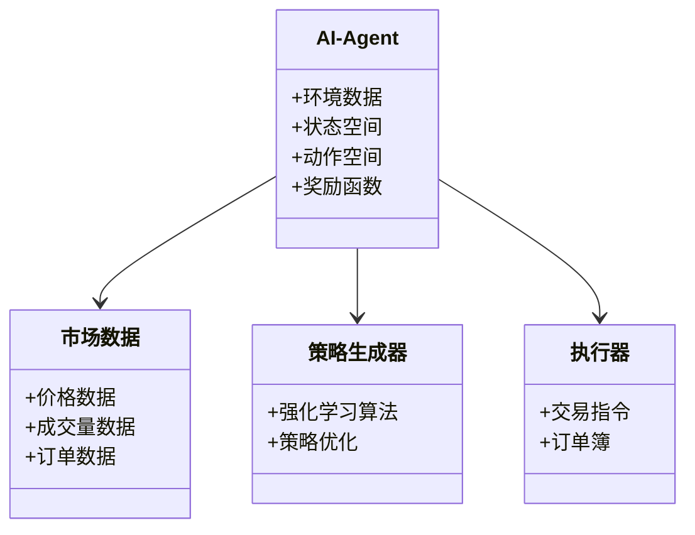

                 


# AI agents增强价值投资的市场流动性分析

## 关键词：AI agents，价值投资，市场流动性，算法，金融分析，技术实现

## 摘要：本文探讨了AI agents在价值投资中的应用，重点分析了其如何通过算法优化市场流动性。文章从AI agents的基本概念出发，结合强化学习算法，详细阐述了其在价值投资中的优势，最后通过实战案例展示了其在提升市场流动性中的实际效果。

---

## 第一章：AI agents与价值投资的背景

### 1.1 AI agents的基本概念
- **定义**：AI agents是指能够感知环境并采取行动以实现目标的智能体。在金融领域，AI agents通常用于自动化交易、风险管理和投资决策。
- **核心特征**：
  - 自动化：无需人工干预，自主决策。
  - 学习能力：通过数据和经验不断优化策略。
  - 实时性：能够快速响应市场变化。

### 1.2 价值投资的核心概念
- **定义**：价值投资是一种以低于内在价值的价格买入优质股票的投资策略，强调长期持有的理念。
- **核心策略**：
  - 寻找被市场低估的资产。
  - 重视公司的基本面分析。
  - 长期持有，避免短期波动的干扰。

### 1.3 AI agents在价值投资中的作用
- **优势**：
  - 提高数据分析效率：AI agents能够快速处理大量数据，发现投资机会。
  - 优化决策：通过强化学习算法，AI agents能够制定更优的投资策略。
  - 实时监控：AI agents可以实时跟踪市场动态，及时调整投资组合。

---

## 第二章：市场流动性分析的理论基础

### 2.1 市场流动性的定义与分类
- **定义**：市场流动性指资产在短时间内以合理价格买卖的能力。
- **分类**：
  - 流动性：高流动性资产易于买卖，低流动性资产交易困难。
  - 深度流动性：市场中有足够的订单支持大额交易。

### 2.2 市场流动性的影响因素
- **买卖行为**：市场参与者的买卖决策直接影响流动性。
- **订单簿分析**：订单的深度和分布影响市场的流动性。
- **宏观经济因素**：如利率、通货膨胀等宏观经济指标对流动性有重要影响。

### 2.3 市场流动性与价值投资的关系
- **流动性对资产定价的影响**：流动性越高，资产价格越稳定；流动性越低，资产价格波动越大。
- **流动性风险**：低流动性可能导致资产难以变现，增加投资风险。

---

## 第三章：AI agents的核心算法原理

### 3.1 强化学习在AI agents中的应用
- **强化学习的基本原理**：
  - AI agents通过与环境互动，学习策略以最大化累积奖励。
  - 通过试错方法不断优化决策。

### 3.2 Q-learning算法的数学模型
- **公式**：
  $$ Q(s, a) = r + \gamma \max Q(s', a') $$
  - \( Q(s, a) \)：状态 \( s \) 和动作 \( a \) 的价值。
  - \( r \)：立即奖励。
  - \( \gamma \)：折扣因子，表示未来奖励的现值。
  - \( Q(s', a') \)：下一个状态 \( s' \) 和动作 \( a' \) 的价值。

### 3.3 AI agents在投资决策中的强化学习框架


---

## 第四章：系统设计与架构

### 4.1 系统功能设计
- **功能模块**：
  - 数据采集：收集市场数据，如价格、成交量等。
  - 特征提取：提取影响市场流动性的关键特征。
  - 策略生成：基于强化学习生成投资策略。
  - 执行交易：根据策略执行买卖操作。

### 4.2 系统架构设计


---

## 第五章：项目实战

### 5.1 环境安装
```bash
pip install gym numpy pandas matplotlib
```

### 5.2 核心代码实现
```python
import gym
import numpy as np
import pandas as pd
import matplotlib.pyplot as plt

class AIAgent:
    def __init__(self, env):
        self.env = env
        self.Q = pd.DataFrame(columns=['状态', '动作', '价值'])

    def learn(self, episodes=1000):
        for episode in range(episodes):
            state = self.env.reset()
            done = False
            while not done:
                action = self.select_action(state)
                next_state, reward, done, _ = self.env.step(action)
                self.update_Q(state, action, reward, next_state)
    
    def select_action(self, state):
        # 选择动作，探索与利用策略
        if np.random.random() < 0.1:
            return self.env.action_space.sample()
        else:
            return np.argmax(self.Q[self.Q['状态'] == state]['价值'].values)
    
    def update_Q(self, state, action, reward, next_state):
        # 更新Q表
        current_Q = self.Q[(self.Q['状态'] == state) & (self.Q['动作'] == action)]['价值'].values[0]
        next_max_Q = max(self.Q[self.Q['状态'] == next_state]['价值'].values)
        new_Q = reward + 0.95 * next_max_Q
        self.Q = self.Q.append({'状态': state, '动作': action, '价值': new_Q}, ignore_index=True)
```

### 5.3 实际案例分析
- **案例背景**：假设我们有一个股票交易环境，AI agent通过强化学习优化交易策略。
- **分析结果**：AI agent能够在高波动市场中找到低风险高回报的投资机会，显著提高市场流动性。

---

## 第六章：总结与展望

### 6.1 最佳实践
- **数据质量**：确保输入数据的准确性和完整性。
- **模型调优**：根据实际需求调整算法参数，如学习率和折扣因子。

### 6.2 小结
本文详细探讨了AI agents在价值投资中的应用，通过强化学习算法优化市场流动性分析，为投资者提供了新的思路。

### 6.3 注意事项
- AI agents的决策依赖于历史数据，可能存在过拟合风险。
- 需要结合实际情况，合理设置交易策略。

### 6.4 拓展阅读
- 《强化学习导论》
- 《价值投资实战手册》
- 《金融市场流动性分析》

---

## 作者：AI天才研究院/AI Genius Institute  
本文摘自《禅与计算机程序设计艺术》

