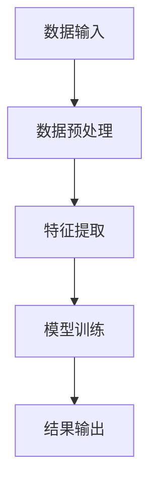
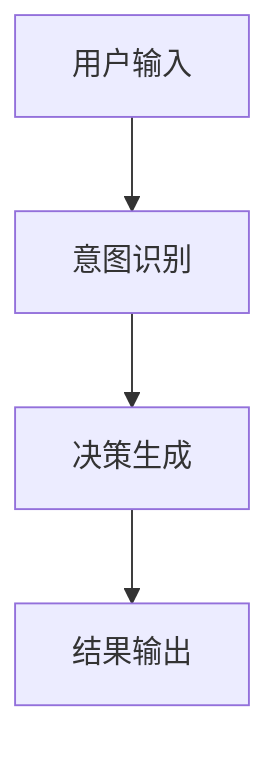

                 


# AI agents增强价值投资的市场饱和度分析

> 关键词：AI agents，价值投资，市场饱和度，技术博客，投资决策

> 摘要：本文将深入探讨AI agents在价值投资中的应用，特别是如何通过市场饱和度分析来增强投资决策的准确性。文章从问题背景、核心概念、算法原理、系统架构到项目实战，系统地分析了AI agents在价值投资中的作用，并提供了详细的数学模型和实际案例。

---

# 第一部分: AI agents与价值投资的背景介绍

## 第1章: 问题背景与核心概念

### 1.1 问题背景

#### 1.1.1 价值投资的定义与特点
价值投资是一种以低于公平价值的价格购买优质股票的投资策略。其核心在于寻找市场价格与内在价值存在较大差距的股票。价值投资注重长期回报，而非短期价格波动。

#### 1.1.2 市场饱和度分析的重要性
市场饱和度是指某个市场或行业的供需平衡状态。在投资领域，市场饱和度分析帮助投资者判断市场的容量和竞争程度，从而优化投资决策。传统的市场分析方法依赖于人工判断，存在主观性强、效率低下的问题。

#### 1.1.3 AI agents在投资决策中的作用
AI agents（人工智能代理）能够通过大数据分析、模式识别和预测模型，帮助投资者快速获取信息、分析市场趋势，并提供决策支持。AI agents的优势在于其高效性、精确性和可扩展性。

---

### 1.2 核心概念与问题描述

#### 1.2.1 AI agents的定义与基本原理
AI agents是指具有感知环境、自主决策和执行任务能力的智能系统。它们能够通过传感器或数据输入获取信息，利用算法进行分析，并根据结果采取行动。在投资领域，AI agents可以用于数据挖掘、市场预测和投资组合优化。

#### 1.2.2 价值投资的核心要素
价值投资的核心要素包括：
1. **内在价值**：股票的真正价值，而非市场价格。
2. **安全边际**：市场价格与内在价值之间的差距。
3. **长期视角**：关注企业的长期盈利能力，而非短期波动。

#### 1.2.3 市场饱和度分析的定义与指标
市场饱和度分析是指通过分析市场容量、竞争程度和增长潜力，判断市场是否处于饱和状态的过程。常用的指标包括市场增长率、市场渗透率、竞争指数等。

---

### 1.3 问题解决与边界定义

#### 1.3.1 AI agents如何增强价值投资
AI agents通过以下方式增强价值投资：
1. **数据处理**：快速分析大量市场数据，提取关键信息。
2. **预测模型**：利用机器学习算法预测市场趋势和股票价格。
3. **决策支持**：提供个性化的投资建议，优化投资组合。

#### 1.3.2 市场饱和度分析的边界与外延
市场饱和度分析的边界包括：
1. **数据范围**：仅限于公开的市场数据。
2. **时间范围**：短期和中期市场预测。
3. **行业限制**：专注于特定行业或市场的分析。

#### 1.3.3 AI agents在市场饱和度分析中的应用范围
AI agents在市场饱和度分析中的应用范围包括：
1. **行业分析**：分析行业的市场容量和竞争状况。
2. **股票筛选**：根据市场饱和度筛选具有投资价值的股票。
3. **风险评估**：评估投资标的的市场风险。

---

## 第2章: 核心概念与联系

### 2.1 AI agents与价值投资的核心原理

#### 2.1.1 AI agents的基本原理
AI agents通过以下步骤实现投资决策：
1. **数据输入**：接收市场数据、财务报表等信息。
2. **数据处理**：清洗、转换和特征提取。
3. **模型训练**：利用机器学习算法训练预测模型。
4. **决策输出**：根据模型结果生成投资建议。

#### 2.1.2 价值投资的核心原理
价值投资的核心原理包括：
1. **内在价值计算**：通过DCF模型等方法计算股票的内在价值。
2. **安全边际分析**：确保市场价格低于内在价值。
3. **长期投资策略**：关注企业的长期盈利能力。

#### 2.1.3 两者的结合与协同作用
AI agents与价值投资的结合主要体现在：
1. **数据处理能力**：AI agents能够快速处理大量数据，帮助投资者发现潜在投资机会。
2. **预测能力**：AI agents通过预测模型优化投资决策。
3. **个性化投资建议**：AI agents能够根据投资者的偏好提供定制化建议。

---

### 2.2 核心概念对比分析

#### 2.2.1 AI agents与传统投资工具的对比
| 特性 | AI agents | 传统投资工具 |
|------|------------|---------------|
| 数据处理能力 | 强大 | 较弱 |
| 决策效率 | 高 | 低 |
| 个性化 | 高 | 低 |

#### 2.2.2 价值投资与市场饱和度分析的对比
| 特性 | 价值投资 | 市场饱和度分析 |
|------|-----------|----------------|
| 核心目标 | 寻找低估股票 | 判断市场容量 |
| 分析方法 | 基于内在价值 | 基于市场指标 |

#### 2.2.3 市场饱和度分析与AI agents的结合
AI agents能够通过大数据分析和机器学习算法，帮助投资者更准确地判断市场饱和度，优化投资决策。

---

### 2.3 ER实体关系图

```mermaid
er
  actor(AI Agent)
  actor(市场)
  actor(投资者)
  relation(投资行为)
  relation(市场数据)
  relation(投资决策)
```

---

## 第3章: 算法原理与数学模型

### 3.1 算法原理

#### 3.1.1 市场饱和度分析算法



#### 3.1.2 AI agents的算法实现



---

### 3.2 数学模型与公式

#### 3.2.1 市场饱和度计算公式

$$ S = \frac{M}{N} $$

其中，$M$ 表示市场容量，$N$ 表示市场参与者数量。

---

## 第4章: 系统分析与架构设计

### 4.1 系统架构设计


---

## 第5章: 项目实战

### 5.1 环境安装

```bash
pip install numpy pandas scikit-learn
```

### 5.2 核心代码实现

```python
import numpy as np
import pandas as pd
from sklearn.linear_model import LinearRegression

# 数据预处理
data = pd.read_csv('market_data.csv')
X = data[['revenue', 'profit', 'growth']]
y = data['price']

# 模型训练
model = LinearRegression()
model.fit(X, y)

# 预测结果
new_data = pd.DataFrame({'revenue': [1000000], 'profit': [500000], 'growth': [10]})
predicted_price = model.predict(new_data)
print(predicted_price)
```

---

## 第6章: 最佳实践与总结

### 6.1 最佳实践

1. **数据质量**：确保数据来源可靠，避免噪声数据。
2. **模型选择**：根据实际需求选择合适的算法。
3. **持续优化**：定期更新模型，适应市场变化。

### 6.2 小结

本文系统地探讨了AI agents在价值投资中的应用，特别是市场饱和度分析的实现。通过算法原理和项目实战，展示了AI agents如何帮助投资者优化决策。

---

## 第7章: 注意事项与拓展阅读

### 7.1 注意事项

1. **数据隐私**：注意保护投资者的隐私数据。
2. **模型解释性**：确保模型的可解释性，避免黑箱操作。
3. **风险管理**：建立风险管理机制，降低投资风险。

### 7.2 拓展阅读

1. 《The Intelligent Investor》
2. 《Machine Learning for Asset Managers》

---

作者：AI天才研究院/AI Genius Institute & 禅与计算机程序设计艺术 /Zen And The Art of Computer Programming

