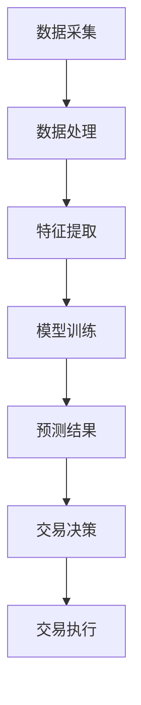

                 


# AI agents实时监控市场：捕捉价值投资机会

## 关键词：AI代理，金融市场，价值投资，实时监控，机器学习

## 摘要：本文探讨了如何利用AI代理实时监控金融市场，捕捉价值投资机会。通过详细分析AI代理的核心概念、算法原理、系统架构和实战项目，展示了如何利用AI技术提升投资决策的效率和准确性。

---

# 第1章: AI代理与金融市场分析概述

## 1.1 AI代理的基本概念

### 1.1.1 什么是AI代理
AI代理（Artificial Intelligence Agent）是一种能够感知环境、执行任务并做出决策的智能实体。在金融市场中，AI代理通常用于数据收集、模式识别和自动交易。

### 1.1.2 AI代理的核心功能
- 数据收集与处理
- 模式识别与预测
- 自动化决策与执行

### 1.1.3 AI代理在金融市场的应用
- 股票交易
- 债券评级
- 市场趋势预测

---

## 1.2 金融市场分析的背景与挑战

### 1.2.1 金融市场分析的基本概念
金融市场分析是指对市场中的价格、交易量、趋势等数据进行分析，以预测未来的市场走势。

### 1.2.2 传统金融分析的局限性
- 数据量大，难以处理
- 人工分析耗时且容易出错
- 市场波动快，难以及时捕捉机会

### 1.2.3 AI技术在金融分析中的优势
- 高速数据处理能力
- 精准的模式识别能力
- 自动化决策能力

---

## 1.3 AI代理与价值投资的结合

### 1.3.1 价值投资的基本原理
价值投资是一种投资策略，旨在通过分析公司的基本面，寻找被市场低估的投资标的。

### 1.3.2 AI如何辅助价值投资
- 通过机器学习模型筛选潜在投资标的
- 利用自然语言处理分析财务报告
- 自动监控市场动态，捕捉投资机会

### 1.3.3 价值投资与AI代理的结合案例
- 使用AI代理分析公司财务数据，识别具有成长潜力的企业
- 利用市场情绪分析预测投资标的的价值回归

---

# 第2章: AI代理的核心概念与工作原理

## 2.1 AI代理的核心概念

### 2.1.1 数据源与数据处理
- 数据源包括股票价格、交易量、新闻等
- 数据处理包括清洗、标准化和增强

### 2.1.2 模型训练与预测
- 使用机器学习模型进行市场预测
- 模型训练包括特征提取和模型优化

### 2.1.3 决策机制与执行
- 基于预测结果制定交易策略
- 自动化执行交易指令

---

## 2.2 AI代理的工作原理

### 2.2.1 数据采集与清洗
- 数据采集：从多个数据源获取市场数据
- 数据清洗：去除噪声数据，确保数据质量

### 2.2.2 模型训练与优化
- 使用历史数据训练预测模型
- 通过回测优化交易策略

### 2.2.3 决策与执行流程
- 基于模型预测结果制定交易决策
- 自动化执行交易指令

---

## 2.3 AI代理与传统金融分析的对比

### 2.3.1 传统金融分析方法
- 主要依赖人工分析
- 数据处理耗时且容易出错

### 2.3.2 AI代理的优势
- 高效的数据处理能力
- 精准的模式识别能力
- 自动化决策能力

### 2.3.3 两者的结合与互补
- 传统分析提供基础，AI代理提供技术支持
- 结合两者优势，提升分析效率和准确性

---

# 第3章: 市场数据处理与特征提取

## 3.1 数据预处理

### 3.1.1 数据清洗
- 去除缺失值和异常值
- 数据标准化：将数据归一化处理，确保模型训练的稳定性

### 3.1.2 数据增强
- 数据增强技术：通过添加噪声或变换数据，提升模型的泛化能力

---

## 3.2 特征提取

### 3.2.1 基本特征提取
- 市场指标：如成交量、波动率、相对强弱指数（RSI）
- 财务指标：如市盈率、市净率、ROE

### 3.2.2 高级特征提取
- 使用机器学习模型提取非线性特征
- 利用自然语言处理技术分析新闻和公告

### 3.2.3 特征选择与降维
- 使用特征重要性分析选择关键特征
- 使用主成分分析（PCA）进行降维

---

# 第4章: 基于机器学习的市场预测模型

## 4.1 机器学习算法的选择
- 监督学习：如线性回归、支持向量机（SVM）
- 非监督学习：如聚类分析
- 深度学习：如神经网络、LSTM

### 4.1.1 线性回归模型
$$ y = \beta_0 + \beta_1x + \epsilon $$

### 4.1.2 LSTM网络
LSTM（长短期记忆网络）适用于时间序列数据的预测。

---

## 4.2 模型训练与优化

### 4.2.1 模型训练
- 使用历史数据训练模型
- 通过交叉验证选择最优模型

### 4.2.2 模型优化
- 调整超参数（如学习率、批量大小）
- 使用早停法防止过拟合

---

## 4.3 模型评估与部署

### 4.3.1 模型评估
- 使用回测数据验证模型的准确性
- 计算指标如准确率、精确率、召回率

### 4.3.2 模型部署
- 将模型部署到实时监控系统
- 设置预警机制，及时捕捉市场变化

---

# 第5章: 系统架构与实现方案

## 5.1 系统功能设计

### 5.1.1 数据采集模块
- 实时采集市场数据
- 支持多数据源的整合

### 5.1.2 市场分析模块
- 使用机器学习模型进行市场预测
- 提供可视化界面供用户查看分析结果

### 5.1.3 投资决策模块
- 根据模型预测结果制定交易策略
- 支持多策略组合优化

### 5.1.4 执行模块
- 自动化执行交易指令
- 支持多种交易类型（如股票、期货）

---

## 5.2 系统架构设计

### 5.2.1 系统架构图


### 5.2.2 模块交互流程
- 数据采集模块从多个数据源获取市场数据
- 数据处理模块对数据进行清洗和标准化
- 特征提取模块提取关键特征
- 模型训练模块训练预测模型
- 预测结果模块生成交易信号
- 交易决策模块制定交易策略
- 交易执行模块执行交易指令

---

## 5.3 项目实战

### 5.3.1 环境配置
```bash
pip install numpy pandas scikit-learn matplotlib
```

### 5.3.2 核心代码实现

#### 5.3.2.1 数据处理代码
```python
import pandas as pd
import numpy as np

# 数据加载
data = pd.read_csv('market_data.csv')

# 数据清洗
data.dropna(inplace=True)
data = data.iloc[:100]

# 数据增强
data['new_feature'] = np.random.normal(size=len(data))
```

#### 5.3.2.2 模型训练代码
```python
from sklearn.linear_model import LinearRegression

model = LinearRegression()
model.fit(X_train, y_train)
```

---

## 5.4 案例分析

### 5.4.1 案例背景
- 数据来源：某股票的历史价格数据
- 分析目标：预测未来30天的价格走势

### 5.4.2 案例实现
```python
import matplotlib.pyplot as plt

# 数据可视化
plt.plot(data['price'], label='Actual Price')
plt.plot(predicted_prices, label='Predicted Price')
plt.xlabel('Time')
plt.ylabel('Price')
plt.legend()
plt.show()
```

---

## 5.5 项目小结

### 5.5.1 项目总结
- 成功实现了AI代理实时监控市场的功能
- 模型在回测中表现出较高的准确性

### 5.5.2 注意事项
- 数据质量对模型性能影响重大
- 模型需要定期更新以适应市场变化

---

# 第6章: 最佳实践与小结

## 6.1 最佳实践

### 6.1.1 数据源的选择
- 优先选择高质量、可靠的市场数据
- 支持多数据源的整合

### 6.1.2 算法优化
- 定期回测模型，优化参数
- 使用 ensemble 方法提升模型性能

### 6.1.3 风险管理
- 设置止损和止盈机制
- 监控市场波动，及时调整交易策略

---

## 6.2 小结

### 6.2.1 全文总结
- AI代理在金融市场中的应用前景广阔
- 通过实时监控和价值投资的结合，可以有效捕捉市场机会
- 未来，随着技术的不断发展，AI代理将在金融领域发挥更大的作用

### 6.2.2 展望
- 深入研究 AI 技术在金融风险管理中的应用
- 探索更多 AI 技术与金融业务的结合点

---

# 作者：AI天才研究院/AI Genius Institute & 禅与计算机程序设计艺术 /Zen And The Art of Computer Programming

---

### 本文是AI天才研究院的原创内容，未经授权不得转载。

