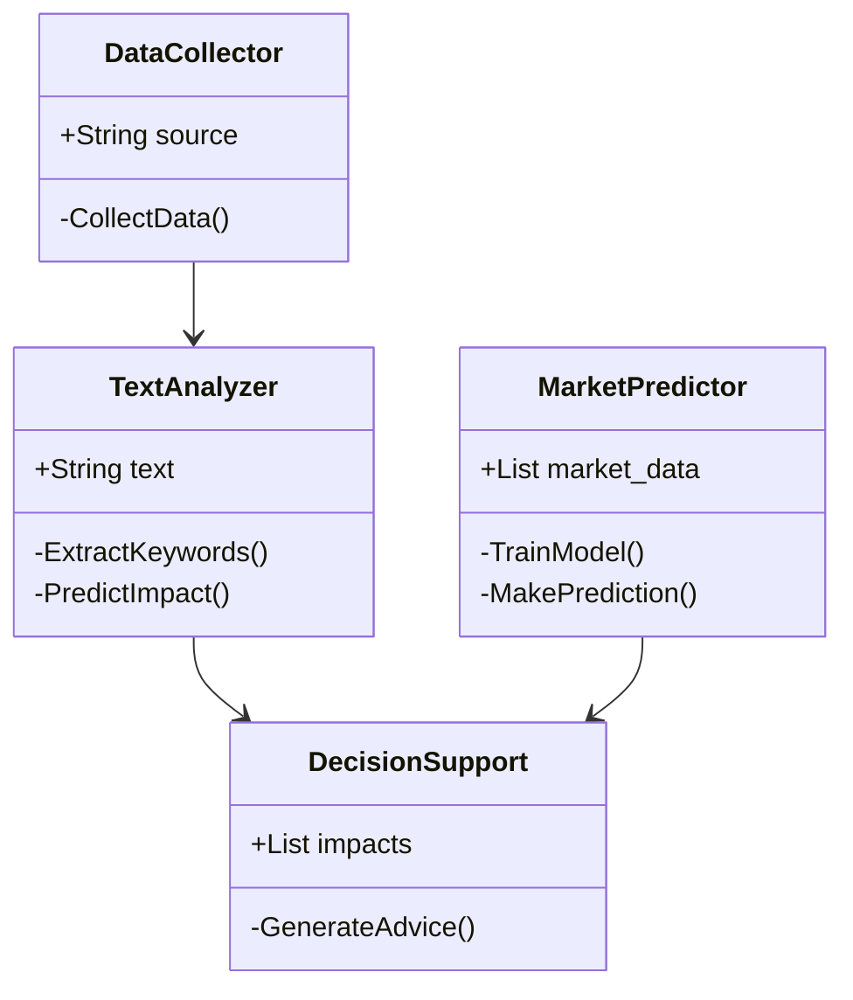
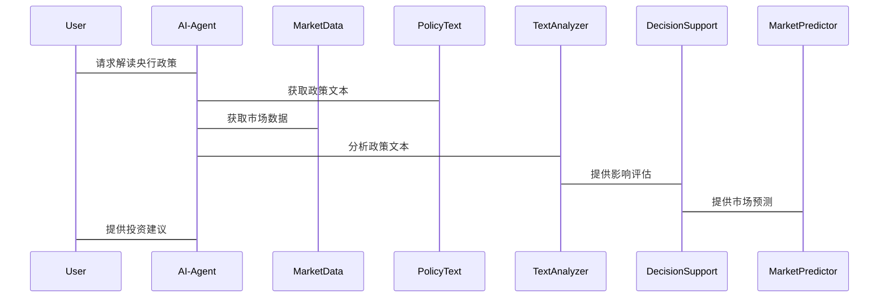

                 


# AI agents辅助价值投资者解读央行政策影响

---

## 关键词：AI agents、价值投资者、央行政策、自然语言处理、时间序列分析、金融数据分析

---

## 摘要：  
本文详细探讨了AI agents如何辅助价值投资者解读央行政策的影响，帮助投资者做出更明智的投资决策。文章从AI agents的基本概念出发，分析了央行政策对金融市场的影响，并结合自然语言处理（NLP）和时间序列分析等技术，详细阐述了AI agents在政策解读和市场预测中的应用。通过实际案例分析和系统设计，展示了如何利用AI技术提升投资分析的效率和准确性。  

---

## 第1章：AI agents与金融投资概述

### 1.1 AI agents的基本概念  
AI agents（人工智能代理）是指能够感知环境并采取行动以实现特定目标的智能实体。在金融领域，AI agents可以通过分析市场数据、解读政策文本、预测市场趋势等方式，辅助投资者做出决策。  

#### 1.1.1 AI agents的定义与特点  
- **定义**：AI agents是具有自主决策能力的智能系统，能够根据输入数据采取相应行动。  
- **特点**：  
  - **自主性**：能够独立决策，无需人工干预。  
  - **反应性**：能够实时感知环境并做出反应。  
  - **目标导向**：所有行动都以实现特定目标为导向。  

#### 1.1.2 AI agents在金融领域的应用  
- **股票交易**：通过算法交易系统，AI agents可以在毫秒级别完成交易决策。  
- **风险控制**：利用AI代理实时监控市场风险，及时发出预警信号。  
- **投资组合管理**：AI agents可以根据市场变化动态调整投资组合。  

#### 1.1.3 价值投资者与AI agents的结合  
价值投资者注重长期投资，关注企业的基本面和内在价值。AI agents可以帮助价值投资者快速分析大量数据，识别潜在的投资机会，并预测市场趋势。  

### 1.2 央行政策对金融市场的影响  
央行政策是影响金融市场的重要因素，包括货币政策、利率调整、货币供应量变化等。  

#### 1.2.1 央行政策的核心内容  
- **货币政策**：通过调整利率、货币供应量等手段影响经济活动。  
- **财政政策**：通过政府支出和税收政策调节经济。  
- **汇率政策**：通过干预外汇市场影响汇率变动。  

#### 1.2.2 央行政策对股市、债市的影响  
- **股市**：利率下降通常会降低企业的融资成本，刺激股市上涨。  
- **债市**：利率上升会导致债券收益率下降，反之亦然。  
- **政策不确定性**：政策变化的不确定性可能引发市场波动。  

#### 1.2.3 央行政策的解读与预测  
- **政策解读**：分析政策文本，识别政策的核心内容和潜在影响。  
- **政策预测**：基于历史数据和市场反馈，预测未来政策走向。  

### 1.3 AI agents辅助投资的优势  
- **提高信息处理效率**：AI agents可以快速处理大量数据，提取关键信息。  
- **增强市场预测能力**：通过机器学习模型，AI agents可以预测市场趋势。  
- **优化投资决策流程**：AI代理可以辅助投资者做出更明智的决策。  

---

## 第2章：自然语言处理与政策解读  

### 2.1 自然语言处理（NLP）技术  
NLP是AI代理的重要技术之一，能够帮助代理理解人类语言，解读政策文本。  

#### 2.1.1 NLP的基本原理  
- **文本预处理**：包括分词、去除停用词、文本向量化等步骤。  
- **文本理解**：通过词袋模型、TF-IDF等方法理解文本内容。  
- **文本生成**：基于预训练模型生成自然语言文本。  

#### 2.1.2 常见NLP模型  
- **BERT**：基于Transformer的预训练模型，擅长上下文理解。  
- **GPT**：生成式预训练模型，能够生成自然语言文本。  
- **LSTM**：长短期记忆网络，适合处理序列数据。  

#### 2.1.3 NLP在政策文本分析中的应用  
- **关键词提取**：从政策文本中提取关键术语。  
- **主题模型**：通过LDA等主题模型分析政策文本的主题分布。  
- **情感分析**：判断政策文本中隐含的情绪倾向。  

#### 2.2 政策文本的特征提取  
- **文本预处理**：去除停用词、分词、句法分析。  
- **关键词提取**：使用TF-IDF或主题模型提取关键词。  
- **实体识别**：识别政策文本中的实体，如人名、组织名、日期等。  

#### 2.3 基于NLP的政策影响预测  
- **文本向量化**：将政策文本转化为向量表示。  
- **相似度计算**：通过余弦相似度判断政策文本的相似性。  
- **市场反应分析**：结合历史市场数据，预测政策的市场影响。  

---

## 第3章：时间序列分析与市场预测  

### 3.1 时间序列分析基础  
时间序列分析是研究市场数据的重要方法，能够帮助投资者预测未来趋势。  

#### 3.1.1 时间序列的基本特征  
- **趋势**：数据的长期走势。  
- **周期性**：数据的周期性波动。  
- **随机性**：数据的不可预测部分。  

#### 3.1.2 常见的时间序列模型  
- **ARIMA**：自回归积分滑动平均模型，适合线性时间序列预测。  
- **GARCH**：广义自回归条件异方差模型，适合预测波动性。  
- **LSTM**：长短期记忆网络，适合非线性时间序列预测。  

#### 3.1.3 机器学习在时间序列预测中的应用  
- **特征工程**：提取时间序列的特征，如均值、标准差、自相关系数等。  
- **模型训练**：使用神经网络模型训练时间序列数据。  
- **预测评估**：通过均方误差（MSE）、平均绝对误差（MAE）等指标评估模型性能。  

### 3.2 基于时间序列的市场预测  
- **数据准备**：收集和清洗市场数据，包括股票价格、成交量等。  
- **模型选择**：根据数据特点选择合适的模型。  
- **模型训练**：使用训练数据训练模型。  
- **预测与评估**：利用测试数据预测未来趋势，并评估模型性能。  

---

## 第4章：系统架构设计与实现  

### 4.1 问题场景介绍  
- **目标**：构建一个AI代理系统，辅助价值投资者解读央行政策。  
- **需求**：实时监控市场数据，解读政策文本，预测市场趋势。  

### 4.2 系统功能设计  
- **数据采集模块**：采集央行政策文本和市场数据。  
- **文本分析模块**：使用NLP技术解读政策文本。  
- **市场预测模块**：基于时间序列模型预测市场趋势。  
- **决策支持模块**：根据分析结果提供投资建议。  

### 4.3 系统架构设计  
- **分层架构**：包括数据层、业务逻辑层和用户界面层。  
- **组件设计**：包括数据源、数据处理组件、模型训练组件、结果展示组件。  

#### 4.3.1 类图  


#### 4.3.2 序列图  


---

## 第5章：项目实战与案例分析  

### 5.1 环境安装与配置  
- **安装Python**：确保Python 3.8及以上版本。  
- **安装依赖库**：包括`numpy`、`pandas`、`tensorflow`、`pytorch`等。  

### 5.2 核心代码实现  

#### 5.2.1 政策文本分析  
```python
import numpy as np
from sklearn.feature_extraction.text import TfidfVectorizer
from sklearn.decomposition import NMF

# 示例政策文本
text = "央行将降低基准利率以刺激经济增长"

# 文本预处理
vectorizer = TfidfVectorizer(stop_words='english')
tfidf = vectorizer.fit_transform([text])

# 主题模型
nmf = NMF(n_components=1, random_state=42)
nmf.fit(tfidf)

# 提取关键词
keywords = vectorizer.get_feature_names_out()[nmf.components_[0].argsort()[-10:]]
print(keywords)
```

#### 5.2.2 市场预测模型  
```python
import pandas as pd
from tensorflow.keras.models import Sequential
from tensorflow.keras.layers import LSTM, Dense

# 示例市场数据
data = pd.DataFrame({'price': [100, 105, 98, 110, 108]})

# 数据准备
X = []
y = []
for i in range(1, len(data)):
    X.append(data.iloc[i-1])
    y.append(data.iloc[i])

# 模型训练
model = Sequential()
model.add(LSTM(50, input_shape=(1,1)))
model.add(Dense(1))
model.compile(optimizer='adam', loss='mean_squared_error')
model.fit(X, y, epochs=10, batch_size=1)
```

### 5.3 实际案例分析  
假设央行宣布降低基准利率，AI代理可以通过NLP技术分析政策文本，提取关键词如“降低”、“利率”、“刺激”等，并结合市场数据预测股票价格可能上涨。  

### 5.4 项目小结  
通过实际案例分析，展示了AI代理在解读央行政策和预测市场趋势中的强大能力。  

---

## 第6章：总结与展望  

### 6.1 总结  
本文详细探讨了AI代理在辅助价值投资者解读央行政策中的应用，结合了自然语言处理和时间序列分析等技术，展示了如何利用AI技术提升投资分析的效率和准确性。  

### 6.2 未来展望  
未来，随着AI技术的不断发展，AI代理在金融领域的应用将更加广泛。可能的方向包括：  
- 更加智能化的市场预测模型。  
- 更加高效的数据处理方法。  
- 更加人性化的用户界面设计。  

---

## 作者：AI天才研究院/AI Genius Institute & 禅与计算机程序设计艺术 /Zen And The Art of Computer Programming  

---

**本文内容来源于对AI代理技术的深入研究和实际应用案例的分析，旨在为价值投资者提供一种新的视角和工具，帮助他们更好地解读央行政策，把握市场趋势。**

