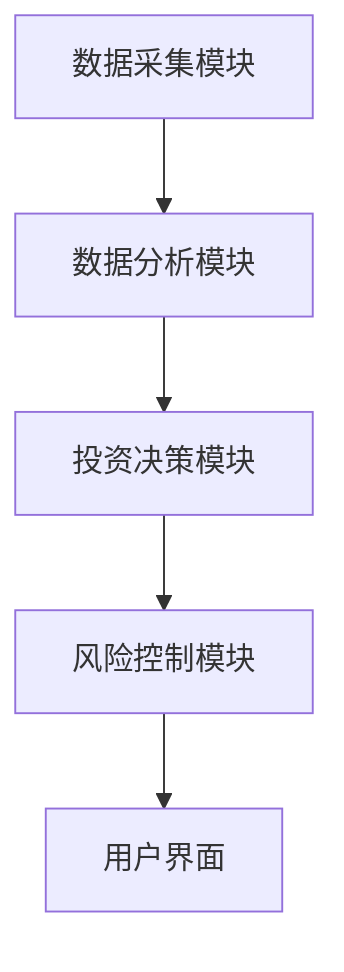
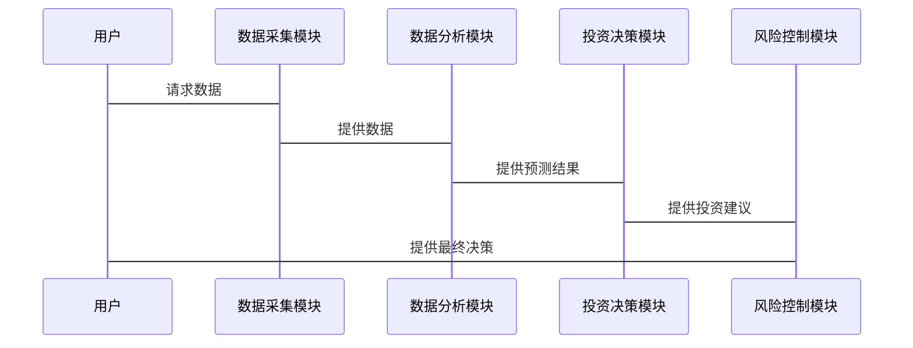

                 


# AI代理辅助价值投资者解读宏观经济指标

> 关键词：AI代理，价值投资，宏观经济指标，机器学习，深度学习，投资决策，数据分析

> 摘要：本文将深入探讨AI代理如何辅助价值投资者解读宏观经济指标。通过分析宏观经济指标的基本概念、AI代理的核心功能，以及它们在投资决策中的结合，我们将揭示AI代理在宏观经济分析中的潜力。文章还将详细讲解AI代理辅助宏观经济分析的核心原理，包括数据处理、特征提取、模型训练与预测，以及结果解释与投资决策。最后，我们将通过实际案例展示AI代理在宏观经济指标分析中的应用，并总结最佳实践和注意事项。

---

# 第一部分: AI代理与宏观经济指标基础

## 第1章: AI代理的基本概念与宏观经济指标概述

### 1.1 AI代理的定义与核心功能

#### 1.1.1 什么是AI代理
AI代理（Artificial Intelligence Agent）是指具备自主决策能力的智能体，能够感知环境、理解数据、执行任务并做出决策。AI代理的核心在于其智能性和适应性，能够通过学习和推理来优化任务执行效率。

#### 1.1.2 AI代理的核心功能与特点
- **感知能力**：AI代理能够通过传感器或数据输入接口感知外部环境。
- **推理能力**：基于感知到的信息，AI代理能够进行逻辑推理和数据分析。
- **决策能力**：根据推理结果，AI代理能够做出最优决策。
- **自适应能力**：AI代理能够根据环境变化动态调整策略和行为。

#### 1.1.3 AI代理在金融领域的应用潜力
AI代理在金融领域的应用潜力巨大，尤其是在宏观经济分析和投资决策领域。AI代理可以通过对海量数据的处理和分析，帮助投资者快速捕捉市场趋势和潜在机会。

### 1.2 宏观经济指标的定义与分类

#### 1.2.1 宏观经济指标的基本概念
宏观经济指标是衡量一个国家或地区经济运行状态的重要工具。常见的宏观经济指标包括国内生产总值（GDP）、失业率、消费者价格指数（CPI）、工业产出指数等。

#### 1.2.2 主要宏观经济指标的分类与作用
- **总量指标**：如GDP、国民收入，用于衡量整体经济规模和增长。
- **结构指标**：如产业构成比例，用于分析经济结构的合理性。
- **价格指标**：如CPI、生产者价格指数（PPI），用于衡量通货膨胀水平。
- **就业指标**：如失业率，用于反映劳动力市场的健康状况。

#### 1.2.3 宏观经济指标对价值投资的影响
宏观经济指标对价值投资的影响是多方面的。例如，GDP增长率可以反映整体经济的增长潜力，CPI则可以提示通货膨胀风险。价值投资者可以通过分析宏观经济指标来评估企业的盈利能力和发展前景。

### 1.3 价值投资与宏观经济分析的结合

#### 1.3.1 价值投资的核心理念
价值投资是一种投资策略，强调通过分析企业的内在价值，寻找被市场低估的投资标的。价值投资者通常关注企业的财务状况、盈利能力以及行业地位。

#### 1.3.2 宏观经济分析在价值投资中的重要性
宏观经济分析在价值投资中具有重要意义。宏观经济指标可以帮助投资者判断整体经济环境对企业价值的影响，从而做出更明智的投资决策。

#### 1.3.3 AI代理如何辅助价值投资
AI代理可以通过对宏观经济指标的实时监控、数据挖掘和预测模型，帮助投资者快速识别市场趋势和投资机会。例如，AI代理可以分析GDP增长率和CPI走势，预测企业的盈利能力，并为企业估值提供数据支持。

---

## 第2章: AI代理辅助宏观经济分析的核心原理

### 2.1 数据处理与特征提取

#### 2.1.1 数据预处理的基本方法
数据预处理是AI代理辅助宏观经济分析的第一步。预处理步骤包括数据清洗、数据转换和数据标准化。通过预处理，可以消除数据中的噪声，提高模型的准确性。

#### 2.1.2 宏观经济指标的特征提取技术
特征提取是将原始数据转化为更有意义的特征表示的过程。例如，可以通过移动平均线（MA）和指数平滑法（ES）对时间序列数据进行特征提取，提取趋势和周期性特征。

#### 2.1.3 时间序列数据分析的挑战与解决方案
时间序列数据分析的挑战包括数据的非平稳性和季节性。为了应对这些挑战，可以使用ARIMA模型（自回归积分滑动平均模型）或LSTM（长短期记忆网络）进行建模和预测。

### 2.2 模型训练与预测

#### 2.2.1 机器学习模型在宏观经济预测中的应用
机器学习模型，如线性回归和随机森林，常用于宏观经济指标的预测。线性回归适用于线性关系的建模，而随机森林则适用于非线性关系的建模。

#### 2.2.2 深度学习模型的优势与局限性
深度学习模型，如LSTM和Transformer，具有强大的非线性建模能力，能够捕捉复杂的经济规律。然而，深度学习模型通常需要大量的数据和计算资源，且模型解释性较差。

#### 2.2.3 组合模型的构建与优化
为了提高预测的准确性，可以将多种模型组合起来，形成一个组合模型。例如，可以通过投票法或加权平均法将线性回归、随机森林和LSTM的预测结果结合起来，得到最终的预测结果。

### 2.3 结果解释与投资决策

#### 2.3.1 预测结果的可解释性分析
预测结果的可解释性是投资者决策的重要依据。例如，如果模型预测GDP增长率将下降，投资者需要了解下降的原因和可能的影响。

#### 2.3.2 如何将预测结果转化为投资决策
投资者可以根据预测结果调整投资策略。例如，如果预测GDP增长率将上升，投资者可以增加对周期性行业的投资；如果预测通货膨胀率将上升，投资者可以增加对抗通胀资产的投资。

#### 2.3.3 风险控制与投资组合优化
通过AI代理的预测结果，投资者可以更好地控制投资风险。例如，可以通过动态调整投资组合的资产配置，降低整体投资组合的风险。

---

## 第3章: 宏观经济指标的多维度分析

### 3.1 主要宏观经济指标的综合分析

#### 3.1.1 GDP增长率的预测与投资影响
GDP增长率是衡量经济健康状况的重要指标。AI代理可以通过对GDP增长率的预测，帮助投资者判断经济的整体走势，并据此调整投资策略。

#### 3.1.2 失业率与市场波动的关系
失业率与市场波动密切相关。高失业率通常意味着经济低迷，市场波动较大。通过AI代理对失业率的预测，投资者可以更好地应对市场波动。

#### 3.1.3 消费者价格指数（CPI）与通货膨胀预测
CPI是衡量通货膨胀的重要指标。通过AI代理对CPI的预测，投资者可以更好地判断通货膨胀风险，并相应调整投资策略。

### 3.2 宏观经济指标的相互关系与系统性分析

#### 3.2.1 宏观经济指标之间的相互影响
宏观经济指标之间存在相互影响。例如，高失业率可能导致消费下降，进而影响GDP增长率。通过系统性分析，投资者可以更好地理解这些相互关系。

#### 3.2.2 系统性风险的识别与预警
系统性风险是指整个金融系统面临的风险，如金融危机和经济衰退。通过AI代理对宏观经济指标的综合分析，投资者可以更好地识别系统性风险，并提前采取防范措施。

#### 3.2.3 经济周期的识别与投资策略调整
经济周期包括衰退、复苏、繁荣和衰退阶段。通过AI代理对经济周期的识别，投资者可以更好地调整投资策略，例如在繁荣阶段增加风险资产的投资，在衰退阶段增加防御性资产的投资。

### 3.3 宏观经济指标的区域差异与全球视角

#### 3.3.1 不同国家或地区的宏观经济指标差异
不同国家或地区的宏观经济指标存在差异。例如，发展中国家的经济增长率通常高于发达国家，但通货膨胀率也可能更高。通过AI代理的分析，投资者可以更好地理解这些差异，并制定相应的投资策略。

#### 3.3.2 全球经济趋势的预测与投资机会
全球经济趋势的预测对跨国投资至关重要。通过AI代理对全球经济指标的分析，投资者可以更好地把握全球经济趋势，并发现潜在的投资机会。

#### 3.3.3 跨国投资中的宏观经济分析
跨国投资需要考虑不同国家或地区的宏观经济环境。通过AI代理的分析，投资者可以更好地评估跨国投资的风险和收益，并制定相应的投资策略。

---

## 第4章: AI代理辅助宏观经济分析的系统设计

### 4.1 问题场景介绍
在价值投资中，投资者需要实时监控宏观经济指标的变化，并根据这些变化调整投资策略。然而，宏观经济指标的数量庞大且复杂，人工分析效率低下。因此，引入AI代理来辅助宏观经济分析成为一种必然趋势。

### 4.2 系统功能设计

#### 4.2.1 数据采集模块
数据采集模块负责从多个数据源（如政府统计机构、金融数据平台）获取宏观经济指标数据。为了确保数据的准确性和及时性，数据采集模块需要支持多种数据格式和接口。

#### 4.2.2 数据分析模块
数据分析模块负责对采集到的宏观经济指标数据进行处理和分析。通过使用数据挖掘和机器学习技术，数据分析模块可以提取数据中的潜在规律，并生成预测结果。

#### 4.2.3 投资决策模块
投资决策模块负责根据分析模块的预测结果，生成投资建议和决策。例如，如果预测GDP增长率将上升，投资决策模块可以建议增加对周期性行业的投资。

#### 4.2.4 风险控制模块
风险控制模块负责评估投资决策的风险，并制定风险控制策略。例如，如果预测市场波动将增大，风险控制模块可以建议增加防御性资产的投资比例。

### 4.3 系统架构设计

#### 4.3.1 系统架构图
以下是系统架构图的Mermaid表示：



#### 4.3.2 系统接口设计
系统接口设计包括数据采集模块的API接口、数据分析模块的算法接口、投资决策模块的决策接口以及风险控制模块的风险评估接口。这些接口需要遵循统一的标准，以确保系统的兼容性和可扩展性。

#### 4.3.3 系统交互流程
以下是系统交互流程的Mermaid表示：



### 4.4 系统实现

#### 4.4.1 环境配置
为了实现AI代理辅助宏观经济分析的系统，需要配置以下环境：
- **编程语言**：Python 3.8+
- **机器学习框架**：TensorFlow 2.0+, PyTorch 1.8+
- **数据处理工具**：Pandas, NumPy
- **可视化工具**：Matplotlib, Seaborn
- **开发环境**：Jupyter Notebook, VS Code

#### 4.4.2 核心代码实现

```python
import numpy as np
import pandas as pd
from sklearn.linear_model import LinearRegression
from sklearn.metrics import mean_squared_error

# 数据加载
data = pd.read_csv('macroeconomic_indicators.csv')

# 数据预处理
X = data[['GDP增长率', '失业率', 'CPI']]
y = data['预测目标']

# 模型训练
model = LinearRegression()
model.fit(X, y)

# 模型预测
y_pred = model.predict(X)

# 模型评估
 mse = mean_squared_error(y, y_pred)
 print(f'Mean Squared Error: {mse}')
```

#### 4.4.3 代码应用解读与分析
上述代码实现了基于线性回归模型的宏观经济指标预测。首先，数据加载模块从CSV文件中读取数据；然后，数据预处理模块对数据进行清洗和转换；接下来，模型训练模块使用线性回归模型对数据进行训练；最后，模型预测模块使用训练好的模型对新数据进行预测，并对预测结果进行评估。

#### 4.4.4 系统优化与扩展
为了提高系统的性能和扩展性，可以考虑以下优化措施：
- **数据源扩展**：增加更多数据源，如政府统计数据、市场调研数据等。
- **模型优化**：尝试不同的机器学习模型，如随机森林、LSTM等，以提高预测精度。
- **实时监控**：实现实时数据采集和预测，确保系统的及时性和准确性。

---

## 第5章: 项目实战

### 5.1 环境安装与配置
为了实现AI代理辅助宏观经济分析的系统，需要安装以下工具和库：
- **Python**：建议使用Anaconda发行版。
- **机器学习库**：包括scikit-learn、TensorFlow、PyTorch等。
- **数据处理库**：包括Pandas、NumPy。
- **可视化库**：包括Matplotlib、Seaborn。

### 5.2 核心代码实现

#### 5.2.1 数据采集模块

```python
import requests
import json

def fetch_data(api_key):
    url = 'https://api.example.com/macroeconomic_indicators'
    headers = {'Authorization': f'Bearer {api_key}'}
    response = requests.get(url, headers=headers)
    data = response.json()
    return data
```

#### 5.2.2 数据分析模块

```python
import pandas as pd
from sklearn.ensemble import RandomForestRegressor

def preprocess_data(data):
    df = pd.DataFrame(data)
    df['date'] = pd.to_datetime(df['date'])
    df.set_index('date', inplace=True)
    return df

def train_model(df, target_col):
    features = df.drop(columns=[target_col])
    target = df[target_col]
    model = RandomForestRegressor(n_estimators=100, random_state=42)
    model.fit(features, target)
    return model

```

#### 5.2.3 投资决策模块

```python
def generate_investment_recommendations(model, current_data):
    df = preprocess_data(current_data)
    predictions = model.predict(df)
    recommendations = []
    for i in range(len(predictions)):
        if predictions[i] > 0.7:
            recommendations.append('买入')
        elif predictions[i] < 0.3:
            recommendations.append('卖出')
        else:
            recommendations.append('持有')
    return recommendations
```

#### 5.2.4 风险控制模块

```python
def assess_risk(recommendations):
    risk_level = '低风险'
    if '卖出' in recommendations:
        risk_level = '高风险'
    return risk_level
```

### 5.3 代码应用解读与分析
上述代码实现了一个完整的AI代理辅助宏观经济分析的系统。数据采集模块通过API接口获取宏观经济指标数据；数据分析模块对数据进行预处理，并使用随机森林模型进行训练和预测；投资决策模块根据预测结果生成投资建议；风险控制模块根据投资建议评估整体风险水平。

### 5.4 实际案例分析
以GDP增长率预测为例，假设我们已经训练好了一个随机森林模型。通过输入最新的宏观经济指标数据，模型可以预测出未来的GDP增长率。根据预测结果，投资决策模块可以生成相应的投资建议，并通过风险控制模块评估整体风险水平。

### 5.5 项目总结
通过实际案例分析，我们可以看到AI代理在宏观经济指标分析中的巨大潜力。AI代理不仅可以提高分析效率，还能帮助投资者捕捉更多的市场机会。然而，AI代理的应用也面临一些挑战，如数据质量和模型解释性等。未来，随着技术的进步，这些问题将逐步得到解决。

---

## 第6章: 最佳实践、小结与注意事项

### 6.1 最佳实践
- **数据质量**：确保数据的准确性和完整性，避免噪声数据对模型的影响。
- **模型选择**：根据具体问题选择合适的模型，避免盲目追求复杂性。
- **实时监控**：建立实时监控机制，及时发现和处理系统异常。
- **风险管理**：制定完善的风险管理策略，确保投资决策的安全性。

### 6.2 小结
本文详细探讨了AI代理如何辅助价值投资者解读宏观经济指标。通过分析宏观经济指标的基本概念、AI代理的核心功能，以及它们在投资决策中的结合，我们揭示了AI代理在宏观经济分析中的潜力。同时，我们还详细讲解了AI代理辅助宏观经济分析的核心原理，并通过实际案例展示了AI代理在宏观经济指标分析中的应用。

### 6.3 注意事项
- **数据隐私**：在处理宏观经济指标数据时，需要注意数据的隐私性和敏感性。
- **模型局限性**：AI代理的预测结果仅供参考，不能完全替代人类的判断和决策。
- **技术风险**：AI代理的应用需要考虑技术风险，如算法漏洞和系统故障等。

---

# 作者：AI天才研究院/AI Genius Institute & 禅与计算机程序设计艺术 /Zen And The Art of Computer Programming

