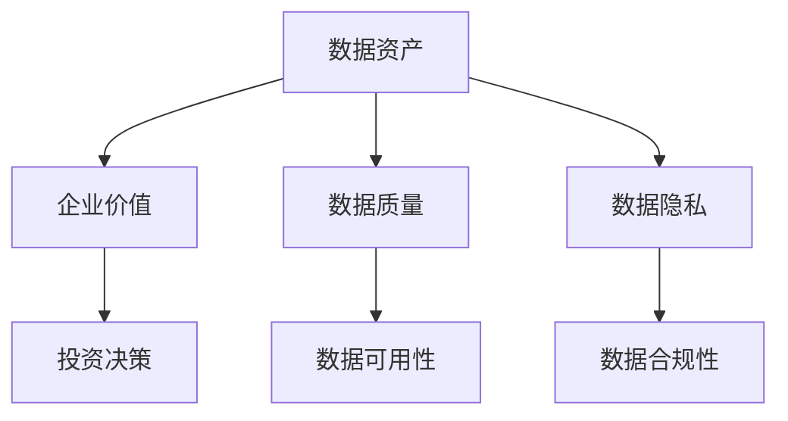
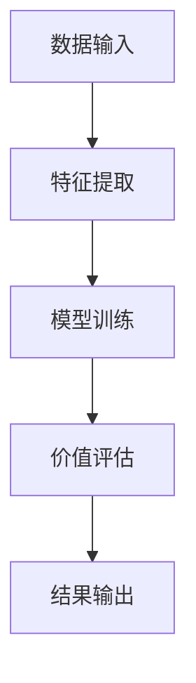
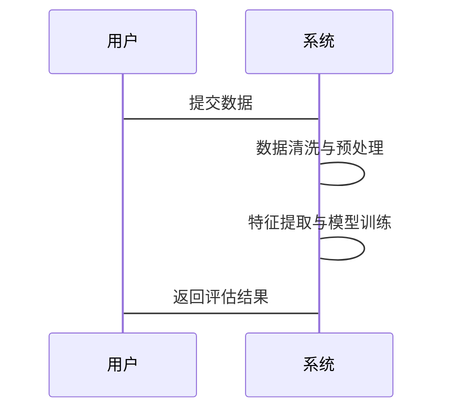

                 


# AI agents辅助价值投资者评估公司的数据资产价值

> 关键词：AI agents, 数据资产价值评估, 价值投资, 数据资产, 投资决策

> 摘要：本文探讨了AI agents在辅助价值投资者评估公司数据资产价值中的应用。通过分析数据资产的核心概念、价值评估的算法原理、系统架构设计以及实际案例，本文详细阐述了如何利用AI技术提升数据资产评估的效率和准确性。文章结合理论与实践，为价值投资者提供了实用的工具和方法。

---

## 第一部分: 数据资产价值评估的背景与挑战

### 第1章: 数据资产价值评估的背景与挑战

#### 1.1 数据资产价值评估的背景
- 数据作为企业的核心资产，其价值在数字经济时代变得尤为重要。
- 价值投资者需要通过数据资产的评估来优化投资决策。
- AI agents的引入为数据资产评估提供了高效、智能的解决方案。

#### 1.2 数据资产价值评估的核心问题
- 数据资产的定义与分类：数据资产包括哪些内容？如何分类？
- 数据资产价值评估的难点：如何量化数据的价值？如何处理数据的不确定性？
- 数据资产与企业价值的关系：数据资产如何影响企业的整体价值？

#### 1.3 价值投资者的视角
- 价值投资的基本原理：寻找被市场低估的企业。
- 数据资产对投资决策的影响：数据资产如何影响企业的未来盈利能力？
- 价值投资者对数据资产的需求：如何通过数据资产评估发现投资机会？

---

### 第2章: AI agents的基本原理与应用

#### 2.1 AI agents的核心概念
- 什么是AI agents：AI agents是具有感知和行动能力的智能体，能够执行特定任务。
- AI agents的分类与特点：基于智能水平、应用场景等进行分类。
- AI agents在数据处理中的优势：高效性、准确性、可扩展性。

#### 2.2 AI agents与数据资产评估的结合
- 数据清洗与预处理：AI agents如何处理脏数据？
- 数据特征提取：AI agents如何识别关键特征？
- 数据价值评估：AI agents如何量化数据价值？

#### 2.3 AI agents的算法基础
- 基础算法概述：回归分析、聚类算法、神经网络等。
- 常见AI agents算法的优缺点：对比分析不同算法的适用场景。
- 算法选择与优化策略：如何根据具体需求选择合适的算法？

---

### 第3章: 数据资产价值评估的核心概念与联系

#### 3.1 数据资产价值评估的理论框架
- 数据资产价值的构成要素：数据质量、数据隐私、数据可用性等。
- 数据资产价值评估的指标体系：如何构建评估指标？
- 数据资产价值与企业价值的关系：数据资产如何影响企业价值？

#### 3.2 数据资产与企业价值的实体关系图


#### 3.3 数据资产价值评估的算法原理


---

### 第4章: 数据资产价值评估的算法原理

#### 4.1 数据清洗与预处理
- 数据清洗的必要性：处理缺失值、重复值、异常值。
- 数据预处理的步骤：标准化、归一化、特征工程。

#### 4.2 数据特征提取
- 基于统计的方法：均值、方差、相关系数。
- 基于机器学习的方法：主成分分析（PCA）、因子分析。
- 特征选择的策略：基于重要性排序、基于模型解释性。

#### 4.3 数据价值评估的数学模型
- 线性回归模型：$$ y = \beta_0 + \beta_1x_1 + \beta_2x_2 + \cdots + \beta_nx_n $$
- 聚类分析：K-means算法。
- 神经网络模型：深度学习在数据资产评估中的应用。

---

### 第5章: 系统分析与架构设计方案

#### 5.1 问题场景介绍
- 价值投资者需要评估目标公司的数据资产价值。
- 数据资产的多样性和复杂性使得传统方法效率低下。

#### 5.2 系统功能设计
- 数据输入与清洗模块：处理原始数据。
- 数据特征提取模块：识别关键特征。
- 数据价值评估模块：基于算法进行评估。
- 结果输出与可视化模块：展示评估结果。

#### 5.3 系统架构设计


#### 5.4 系统接口设计
- API接口：与其他系统集成。
- 用户界面：直观展示评估结果。

#### 5.5 系统交互序列图


---

### 第6章: 项目实战

#### 6.1 环境安装
- 安装Python、机器学习库（如scikit-learn、TensorFlow）。

#### 6.2 核心代码实现
```python
import pandas as pd
from sklearn.preprocessing import StandardScaler
from sklearn.linear_model import LinearRegression

# 数据清洗
def data_cleaning(data):
    # 处理缺失值
    data = data.dropna()
    # 标准化处理
    scaler = StandardScaler()
    data_scaled = scaler.fit_transform(data)
    return data_scaled

# 特征提取
def feature_extraction(data):
    # 使用主成分分析提取特征
    from sklearn.decomposition import PCA
    pca = PCA(n_components=3)
    features = pca.fit_transform(data)
    return features

# 数据价值评估
def value_assessment(features):
    # 线性回归模型
    model = LinearRegression()
    model.fit(features, target)
    return model.predict(features)
```

#### 6.3 代码应用解读
- 数据清洗：处理缺失值，标准化数据。
- 特征提取：使用PCA提取关键特征。
- 价值评估：基于线性回归模型进行预测。

#### 6.4 实际案例分析
- 某科技公司数据资产价值评估案例。
- 通过模型预测数据资产价值，辅助投资决策。

#### 6.5 项目小结
- 项目实现的关键点：数据清洗、特征提取、模型训练。
- 项目的实际效果：提升数据资产评估的效率和准确性。

---

### 第7章: 最佳实践 tips、小结、注意事项、拓展阅读

#### 7.1 小结
- AI agents在数据资产评估中的优势：高效性、智能性、可扩展性。
- 价值投资者如何利用AI agents优化投资决策。

#### 7.2 注意事项
- 数据隐私与合规性：确保数据处理符合相关法律法规。
- 模型的可解释性：选择适合的模型，确保结果的透明性。
- 模型的实时性：及时更新模型，应对数据变化。

#### 7.3 拓展阅读
- 推荐阅读《数据挖掘导论》、《机器学习实战》等书籍。
- 关注AI agents在其他领域的应用，如金融风险控制、供应链优化等。

---

## 作者：AI天才研究院/AI Genius Institute & 禅与计算机程序设计艺术 /Zen And The Art of Computer Programming

