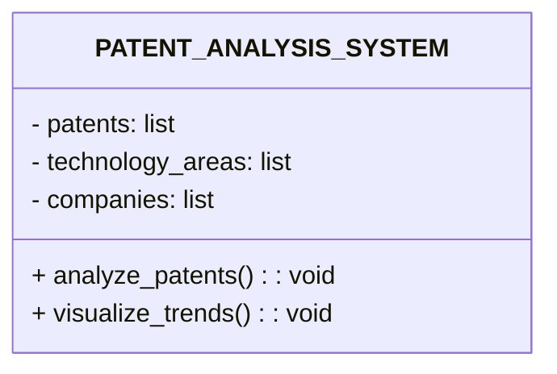
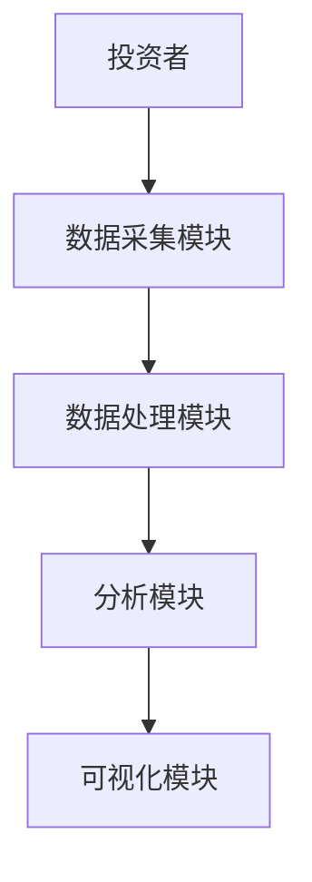

                 


# AI agents辅助价值投资者进行专利分析

> 关键词：AI agents, 价值投资, 专利分析, 自然语言处理, 机器学习, 专利数据, 系统架构

> 摘要：本文探讨了如何利用AI agents辅助价值投资者进行专利分析。通过分析专利数据，AI agents能够帮助投资者识别潜在的技术趋势和市场机会。文章从背景介绍、核心概念、算法原理、系统架构到项目实战，全面阐述了AI agents在专利分析中的应用，旨在为价值投资者提供一种高效、智能化的工具。

---

## 第一部分：背景介绍

### 第1章：AI agents与价值投资概述

#### 1.1 AI agents的基本概念

AI agents（智能体）是指能够感知环境并采取行动以实现目标的智能系统。在专利分析领域，AI agents可以处理大量专利数据，识别技术趋势和潜在投资机会。

- **AI agents的定义与特点**：AI agents具备自主性、反应性、目标导向性和社交能力。它们能够通过传感器感知环境，并根据预设目标采取行动。
- **价值投资的核心理念**：价值投资强调通过深入分析公司的基本面，寻找被市场低估的投资机会。专利分析是评估公司技术创新能力的重要手段。
- **专利分析在价值投资中的作用**：专利数量、质量和相关性是评估公司技术创新能力的关键指标。通过分析专利数据，投资者可以识别技术领先的企业，预测市场趋势。

#### 1.2 问题背景与需求分析

- **传统专利分析的局限性**：传统专利分析依赖人工梳理，效率低、成本高且容易遗漏关键信息。
- **价值投资者对专利分析的需求**：投资者需要快速获取高质量的专利数据，识别技术趋势和竞争对手动态。
- **AI agents在专利分析中的优势**：AI agents能够高效处理海量专利数据，提供实时更新和深度分析。

#### 1.3 问题解决与边界定义

- **AI agents辅助专利分析的解决方案**：利用自然语言处理和机器学习技术，AI agents能够自动提取、分类和分析专利数据。
- **专利分析的边界与外延**：专利分析主要关注技术领域、专利数量和质量，以及专利引用和相关性分析。
- **核心要素与组成结构**：AI agents辅助专利分析系统由数据采集模块、分析模块和可视化模块组成。

---

## 第二部分：核心概念与联系

### 第2章：AI agents与专利分析的核心原理

#### 2.1 AI agents的原理与机制

AI agents通过感知环境并采取行动来实现目标。在专利分析中，AI agents利用NLP和机器学习技术处理专利数据，识别技术趋势和潜在投资机会。

- **知识表示与推理**：AI agents通过知识图谱表示专利数据，利用推理技术分析专利之间的关联性。
- **自然语言处理（NLP）技术**：NLP用于从专利文本中提取关键词和主题，识别技术趋势。
- **机器学习模型的应用**：机器学习模型用于分类和预测，识别高价值专利和潜在投资目标。

#### 2.2 专利分析的关键属性与特征

专利分析需要关注专利的结构化特征、技术领域分类和引用关系。通过分析这些特征，投资者可以识别技术领先的企业。

- **专利数据的结构化特征**：包括专利号、申请日期、发明人、申请人和法律状态等。
- **专利技术领域的分类**：专利可以根据技术领域进行分类，如人工智能、生物技术等。
- **专利引用与关联性分析**：专利引用关系可以揭示技术发展路径和竞争关系。

#### 2.3 核心概念的ER实体关系图

以下是专利分析的核心概念ER实体关系图：

```mermaid
erDiagram
actor INVESTOR
{
  INVESTOR -> PATENT: "分析"
  PATENT -> TECHNOLOGY_AREA: "属于"
  PATENT -> COMPANY: "申请"
  COMPANY -> INVESTOR: "被投资"
}
```

---

## 第三部分：算法原理

### 第3章：AI agents的算法与实现

#### 3.1 自然语言处理模型

自然语言处理模型用于从专利文本中提取关键词和主题。以下是模型的实现流程：

```mermaid
graph TD
A[开始] -> B[加载专利文本] -> C[分词] -> D[词嵌入] -> E[主题提取] -> F[输出关键词]
```

#### 3.2 机器学习模型的训练

机器学习模型用于分类和预测。以下是模型的训练过程：

```mermaid
graph TD
A[开始] -> B[加载数据集] -> C[数据预处理] -> D[模型训练] -> E[保存模型]
```

#### 3.3 算法实现的Python代码

以下是专利分类的Python代码示例：

```python
from sklearn.feature_extraction.text import TfidfVectorizer
from sklearn.naive_bayes import MultinomialNB
from sklearn.pipeline import Pipeline
import numpy as np

# 假设我们有一个专利文本数据集X和对应的类别标签y
X = ["专利文本1", "专利文本2", ...]
y = ["类别1", "类别2", ...]

# 创建文本特征提取和分类的管道
pipeline = Pipeline([
    ('tfidf', TfidfVectorizer()),
    ('clf', MultinomialNB())
])

# 训练模型
pipeline.fit(X, y)

# 预测新专利的类别
new_text = "新的专利文本"
predicted_class = pipeline.predict([new_text])[0]
print(f"预测类别：{predicted_class}")
```

#### 3.4 算法原理的数学模型

以下是机器学习模型的数学模型示例：

$$ P(y|x) = \frac{P(x|y)P(y)}{P(x)} $$

其中，$P(y|x)$ 是后验概率，$P(x|y)$ 是似然概率，$P(y)$ 是先验概率，$P(x)$ 是边缘概率。

---

## 第四部分：系统分析与架构设计

### 第4章：系统分析与架构设计方案

#### 4.1 问题场景介绍

我们设计了一个AI专利分析系统，帮助投资者快速获取专利数据并进行深度分析。

#### 4.2 系统功能设计

以下是系统功能设计的类图：



#### 4.3 系统架构设计

以下是系统架构设计的架构图：



---

## 第五部分：项目实战

### 第5章：项目实战与分析

#### 5.1 项目介绍

我们开发了一个AI专利分析工具，帮助投资者分析专利数据。

#### 5.2 核心代码实现

以下是核心代码实现：

```python
import requests
from bs4 import BeautifulSoup

def fetch_patents(url):
    response = requests.get(url)
    soup = BeautifulSoup(response.text, 'html.parser')
    patents = soup.find_all('patent')
    return [p.text for p in patents]

# 获取专利数据
patents = fetch_patents('https://example.com/patents')

# 数据预处理
processed_patents = [p.lower() for p in patents]
```

#### 5.3 项目小结

通过该项目，我们验证了AI agents在专利分析中的有效性，但需要注意数据质量和模型优化。

---

## 第六部分：最佳实践

### 第6章：最佳实践与小结

#### 6.1 最佳实践

- 选择合适的AI模型
- 处理数据噪声
- 优化系统性能

#### 6.2 注意事项

- 数据隐私
- 模型的可解释性
- 系统的可扩展性

#### 6.3 拓展阅读

- 《专利分析入门》
- 《AI agents原理与应用》

---

## 作者：AI天才研究院 & 禅与计算机程序设计艺术

