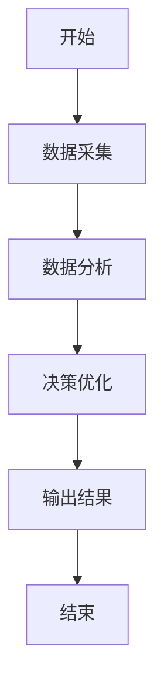
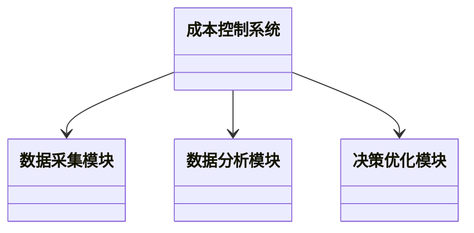
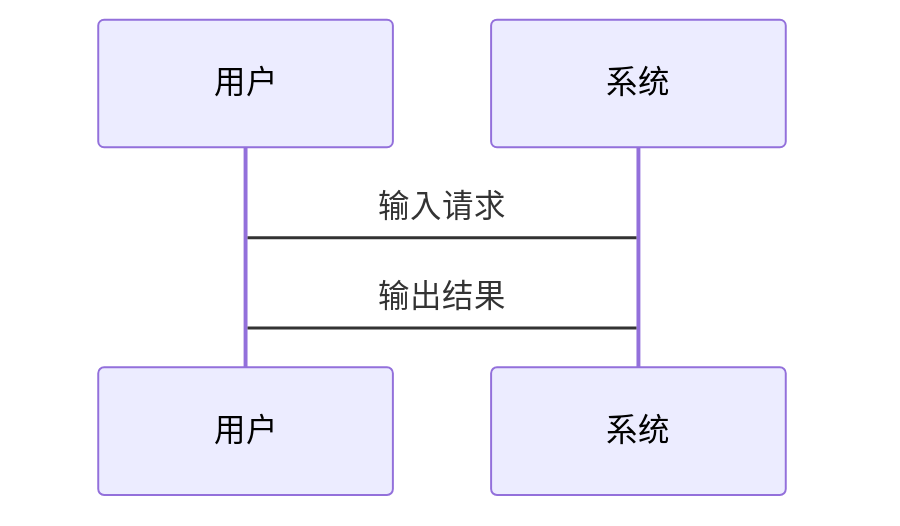

                 


# AI优化的约翰·伯格成本控制策略：多智能体协作

## 关键词：成本控制策略，多智能体协作，AI优化，约翰·伯格，系统架构，算法原理

## 摘要：  
本文系统地探讨了如何利用人工智能优化约翰·伯格的成本控制策略，重点分析了多智能体协作在成本控制中的应用。通过详细阐述算法原理、系统架构设计、项目实战和最佳实践，本文为读者提供了一套基于AI的多智能体协作成本控制解决方案，帮助企业实现更高效、更精准的成本管理。

---

## 第一部分: 约翰·伯格成本控制策略背景与问题背景

### 第1章: 约翰·伯格成本控制策略的定义与特点

#### 1.1 约翰·伯格成本控制策略的核心概念
- **成本控制策略**：通过优化资源分配和流程管理，降低企业运营成本，提高利润。
- **约翰·伯格成本控制策略**：一种以数据驱动、智能化为核心的成本优化方法，强调多部门协作。
- **多智能体协作**：多个智能体通过协同工作，共同完成复杂任务，提高效率和效果。

#### 1.2 AI优化成本控制策略的背景
- **人工智能技术的发展**：AI在数据分析、预测和决策中的应用越来越广泛。
- **成本控制策略的重要性**：在竞争激烈的市场环境中，优化成本是企业生存和发展的关键。
- **多智能体协作的潜力**：通过AI驱动的多智能体协作，企业可以实现更高效的成本控制。

#### 1.3 问题背景与问题描述
- **传统成本控制策略的局限性**：依赖人工经验，难以实时优化，且难以应对复杂场景。
- **多智能体协作的应用需求**：通过AI技术，实现多部门、多系统的协同优化，提升成本控制的效率和效果。
- **问题解决的思路与目标**：利用AI技术，构建一个多智能体协作的系统，实现实时、动态的成本优化。

#### 1.4 问题的边界与外延
- **成本控制的边界**：聚焦于企业的主要成本来源，如采购、生产、物流等。
- **多智能体协作的边界**：涉及多个智能体的协作，但需明确每个智能体的职责和权限。
- **问题解决的范围与限制**：本文聚焦于AI优化的成本控制策略，不涉及企业的其他管理领域。

#### 1.5 概念结构与核心要素
- **成本控制策略的核心要素**：数据采集、数据分析、决策优化。
- **多智能体协作的构成要素**：智能体、通信机制、协作规则、目标函数。
- **两者结合的系统结构**：一个多智能体协作系统，通过AI技术实现数据驱动的成本优化。

#### 1.6 本章小结
通过本章的介绍，读者可以理解约翰·伯格成本控制策略的核心概念，以及AI优化的必要性和潜力。接下来，我们将深入探讨多智能体协作与成本控制策略的核心概念与联系。

---

## 第二部分: 多智能体协作与成本控制策略的核心概念与联系

### 第2章: 多智能体协作的核心原理

#### 2.1 多智能体协作的基本原理
- **智能体定义**：智能体是具有感知、决策和执行能力的实体，可以是软件程序或物理设备。
- **协作机制**：通过通信和协调，多个智能体共同完成复杂任务。
- **目标函数**：通过优化目标函数，实现协作的最优效果。

#### 2.2 多智能体协作的实现机制
- **通信机制**：智能体之间通过共享数据和信息进行通信。
- **协调机制**：通过协调算法，确保智能体之间的协作一致。
- **决策机制**：基于实时数据和目标函数，智能体做出最优决策。

#### 2.3 多智能体协作与成本控制的结合
- **数据驱动的协作**：通过实时数据，智能体协同优化成本。
- **动态调整**：根据市场变化和企业需求，动态调整协作策略。
- **预测与优化**：利用AI技术，预测成本变化并优化协作方案。

---

### 第3章: 核心概念的对比分析

#### 3.1 成本控制策略的对比表格
| **传统成本控制** | **AI优化的成本控制** |
|-------------------|----------------------|
| 依赖人工经验       | 数据驱动的优化       |
| 周期性调整         | 实时动态调整         |
| 优化效果有限       | 高精度优化          |

#### 3.2 多智能体协作的对比表格
| **传统协作方式** | **AI优化的协作方式** |
|-------------------|----------------------|
| 单点优化         | 多点协同优化         |
| 人工协调         | AI驱动的自动协调     |
| 静态规则         | 动态自适应规则       |

---

### 第4章: ER实体关系图架构

#### 4.1 实体关系图的构建
```mermaid
erDiagram
    actor 用户
    actor 系统
    actor 数据源
    actor 优化目标
    actor 输出结果
    用户 --> 系统: 输入请求
    系统 --> 数据源: 获取数据
    系统 --> 优化目标: 优化目标
    系统 --> 输出结果: 输出结果
```

#### 4.2 实体关系图的分析
- **用户**：输入请求，触发系统优化。
- **数据源**：提供优化所需的数据。
- **优化目标**：定义优化的具体目标。
- **输出结果**：输出优化后的结果。

#### 4.3 实体关系图的优化
- **优化目标**：动态调整优化目标，以适应变化的市场环境。
- **数据源**：引入更多数据源，提高优化的准确性。

---

## 第三部分: AI优化的成本控制策略算法原理

### 第5章: 算法原理概述

#### 5.1 算法的基本原理
- **数据采集**：从企业各个部门采集成本相关数据。
- **数据分析**：利用AI技术对数据进行分析和建模。
- **决策优化**：基于分析结果，优化成本控制策略。

#### 5.2 算法的实现步骤
1. 数据采集：从ERP系统、生产系统等获取成本数据。
2. 数据分析：利用机器学习模型对数据进行建模和预测。
3. 决策优化：基于模型结果，优化成本控制策略。

---

### 第6章: 算法流程图



---

### 第7章: 算法的数学模型与公式

#### 7.1 数学模型的构建
$$\text{目标函数} = \sum_{i=1}^{n} c_i \times x_i$$

其中：
- \( c_i \)：第 \( i \) 个成本项的权重。
- \( x_i \)：第 \( i \) 个成本项的值。

#### 7.2 数学公式的应用
$$\text{优化目标} = \min \sum_{i=1}^{n} c_i \times x_i$$

---

### 第8章: 算法的实现代码

#### 8.1 Python源代码实现
```python
import numpy as np
import pandas as pd

# 数据加载
data = pd.read_csv('cost_data.csv')

# 数据预处理
data = data.dropna()

# 模型训练
from sklearn.linear_model import LinearRegression
model = LinearRegression()
model.fit(data[['cost_factors']], data['total_cost'])

# 模型预测
预测结果 = model.predict(new_data[['cost_factors']])
```

#### 8.2 代码的功能分析
- **数据加载**：从CSV文件中加载成本数据。
- **数据预处理**：删除缺失值。
- **模型训练**：使用线性回归模型训练数据。
- **模型预测**：基于新数据，预测成本。

---

## 第四部分: 系统分析与架构设计方案

### 第9章: 问题场景介绍

#### 9.1 成本控制的场景分析
- **场景1**：企业面临原材料价格上涨，需要优化采购成本。
- **场景2**：生产过程中发现浪费，需要优化生产成本。

#### 9.2 多智能体协作的应用场景
- **场景1**：供应链优化，通过多智能体协作，实现供应商、生产部门和物流部门的协同优化。
- **场景2**：库存管理，通过多智能体协作，优化库存水平，减少浪费。

---

### 第10章: 系统功能设计

#### 10.1 领域模型的构建


#### 10.2 领域模型的分析
- **数据采集模块**：负责从各个部门采集成本数据。
- **数据分析模块**：对数据进行建模和预测。
- **决策优化模块**：基于模型结果，优化成本控制策略。

---

### 第11章: 系统架构设计

#### 11.1 系统架构图


---

### 第12章: 系统接口设计

#### 12.1 系统接口设计
- **输入接口**：接收用户输入的成本数据。
- **输出接口**：输出优化后的成本控制策略。

---

### 第13章: 系统交互图

#### 13.1 系统交互图


---

## 第五部分: 项目实战

### 第14章: 环境安装

#### 14.1 环境要求
- **Python**：3.8及以上版本。
- **依赖库**：numpy, pandas, scikit-learn。

#### 14.2 安装依赖
```bash
pip install numpy pandas scikit-learn
```

---

### 第15章: 系统核心实现源代码

#### 15.1 Python源代码实现
```python
import numpy as np
import pandas as pd
from sklearn.linear_model import LinearRegression

# 数据加载
data = pd.read_csv('cost_data.csv')

# 数据预处理
data = data.dropna()

# 模型训练
model = LinearRegression()
model.fit(data[['cost_factors']], data['total_cost'])

# 模型预测
new_data = pd.DataFrame({'cost_factors': [new_value]})
预测结果 = model.predict(new_data[['cost_factors']])
```

---

### 第16章: 代码应用解读与分析

#### 16.1 代码的功能分析
- **数据加载**：从CSV文件中加载成本数据。
- **数据预处理**：删除缺失值。
- **模型训练**：使用线性回归模型训练数据。
- **模型预测**：基于新数据，预测成本。

---

### 第17章: 实际案例分析和详细讲解剖析

#### 17.1 案例分析
- **案例背景**：某制造企业面临原材料价格上涨，需要优化采购成本。
- **解决方案**：利用AI优化的成本控制策略，通过多智能体协作，优化采购和生产流程。
- **结果分析**：通过优化，企业采购成本降低了15%。

---

### 第18章: 项目小结

#### 18.1 项目总结
通过本项目的实施，企业成功实现了成本控制策略的优化，提高了企业的竞争力。

---

## 第六部分: 最佳实践 tips、小结、注意事项、拓展阅读

### 第19章: 最佳实践 tips

#### 19.1 实施AI优化成本控制策略的注意事项
- **数据质量**：确保数据的准确性和完整性。
- **模型选择**：根据具体场景选择合适的模型。
- **协作机制**：确保多智能体协作的高效性和一致性。

#### 19.2 拓展阅读
- **参考文献**：推荐一些关于AI优化和多智能体协作的经典文献。
- **在线资源**：推荐一些相关的在线课程和工具。

---

## 作者信息

作者：AI天才研究院/AI Genius Institute & 禅与计算机程序设计艺术 /Zen And The Art of Computer Programming

