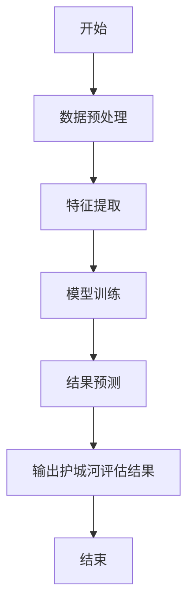
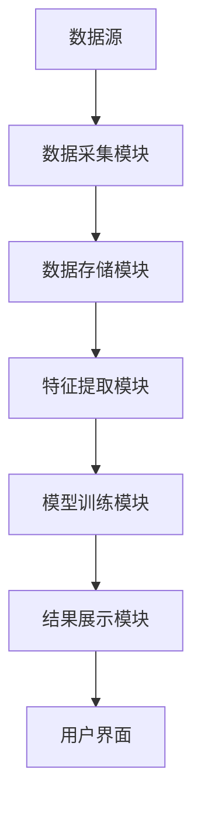

                 


# AI助力巴菲特式护城河分析：多维度评估竞争优势

## 关键词：护城河分析，人工智能，竞争优势，企业估值，数据驱动

## 摘要：  
本文探讨了如何利用人工智能技术助力巴菲特式护城河分析，从多维度评估企业的竞争优势。通过结合护城河分析的核心概念与AI算法，提出了一种基于数据驱动的分析方法，帮助企业更精准地识别和构建竞争优势。文章详细讲解了AI在护城河分析中的应用场景、算法原理、系统架构设计以及实际案例，为投资者和企业管理者提供了实用的工具和方法。

---

# 第一部分：护城河分析的背景与AI的引入

## 第1章：护城河分析的起源与价值

### 1.1 护城河分析的核心概念  
护城河分析是一种用于评估企业竞争优势的方法，源自巴菲特的投资理念。它通过识别企业的独特优势（如成本优势、品牌忠诚度、技术壁垒等），帮助企业确定其在市场中的长期竞争优势。  

- **护城河的四种类型**：  
  1. **成本优势**：企业以更低的成本生产产品或服务，从而在价格上具有竞争力。  
  2. **差异化优势**：通过独特的品牌形象或产品设计，吸引特定客户群体。  
  3. **网络效应**：产品或服务的价值随着用户数量的增加而增加，如社交平台或操作系统。  
  4. **资源壁垒**：企业拥有独特的资源（如专利、原材料来源等），难以被竞争对手复制。  

### 1.2 AI如何助力护城河分析  
人工智能技术的引入，极大地提升了护城河分析的效率和准确性。通过处理海量数据，AI可以帮助识别潜在的竞争优势，并预测其未来的表现。  

- **数据驱动的护城河评估**：AI可以通过分析企业财务数据、市场表现、客户反馈等，提取关键特征，量化竞争优势。  
- **AI在竞争优势识别中的作用**：通过自然语言处理（NLP）和机器学习算法，AI可以自动识别企业新闻、社交媒体信息中的潜在优势，并进行分类和打分。  

### 1.3 护城河分析的商业应用  
- **投资决策中的护城河评估**：投资者可以通过分析企业的护城河，评估其长期盈利能力，从而做出更明智的投资决策。  
- **企业战略规划中的护城河构建**：企业管理者可以利用护城河分析，识别自身竞争优势，并制定针对性的战略规划。  
- **行业竞争分析中的护城河动态变化**：通过实时监控竞争对手的护城河变化，企业可以及时调整策略，保持竞争优势。  

---

# 第二部分：护城河分析的核心概念与联系

## 第2章：护城河分析模型的构建  

### 2.1 护城河分析模型的定义与构成  
护城河分析模型是一种用于评估企业竞争优势的框架，其核心要素包括：  
- **企业优势**：企业的独特资源、技术、品牌等。  
- **竞争优势**：企业在市场中相对于竞争对手的优势。  
- **市场地位**：企业在行业中的影响力和市场份额。  

### 2.2 护城河分析模型的属性特征对比  

| **属性**       | **成本优势**       | **差异化优势**       | **网络效应**          | **资源壁垒**          |
|----------------|--------------------|----------------------|-----------------------|------------------------|
| **核心特征**   | 成本低，价格优势   | 品牌独特，客户忠诚   | 用户越多，价值越高   | 独特资源，难以复制    |
| **应用场景**   | 制造业、零售业     | 消费品、奢侈品       | 社交媒体、操作系统     | 石油、矿产行业         |
| **评估指标**   | 单位成本、利润率   | 品牌知名度、客户满意度 | 用户增长率、活跃度     | 专利数量、资源储量     |

### 2.3 护城河分析模型的ER实体关系图  
```mermaid
er
actor: 投资者
actor --> model: 输入企业数据
model --> result: 输出护城河评估结果
```

---

# 第三部分：AI驱动的护城河分析算法原理

## 第3章：护城河分析算法详解  

### 3.1 数据预处理与特征提取  

#### 3.1.1 数据清洗与标准化  
- 数据清洗：去除重复数据、处理缺失值、删除异常值。  
- 数据标准化：将数据归一化，便于模型训练。  

#### 3.1.2 特征提取  
- 从企业财务数据中提取关键指标（如净利润率、研发投入占比）。  
- 从文本数据中提取关键词（如“创新”、“客户满意度”）。  

### 3.2 护城河分析算法的实现  

#### 3.2.1 算法流程图  


#### 3.2.2 算法实现代码  
```python
# 数据预处理
import pandas as pd
data = pd.read_csv('enterprise_data.csv')
data = data.dropna().drop_duplicates()

# 特征提取
from sklearn.preprocessing import StandardScaler
scaler = StandardScaler()
features = scaler.fit_transform(data[['net_profit_margin', 'R&D_ratio']])

# 模型训练
from sklearn.linear_model import LinearRegression
model = LinearRegression()
model.fit(features, data['competitive_edge'])

# 结果预测
import numpy as np
new_features = scaler.transform(new_data[['net_profit_margin', 'R&D_ratio']])
predicted_edge = model.predict(new_features)
```

---

# 第四部分：护城河分析的数学模型

## 第4章：护城河分析的数学公式  

### 4.1 竞争优势的量化公式  
$$ competitive\_edge = \alpha \cdot cost\_advantage + \beta \cdot differentiation\_advantage + \gamma \cdot network\_effect + \delta \cdot resource\_barrier $$  

其中，$\alpha, \beta, \gamma, \delta$ 是各因素的权重系数，通常通过机器学习模型训练得到。  

### 4.2 AI模型的预测公式  
$$ predicted\_edge = \theta^T \cdot X + \theta_0 $$  
其中，$X$ 是输入特征向量，$\theta$ 是模型参数，$\theta_0$ 是偏置项。  

---

# 第五部分：系统分析与架构设计

## 第5章：护城河分析系统的构建  

### 5.1 系统应用场景  
- 投资者进行企业估值。  
- 企业管理者制定战略规划。  
- 行业分析师进行竞争分析。  

### 5.2 系统功能设计  

#### 5.2.1 功能模块  
- 数据采集模块：从多种数据源（如财务报表、新闻报道）获取数据。  
- 特征提取模块：对数据进行清洗、转换和特征提取。  
- 模型训练模块：训练护城河分析模型。  
- 结果展示模块：输出护城河评估结果。  

#### 5.2.2 系统架构图  


---

# 第六部分：项目实战

## 第6章：基于Python的护城河分析系统实现  

### 6.1 环境安装  
- 安装Python和相关库：`pip install numpy pandas scikit-learn`。  

### 6.2 核心代码实现  
```python
import pandas as pd
from sklearn.linear_model import LinearRegression
from sklearn.preprocessing import StandardScaler

# 数据加载
data = pd.read_csv('enterprise_data.csv')

# 数据预处理
data = data.dropna().drop_duplicates()

# 特征提取
features = data[['net_profit_margin', 'R&D_ratio']]
scaler = StandardScaler()
scaled_features = scaler.fit_transform(features)

# 模型训练
model = LinearRegression()
model.fit(scaled_features, data['competitive_edge'])

# 预测
new_data = pd.read_csv('new_enterprise.csv')
new_scaled_features = scaler.transform(new_data[['net_profit_margin', 'R&D_ratio']])
predicted_edge = model.predict(new_scaled_features)
```

### 6.3 代码解读与分析  
- 数据加载：从CSV文件中读取企业数据。  
- 数据预处理：删除缺失值和重复值。  
- 特征提取：选择关键财务指标并标准化。  
- 模型训练：使用线性回归模型训练护城河分析模型。  
- 预测：对新企业数据进行预测，输出竞争优势评估结果。  

---

# 第七部分：总结与展望

## 第7章：护城河分析的未来展望  

### 7.1 最佳实践  
- 使用最新的AI算法（如深度学习）提升模型精度。  
- 结合多源数据（如社交媒体、供应链数据）进行更全面的分析。  

### 7.2 小结  
本文详细探讨了AI在护城河分析中的应用，提出了基于数据驱动的分析方法，并通过实际案例展示了如何利用Python实现护城河分析系统。  

### 7.3 注意事项  
- 数据质量和来源对企业估值结果有重要影响。  
- 模型的选择应根据具体场景和数据特点进行调整。  

### 7.4 拓展阅读  
- 《巴菲特传》：了解巴菲特的投资理念。  
- 《机器学习实战》：学习更多AI算法的应用。  

---

# 作者：AI天才研究院 & 禅与计算机程序设计艺术

本文由AI天才研究院联合禅与计算机程序设计艺术团队共同撰写，转载请注明出处。

