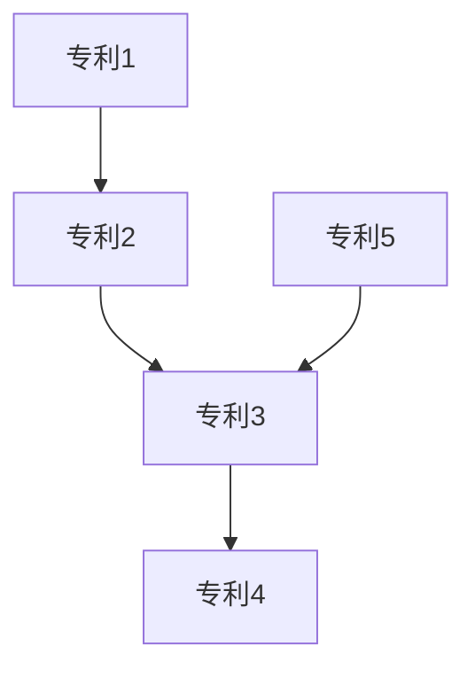
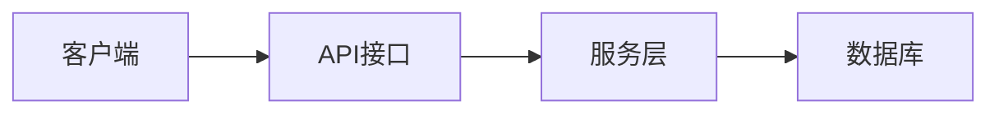
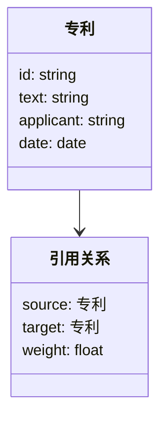

                 


# AI协作分析公司专利引用网络：评估技术领先地位

> **关键词**：AI协作分析、专利引用网络、技术领先性评估、知识图谱、网络分析、文本挖掘

> **摘要**：  
> 在现代商业竞争中，技术领先性是企业核心竞争力的关键体现。本文通过AI协作分析技术，结合专利引用网络的构建与分析，探讨如何利用知识图谱和网络分析方法，评估企业的技术领先地位。通过详细分析专利引用网络的构建方法、核心算法原理及系统实现，本文为读者提供了一套完整的AI协作分析解决方案，帮助企业在技术竞争中占据先机。

---

## 第一部分: AI协作分析公司专利引用网络概述

### 第1章: 什么是AI协作分析

#### 1.1 问题背景与目标

##### 1.1.1 企业技术领先性评估的挑战
企业要在技术领域保持领先地位，需要实时监控和分析海量专利数据。然而，专利数据的复杂性、异构性和动态性使得传统的人工分析效率低下，难以捕捉技术趋势和潜在机会。

##### 1.1.2 专利引用网络的定义与作用
专利引用网络是以专利为节点，以引用关系为边构建的网络。通过分析该网络的结构和属性，可以揭示技术领域的演进方向、技术关联性以及关键专利的影响力。

##### 1.1.3 AI协作分析的核心目标
利用AI技术对专利引用网络进行自动化分析，提取关键信息，评估企业的技术领先性，识别技术空白点和潜在风险。

#### 1.2 问题描述与解决思路

##### 1.2.1 专利引用网络的构建过程
通过文本挖掘技术提取专利信息，构建节点（专利）和边（引用关系）的网络结构。

##### 1.2.2 技术领先性评估的数学模型
基于网络分析和文本相似度计算，构建技术领先性评估的数学模型。

##### 1.2.3 AI协作分析的实现路径
通过知识图谱构建、网络分析和机器学习算法，实现对专利引用网络的自动化分析。

#### 1.3 专利引用网络的边界与外延

##### 1.3.1 知识产权的基本概念
知识产权包括专利、商标、版权等，专利是技术领先性评估的重要依据。

##### 1.3.2 专利引用网络的构成要素
包括专利ID、专利名称、专利申请人、发明人、申请日期、引用关系等。

##### 1.3.3 技术领先性评估的边界条件
包括时间范围、技术领域、专利数量等。

### 第2章: 专利引用网络的核心要素

#### 2.1 专利引用网络的构成

##### 2.1.1 节点：专利信息的提取与处理
通过文本挖掘技术提取专利信息，包括专利ID、申请人、发明人、申请日期等。

##### 2.1.2 边：专利引用关系的建模
通过分析专利之间的引用关系，构建边的权重和方向。

##### 2.1.3 网络属性：度数、中心性等指标
通过网络分析技术计算节点的度数、中心性、聚类系数等属性。

#### 2.2 核心概念的属性特征对比

##### 2.2.1 专利节点的特征分析
| 特征 | 描述 |
|------|------|
| 度数 | 节点的出度和入度，表示专利的引用次数和被引用次数 |
| 中心性 | 表示专利在网络中的重要性 |
| 时间特征 | 专利的申请时间和引用时间，用于分析技术趋势 |

##### 2.2.2 引用边的权重计算方法
- 余弦相似度：$similarity = \frac{\vec{A} \cdot \vec{B}}{|\vec{A}| |\vec{B}|}$
- Jaccard相似度：$similarity = \frac{|A \cap B|}{|A \cup B|}$

##### 2.2.3 网络结构的复杂性分析
- 网络密度：表示网络中边的平均密度。
- 网络直径：表示网络中最长的最短路径长度。

#### 2.3 实体关系图的构建



---

## 第二部分: AI协作分析的核心算法

### 第3章: 文本相似度计算

#### 3.1 算法原理

##### 3.1.1 基于向量空间模型的相似度计算
将文本表示为向量，通过计算向量的相似度来衡量文本的相似性。

##### 3.1.2 余弦相似度
$$similarity = \frac{\vec{A} \cdot \vec{B}}{|\vec{A}| |\vec{B}|}$$

##### 3.1.3 Jaccard相似度
$$similarity = \frac{|A \cap B|}{|A \cup B|}$$

#### 3.2 算法实现

```python
from sklearn.metrics.pairwise import cosine_similarity

# 示例专利文本向量化
vectorizer = TfidfVectorizer()
vectors = vectorizer.fit_transform(texts)

# 计算余弦相似度
similarity_matrix = cosine_similarity(vectors)
```

---

### 第4章: 网络分析与聚类

#### 4.1 网络分析算法

##### 4.1.1 PageRank算法
通过计算节点的PageRank值，评估节点在网络中的重要性。

##### 4.1.2 实现代码
```python
def compute_pagerank(graph):
    # 初始化pagerank值
    pr = {node: 1 for node in graph.nodes}
    # 迭代计算pagerank值
    for _ in range(100):
        new_pr = {}
        for node in graph.nodes:
            total = 0
            for neighbor in graph.predecessors(node):
                total += pr[neighbor] / graph.out_degree(neighbor)
            new_pr[node] = 0.15 + 0.85 * total
        pr = new_pr
    return pr
```

#### 4.2 聚类算法

##### 4.2.1 K-means聚类
通过聚类算法将相似的专利分组，分析技术领域中的技术集群。

##### 4.2.2 实现代码
```python
from sklearn.cluster import KMeans

# 示例数据
vectors = [...]  # 文本向量化后的结果
model = KMeans(n_clusters=3, random_state=42)
model.fit(vectors)
clusters = model.labels_
```

---

## 第三部分: 系统分析与架构设计

### 第5章: 系统功能设计

#### 5.1 系统功能模块

##### 5.1.1 数据预处理模块
- 专利文本清洗
- 专利信息提取

##### 5.1.2 网络构建模块
- 专利引用关系提取
- 网络图谱构建

##### 5.1.3 技术领先性评估模块
- 网络分析
- 技术评分计算

#### 5.2 系统架构设计

##### 5.2.1 系统架构图


##### 5.2.2 实体关系图


---

## 第四部分: 项目实战与总结

### 第6章: 项目实战

#### 6.1 环境配置

##### 6.1.1 Python环境
- 安装必要的库：`numpy`, `pandas`, `networkx`, `sklearn`

#### 6.2 核心代码实现

##### 6.2.1 数据预处理
```python
import pandas as pd
import networkx as nx

# 示例专利数据
data = pd.read_csv('patents.csv')
graph = nx.DiGraph()
for _, row in data.iterrows():
    source = row['source_id']
    target = row['target_id']
    graph.add_edge(source, target)
```

##### 6.2.2 技术领先性评估
```python
pageranks = compute_pagerank(graph)
top_nodes = sorted(pageranks.items(), key=lambda x: x[1], reverse=True)[:5]
print(top_nodes)
```

### 第7章: 最佳实践与总结

#### 7.1 最佳实践

##### 7.1.1 数据清洗的重要性
确保专利数据的准确性和完整性。

##### 7.1.2 算法选择的灵活性
根据具体需求选择合适的算法。

#### 7.2 小结

通过AI协作分析技术，企业可以高效地构建和分析专利引用网络，评估技术领先性，制定技术战略。

---

## 作者信息

作者：AI天才研究院 & 禅与计算机程序设计艺术

