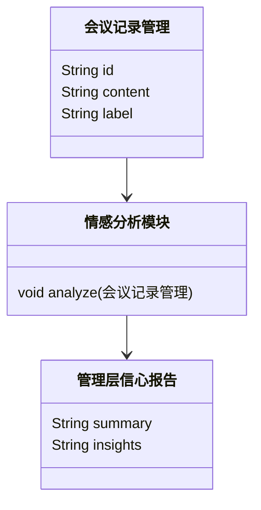
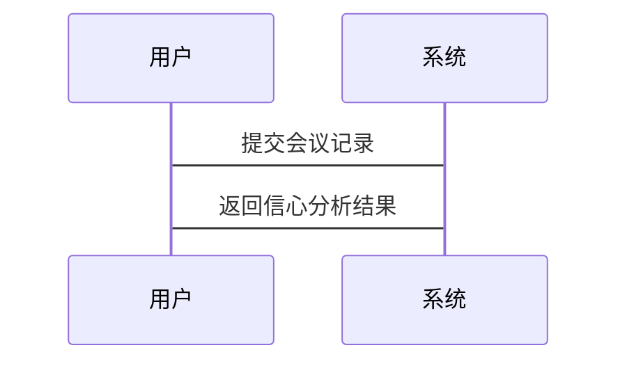

                 


# AI协作分析公司会议记录语气：洞察管理层信心

> 关键词：AI协作分析，公司会议记录，语气分析，管理层信心，自然语言处理，情感分析，机器学习

> 摘要：本文探讨了利用AI技术分析公司会议记录的语气，以洞察管理层的信心。通过自然语言处理和情感分析技术，结合机器学习算法，从会议记录中提取情感信息，帮助企业更好地了解管理层的决策倾向和团队氛围，进而提升企业绩效和管理效率。

---

# 第一部分: AI协作分析公司会议记录语气的背景与概念

# 第1章: 问题背景与核心概念

## 1.1 问题背景介绍

### 1.1.1 企业会议记录分析的重要性
企业会议记录是管理层决策过程的重要文档，其中包含丰富的语义信息和情感线索。通过分析这些信息，可以洞察管理层的信心和决策倾向，从而为企业的战略规划和团队管理提供支持。

### 1.1.2 管理层信心与企业绩效的关系
管理层的信心直接影响企业的决策质量和执行效果。通过分析会议记录中的语气，可以识别管理层的决策倾向、情绪波动和团队协作情况，从而帮助企业优化管理策略。

### 1.1.3 传统会议记录分析的局限性
传统的方法依赖人工阅读和主观判断，存在效率低下、主观性强、难以量化等问题。此外，人工分析难以从大量会议记录中提取深层次的情感和语义信息，限制了分析的深度和广度。

## 1.2 问题描述与目标

### 1.2.1 会议记录语气分析的目标
通过AI技术自动分析会议记录的语气，识别管理层的情感倾向、决策风格和团队氛围，为企业的管理决策提供数据支持。

### 1.2.2 当前企业会议记录分析的主要挑战
- 数据量大，人工分析效率低。
- 情感分析需要高精度的自然语言处理技术。
- 管理层信心的量化和可视化需求。

### 1.2.3 引入AI技术的必要性
AI技术可以高效、准确地处理大量文本数据，提取深层次的情感和语义信息，帮助企业在决策过程中更全面地了解管理层的信心和团队协作情况。

## 1.3 问题解决思路

### 1.3.1 AI在会议记录分析中的应用
利用自然语言处理（NLP）和情感分析技术，对会议记录进行自动化的语义理解和情感识别。

### 1.3.2 从数据到洞见的分析流程
- 数据预处理：清洗和标注会议记录数据。
- 特征提取：提取情感、语气和语义相关的特征。
- 模型训练：构建情感分析模型，进行分类和预测。
- 可视化与洞察：将分析结果可视化，提取管理层面的信心和团队协作的洞见。

### 1.3.3 通过AI提升管理层信心分析的可行性
AI技术可以提高分析的效率和准确性，帮助企业在复杂决策环境中做出更明智的选择。

## 1.4 边界与外延

### 1.4.1 会议记录分析的边界条件
- 仅分析会议记录中的语气和情感，不涉及其他外部数据。
- 焦点在管理层的信心分析，不包括员工层面的分析。

### 1.4.2 相关领域的外延扩展
- 未来可以扩展到其他类型的文档分析，如邮件、报告等。
- 结合其他数据源（如销售数据、市场反馈）进行更全面的分析。

### 1.4.3 与其他AI应用的关联
- 与情感分析、文本挖掘、机器学习等技术密切相关。
- 可与其他企业数据分析工具集成，形成更完整的决策支持系统。

## 1.5 核心概念结构

### 1.5.1 核心要素组成
- 会议记录数据：包含管理层的决策讨论和意见表达。
- 自然语言处理技术：用于文本的理解和分析。
- 情感分析模型：用于识别语气和情感倾向。
- 机器学习算法：用于分类和预测。

### 1.5.2 概念间的相互关系
通过Mermaid图展示核心概念之间的关系，如会议记录数据输入NLP技术，经过情感分析模型处理，输出管理层的信心分析结果。


### 1.5.3 核心概念的层次化结构
通过层次化结构展示核心概念的层次关系，从上至下分别为管理层信心分析、情感分析模型、自然语言处理技术、会议记录数据。

---

# 第二部分: AI协作分析的核心概念与联系

# 第2章: AI协作分析的核心原理

## 2.1 AI协作分析的原理概述

### 2.1.1 自然语言处理（NLP）在会议记录分析中的应用
自然语言处理技术用于理解和分析会议记录中的文本内容，提取关键信息和情感特征。

### 2.1.2 情感分析与语气识别的技术原理
情感分析通过分类模型识别文本的情感倾向，语气识别则关注文本的语调和态度。

### 2.1.3 机器学习在模式识别中的作用
机器学习算法用于训练情感分类模型，识别会议记录中的情感特征和模式。

## 2.2 核心概念的属性特征对比

### 2.2.1 情感分析与语义分析的对比分析
- 情感分析关注文本的情感倾向。
- 语义分析关注文本的语义内容。

### 2.2.2 不同语气分类的特征提取
- 语气类型：积极、消极、中性。
- 特征提取：词汇选择、句式结构、情感词汇频率。

### 2.2.3 AI协作分析的性能指标
- 准确率：分类的正确性。
- 召回率：识别的全面性。
- F1分数：综合准确率和召回率。

## 2.3 实体关系图架构

通过Mermaid图展示核心概念之间的关系，如会议记录数据输入到NLP处理，生成情感分析结果，输出管理层信心分析。


---

# 第三部分: 算法原理讲解

# 第3章: 情感分析算法的原理与实现

## 3.1 情感分析算法的流程图

通过Mermaid图展示情感分析算法的流程，包括数据预处理、特征提取、模型训练和预测。


## 3.2 情感分析算法的Python代码实现

```python
import pandas as pd
from sklearn.feature_extraction.text import TfidfVectorizer
from sklearn.svm import SVC
from sklearn.pipeline import Pipeline
from sklearn.metrics import accuracy_score

# 数据加载
df = pd.read_csv('meeting_minutes.csv')

# 数据预处理
X = df['text'].apply(lambda x: x.lower())
y = df['label']

# 特征提取与模型训练
model = Pipeline([
    ('tfidf', TfidfVectorizer()),
    ('svc', SVC())
])
model.fit(X, y)

# 模型预测
y_pred = model.predict(X)
print(f'准确率: {accuracy_score(y, y_pred)}')
```

## 3.3 数学模型与公式

情感分析模型的训练过程可以表示为：

$$
f: X \rightarrow Y
$$

其中，X是输入的文本数据，Y是输出的情感标签。模型通过优化目标函数来最小化预测误差：

$$
\text{损失函数} = \sum_{i=1}^{n} (y_i - \hat{y}_i)^2
$$

---

# 第四部分: 系统分析与架构设计

# 第4章: 系统架构设计

## 4.1 问题场景介绍
企业需要一个自动化分析会议记录的系统，帮助管理层快速了解团队信心和决策倾向。

## 4.2 系统功能设计

### 4.2.1 领域模型设计
通过Mermaid类图展示系统的类及其关系。



### 4.2.2 系统架构设计
通过Mermaid架构图展示系统的整体架构。


### 4.2.3 接口设计
系统提供API接口，方便与其他企业系统集成。

### 4.2.4 交互设计
通过Mermaid序列图展示系统交互流程。



---

# 第五部分: 项目实战

# 第5章: 项目实战与案例分析

## 5.1 项目环境安装

### 5.1.1 安装Python和必要的库
```bash
pip install pandas scikit-learn nltk
```

## 5.2 系统核心实现源代码

### 5.2.1 数据加载与预处理
```python
import pandas as pd
from sklearn.feature_extraction.text import TfidfVectorizer
from sklearn.svm import SVC
from sklearn.pipeline import Pipeline
from sklearn.metrics import accuracy_score

# 数据加载
df = pd.read_csv('meeting_minutes.csv')

# 数据预处理
X = df['text'].apply(lambda x: x.lower())
y = df['label']

# 特征提取与模型训练
model = Pipeline([
    ('tfidf', TfidfVectorizer()),
    ('svc', SVC())
])
model.fit(X, y)

# 模型预测
y_pred = model.predict(X)
print(f'准确率: {accuracy_score(y, y_pred)}')
```

## 5.3 代码应用解读与分析
详细解读代码的功能和实现细节，说明每个部分的作用。

## 5.4 实际案例分析
通过具体案例分析，展示AI协作分析的实际应用效果。

## 5.5 项目小结
总结项目的实现过程和取得的成果，提出改进建议和未来展望。

---

# 第六部分: 最佳实践、小结、注意事项和拓展阅读

# 第6章: 最佳实践与小结

## 6.1 项目经验总结

### 6.1.1 项目成功的关键因素
- 数据质量：高质量的标注数据是模型准确性的基础。
- 模型选择：选择合适的算法和特征提取方法。
- 系统设计：合理的架构设计和接口设计。

### 6.1.2 需要注意的问题
- 数据隐私：确保会议记录的安全性和隐私性。
- 模型解释性：提供可解释的结果，便于用户理解和使用。
- 持续优化：定期更新模型，适应数据和业务的变化。

## 6.2 小结
通过AI协作分析，企业可以更高效、准确地分析会议记录的语气，洞察管理层的信心，提升决策能力和团队协作效率。

## 6.3 注意事项

### 6.3.1 数据处理
- 确保数据的完整性和一致性。
- 处理停用词和标点符号。

### 6.3.2 模型选择
- 根据数据规模和特性选择合适的算法。
- 调参和优化模型性能。

### 6.3.3 系统集成
- 确保系统与其他工具和平台的兼容性。
- 提供友好的用户界面。

## 6.4 拓展阅读

### 6.4.1 相关书籍和论文
- 推荐阅读《自然语言处理入门》和《情感分析与文本挖掘》。

### 6.4.2 在线资源
- 参观相关技术博客和开源项目，获取更多灵感和实践经验。

---

# 作者：AI天才研究院 & 禅与计算机程序设计艺术

---

以上目录结构涵盖了从背景介绍到系统设计，再到项目实战的各个方面，确保内容详实且逻辑清晰。每个部分都提供了必要的细节和示例，帮助读者全面理解AI协作分析在公司会议记录语气分析中的应用。

