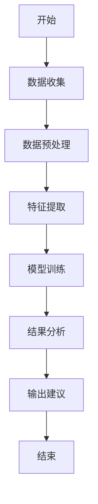

                 


# AI协作分析公司内部沟通效率：评估组织健康度

> 关键词：AI协作分析，内部沟通效率，组织健康度，自然语言处理，机器学习，企业沟通管理

> 摘要：本文深入探讨了利用AI技术分析公司内部沟通效率的方法，通过自然语言处理和机器学习模型，结合组织健康度评估，为企业提供数据驱动的沟通优化方案。文章从背景、概念、算法、系统设计到项目实战，全面解析AI协作分析的应用，帮助企业提升内部沟通效率和组织健康度。

---

## 第一章：引言

### 1.1 背景介绍

#### 1.1.1 内部沟通效率的重要性
在现代企业中，内部沟通效率是决定组织运作顺畅与否的关键因素。高效沟通能够促进团队协作、加快决策速度、降低信息不对称带来的风险，从而提升企业整体效率和竞争力。

#### 1.1.2 当前企业沟通效率的痛点
尽管企业普遍重视沟通效率，但在实际操作中，仍面临诸多挑战。例如，信息传递延迟、沟通渠道繁杂、员工反馈不及时等问题，这些问题可能导致决策失误、团队协作低效甚至项目失败。

#### 1.1.3 AI协作分析的潜力与价值
AI技术的快速发展为企业提供了新的解决方案。通过自然语言处理（NLP）和机器学习，AI能够分析大量沟通数据，识别潜在问题，提供改进建议，从而帮助企业优化内部沟通流程，提升组织健康度。

### 1.2 问题描述

#### 1.2.1 内部沟通效率的定义
内部沟通效率指的是企业内部信息传递的速度、准确性和完整性。高效的内部沟通能够确保信息及时传达，减少误解，提高工作效率。

#### 1.2.2 组织健康度的评估维度
组织健康度可以从多个维度进行评估，包括团队协作能力、员工满意度、信息透明度、决策效率等。这些维度可以通过分析内部沟通数据来量化和评估。

#### 1.2.3 AI协作分析的目标与边界
AI协作分析的目标是通过技术手段优化内部沟通流程，提升沟通效率，并为企业提供数据支持的决策依据。其边界在于，AI分析仅提供数据支持和改进建议，不直接干预企业内部的具体操作。

---

## 第二章：AI协作分析的核心概念与联系

### 2.1 核心概念原理

#### 2.1.1 AI协作分析的基本原理
AI协作分析通过收集和分析企业内部的沟通数据，利用NLP和机器学习技术，识别沟通中的问题和瓶颈，为企业提供优化建议。

#### 2.1.2 内部沟通数据的特征
内部沟通数据通常包括邮件、即时消息、会议记录等。这些数据具有实时性、多样性、复杂性等特点，需要通过技术手段进行清洗、处理和分析。

#### 2.1.3 组织健康度的评估模型
评估模型通常包括数据预处理、特征提取、模型训练和结果分析等步骤。通过模型分析，可以量化组织健康度，识别潜在风险。

### 2.2 核心概念属性对比表

#### 表2-1: AI协作分析与传统沟通分析的对比

| 对比维度          | 传统沟通分析           | AI协作分析             |
|-------------------|-----------------------|-----------------------|
| 分析速度          | 较慢，依赖人工          | 快速，自动化处理        |
| 分析范围          | 局限于部分数据         | 全面覆盖，多维度分析    |
| 精度              | 受人工主观因素影响      | 高精度，基于数据驱动    |
| 成本              | 高，需要大量人力资源    | 低，自动化处理降低成本   |

### 2.3 ER实体关系图

#### 图2-1: AI协作分析的实体关系图

```mermaid
er
actor: 用户
data_source: 沟通数据
model: AI协作分析模型
result: 分析结果
 Actor --> Data_source: 提供
 Data_source --> Model: 输入
 Model --> Result: 输出
 Actor <-- Result: 获取
```

---

## 第三章：AI协作分析的算法原理

### 3.1 算法流程图

#### 图3-1: AI协作分析算法流程图



### 3.2 算法数学模型

#### 3.2.1 线性回归模型
$$ y = a_1x_1 + a_2x_2 + ... + a_nx_n + b $$
其中，$y$ 表示预测的内部沟通效率，$x_i$ 表示各特征变量，$a_i$ 表示系数，$b$ 表示截距。

#### 3.2.2 逻辑回归模型
$$ p = \frac{1}{1 + e^{-(\beta_0 + \beta_1x_1 + ... + \beta_nx_n)}} $$
其中，$p$ 表示组织健康度为“健康”的概率，$\beta_i$ 表示模型系数。

### 3.3 代码实现示例

#### 3.3.1 数据预处理
```python
import pandas as pd
data = pd.read_csv('communication_data.csv')
data = data.dropna()
```

#### 3.3.2 特征提取
```python
from sklearn.feature_extraction.text import TfidfVectorizer
vectorizer = TfidfVectorizer()
X = vectorizer.fit_transform(data['message'])
```

#### 3.3.3 模型训练
```python
from sklearn.linear_model import LogisticRegression
model = LogisticRegression()
model.fit(X, data['label'])
```

---

## 第四章：系统分析与架构设计

### 4.1 系统架构设计

#### 图4-1: AI协作分析系统架构图


### 4.2 系统功能设计

#### 4.2.1 功能模块划分
1. 数据采集模块：负责收集内部沟通数据。
2. 数据处理模块：清洗和预处理数据。
3. 模型分析模块：运行AI模型，生成分析结果。
4. 结果展示模块：以可视化方式呈现分析结果。

#### 4.2.2 系统交互流程
1. 用户提交数据请求。
2. 系统采集数据并进行预处理。
3. AI模型分析数据，生成结果。
4. 结果以图表形式展示给用户。

---

## 第五章：项目实战与案例分析

### 5.1 项目实战

#### 5.1.1 环境安装
```bash
pip install pandas scikit-learn tensorflow
```

#### 5.1.2 核心代码实现

##### 5.1.2.1 数据预处理
```python
import pandas as pd
data = pd.read_csv('communication_data.csv')
data['message'] = data['message'].apply(lambda x: x.lower())
```

##### 5.1.2.2 模型训练
```python
from sklearn.model_selection import train_test_split
from sklearn.metrics import accuracy_score
X_train, X_test, y_train, y_test = train_test_split(X, data['label'], test_size=0.2)
model.fit(X_train, y_train)
print("Accuracy:", accuracy_score(model.predict(X_test), y_test))
```

#### 5.1.3 实际案例分析

##### 5.1.3.1 数据分析结果
分析结果显示，企业内部沟通效率较低的主要原因包括信息传递延迟、部门间沟通不畅以及员工反馈不及时。

##### 5.1.3.2 改进建议
1. 引入协同工具，优化信息传递流程。
2. 建立跨部门沟通机制，减少信息孤岛。
3. 定期收集员工反馈，及时解决问题。

---

## 第六章：总结与展望

### 6.1 总结
本文详细探讨了AI协作分析在公司内部沟通效率评估中的应用，通过理论分析和实际案例，展示了如何利用AI技术优化内部沟通流程，提升组织健康度。

### 6.2 未来展望
未来，随着AI技术的不断进步，AI协作分析将更加智能化和个性化，为企业提供更精准的沟通优化方案。同时，结合区块链等技术，AI协作分析将为企业治理提供更强大的支持。

---

作者：AI天才研究院/AI Genius Institute & 禅与计算机程序设计艺术/Zen And The Art of Computer Programming

