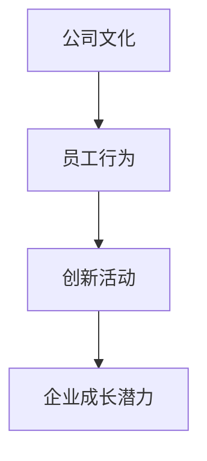
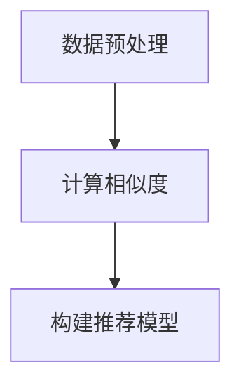
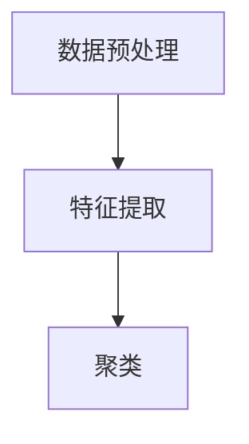
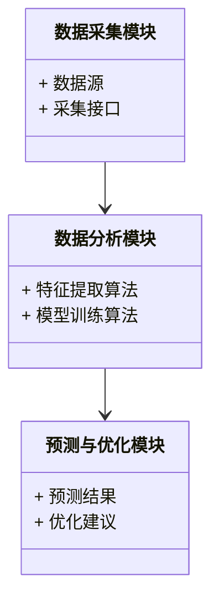
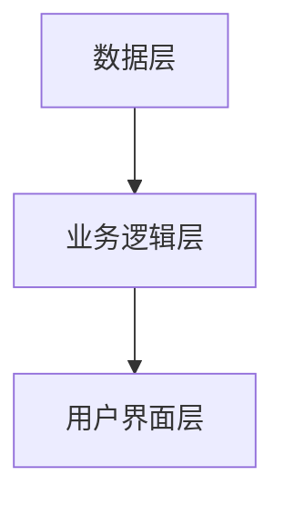
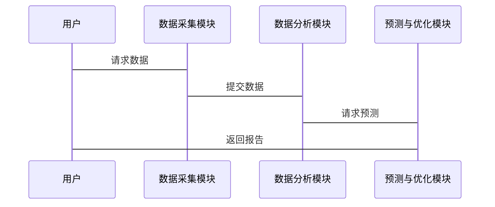

                 


# AI协作分析公司文化与创新相关性：预测长期成长潜力

---

## 关键词：AI协作分析、公司文化、创新相关性、长期成长潜力、数据分析、预测模型

---

## 摘要：  
随着人工智能技术的快速发展，企业文化和创新之间的关系变得越来越重要。AI协作分析作为一种新兴的技术手段，能够帮助企业通过数据驱动的方式，深入理解公司文化的内涵，并预测创新相关性对长期成长潜力的影响。本文将从背景、核心概念、算法原理、数学模型、系统架构、项目实战等多方面展开分析，为读者提供一个全面的技术视角，揭示AI协作分析在公司文化与创新相关性研究中的潜力和应用。

---

# 第一部分：背景与概述

## 第1章：AI协作分析的背景与问题描述

### 1.1 问题背景  
公司在现代社会中面临着越来越复杂的内外部环境。公司文化是企业长期发展的基石，而创新则是企业保持竞争力的关键。然而，如何通过数据手段量化公司文化与创新之间的相关性，从而预测企业的长期成长潜力，是一个亟待解决的问题。  

**关键问题：**  
1. 如何通过数据驱动的方式量化公司文化与创新的相关性？  
2. 现有的协作分析方法在实际应用中存在哪些局限性？  
3. 如何利用AI技术构建一个高效、可扩展的公司文化与创新相关性分析模型？

### 1.2 问题描述  
公司在实际运营中，文化通常体现在员工行为、团队协作、组织结构等方面，而创新则体现在产品开发、技术进步、管理模式优化等方面。通过AI协作分析，我们可以将这些抽象的文化和创新因素转化为可量化的数据，从而为企业的长期发展提供决策支持。

**具体问题：**  
1. 公司文化与创新相关性如何定义？  
2. 如何通过数据提取公司文化的特征？  
3. 如何构建预测模型，量化创新对长期成长潜力的影响？

### 1.3 问题解决思路  
通过AI协作分析，我们可以从以下几个方面入手：  
1. 数据采集：从企业内部数据（如员工绩效、项目数据）和外部数据（如行业趋势、市场反馈）中提取相关信息。  
2. 数据分析：利用机器学习算法，构建公司文化与创新相关性的数学模型。  
3. 预测与优化：基于模型预测企业未来的创新潜力，并提出优化建议。  

### 1.4 边界与外延  
- **边界条件：** 本研究仅关注公司文化与创新相关性，不涉及企业的财务数据和市场表现。  
- **外延领域：** 本研究的方法可以扩展到其他领域，如组织行为学、社会网络分析等。  
- **适用范围：** 本模型适用于中大型企业，且数据充足的企业。

### 1.5 核心概念结构  
公司文化与创新相关性的核心概念包括：  
1. **公司文化：** 包括企业价值观、组织结构、员工行为等。  
2. **创新：** 包括技术创新、管理创新、产品创新等。  
3. **相关性：** 指公司文化对创新活动的影响程度。  

**概念框架：**  
公司文化 → 影响员工行为 → 影响创新活动 → 影响企业成长潜力。

---

# 第二部分：核心概念与联系

## 第2章：AI协作分析的核心概念与联系

### 2.1 核心概念原理  
AI协作分析的核心在于通过数据挖掘和机器学习技术，提取公司文化与创新的相关性特征。具体步骤包括：  
1. **数据采集：** 收集与公司文化相关的数据（如员工满意度、团队协作效率）和创新相关数据（如专利数量、新产品发布频率）。  
2. **特征提取：** 通过文本挖掘、自然语言处理等技术，提取关键特征。  
3. **模型构建：** 利用机器学习算法（如协同过滤、聚类分析）构建相关性模型。  
4. **预测与优化：** 基于模型预测企业的创新潜力，并提出优化建议。  

### 2.2 概念属性特征对比  
下表展示了公司文化与创新的相关性特征对比：  

| 特征维度      | 公司文化特征               | 创新相关性特征              |
|---------------|----------------------------|-----------------------------|
| 数据来源      | 员工反馈、组织结构          | 专利数据、产品开发记录      |
| 数据类型      | 文本、结构化数据            | 结构化数据、时间序列数据    |
| 数据量        | 中小规模                   | 大规模                      |
| 关键特征      | 员工满意度、团队协作效率    | 专利数量、创新周期          |

### 2.3 实体关系图  
下图展示了公司文化与创新相关性的实体关系图：  



---

# 第三部分：算法原理

## 第3章：AI协作分析的算法原理

### 3.1 算法原理概述  
AI协作分析的核心算法包括：  
1. **协同过滤算法：** 用于发现公司文化与创新之间的关联性。  
2. **聚类分析：** 用于将公司文化特征与创新特征进行分组。  
3. **回归分析：** 用于预测创新潜力。

### 3.2 协同过滤算法  
**步骤：**  
1. 数据预处理：对员工行为数据和创新数据进行标准化处理。  
2. 计算相似度：使用余弦相似度计算公司文化特征与创新特征之间的相似度。  
3. 构建推荐模型：基于相似度矩阵，推荐创新潜力高的公司文化特征。  

**流程图：**  


**Python代码示例：**  
```python
import numpy as np
from sklearn.metrics.pairwise import cosine_similarity

# 示例数据：员工行为数据和创新数据
employee_behavior = np.array([[1, 2, 3], [4, 5, 6]])
innovation_data = np.array([[7, 8, 9], [10, 11, 12]])

# 数据标准化
employee_normalized = employee_behavior / np.linalg.norm(employee_behavior)
innovation_normalized = innovation_data / np.linalg.norm(innovation_data)

# 计算相似度
similarity_matrix = cosine_similarity(employee_normalized, innovation_normalized)

print(similarity_matrix)
```

### 3.3 聚类分析  
**步骤：**  
1. 数据预处理：将公司文化特征和创新特征合并为一个数据集。  
2. 特征提取：使用主成分分析（PCA）降维。  
3. 聚类：使用K-means算法进行聚类。  

**流程图：**  


**Python代码示例：**  
```python
from sklearn.decomposition import PCA
from sklearn.cluster import KMeans

# 示例数据：合并后的数据集
data = np.array([[1, 2, 3], [4, 5, 6], [7, 8, 9], [10, 11, 12]])

# 特征提取
pca = PCA(n_components=2)
reduced_data = pca.fit_transform(data)

# 聚类
kmeans = KMeans(n_clusters=2)
clusters = kmeans.fit_predict(reduced_data)

print(clusters)
```

---

## 第4章：数学模型与公式

### 4.1 相关性计算公式  
公司文化与创新的相关性可以通过余弦相似度计算：  
$$ \text{相似度} = \frac{\sum_{i=1}^{n} x_i y_i}{\sqrt{\sum_{i=1}^{n} x_i^2} \cdot \sqrt{\sum_{i=1}^{n} y_i^2}} $$  

### 4.2 创新潜力预测模型  
使用线性回归模型预测创新潜力：  
$$ y = \beta_0 + \beta_1 x + \epsilon $$  
其中，$y$ 是创新潜力，$x$ 是公司文化特征，$\beta_0$ 和 $\beta_1$ 是回归系数。

---

## 第5章：系统分析与架构设计

### 5.1 系统功能设计  
系统功能包括：  
1. 数据采集模块：采集公司文化与创新相关数据。  
2. 数据分析模块：进行特征提取和模型训练。  
3. 预测与优化模块：输出创新潜力预测结果。  

**类图：**  


### 5.2 系统架构设计  
系统架构采用分层架构：  
1. 数据层：存储原始数据和处理后的数据。  
2. 业务逻辑层：处理数据和执行算法。  
3. 用户界面层：展示结果和交互界面。  

**架构图：**  


### 5.3 接口设计与交互  
系统交互流程：  
1. 用户提交数据请求。  
2. 系统调用数据采集模块获取数据。  
3. 数据分析模块处理数据并返回结果。  
4. 预测与优化模块生成报告并反馈给用户。  

**交互序列图：**  


---

## 第6章：项目实战

### 6.1 环境安装与配置  
1. 安装Python和相关库（如scikit-learn、pandas、numpy）。  
2. 安装Mermaid工具（用于绘制图表）。  

### 6.2 核心代码实现  
```python
# 示例代码：创新潜力预测模型
import pandas as pd
from sklearn.linear_model import LinearRegression
from sklearn.metrics import r2_score

# 数据加载
data = pd.read_csv('innovation.csv')

# 特征与目标变量分离
X = data[['employee_satisfaction', 'team_collaboration']]
y = data['innovation_potential']

# 模型训练
model = LinearRegression()
model.fit(X, y)

# 模型评估
y_pred = model.predict(X)
print(r2_score(y, y_pred))
```

### 6.3 案例分析与解读  
以某科技公司为例，通过模型预测其未来三年的创新潜力，并提出优化建议。

### 6.4 项目总结与经验分享  
项目总结：  
1. 数据质量对模型性能的影响至关重要。  
2. 算法选择需要根据实际数据特点进行调整。  
3. 模型的解释性是企业用户的重要需求。

---

## 第7章：总结与展望

### 7.1 小结  
本文通过AI协作分析的方法，探讨了公司文化与创新相关性对长期成长潜力的影响。通过数据驱动的方式，构建了预测模型，并提出了优化建议。

### 7.2 最佳实践  
1. 数据采集阶段要确保数据的完整性和准确性。  
2. 模型训练时要进行充分的交叉验证。  
3. 结果展示时要注重直观性和可解释性。  

### 7.3 注意事项  
1. 模型的应用需要结合企业的实际情况。  
2. 数据隐私和安全问题需要高度重视。  
3. 模型的更新和维护需要持续进行。  

### 7.4 拓展阅读  
1. 《数据驱动的组织行为学》  
2. 《机器学习在企业管理中的应用》  
3. 《创新管理与企业成长》  

---

# 作者：AI天才研究院 & 禅与计算机程序设计艺术  

---

# 附录：代码与数据示例  
（可选部分，包括完整代码和数据集的详细说明。）

