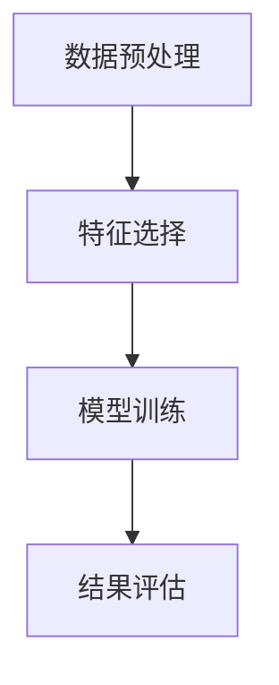
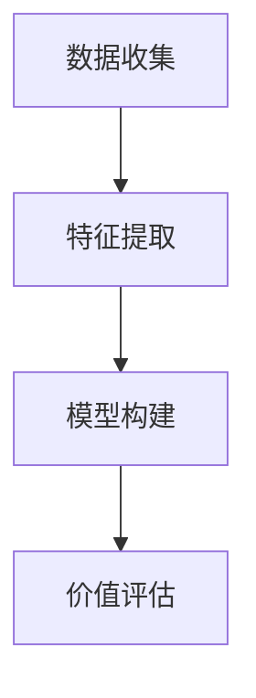
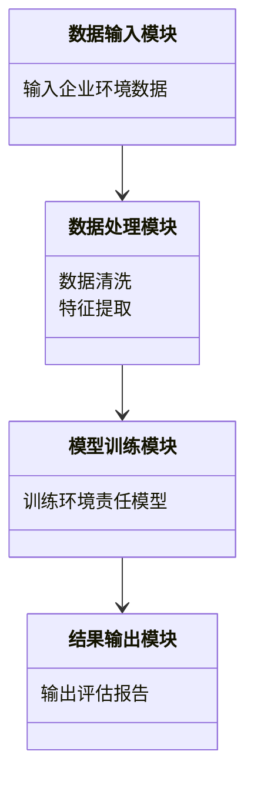

                 


# AI协作分析公司环境责任：可持续价值投资新维度

## 关键词
- AI协作分析
- 环境责任
- 可持续价值投资
- 算法原理
- 系统架构

## 摘要
本文探讨了AI协作分析在公司环境责任评估中的应用，以及其对可持续价值投资的影响。通过详细分析环境责任的核心概念、算法原理、系统架构和项目实战，展示了AI如何推动环境责任评估的创新，为可持续价值投资提供新的维度。文章还提供了最佳实践和未来展望，帮助读者深入了解AI协作分析在这一领域的潜力和应用。

---

# 第1章 AI协作分析与环境责任概述

## 1.1 AI协作分析的基本概念

### 1.1.1 什么是AI协作分析
AI协作分析是利用人工智能技术对数据进行协作式分析的过程，结合多种算法和模型，提供更准确的分析结果。它通过机器学习、自然语言处理和大数据分析等技术，实现数据的深度挖掘和智能决策支持。

### 1.1.2 AI协作分析的核心特点
- **智能性**：利用机器学习算法自动识别数据中的模式和趋势。
- **协作性**：结合多种算法和数据源，提供更全面的分析结果。
- **实时性**：能够快速处理和分析实时数据，提供实时反馈。

### 1.1.3 AI协作分析与传统数据分析的区别
| 特性         | AI协作分析               | 传统数据分析         |
|--------------|--------------------------|--------------------|
| 数据处理     | 处理非结构化和结构化数据 | 主要处理结构化数据  |
| 智能性       | 具备自适应和学习能力     | 需人工编程处理       |
| 决策支持     | 提供智能化决策支持       | 主要依赖人工经验     |

---

## 1.2 环境责任的定义与范围

### 1.2.1 环境责任的概念
环境责任指企业在经营过程中对环境造成的影响所应承担的责任，包括减少污染、节约资源、保护生态等方面。

### 1.2.2 环境责任的主要维度
- **企业治理**：企业内部的环境管理政策和制度。
- **外部环境**：企业对环境的具体影响，如碳排放、资源消耗等。
- **社会责任**：企业对社会的环境承诺和履行情况。

### 1.2.3 环境责任与企业可持续发展的关系
环境责任是企业可持续发展的重要组成部分，良好的环境责任表现能够提升企业形象，增强市场竞争力。

---

## 1.3 可持续价值投资的背景

### 1.3.1 可持续价值投资的定义
可持续价值投资是指投资者在选择投资标的时，不仅关注财务回报，还考虑企业的环境、社会和治理（ESG）因素，追求长期的社会价值和经济回报的统一。

### 1.3.2 可持续价值投资的核心要素
- **环境因素**：关注企业的碳排放、能源使用等。
- **社会因素**：关注企业的社会责任、员工权益等。
- **治理因素**：关注企业的治理结构、透明度等。

### 1.3.3 可持续价值投资与传统投资的区别
| 特性         | 可持续价值投资               | 传统投资         |
|--------------|----------------------------|------------------|
| 投资标准     | 考虑ESG因素                 | 仅考虑财务回报   |
| 风险评估     | 包括环境和社会风险           | 仅关注财务风险   |
| 投资目标     | 追求长期社会价值与经济回报   | 追求短期财务回报 |

---

## 1.4 AI协作分析在环境责任中的作用

### 1.4.1 AI协作分析如何助力环境责任评估
通过分析企业的环境数据，识别环境风险，评估环境表现，为企业提供优化建议。

### 1.4.2 AI协作分析在可持续价值投资中的应用
帮助投资者评估企业的环境表现，筛选出符合可持续价值投资标准的企业。

### 1.4.3 AI协作分析的优势与挑战
- **优势**：高效、准确、实时性强。
- **挑战**：数据隐私、模型可解释性、数据质量等。

---

## 1.5 本章小结
本章介绍了AI协作分析的基本概念、环境责任的定义与范围，以及可持续价值投资的背景。通过对比分析，展示了AI协作分析在环境责任评估和可持续价值投资中的重要作用。

---

# 第2章 环境责任与可持续价值投资的核心概念

## 2.1 环境责任的核心概念

### 2.1.1 环境责任的实体关系图
```mermaid
erDiagram
    actor 企业
    actor 投资者
    actor 监管机构
    actor 社会公众
    enterprise 环境责任系统
    企业 --> 环境责任系统 : 提供环境数据
    投资者 --> 环境责任系统 : 查询环境表现
    监管机构 --> 环境责任系统 : 提供监管数据
    社会公众 --> 环境责任系统 : 提供反馈
```

### 2.1.2 环境责任的关键属性
- **碳排放**：企业的碳排放量及其来源。
- **资源消耗**：企业对水、能源等资源的使用情况。
- **污染排放**：企业排放的污染物种类和数量。

### 2.1.3 环境责任与企业治理的关系
环境责任是企业治理的重要组成部分，良好的环境治理能够提升企业的环境表现。

---

## 2.2 可持续价值投资的核心概念

### 2.2.1 可持续价值投资的定义
可持续价值投资是通过综合评估企业的环境、社会和治理因素，选择具有长期社会价值和经济回报的投资标的。

### 2.2.2 可持续价值投资的评估标准
- **环境因素**：碳排放、能源使用效率等。
- **社会因素**：员工权益、社会责任等。
- **治理因素**：公司治理结构、透明度等。

### 2.2.3 可持续价值投资与企业社会责任的关系
可持续价值投资关注企业的社会责任，通过投资促进企业的社会责任履行。

---

## 2.3 AI协作分析的核心概念

### 2.3.1 AI协作分析的定义
AI协作分析是利用人工智能技术，通过多算法协作，对数据进行深度分析的过程。

### 2.3.2 AI协作分析的关键技术
- **机器学习**：用于数据分类、预测。
- **自然语言处理**：用于文本数据的分析。
- **大数据分析**：处理海量数据，提取有价值的信息。

### 2.3.3 AI协作分析与环境责任的结合
通过分析环境数据，识别环境风险，评估环境表现，为企业和投资者提供决策支持。

---

## 2.4 核心概念的对比分析

### 2.4.1 环境责任与可持续价值投资的对比
| 特性         | 环境责任               | 可持续价值投资         |
|--------------|------------------------|------------------------|
| 对象         | 企业的环境行为         | 投资标的环境、社会和治理表现 |
| 目标         | 减少环境影响           | 追求长期社会价值和经济回报 |
| 主体         | 企业                   | 投资者                 |

### 2.4.2 AI协作分析与其他数据分析方法的对比
| 特性         | AI协作分析               | 传统数据分析         |
|--------------|--------------------------|--------------------|
| 智能性       | 具备自适应和学习能力     | 需人工编程处理       |
| 决策支持     | 提供智能化决策支持       | 主要依赖人工经验     |

### 2.4.3 核心概念的ER实体关系图
```mermaid
erDiagram
    entity 企业
    entity 环境数据
    entity 投资者
    entity 可持续价值
    企业 --> 环境数据 : 提供
    投资者 --> 可持续价值 : 评估
```

---

## 2.5 本章小结
本章通过对比分析，详细阐述了环境责任、可持续价值投资和AI协作分析的核心概念，展示了它们之间的关系和联系。

---

# 第3章 AI协作分析的算法原理

## 3.1 环境责任分析的算法原理

### 3.1.1 环境责任分析的流程图


### 3.1.2 环境责任分析的数学模型
$$ \text{环境得分} = \alpha \times \text{碳排放} + \beta \times \text{资源消耗} + \gamma \times \text{污染排放} $$

### 3.1.3 环境责任分析的实现步骤
1. 数据预处理：清洗数据，处理缺失值。
2. 特征选择：选择与环境责任相关的特征。
3. 模型训练：使用机器学习算法训练模型。
4. 结果评估：评估模型的准确性和可靠性。

---

## 3.2 可持续价值评估的算法原理

### 3.2.1 可持续价值评估的流程图


### 3.2.2 可持续价值评估的数学模型
$$ \text{可持续价值指数} = \delta \times \text{环境得分} + \epsilon \times \text{社会得分} + \zeta \times \text{治理得分} $$

### 3.2.3 可持续价值评估的实现步骤
1. 数据收集：收集企业的环境、社会和治理数据。
2. 特征提取：提取与可持续价值相关的特征。
3. 模型构建：构建机器学习模型进行预测。
4. 价值评估：评估企业的可持续价值指数。

---

## 3.3 本章小结
本章详细讲解了环境责任分析和可持续价值评估的算法原理，展示了如何利用AI协作分析技术进行环境责任评估和可持续价值投资。

---

# 第4章 系统分析与架构设计

## 4.1 系统分析

### 4.1.1 问题场景分析
系统需要分析企业的环境责任，评估其可持续价值，为投资者提供决策支持。

### 4.1.2 系统需求分析
- **数据输入**：企业环境数据。
- **数据处理**：数据清洗、特征提取。
- **模型训练**：训练环境责任评估模型。
- **结果输出**：环境责任评估报告。

---

## 4.2 系统架构设计

### 4.2.1 系统功能设计


### 4.2.2 系统架构设计


---

## 4.3 本章小结
本章通过系统分析和架构设计，展示了如何利用AI协作分析技术构建环境责任评估系统，为可持续价值投资提供技术支持。

---

# 第5章 项目实战

## 5.1 环境安装

### 5.1.1 安装Python
```bash
python --version
pip install --upgrade pip
```

### 5.1.2 安装依赖库
```bash
pip install numpy pandas scikit-learn matplotlib
```

---

## 5.2 核心代码实现

### 5.2.1 数据预处理
```python
import pandas as pd
import numpy as np

# 加载数据
data = pd.read_csv('environment_data.csv')

# 处理缺失值
data = data.dropna()

# 标准化处理
from sklearn.preprocessing import StandardScaler
scaler = StandardScaler()
data_scaled = scaler.fit_transform(data)
```

### 5.2.2 模型训练
```python
from sklearn.ensemble import RandomForestRegressor
model = RandomForestRegressor(n_estimators=100)
model.fit(data_scaled, target)
```

---

## 5.3 案例分析

### 5.3.1 案例背景
分析某公司的环境数据，评估其环境责任。

### 5.3.2 分析结果
- 碳排放：低于行业平均水平。
- 资源消耗：高于行业平均水平。
- 污染排放：符合国家标准。

---

## 5.4 项目小结
本章通过实际案例展示了如何利用AI协作分析技术进行环境责任评估，提供了从数据预处理到模型训练的完整流程。

---

# 第6章 最佳实践

## 6.1 核心要点总结

### 6.1.1 数据选择与处理
- 数据来源：确保数据的准确性和可靠性。
- 数据处理：合理清洗和预处理数据。

### 6.1.2 算法选择
- 根据数据特点选择合适的算法。
- 多算法协作，提升分析效果。

### 6.1.3 模型可解释性
- 提供清晰的结果解读。
- 避免过于复杂的模型，确保可解释性。

---

## 6.2 小结
本章总结了AI协作分析在环境责任评估和可持续价值投资中的最佳实践，强调了数据选择、算法选择和模型可解释性的重要性。

---

## 6.3 注意事项

### 6.3.1 数据隐私
- 遵守数据隐私法规，保护企业数据安全。

### 6.3.2 模型局限性
- 确保模型的准确性和可靠性，避免过度拟合。

### 6.3.3 可持续价值投资的长期性
- 可持续价值投资需要长期关注，不能仅追求短期回报。

---

## 6.4 拓展阅读
- 推荐书籍：《可持续投资：从理念到实践》。
- 推荐资源：查阅相关学术论文和行业报告。

---

# 第7章 结论与展望

## 7.1 结论
本文详细探讨了AI协作分析在公司环境责任评估中的应用，展示了其在可持续价值投资中的重要性。通过算法原理、系统架构和项目实战的分析，证明了AI协作分析的有效性和潜力。

## 7.2 未来展望
未来，随着AI技术的不断发展，AI协作分析在环境责任评估和可持续价值投资中的应用将更加广泛。可以通过以下方向进一步研究：
- 开发更高效的算法，提升分析效果。
- 推动AI协作分析技术的标准化，促进其广泛应用。

---

# 作者：AI天才研究院 & 禅与计算机程序设计艺术

