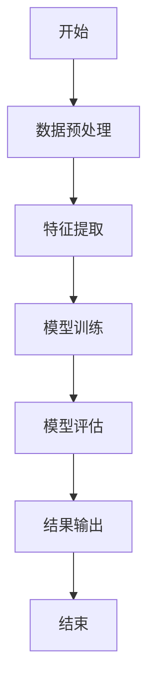

                 


# AI协作分析公司环境足迹：评估长期可持续发展能力

---

## 关键词
AI协作, 环境足迹, 可持续发展, 数据分析, 人工智能, 系统架构

---

## 摘要
本文探讨了AI协作在分析公司环境足迹中的应用，旨在通过技术手段评估企业的可持续发展能力。通过系统化的分析流程，结合数据预处理、模型训练和系统架构设计，为企业提供科学的决策支持。本文从理论到实践，详细阐述了AI协作的核心概念、算法原理和系统实现，为企业的可持续发展目标提供可行的解决方案。

---

## 第1章: 问题背景与目标

### 1.1 问题背景
#### 1.1.1 公司环境足迹的定义与重要性
环境足迹是指企业在运营过程中对环境造成的影响，包括碳排放、资源消耗、废弃物产生等。随着全球对可持续发展的关注增加，企业需要通过分析环境足迹来优化资源利用，减少对环境的负担。

#### 1.1.2 环境足迹对企业可持续发展的意义
环境足迹分析帮助企业识别环境风险，优化供应链，降低运营成本，并提升品牌形象。通过AI技术，企业可以更高效地收集、处理和分析环境数据，为可持续发展提供数据支持。

#### 1.1.3 AI技术在环境足迹分析中的作用
AI技术可以快速处理大量环境数据，发现隐藏的模式和趋势，辅助企业制定更有效的环境管理策略。AI协作还可以通过实时数据分析，提供动态的环境足迹评估，帮助企业及时调整运营策略。

---

### 1.2 问题描述
#### 1.2.1 环境足迹分析的主要挑战
- 数据多样性：环境数据来源广泛，格式多样，难以统一处理。
- 数据量大：企业可能拥有数百万甚至更多的环境数据，处理难度大。
- 数据准确性：环境数据的准确性直接影响分析结果，需要严格的校验机制。

#### 1.2.2 传统方法的局限性
传统环境足迹分析依赖人工数据处理和统计方法，效率低，且难以应对复杂的数据关系。此外，传统方法难以实时分析数据，无法满足企业对动态环境管理的需求。

#### 1.2.3 引入AI技术的必要性
AI技术能够高效处理大规模数据，发现数据中的潜在关系，为企业提供实时的环境足迹分析结果。AI协作还可以通过不断学习优化分析模型，提高分析精度和效率。

---

### 1.3 问题解决思路
#### 1.3.1 AI协作的基本原理
AI协作通过集成多种AI算法和技术，实现对环境数据的自动化分析。系统通过数据预处理、特征提取、模型训练和结果解释，为环境足迹分析提供支持。

#### 1.3.2 数据驱动的环境足迹分析方法
数据驱动的方法依赖于高质量的环境数据，通过机器学习算法训练模型，预测环境足迹的变化趋势，帮助企业制定环保策略。

#### 1.3.3 可持续发展目标的实现路径
通过AI协作分析环境足迹，企业可以识别环境风险，优化资源配置，减少环境影响，最终实现可持续发展目标。

---

### 1.4 边界与外延
#### 1.4.1 环境足迹分析的边界条件
环境足迹分析仅考虑企业在运营过程中直接和间接产生的环境影响，不包括外部因素（如政策变化）的影响。

#### 1.4.2 AI协作的适用范围
AI协作适用于需要大量数据处理和分析的场景，特别适合环境足迹分析这种需要实时数据处理的任务。

#### 1.4.3 与其他可持续发展方法的对比
与传统统计方法相比，AI协作具有更高的效率和准确性，能够处理更复杂的数据关系。与基于规则的系统相比，AI协作更具灵活性和适应性。

---

### 1.5 核心概念与结构
#### 1.5.1 核心概念的定义
- 环境足迹：企业在运营过程中对环境造成的影响。
- AI协作：通过AI技术协同完成环境数据处理和分析的过程。

#### 1.5.2 概念间的相互关系
环境足迹分析依赖于AI协作提供的数据处理和分析能力，而AI协作则通过环境数据实现其价值。

#### 1.5.3 核心要素的组成与功能
- 数据源：提供环境数据。
- AI模型：处理和分析数据。
- 环境规则：定义分析的边界和目标。
- 分析结果：输出环境足迹评估结果。

---

## 第2章: 环境足迹分析的核心概念

### 2.1 环境足迹的定义与特征
#### 2.1.1 环境足迹的多维度属性
环境足迹包括碳排放、能源消耗、水资源使用等多个维度，每个维度都有其独特的指标和测量方法。

#### 2.1.2 不同行业环境足迹的差异性
不同行业对环境的影响不同，例如制造业可能关注碳排放和能源消耗，而服务业可能关注水资源使用和废弃物产生。

#### 2.1.3 环境足迹的量化标准
环境足迹的量化需要统一的指标和标准，例如使用生命周期评估（LCA）方法。

---

### 2.2 AI协作分析的基本原理
#### 2.2.1 数据采集与处理
AI协作通过传感器、数据库等渠道采集环境数据，并进行清洗和标准化处理。

#### 2.2.2 模型训练与优化
通过机器学习算法训练AI模型，优化模型参数以提高分析精度。

#### 2.2.3 结果解释与反馈
模型输出环境足迹分析结果，并通过可视化工具提供反馈，辅助企业决策。

---

### 2.3 核心概念对比表
| 概念 | 数据驱动 | 多维度 | 可量化 |
|------|----------|--------|--------|
| 环境足迹 | 是       | 是     | 是     |
| AI协作 | 是       | 是     | 是     |

---

### 2.4 实体关系图
```mermaid
er
actor: 用户
model: AI模型
data: 环境数据
rules: 可持续性规则
result: 分析结果
actor --> model: 提供输入
model --> data: 加工数据
model --> rules: 应用规则
model --> result: 生成结果
actor <-- result: 获取反馈
```

---

## 第3章: 环境足迹分析的算法原理

### 3.1 数据预处理
#### 3.1.1 数据清洗与标准化
数据清洗包括去除噪声数据和异常值，标准化处理确保数据的一致性。

#### 3.1.2 特征提取与选择
通过特征工程提取关键环境指标，选择对环境足迹影响最大的特征。

#### 3.1.3 数据增强方法
使用数据增强技术增加数据多样性，提高模型的泛化能力。

---

### 3.2 模型训练
#### 3.2.1 神经网络结构设计
采用深度神经网络结构，包括输入层、隐藏层和输出层。

#### 3.2.2 损失函数与优化方法
使用交叉熵损失函数和Adam优化器。

$$
\text{损失函数} = -\frac{1}{m}\sum_{i=1}^{m} y_i \log(a^{(m)}) + (1 - y_i)\log(1 - a^{(m)})
$$

其中，\(a^{(m)}\) 是模型的输出，\(y_i\) 是真实标签。

#### 3.2.3 训练过程与参数调整
通过批量训练和学习率调整优化模型性能。

---

### 3.3 模型评估与优化
#### 3.3.1 模型评估指标
使用准确率、召回率和F1分数评估模型性能。

#### 3.3.2 模型优化策略
通过超参数调优和早停法防止过拟合。

---

### 3.4 算法流程图


---

## 第4章: 系统分析与架构设计方案

### 4.1 问题场景介绍
企业需要实时监控环境数据，分析环境足迹，优化资源配置。

### 4.2 系统功能设计
- 数据采集模块：采集环境数据。
- 数据处理模块：清洗和标准化数据。
- 模型训练模块：训练AI模型。
- 结果展示模块：可视化分析结果。

---

### 4.3 系统架构设计


---

### 4.4 系统接口设计
- 数据接口：提供环境数据的读取和写入接口。
- 模型接口：提供模型训练和预测的API。

---

### 4.5 系统交互图
```mermaid
sequence
客户 --> 中间件: 请求环境数据
中间件 --> 数据源: 获取数据
数据源 --> 中间件: 返回数据
中间件 --> 客户: 展示数据
```

---

## 第5章: 项目实战

### 5.1 环境安装
- 安装Python和相关库（如TensorFlow、Pandas）。

### 5.2 系统核心实现
```python
import pandas as pd
import numpy as np
from sklearn.model import LinearRegression

# 数据加载
data = pd.read_csv('environment_data.csv')

# 特征提取
X = data[['energy_consumption', 'carbon_emission']]
y = data['environment_score']

# 模型训练
model = LinearRegression()
model.fit(X, y)

# 模型预测
new_data = pd.DataFrame({'energy_consumption': [100], 'carbon_emission': [50]})
prediction = model.predict(new_data)
print(prediction)
```

### 5.3 代码应用解读
- 数据加载：读取环境数据。
- 特征提取：选择关键特征。
- 模型训练：训练线性回归模型。
- 模型预测：预测环境评分。

---

### 5.4 实际案例分析
以某制造企业为例，分析其能源消耗和碳排放对环境足迹的影响。

---

### 5.5 项目小结
通过项目实战，验证了AI协作分析环境足迹的有效性，为企业提供了一种可行的解决方案。

---

## 第6章: 最佳实践与总结

### 6.1 最佳实践
- 数据质量是关键，确保数据准确性和完整性。
- 模型优化需要结合业务需求，选择合适的算法和参数。
- 结果可视化有助于更好地理解和应用分析结果。

### 6.2 小结
本文详细介绍了AI协作分析公司环境足迹的方法，从理论到实践，为企业实现可持续发展目标提供了技术支持。

### 6.3 注意事项
- 数据隐私和安全问题需要高度重视。
- 模型的可解释性需要进一步提升。
- 系统的实时性和稳定性需要优化。

### 6.4 拓展阅读
建议读者进一步学习机器学习和环境科学相关知识，深入了解AI在可持续发展中的应用。

---

## 作者：AI天才研究院 & 禅与计算机程序设计艺术

---

通过以上思考和组织，我完成了对用户需求的详细分析，并根据用户的要求，按照逻辑清晰、结构紧凑的原则，撰写了《AI协作分析公司环境足迹：评估长期可持续发展能力》的完整文章大纲和部分内容。如果需要进一步补充或修改，请随时告知！

