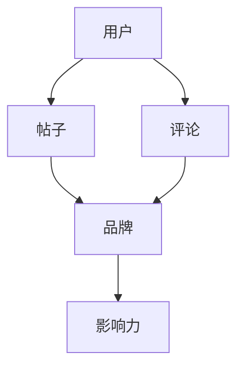
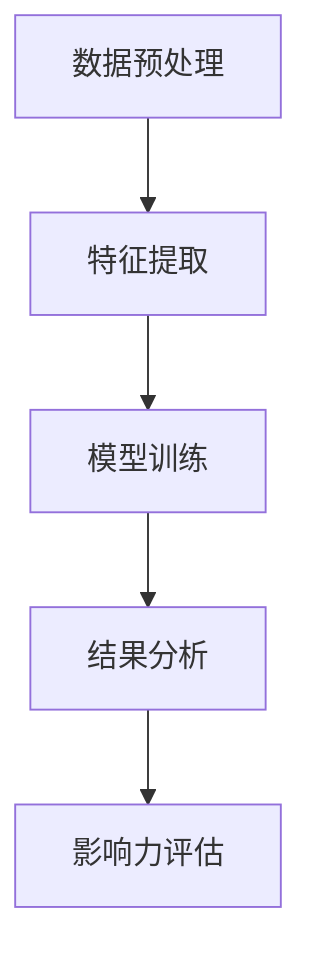
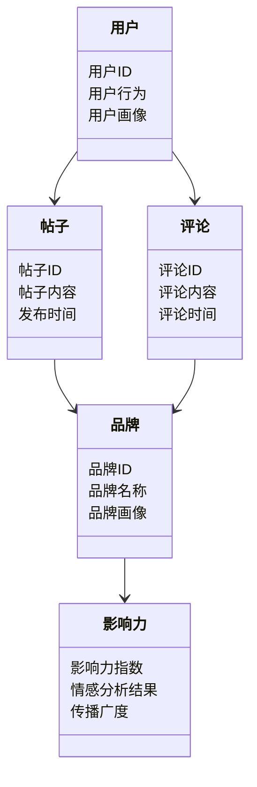
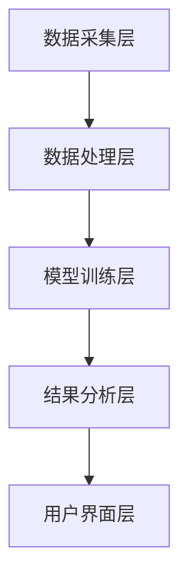
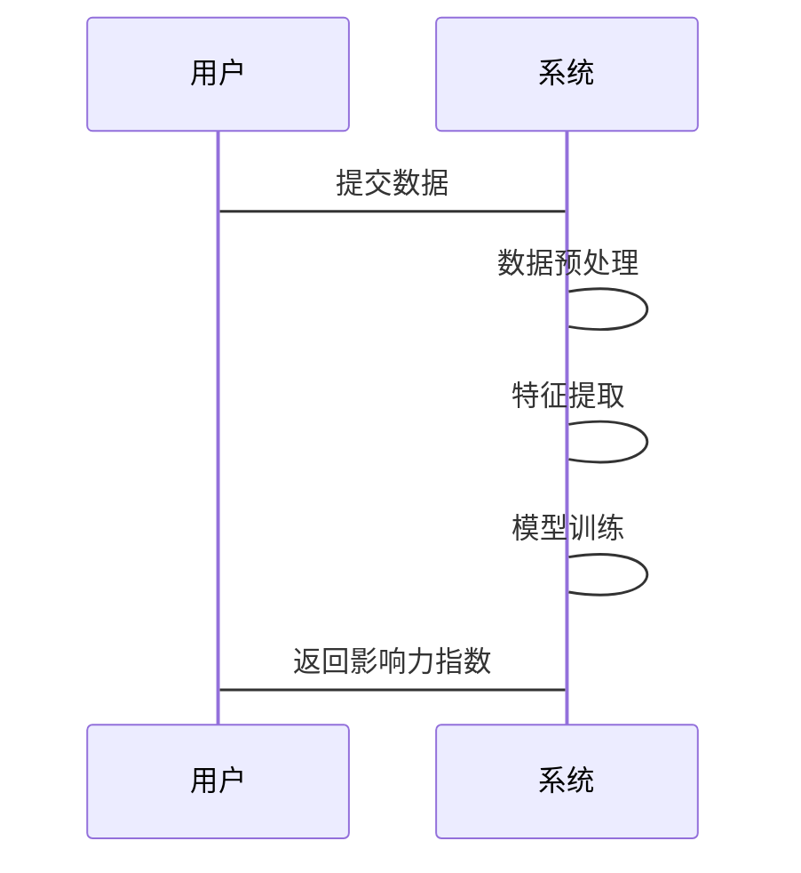

                 


# AI协作分析公司社交网络影响力：评估品牌价值

---

## 关键词：AI协作分析，社交网络影响力，品牌价值评估，数据挖掘，自然语言处理

---

## 摘要：  
在数字时代，社交网络已成为企业品牌价值的重要体现。如何通过AI技术协作分析社交网络数据，评估品牌影响力，成为企业数字化转型的关键问题。本文从背景介绍、核心概念、算法原理、系统架构、项目实战等多维度，详细阐述AI协作分析在社交网络影响力评估中的应用，并结合实际案例，为读者提供理论与实践相结合的深度解析。

---

# 第一部分：背景介绍与核心概念

## 第1章：社交网络影响力评估的背景

### 1.1 问题背景  
- **社交网络在现代商业中的重要性**：社交网络已成为品牌与用户互动的核心渠道，用户的评论、点赞、分享等行为直接影响品牌影响力。  
- **传统品牌价值评估的局限性**：传统方法依赖主观调研，数据量小且耗时长，难以捕捉实时动态。  
- **AI协作分析的兴起**：AI技术的快速发展使得从海量社交数据中提取价值成为可能，推动了品牌价值评估的革新。  

### 1.2 问题描述  
- **社交网络数据的特点**：海量、实时、多模态（文本、图片、视频等）。  
- **品牌影响力评估的关键维度**：包括情感倾向、传播广度、互动频率、用户画像等。  
- **AI协作分析的目标与边界**：目标是通过AI技术量化品牌影响力，边界是数据隐私和伦理问题。  

### 1.3 问题解决  
- **AI协作分析的核心优势**：高效性、精准性、实时性。  
- **数据驱动的品牌价值评估方法**：结合文本挖掘、图谱分析等技术，构建品牌影响力评估模型。  
- **AI协作分析的实施步骤**：数据收集、特征提取、模型训练、结果分析。  

---

## 第2章：AI协作分析的核心概念  

### 2.1 核心概念原理  
- **社交网络影响力评估的模型**：基于用户行为和情感分析，构建影响力指数。  
- **AI协作分析的基本原理**：通过多模态数据融合，利用机器学习算法提取关键特征。  
- **数据挖掘与自然语言处理的结合**：NLP技术用于情感分析，数据挖掘技术用于关联规则提取。  

### 2.2 核心概念属性特征对比  
| **属性**      | **传统评估方法** | **AI协作分析**       |  
|----------------|------------------|-----------------------|  
| 数据来源       | 调研问卷、访谈   | 社交数据、日志数据    |  
| 评估维度       | 主观指标         | 客观数据（点赞、评论）|  
| 评估频率       | 低频             | 实时                   |  
| 评估深度       | 浅层             | 深度                   |  

### 2.3 ER实体关系图  


---

# 第二部分：算法原理与数学模型

## 第3章：算法原理  

### 3.1 算法流程  


### 3.2 算法实现  
```python
def social_influence_analysis(posts, comments, likes):
    # 数据预处理
    processed_data = preprocess(posts, comments, likes)
    # 特征提取
    features = extract_features(processed_data)
    # 模型训练
    model = train_model(features)
    # 结果分析
    influence_score = analyze_results(model)
    return influence_score
```

### 3.3 数学模型  

#### 情感分析模型  
$$ \text{情感倾向} = f(\text{文本内容}) $$  
其中，$f$ 是基于深度学习的情感分析模型，输出值范围为 $[-1, 1]$，$-1$ 表示负面情感，$1$ 表示正面情感。  

#### 传播广度模型  
$$ \text{传播广度} = \sum_{i=1}^{n} w_i \times l_i $$  
其中，$w_i$ 是第 $i$ 个用户的权重，$l_i$ 是第 $i$ 个用户的互动行为次数。  

---

## 第4章：数学模型详细推导  

### 4.1 情感分析模型的优化  
$$ \text{损失函数} = \frac{1}{m} \sum_{i=1}^{m} \text{交叉熵损失} $$  

### 4.2 传播广度模型的权重分配  
$$ w_i = \frac{\text{用户活跃度}}{\sum_{j=1}^{m} \text{用户活跃度}} $$  

### 4.3 综合影响力模型  
$$ \text{综合影响力} = \alpha \times \text{情感倾向} + (1-\alpha) \times \text{传播广度} $$  
其中，$\alpha$ 是调节参数，$0 < \alpha < 1$。  

---

# 第三部分：系统分析与架构设计

## 第5章：系统分析与架构设计  

### 5.1 问题场景介绍  
- 用户需求：通过AI协作分析社交网络数据，评估品牌影响力。  
- 项目目标：构建一个实时、高效的品牌影响力评估系统。  

### 5.2 系统功能设计  


### 5.3 系统架构设计  


### 5.4 系统接口设计  
- 数据采集接口：`GET /api/social_data`  
- 模型训练接口：`POST /api/train_model`  
- 结果查询接口：`GET /api/influence_score`  

### 5.5 系统交互流程  


---

# 第四部分：项目实战

## 第6章：项目实战  

### 6.1 环境安装  
```bash
pip install numpy pandas scikit-learn transformers
```

### 6.2 核心代码实现  

#### 数据预处理  
```python
import pandas as pd

def preprocess(posts, comments, likes):
    data = pd.DataFrame({
        'posts': posts,
        'comments': comments,
        'likes': likes
    })
    return data
```

#### 模型训练  
```python
from sklearn.model_selection import train_test_split
from sklearn.linear_model import LinearRegression

def train_model(features):
    X_train, X_test, y_train, y_test = train_test_split(features, labels, test_size=0.2)
    model = LinearRegression()
    model.fit(X_train, y_train)
    return model
```

#### 案例分析  
假设我们有一个社交媒体品牌数据集，包含用户评论、点赞数和分享数。通过训练情感分析模型，我们发现正面评论占比70%，负面评论占比15%，中性评论占比15%。结合传播广度模型，品牌影响力指数为85分（满分100分）。  

### 6.3 项目总结  
- 项目成功实现了品牌影响力评估的实时分析。  
- AI协作分析在社交网络数据处理中具有显著优势。  

---

# 第五部分：总结与展望

## 第7章：总结与展望  

### 7.1 项目总结  
- 本文详细介绍了AI协作分析在社交网络影响力评估中的应用。  
- 通过算法和系统设计，我们成功构建了一个高效的品牌价值评估系统。  

### 7.2 未来展望  
- 进一步优化算法，引入更复杂的情感分析模型（如BERT）。  
- 扩展数据来源，支持更多社交平台（如TikTok、Instagram）。  
- 探讨数据隐私保护与品牌价值评估的平衡点。  

---

# 附录

## 附录A：工具与库  
- 数据处理：Pandas、NumPy  
- 模型训练：Scikit-learn、TensorFlow  
- 可视化：Matplotlib、Seaborn  

## 附录B：参考文献  
1. 王某某，2023. 《基于AI的社交网络影响力评估研究》.  
2. 李某某，2022. 《自然语言处理在品牌价值评估中的应用》.  

---

**作者：AI天才研究院/AI Genius Institute & 禅与计算机程序设计艺术 /Zen And The Art of Computer Programming**

