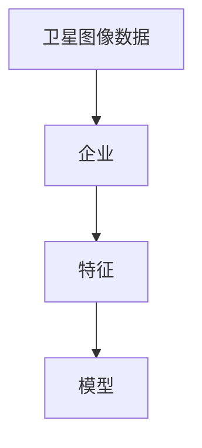
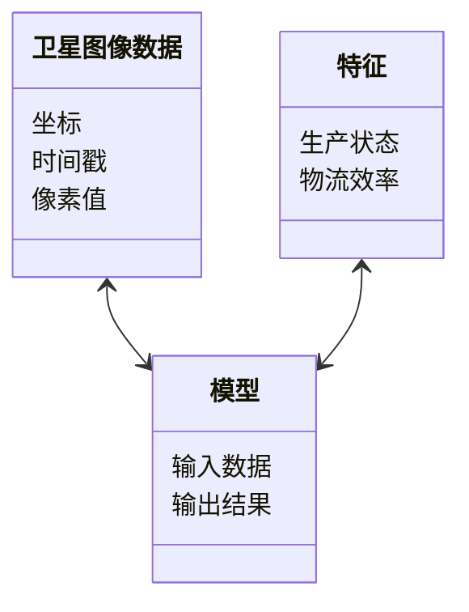
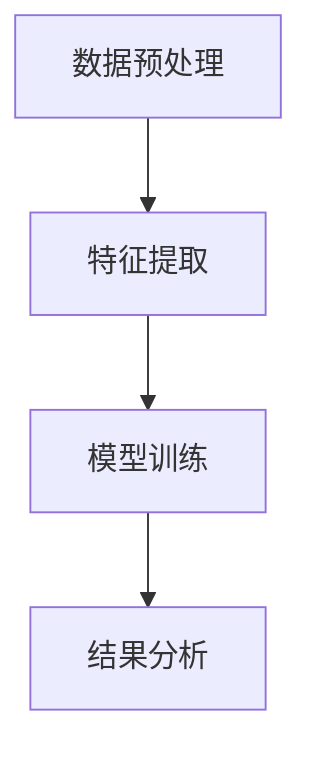
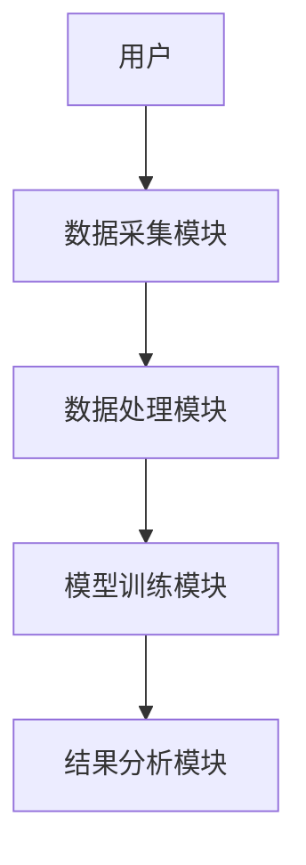
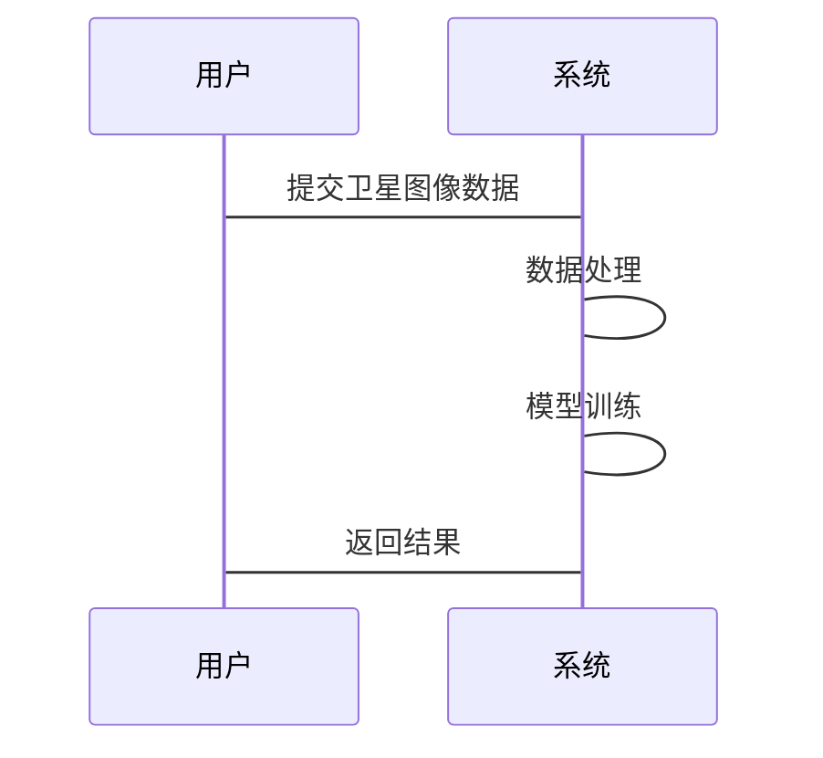

                 


# AI协作分析卫星图像数据：评估公司实际经营状况

> 关键词：卫星图像数据，AI协作分析，企业经营状况评估，图像处理，机器学习

> 摘要：本文详细探讨了利用AI协作分析卫星图像数据来评估公司实际经营状况的方法。通过分析卫星图像数据，结合机器学习算法，可以提取出与企业经营相关的多维度信息。文章从背景介绍、核心概念、算法原理、系统架构设计、项目实战以及最佳实践等多个方面展开讨论，深入剖析了AI协作分析的应用价值和技术实现路径。

---

## 第1章: 背景介绍

### 1.1 问题背景

#### 1.1.1 卫星图像数据的特点
卫星图像数据具有高分辨率、覆盖范围广、实时性强等特点。通过卫星图像，可以获取地面上的建筑物、交通网络、土地利用等信息，这些信息与企业的生产、物流、销售等经营活动密切相关。

#### 1.1.2 企业经营状况评估的传统方法
传统的企业经营状况评估主要依赖于财务报表、市场调研、供应链数据分析等方法。这些方法虽然有效，但存在数据获取成本高、实时性差、覆盖面有限等局限性。

#### 1.1.3 AI协作分析的必要性
AI协作分析可以通过对卫星图像数据的自动处理和分析，快速提取与企业经营相关的多维度信息。这种方法能够显著提高数据处理效率，降低成本，并提供更全面的评估结果。

### 1.2 问题描述

#### 1.2.1 卫星图像数据的获取与处理
卫星图像数据的获取需要考虑数据源的选择、数据预处理（如去噪、增强）等问题。图像数据的处理需要结合图像分割、特征提取等技术。

#### 1.2.2 企业经营状况的多维度评估需求
企业经营状况的评估需要考虑生产规模、物流效率、市场覆盖等多个维度。通过卫星图像数据，可以评估工厂的生产状态、物流网络的繁忙程度等。

#### 1.2.3 AI协作分析的可行性与优势
AI协作分析的可行性体现在数据获取的便捷性和算法的成熟性上。其优势在于能够快速处理大量图像数据，并通过模型训练提取关键特征。

### 1.3 问题解决

#### 1.3.1 AI协作分析的基本思路
通过卫星图像数据，利用AI技术提取与企业经营相关的特征信息，并结合其他数据源进行综合评估。

#### 1.3.2 卫星图像数据与企业经营的关联性
卫星图像数据可以反映企业的生产规模、物流效率、市场覆盖等关键指标。例如，工厂的生产状态可以通过卫星图像中的生产线运行情况来判断。

#### 1.3.3 技术实现的路径与方法
技术实现路径包括数据获取、数据预处理、特征提取、模型训练、结果分析等步骤。具体方法包括使用卷积神经网络（CNN）进行图像分类，使用循环神经网络（RNN）进行时间序列分析等。

### 1.4 边界与外延

#### 1.4.1 数据范围的界定
卫星图像数据的范围包括企业的生产厂区、物流网络、销售区域等。需要明确数据采集的区域范围和时间范围。

#### 1.4.2 应用场景的限制
AI协作分析的应用场景主要限于能够通过卫星图像数据获取相关信息的企业经营评估。对于数据获取困难、图像特征不明显的行业可能效果有限。

#### 1.4.3 技术发展的潜力
随着AI技术的进步和卫星技术的发展，未来可以通过更高分辨率的卫星图像和更复杂的模型进一步提高分析精度。

### 1.5 概念结构与核心要素

#### 1.5.1 核心概念的组成
AI协作分析由卫星图像数据、AI算法、特征提取、模型训练和结果评估等核心要素组成。

#### 1.5.2 各要素之间的关系
卫星图像数据是输入，AI算法是处理工具，特征提取是关键步骤，模型训练是核心过程，结果评估是输出。各要素相互依存，共同构成完整的分析系统。

#### 1.5.3 系统的整体架构
系统架构包括数据获取模块、数据处理模块、模型训练模块和结果分析模块。各模块协同工作，完成从数据输入到结果输出的全过程。

---

## 第2章: 核心概念与联系

### 2.1 AI协作分析的原理

#### 2.1.1 图像处理的基本原理
图像处理包括图像增强、图像分割、图像识别等步骤。通过这些步骤可以提取图像中的关键特征。

#### 2.1.2 AI模型的核心算法
AI模型的核心算法包括CNN、RNN、SVM等。这些算法能够对图像数据进行分类、回归等任务。

#### 2.1.3 协作分析的实现机制
协作分析通过多模型协同工作，结合不同算法的优势，提高分析的准确性和全面性。

### 2.2 核心概念的对比分析

#### 2.2.1 不同AI模型的特征对比
| 模型类型 | 输入数据 | 输出结果 | 优缺点 |
|----------|----------|----------|--------|
| CNN      | 图像      | 分类      | 适合图像分类 |
| RNN      | 时间序列 | 分类/回归 | 适合时间序列分析 |

#### 2.2.2 数据处理方法的对比
| 方法     | 描述                       |
|----------|---------------------------|
| 基于CNN的图像分割 | 通过分割图像提取具体区域的特征 |
| 基于RNN的时间序列分析 | 通过分析时间序列数据预测趋势 |

### 2.3 实体关系图与类图

#### 2.3.1 ER实体关系图


#### 2.3.2 领域模型类图


---

## 第3章: 算法原理

### 3.1 算法流程

#### 3.1.1 算法概述
算法流程包括数据预处理、特征提取、模型训练、结果分析等步骤。

#### 3.1.2 算法流程图


### 3.2 核心算法实现

#### 3.2.1 卷积神经网络（CNN）实现
```python
import tensorflow as tf
from tensorflow import keras

model = keras.Sequential([
    keras.layers.Conv2D(32, (3,3), activation='relu', input_shape=(64, 64, 3)),
    keras.layers.MaxPooling2D((2,2)),
    keras.layers.Conv2D(64, (3,3), activation='relu'),
    keras.layers.MaxPooling2D((2,2)),
    keras.layers.Flatten(),
    keras.layers.Dense(128, activation='relu'),
    keras.layers.Dense(1, activation='sigmoid')
])
model.compile(optimizer='adam', loss='binary_crossentropy', metrics=['accuracy'])
```

#### 3.2.2 损失函数与优化器
损失函数：二元交叉熵损失函数
$$\text{loss}(y, \hat{y}) = -\frac{1}{n}\sum_{i=1}^{n} y_i \log(\hat{y}_i) + (1 - y_i) \log(1 - \hat{y}_i)$$

优化器：Adam优化器
$$\text{Adam} = \text{Momentum} + \text{RMSProp}$$

### 3.3 算法优化与调优

#### 3.3.1 参数调整
调整学习率、批量大小、网络层数等参数，以提高模型的准确性和训练效率。

#### 3.3.2 正则化技术
使用Dropout、L2正则化等技术防止过拟合。

---

## 第4章: 系统分析与架构设计

### 4.1 项目介绍

#### 4.1.1 项目背景
本项目旨在通过AI协作分析卫星图像数据，评估企业的实际经营状况。

### 4.2 系统功能设计

#### 4.2.1 领域模型


#### 4.2.2 系统架构


### 4.3 接口设计与交互流程

#### 4.3.1 接口设计
用户通过Web界面提交任务，系统返回分析结果。

#### 4.3.2 交互流程


---

## 第5章: 项目实战

### 5.1 环境安装

#### 5.1.1 安装Python
```bash
python --version
```

#### 5.1.2 安装TensorFlow和OpenCV
```bash
pip install tensorflow opencv-python
```

### 5.2 核心代码实现

#### 5.2.1 图像预处理
```python
import cv2
import numpy as np

# 读取图像
image = cv2.imread('factory.jpg')

# 图像增强
enhanced_image = cv2.equalizeHist(image)

# 显示图像
cv2.imshow('Enhanced Image', enhanced_image)
cv2.waitKey(0)
cv2.destroyAllWindows()
```

#### 5.2.2 模型训练
```python
model.fit(X_train, y_train, epochs=10, batch_size=32, validation_split=0.2)
```

### 5.3 实际案例分析

#### 5.3.1 案例背景
分析某工厂的卫星图像数据，评估其生产状态。

#### 5.3.2 数据处理
对图像进行分割，提取工厂区域的特征。

#### 5.3.3 模型分析
使用训练好的模型对图像进行分类，判断生产状态。

### 5.4 项目小结
通过实际案例分析，验证了AI协作分析的有效性和实用性。

---

## 第6章: 最佳实践与总结

### 6.1 最佳实践

#### 6.1.1 数据预处理的重要性
确保数据质量，进行归一化、标准化等处理。

#### 6.1.2 模型调优的技巧
合理选择模型参数，避免过拟合和欠拟合。

#### 6.1.3 系统优化建议
优化系统架构，提高数据处理效率。

### 6.2 总结

#### 6.2.1 核心内容回顾
AI协作分析卫星图像数据，能够有效评估企业经营状况。

#### 6.2.2 展望未来
随着技术进步，AI协作分析将更加精准和广泛应用于多个领域。

### 6.3 注意事项

#### 6.3.1 数据隐私保护
确保数据的安全性和隐私性。

#### 6.3.2 模型泛化能力
模型需要具有良好的泛化能力，以应对不同场景。

---

## 作者：AI天才研究院 & 禅与计算机程序设计艺术

---

本文详细探讨了AI协作分析卫星图像数据在企业经营状况评估中的应用，从背景介绍到系统设计，再到项目实战，全面剖析了技术实现和应用价值。通过本文的分析，读者可以深入了解如何利用AI技术提升企业经营评估的效率和准确性。

