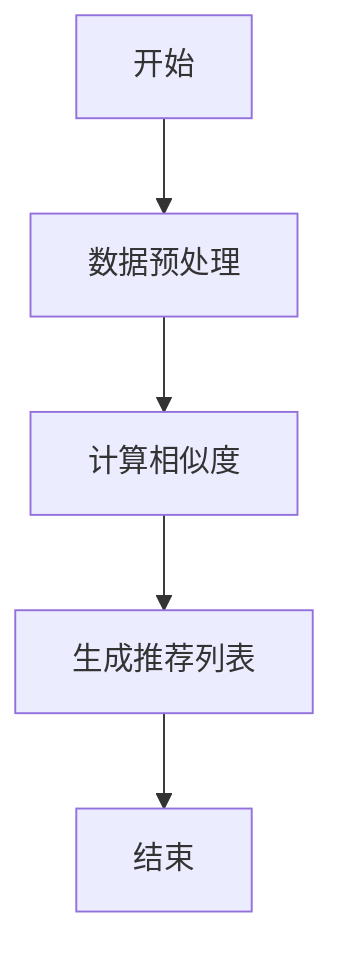
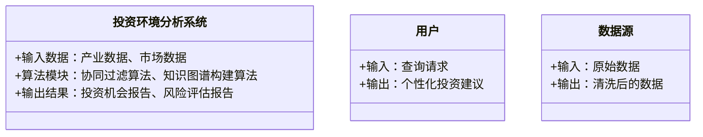
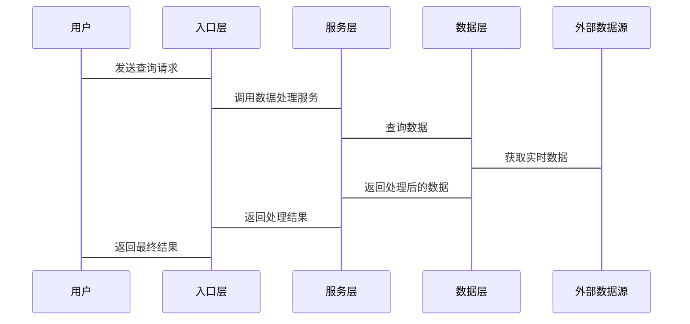

                 


# AI协作构建动态产业生态图：全面把握投资环境

**关键词**：AI协作、动态产业生态图、投资环境分析、知识图谱、协同学习

**摘要**：本文系统探讨了AI协作在构建动态产业生态图中的应用及其对投资环境的影响。通过分析AI协作的核心机制、算法原理和系统架构设计，本文展示了如何利用AI技术实现产业生态的动态更新和投资环境的精准分析。结合实际案例，本文提供了详细的项目实现步骤和最佳实践，为读者提供了全面的指导。

---

## 目录

1. 引言  
2. AI协作与动态产业生态图的核心概念  
3. 产业生态图谱构建算法原理  
4. 投资环境分析与AI协作  
5. 系统架构设计  
6. 项目实战：医疗产业生态图构建  
7. 最佳实践与未来展望  

---

### 第1章: 引言

#### 1.1 问题背景
- 1.1.1 传统产业生态图的局限性  
- 1.1.2 AI协作的兴起及其优势  
- 1.1.3 动态产业生态图的定义与特点  

#### 1.2 问题描述
- 1.2.1 传统投资环境分析的痛点  
- 1.2.2 产业生态图构建的难点  
- 1.2.3 AI协作在产业生态图中的作用  

#### 1.3 问题解决
- 1.3.1 AI协作的核心机制  
- 1.3.2 动态产业生态图的构建方法  
- 1.3.3 投资环境分析的AI解决方案  

#### 1.4 边界与外延
- 1.4.1 产业生态图的边界  
- 1.4.2 AI协作的应用范围  
- 1.4.3 动态产业生态图的外延  

#### 1.5 概念结构与核心要素
- 1.5.1 产业生态图的构成要素  
- 1.5.2 AI协作的核心要素  
- 1.5.3 动态产业生态图的系统结构  

---

### 第2章: AI协作与动态产业生态图的核心概念

#### 2.1 AI协作的基本原理
- 2.1.1 协同学习  
- 2.1.2 分布式计算  
- 2.1.3 多智能体协作  

#### 2.2 动态产业生态图的构建
- 2.2.1 数据采集与处理  
- 2.2.2 知识图谱构建  
- 2.2.3 动态更新机制  

#### 2.3 AI协作与产业生态图的关系
- 2.3.1 协作网络的形成  
- 2.3.2 产业生态的动态演化  
- 2.3.3 AI协作对产业生态的影响  

---

### 第3章: 产业生态图谱构建算法原理

#### 3.1 协同过滤算法
- 3.1.1 协同过滤算法的定义  
- 3.1.2 基于用户的协同过滤  
- 3.1.3 基于物品的协同过滤  

#### 3.2 算法流程图
- 使用 Mermaid 绘制协同过滤算法的流程图：



#### 3.3 数学模型与公式
- 协同过滤的相似度计算公式：

$$ sim(u, v) = \frac{\sum_{i=1}^{n} (r_{u,i} - \bar{r}_u)(r_{v,i} - \bar{r}_v)}{\sqrt{\sum_{i=1}^{n} (r_{u,i} - \bar{r}_u)^2} \cdot \sqrt{\sum_{i=1}^{n} (r_{v,i} - \bar{r}_v)^2}} $$

- 其中，$\bar{r}_u$ 表示用户 $u$ 的平均评分。

#### 3.4 代码实现
- Python 实现基于用户的协同过滤算法：

```python
def compute_cosine_similarity(user_ratings, user_avg_ratings):
    similarity = {}
    for u in user_ratings:
        for v in user_ratings:
            if u == v:
                continue
            numerator = 0
            denominator_u = 0
            denominator_v = 0
            for i in range(len(user_ratings[u])):
                rating_u = user_ratings[u][i]
                rating_v = user_ratings[v][i]
                numerator += (rating_u - user_avg_ratings[u]) * (rating_v - user_avg_ratings[v])
                denominator_u += (rating_u - user_avg_ratings[u]) ** 2
                denominator_v += (rating_v - user_avg_ratings[v]) ** 2
            if denominator_u == 0 or denominator_v == 0:
                similarity[(u, v)] = 0.0
            else:
                similarity[(u, v)] = numerator / (math.sqrt(denominator_u) * math.sqrt(denominator_v))
    return similarity
```

---

### 第4章: 投资环境分析与AI协作

#### 4.1 投资环境分析的核心要素
- 4.1.1 产业趋势分析  
- 4.1.2 市场竞争分析  
- 4.1.3 投资风险评估  

#### 4.2 AI协作在投资环境分析中的应用
- 4.2.1 通过知识图谱识别投资机会  
- 4.2.2 利用动态产业生态图评估企业关联风险  
- 4.2.3 基于AI协作的多维度投资决策支持  

---

### 第5章: 系统架构设计

#### 5.1 问题场景介绍
- 投资环境分析系统的设计目标是利用AI协作构建动态产业生态图，为投资者提供实时、精准的投资决策支持。

#### 5.2 系统功能设计
- 使用 Mermaid 绘制领域模型类图：



#### 5.3 系统架构设计
- 使用 Mermaid 绘制系统架构图：


#### 5.4 系统接口设计
- API 接口：
  - `/api/v1/data/upload`：上传数据接口  
  - `/api/v1/process`：数据处理接口  
  - `/api/v1/report`：生成报告接口  

#### 5.5 系统交互设计
- 使用 Mermaid 绘制交互序列图：



---

### 第6章: 项目实战——医疗产业生态图构建

#### 6.1 环境安装
- 安装必要的 Python 包：
  ```bash
  pip install numpy pandas networkx matplotlib
  ```

#### 6.2 核心代码实现
- 医疗产业生态图构建的代码示例：

```python
import networkx as nx
import matplotlib.pyplot as plt

# 创建知识图谱
G = nx.Graph()
G.add_nodes_from(["药厂A", "药厂B", "医院A", "保险公司A"])
G.add_edges_from([("药厂A", "医院A"), ("药厂B", "医院A"), ("保险公司A", "药厂A")])

nx.draw(G, with_labels=True, node_size=1500, edge_length=2)
plt.show()
```

#### 6.3 代码应用解读与分析
- 通过上述代码，我们可以构建一个简单的医疗产业生态图，展示不同实体之间的关系。

#### 6.4 实际案例分析
- 分析某医疗产业生态图中的关键节点和关系，评估投资风险和机会。

#### 6.5 项目小结
- 总结项目实现的关键步骤和经验教训。

---

### 第7章: 最佳实践与未来展望

#### 7.1 最佳实践 tips
- 数据质量是构建动态产业生态图的关键。
- 定期更新数据以保持产业生态图的动态性。
- 在实际应用中，结合领域知识优化AI协作算法。

#### 7.2 小结
- 本文系统介绍了AI协作在构建动态产业生态图中的应用，展示了其在投资环境分析中的巨大潜力。

#### 7.3 注意事项
- 数据隐私和安全问题需要高度重视。
- 算法的可解释性是实际应用中的重要考量。

#### 7.4 拓展阅读
- 推荐阅读《深度学习》和《知识图谱构建与应用》。

---

**作者：AI天才研究院/AI Genius Institute & 禅与计算机程序设计艺术 /Zen And The Art of Computer Programming**

