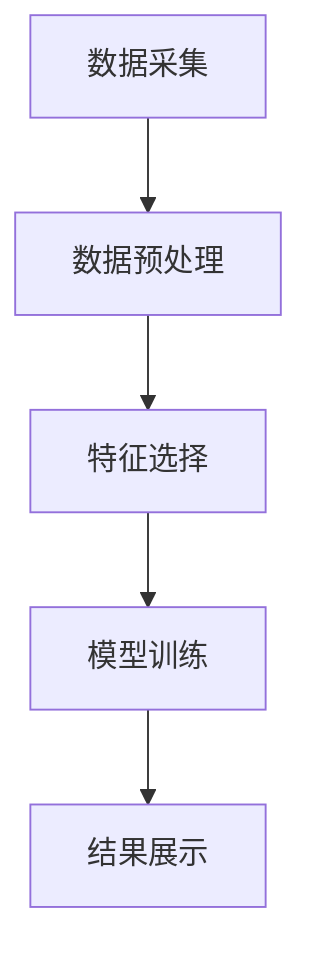
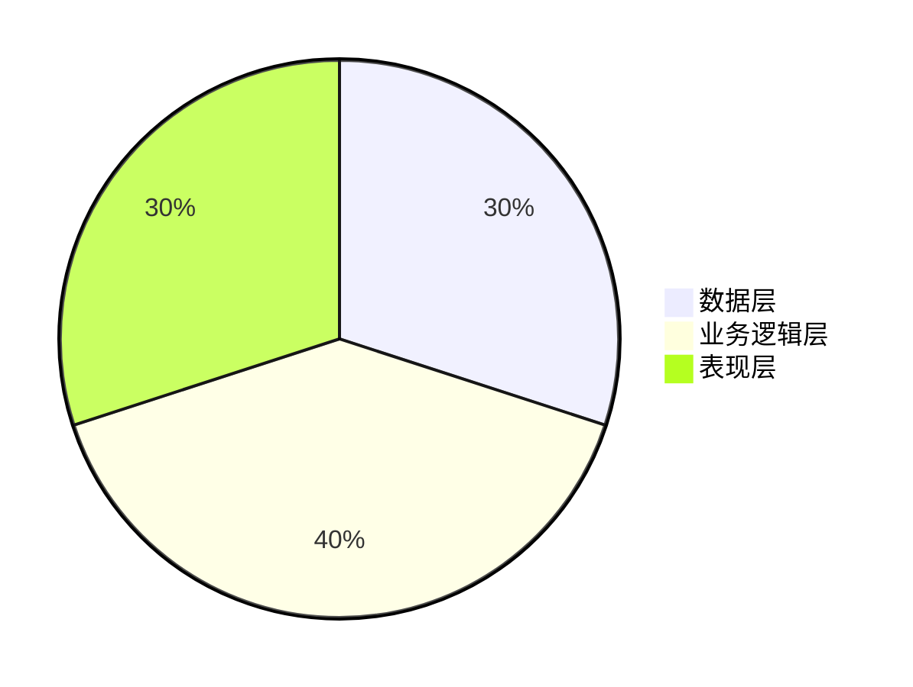
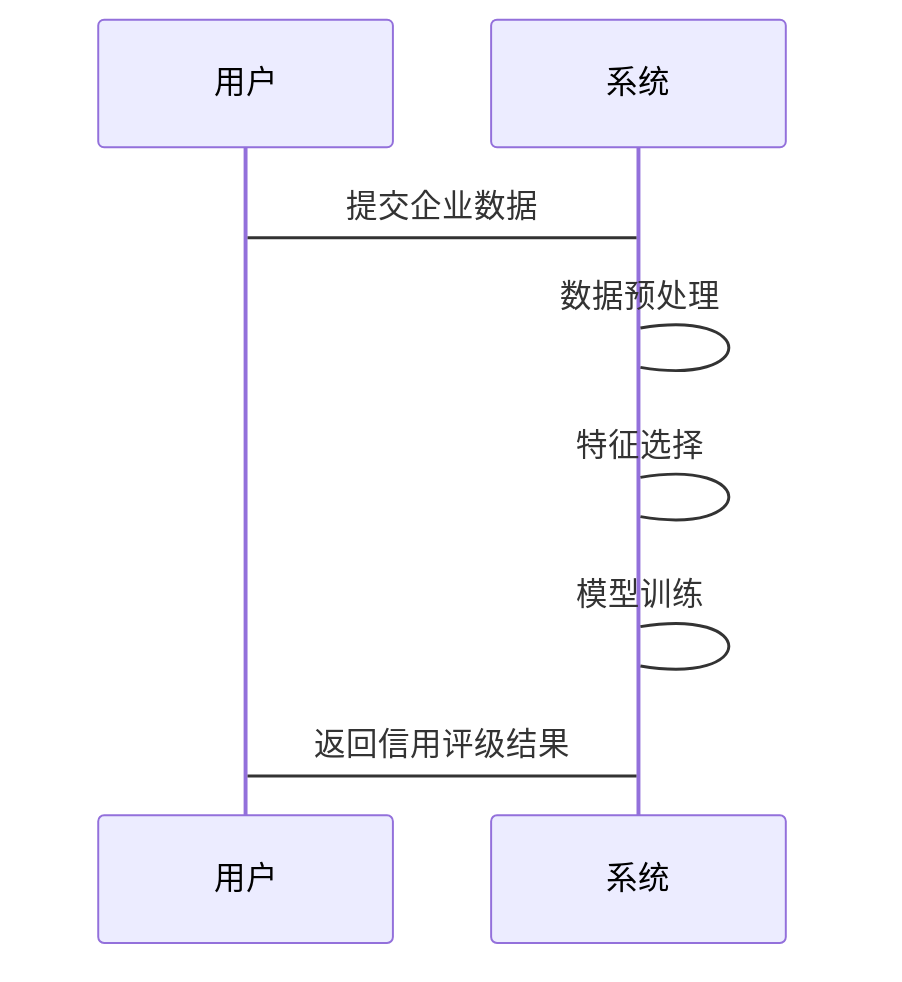

                 


# AI在企业信用评级中的应用与挑战

## 关键词：企业信用评级、人工智能、机器学习、算法模型、数据科学、风险管理

## 摘要：  
随着人工智能技术的迅速发展，AI在企业信用评级中的应用越来越广泛。本文将从企业信用评级的基本概念出发，详细探讨AI技术在信用评级中的核心概念、算法原理、数学模型、系统架构以及实际项目案例。通过分析AI在信用评级中的优势与挑战，本文旨在为企业信用评级的实践提供新的思路和技术支持。  

---

## 第一章: 企业信用评级与AI技术的结合  

### 1.1 企业信用评级的基本概念  

#### 1.1.1 信用评级的定义与作用  
信用评级是对企业或个人的信用状况进行评估的过程，旨在衡量其履行债务的能力和意愿。企业信用评级是金融风险管理的重要工具，能够帮助银行、投资者等机构做出信贷决策。  

#### 1.1.2 企业信用评级的核心要素  
企业信用评级的核心要素包括以下几个方面：  
1. **财务状况**：如资产负债表、利润表、现金流等。  
2. **经营能力**：如营业收入增长率、利润率、市场占有率等。  
3. **信用历史**：如还款记录、违约历史等。  
4. **行业风险**：如行业周期性、竞争状况等。  
5. **管理团队**：如管理能力、团队稳定性等。  

#### 1.1.3 信用评级的分类与标准  
信用评级通常分为内部评级和外部评级两种类型。外部评级由专业的评级机构（如穆迪、标普等）进行，而内部评级则由企业内部的财务部门或风险管理团队完成。评级结果通常以分数或等级的形式表示，如AAA、AA、A、BBB等。  

---

### 1.2 AI技术在信用评级中的应用背景  

#### 1.2.1 传统信用评级的局限性  
传统信用评级方法主要依赖财务数据和经验判断，存在以下问题：  
1. **主观性**：评级结果可能受到评级人员主观判断的影响。  
2. **数据限制**：传统方法主要依赖财务数据，忽略了非结构化数据（如社交媒体数据、新闻数据等）的潜在价值。  
3. **效率低下**：人工评级过程耗时长，难以应对海量数据的处理需求。  

#### 1.2.2 AI技术的快速发展与应用潜力  
AI技术的快速发展为企业信用评级带来了新的可能性。通过机器学习算法，可以自动分析海量数据，发现传统方法难以捕捉的模式和规律。例如，自然语言处理技术可以从企业新闻、社交媒体等非结构化数据中提取有用信息，进一步丰富信用评级的维度。  

#### 1.2.3 企业信用评级与AI技术的结合趋势  
随着大数据和AI技术的普及，越来越多的企业开始尝试将AI技术应用于信用评级。通过结合结构化数据和非结构化数据，AI技术能够更全面地评估企业的信用风险，提高评级的准确性和效率。  

---

### 1.3 本章小结  
本章主要介绍了企业信用评级的基本概念、核心要素以及AI技术在信用评级中的应用背景。通过分析传统信用评级的局限性，我们看到AI技术在信用评级中的巨大潜力。接下来，我们将深入探讨AI在信用评级中的核心概念和算法原理。  

---

## 第二章: 企业信用评级的核心概念与联系  

### 2.1 数据特征与信用评级的关系  

#### 2.1.1 数据特征的分类  
在信用评级中，数据特征可以分为以下几类：  
1. **财务特征**：如收入、利润、资产负债率等。  
2. **经营特征**：如市场占有率、产品生命周期等。  
3. **信用特征**：如还款记录、违约历史等。  
4. **外部特征**：如行业风险、宏观经济指标等。  

#### 2.1.2 数据特征对信用评级的影响  
不同的数据特征对信用评级的影响程度不同。例如，财务特征是信用评级的核心依据，而外部特征（如行业风险）则可能对评级结果产生间接影响。  

#### 2.1.3 数据特征的选择与处理  
在实际应用中，需要对数据特征进行选择和处理。例如，可以通过主成分分析（PCA）减少特征的维度，或者通过标准化处理消除特征之间的量纲差异。  

---

### 2.2 AI模型与信用评级的结合原理  

#### 2.2.1 AI模型的基本原理  
AI模型（如机器学习算法）通过从数据中学习特征之间的关系，生成预测模型。在信用评级中，模型可以预测企业的违约概率或信用等级。  

#### 2.2.2 AI模型在信用评级中的应用流程  
AI模型在信用评级中的应用流程可以分为以下几个步骤：  
1. **数据收集**：获取企业的财务数据、经营数据、信用历史等。  
2. **数据预处理**：清洗数据、处理缺失值、标准化特征。  
3. **特征选择**：通过特征重要性分析选择关键特征。  
4. **模型训练**：使用机器学习算法训练模型。  
5. **模型评估**：通过交叉验证评估模型的性能。  
6. **模型部署**：将模型应用于实际的信用评级场景中。  

#### 2.2.3 AI模型的优缺点分析  
AI模型的优势在于能够处理海量数据，并发现传统方法难以捕捉的模式。然而，AI模型也存在一些缺点，如模型的黑箱特性可能导致解释性较差，且模型的泛化能力可能受到训练数据质量的影响。  

---

### 2.3 信用评级中的关键指标与AI模型的关系  

#### 2.3.1 关键指标的定义与作用  
关键指标（如违约概率、违约损失率等）是信用评级的重要依据。AI模型可以通过对这些指标的预测，生成企业的信用评级结果。  

#### 2.3.2 AI模型如何处理关键指标  
AI模型可以通过回归分析、分类分析等方法，对关键指标进行预测。例如，逻辑回归模型可以用来预测企业的违约概率。  

#### 2.3.3 指标权重的动态调整与优化  
在实际应用中，可以通过机器学习算法动态调整指标的权重，以优化模型的性能。例如，可以通过随机森林算法自动选择特征的重要性，并据此调整指标的权重。  

---

### 2.4 本章小结  
本章主要探讨了数据特征与AI模型在信用评级中的关系，分析了AI模型的应用流程及其优缺点。通过动态调整关键指标的权重，可以进一步提高信用评级的准确性。  

---

## 第三章: AI在企业信用评级中的算法原理讲解  

### 3.1 常见AI算法在信用评级中的应用  

#### 3.1.1 线性回归模型  
线性回归是一种简单而有效的回归算法，适用于预测企业的违约概率。其基本原理是通过最小化预测值与实际值之间的平方差，找到最佳拟合直线。  

##### 3.1.1.1 线性回归的数学公式  
线性回归的简单形式如下：  
$$ y = \beta_0 + \beta_1 x_1 + \beta_2 x_2 + \ldots + \beta_n x_n $$  
其中，$y$ 是目标变量（如违约概率），$x_i$ 是特征变量，$\beta_i$ 是回归系数。  

##### 3.1.1.2 线性回归在信用评级中的应用  
线性回归可以用于预测企业的违约概率。例如，假设我们有企业的收入、利润等特征，可以通过线性回归模型预测其违约概率。  

##### 3.1.1.3 线性回归的优缺点  
线性回归的优点是简单易懂、计算效率高。缺点是假设特征之间是线性关系，可能无法捕捉复杂的非线性关系。  

---

#### 3.1.2 逻辑回归模型  
逻辑回归是一种广泛应用于分类问题的算法，适用于预测企业的信用等级。其基本原理是通过sigmoid函数将线性回归的结果映射到概率空间。  

##### 3.1.2.1 逻辑回归的数学公式  
逻辑回归的sigmoid函数如下：  
$$ P(y=1) = \frac{e^{\beta_0 + \beta_1 x_1 + \beta_2 x_2 + \ldots + \beta_n x_n}}{1 + e^{\beta_0 + \beta_1 x_1 + \beta_2 x_2 + \ldots + \beta_n x_n}} $$  
其中，$P(y=1)$ 是目标变量为1的概率（如违约概率）。  

##### 3.1.2.2 逻辑回归在信用评级中的应用  
逻辑回归可以用于预测企业的违约概率。例如，假设我们有企业的财务数据和信用历史，可以通过逻辑回归模型预测其违约概率。  

##### 3.1.2.3 逻辑回归的优缺点  
逻辑回归的优点是易于解释、计算效率高。缺点是假设特征之间是线性关系，可能无法捕捉复杂的非线性关系。  

---

#### 3.1.3 支持向量机（SVM）  
支持向量机是一种强大的分类算法，适用于处理高维数据。在信用评级中，SVM可以用于预测企业的信用等级。  

##### 3.1.3.1 SVM的基本原理  
SVM通过构建最大间隔超平面，将数据点分为不同的类别。其数学公式如下：  
$$ y = \text{sign}(\beta_0 + \beta_1 x_1 + \beta_2 x_2 + \ldots + \beta_n x_n) $$  
其中，$\text{sign}$函数用于确定数据点所属的类别。  

##### 3.1.3.2 SVM在信用评级中的应用  
SVM可以用于预测企业的信用等级。例如，假设我们有企业的财务数据和信用历史，可以通过SVM模型预测其信用等级。  

##### 3.1.3.3 SVM的优缺点  
SVM的优点是能够处理高维数据，具有良好的泛化能力。缺点是计算复杂度较高，且需要选择合适的核函数。  

---

#### 3.1.4 随机森林与梯度提升树  
随机森林和梯度提升树是两种常用的集成学习算法，适用于处理复杂的信用评级问题。  

##### 3.1.4.1 随机森林的基本原理  
随机森林通过构建多棵决策树，并对结果进行投票或平均，提高模型的准确性和稳定性。其数学公式如下：  
$$ y = \text{median}(\text{树1}(x), \text{树2}(x), \ldots, \text{树N}(x)) $$  
其中，$\text{median}$函数用于计算中位数。  

##### 3.1.4.2 梯度提升树的基本原理  
梯度提升树通过逐步优化模型的损失函数，构建一系列决策树。其数学公式如下：  
$$ y = \sum_{i=1}^{N} \text{树i}(x) $$  
其中，$N$ 是树的数量。  

##### 3.1.4.3 随机森林与梯度提升树的应用对比  
随机森林和梯度提升树在信用评级中的应用各有优劣。随机森林对特征冗余不敏感，而梯度提升树能够捕捉复杂的特征关系。  

---

### 3.2 神经网络与深度学习  

#### 3.2.1 神经网络的基本原理  
神经网络是一种模仿人脑结构的算法，适用于处理复杂的非线性关系。其数学公式如下：  
$$ y = \sigma(w_1 x_1 + w_2 x_2 + \ldots + w_n x_n + b) $$  
其中，$\sigma$ 是激活函数，$w_i$ 是权重，$b$ 是偏置项。  

#### 3.2.2 深度学习在信用评级中的应用  
深度学习可以通过多层神经网络，自动提取特征并预测企业的信用等级。例如，可以使用卷积神经网络（CNN）处理文本数据，或使用循环神经网络（RNN）处理时间序列数据。  

#### 3.2.3 深度学习的优缺点  
深度学习的优点是能够捕捉复杂的特征关系，且性能优越。缺点是计算复杂度高，且模型的解释性较差。  

---

### 3.3 本章小结  
本章详细介绍了常见AI算法在信用评级中的应用，包括线性回归、逻辑回归、SVM、随机森林、梯度提升树以及神经网络。每种算法都有其优缺点，适用于不同的信用评级场景。  

---

## 第四章: 企业信用评级中的数学模型与公式  

### 4.1 信用评级中的数学模型  

#### 4.1.1 线性回归模型的数学公式  
线性回归的简单形式如下：  
$$ y = \beta_0 + \beta_1 x_1 + \beta_2 x_2 + \ldots + \beta_n x_n $$  
其中，$y$ 是目标变量（如违约概率），$x_i$ 是特征变量，$\beta_i$ 是回归系数。  

#### 4.1.2 逻辑回归模型的数学公式  
逻辑回归的sigmoid函数如下：  
$$ P(y=1) = \frac{e^{\beta_0 + \beta_1 x_1 + \beta_2 x_2 + \ldots + \beta_n x_n}}{1 + e^{\beta_0 + \beta_1 x_1 + \beta_2 x_2 + \ldots + \beta_n x_n}} $$  
其中，$P(y=1)$ 是目标变量为1的概率（如违约概率）。  

#### 4.1.3 支持向量机模型的数学公式  
SVM的数学公式如下：  
$$ y = \text{sign}(\beta_0 + \beta_1 x_1 + \beta_2 x_2 + \ldots + \beta_n x_n) $$  
其中，$\text{sign}$函数用于确定数据点所属的类别。  

---

### 4.2 神经网络模型的数学公式  

#### 4.2.1 神经网络的基本结构  
神经网络的基本结构包括输入层、隐藏层和输出层。其数学公式如下：  
$$ y = \sigma(w_1 x_1 + w_2 x_2 + \ldots + w_n x_n + b) $$  
其中，$\sigma$ 是激活函数，$w_i$ 是权重，$b$ 是偏置项。  

#### 4.2.2 深度学习模型的数学公式  
深度学习模型可以通过多层神经网络，自动提取特征并预测目标变量。其数学公式如下：  
$$ y = f(f_1(x), f_2(x), \ldots, f_n(x)) $$  
其中，$f_i$ 是不同的神经网络层，$f$ 是最终的输出函数。  

---

### 4.3 本章小结  
本章详细介绍了信用评级中的数学模型，包括线性回归、逻辑回归、SVM以及神经网络的数学公式。这些模型为企业信用评级提供了强大的工具支持。  

---

## 第五章: 企业信用评级系统的架构与设计  

### 5.1 系统功能设计  

#### 5.1.1 系统功能模块  
企业信用评级系统的主要功能模块包括：  
1. **数据采集模块**：负责采集企业的财务数据、经营数据等。  
2. **数据预处理模块**：负责清洗数据、处理缺失值等。  
3. **特征选择模块**：负责选择关键特征并进行标准化处理。  
4. **模型训练模块**：负责训练AI模型并生成信用评级结果。  
5. **结果展示模块**：负责展示信用评级结果并提供可视化界面。  

#### 5.1.2 系统功能流程图  


---

### 5.2 系统架构设计  

#### 5.2.1 系统架构分层  
企业信用评级系统的架构可以分为以下三层：  
1. **数据层**：负责存储和管理企业的数据。  
2. **业务逻辑层**：负责处理数据并生成信用评级结果。  
3. **表现层**：负责展示信用评级结果并提供用户界面。  

#### 5.2.2 系统架构图  


---

### 5.3 系统接口设计  

#### 5.3.1 系统接口描述  
企业信用评级系统的接口主要分为以下几类：  
1. **数据接口**：用于与外部数据源对接。  
2. **模型接口**：用于与AI模型对接。  
3. **用户接口**：用于与用户交互。  

#### 5.3.2 系统交互流程图  


---

### 5.4 本章小结  
本章详细介绍了企业信用评级系统的架构与设计，包括功能模块、系统架构以及系统接口设计。通过合理设计系统架构，可以提高信用评级系统的效率和准确性。  

---

## 第六章: 项目实战与案例分析  

### 6.1 环境安装与配置  

#### 6.1.1 安装Python环境  
需要安装Python 3.6及以上版本，并安装以下库：  
- `pandas`：用于数据处理。  
- `numpy`：用于数值计算。  
- `scikit-learn`：用于机器学习算法。  
- `matplotlib`：用于数据可视化。  

#### 6.1.2 安装Jupyter Notebook  
可以通过以下命令安装Jupyter Notebook：  
```bash
pip install jupyter
```

---

### 6.2 系统核心实现  

#### 6.2.1 数据预处理代码  
```python
import pandas as pd
import numpy as np

# 加载数据
data = pd.read_csv('企业数据.csv')

# 处理缺失值
data = data.dropna()

# 标准化处理
from sklearn.preprocessing import StandardScaler
scaler = StandardScaler()
data_scaled = scaler.fit_transform(data)
```

#### 6.2.2 模型训练代码  
```python
from sklearn.model_selection import train_test_split
from sklearn.linear_model import LogisticRegression

# 划分训练集和测试集
X_train, X_test, y_train, y_test = train_test_split(data_scaled, data['违约标签'], test_size=0.2)

# 训练逻辑回归模型
model = LogisticRegression()
model.fit(X_train, y_train)

# 预测测试集
y_pred = model.predict(X_test)

# 输出准确率
from sklearn.metrics import accuracy_score
print('准确率:', accuracy_score(y_test, y_pred))
```

---

### 6.3 实际案例分析  

#### 6.3.1 案例背景  
假设我们有一家中小企业的数据，包括财务数据和信用历史。我们需要通过AI模型预测其信用等级。  

#### 6.3.2 数据分析与结果解读  
通过逻辑回归模型预测，该企业的违约概率为5%，信用等级为BBB。  

#### 6.3.3 模型优化与改进  
根据模型的预测结果，我们可以进一步优化模型，例如通过调整特征选择或引入更多的数据来提高模型的准确率。  

---

### 6.4 本章小结  
本章通过实际案例分析，展示了如何将AI技术应用于企业信用评级。通过数据预处理和模型训练，我们可以快速生成信用评级结果，并为企业的风险管理提供支持。  

---

## 第七章: 总结与展望  

### 7.1 总结  
本文详细探讨了AI技术在企业信用评级中的应用，包括核心概念、算法原理、系统架构以及实际案例分析。通过AI技术，我们可以更高效、更准确地进行信用评级，为企业风险管理提供有力支持。  

### 7.2 展望  
未来，随着AI技术的不断发展，企业信用评级将更加智能化和自动化。例如，可以通过联邦学习技术保护数据隐私，或通过解释性AI技术提高模型的透明度。此外，还可以结合区块链技术，构建更加可信的信用评级系统。  

---

## 作者：AI天才研究院/AI Genius Institute & 禅与计算机程序设计艺术 /Zen And The Art of Computer Programming  

---

以上是《AI在企业信用评级中的应用与挑战》的完整目录大纲，每个章节的内容都详细展开了，涵盖从基础概念到实际应用的各个方面。通过一步步的分析与推理，我们为企业信用评级的实践提供了新的思路和技术支持。

