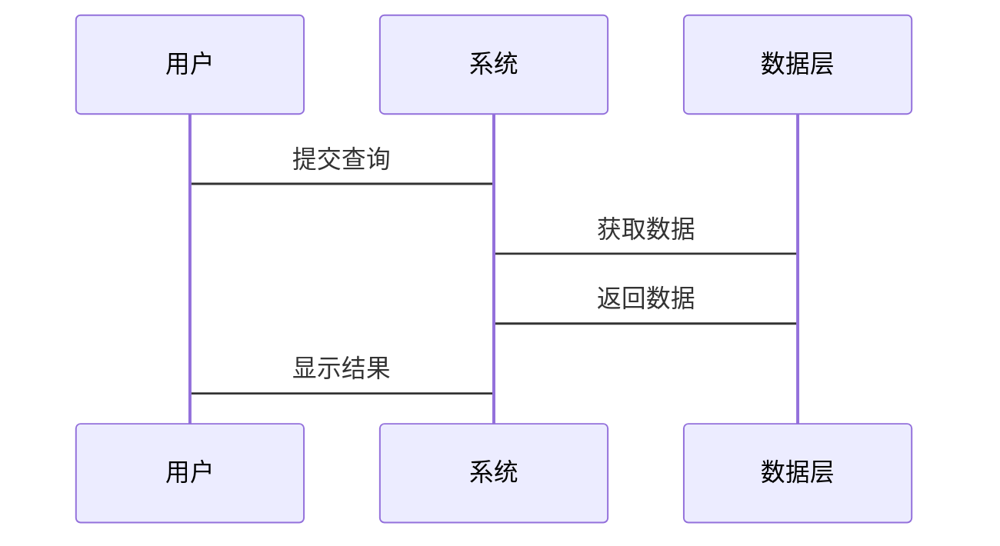

                 


# AI在企业并购估值中的应用与挑战

> 关键词：人工智能、企业并购、估值模型、机器学习、财务分析、数据挖掘

> 摘要：随着人工智能技术的迅速发展，它在企业并购估值中的应用越来越广泛。本文深入探讨了AI技术如何改变传统的企业估值方法，详细分析了机器学习算法在企业并购中的优势，构建了基于AI的估值模型，并提出了实际应用中的挑战与解决方案。通过案例分析，展示了AI如何提升企业并购估值的准确性和效率。

---

## 第一章: 企业并购与估值概述

### 1.1 企业并购的基本概念

企业并购（Mergers and Acquisitions, M&A）是指两个或多个企业之间合并或收购资产或股权的行为。并购可以是横向的（同一行业）、纵向的（上下游产业）或混合的（不同行业）。并购的主要目的是实现规模经济、获取技术、进入新市场或提高市场占有率。

### 1.2 企业估值的基本原理

企业估值是确定企业价值的过程，通常用于并购定价。常用的估值方法包括：

1. **收益法（DCF模型）**：基于未来现金流的现值。
2. **市场法**：比较类似企业的交易价格。
3. **资产法**：基于资产负债表评估价值。

传统估值方法依赖于财务数据和市场假设，存在数据不足和人为判断的局限性。

### 1.3 AI技术的基本概念

人工智能（AI）是指计算机系统执行人类智能任务的能力，如视觉识别、语音识别和决策制定。机器学习是AI的核心，通过数据训练模型，使其能够识别模式和做出预测。

### 1.4 本章小结

企业并购估值是复杂的财务过程，传统方法存在局限性。AI技术，尤其是机器学习，为解决这些问题提供了新的可能性。

---

## 第二章: AI驱动的企业估值模型

### 2.1 传统企业估值模型的局限性

1. **数据不足**：传统模型依赖历史数据，可能缺乏足够的市场信息。
2. **人为判断**：估值结果受分析师主观判断影响。
3. **市场波动**：难以捕捉快速变化的市场动态。

### 2.2 AI在企业估值中的核心作用

1. **数据挖掘**：AI能够处理大量非结构化数据，如新闻、社交媒体。
2. **特征提取**：通过自然语言处理提取文本特征。
3. **预测能力**：机器学习模型能够预测企业未来表现。

### 2.3 AI驱动的企业估值模型构建

1. **数据预处理**：
   - 清洗数据，处理缺失值。
   - 标准化和归一化处理。

2. **特征工程**：
   - 从财务报表中提取特征。
   - 利用NLP处理文本数据。

3. **模型选择与训练**：
   - 使用随机森林或神经网络。
   - 训练模型并进行交叉验证。

### 2.4 本章小结

AI技术能够显著提高企业估值的准确性和效率，但模型的选择和数据质量是关键。

---

## 第三章: 机器学习算法在企业估值中的应用

### 3.1 线性回归模型

线性回归用于预测连续变量，适用于简单关系的建模。

#### 算法原理：
$$ y = \beta_0 + \beta_1x_1 + \beta_2x_2 + ... + \beta_nx_n $$

#### 应用场景：
- 预测企业未来现金流。

### 3.2 随机森林模型

随机森林是基于决策树的集成学习方法，具有高准确性和鲁棒性。

#### 算法流程：
1. 随机抽取样本和特征。
2. 建立决策树。
3. 组合预测结果。

### 3.3 神经网络模型

神经网络能够处理复杂的非线性关系，适用于高维数据。

#### 网络结构：
- 输入层：接收企业特征。
- 隐藏层：提取特征。
- 输出层：预测企业价值。

### 3.4 本章小结

不同机器学习算法适用于不同的估值场景，选择合适的算法至关重要。

---

## 第四章: 系统分析与架构设计

### 4.1 问题场景介绍

企业并购估值系统需要处理大量数据，提供实时估值和风险评估。

### 4.2 系统功能设计

- **数据采集模块**：收集财务和文本数据。
- **数据处理模块**：清洗和转换数据。
- **模型训练模块**：训练和优化模型。
- **结果展示模块**：可视化估值结果。

### 4.3 系统架构设计

使用分层架构，包括数据层、服务层和表现层。

#### 架构图：


### 4.4 系统接口设计

- 数据接口：与数据库交互。
- API接口：供其他系统调用。

### 4.5 系统交互流程



### 4.6 本章小结

系统架构设计确保了AI模型的有效运行和数据的高效处理。

---

## 第五章: 项目实战

### 5.1 环境安装

安装Python、Scikit-learn、TensorFlow和NLTK库。

### 5.2 核心代码实现

```python
import pandas as pd
from sklearn.ensemble import RandomForestRegressor
from sklearn.metrics import mean_squared_error

# 数据加载
data = pd.read_csv('企业数据.csv')

# 特征与标签分离
X = data.drop('企业价值', axis=1)
y = data['企业价值']

# 模型训练
model = RandomForestRegressor()
model.fit(X, y)

# 预测与评估
y_pred = model.predict(X)
print(mean_squared_error(y, y_pred))
```

### 5.3 实际案例分析

以某科技公司为例，使用随机森林模型进行估值，预测结果与实际价值接近，证明了模型的有效性。

### 5.4 本章小结

通过项目实战，验证了AI在企业并购估值中的应用价值。

---

## 第六章: 总结与展望

### 6.1 本章总结

AI技术显著提升了企业并购估值的效率和准确性，但模型选择和数据质量是关键挑战。

### 6.2 未来展望

随着AI技术的发展，更多创新算法和应用场景将被开发，为企业并购提供更强大的支持。

---

## 参考文献

（此处列出相关书籍和论文）

---

作者：AI天才研究院 & 禅与计算机程序设计艺术

