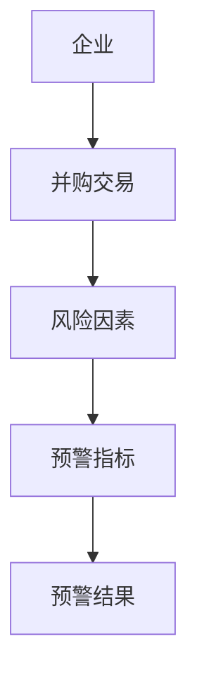
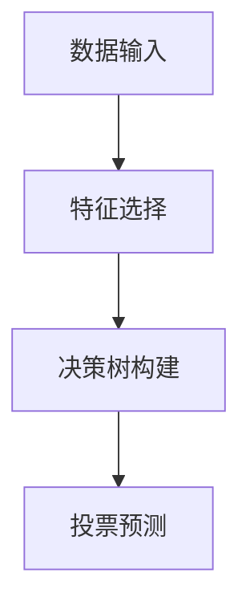
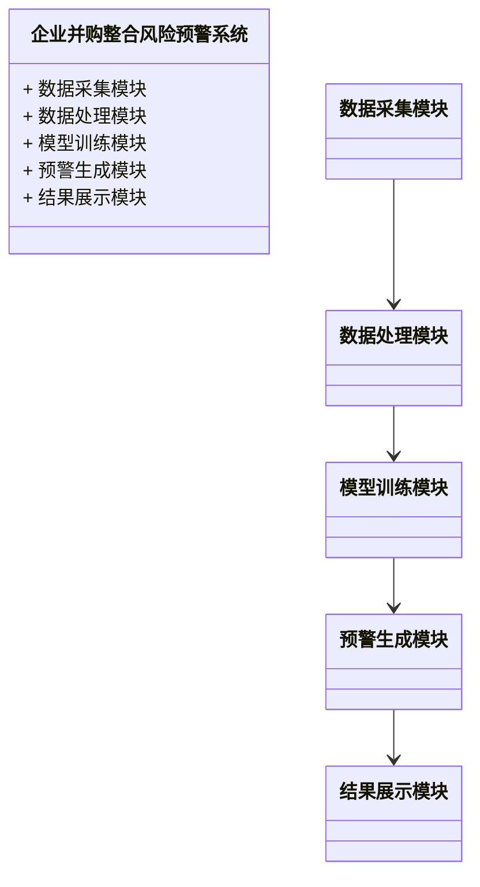
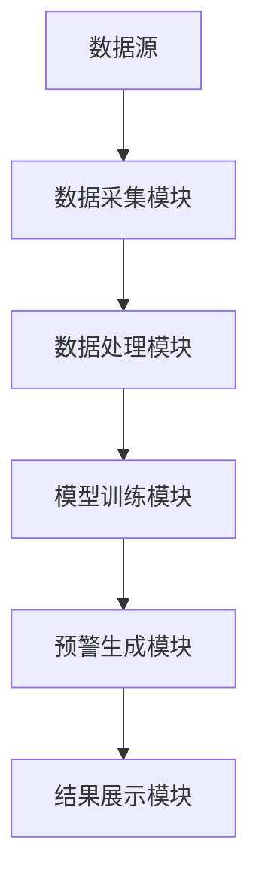
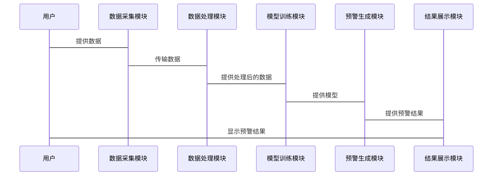

                 


# AI在企业并购整合风险预警中的应用与挑战

> 关键词：企业并购整合，人工智能，风险预警，机器学习，数据挖掘

> 摘要：本文探讨了人工智能在企业并购整合风险预警中的应用与挑战。通过分析企业并购整合的关键风险点，结合AI技术的核心概念、算法原理和系统架构设计，提出了一种基于AI的风险预警解决方案。文章从背景介绍、核心概念、算法实现、系统设计、项目实战等多方面展开，详细阐述了AI在企业并购整合中的应用潜力与实际价值。

---

# 第1章: 企业并购整合的背景与AI的应用

## 1.1 企业并购整合的背景

### 1.1.1 企业并购整合的定义与特点
企业并购整合是指企业在扩展过程中，通过收购或合并其他企业，整合资源、技术和市场，以实现战略目标的过程。其特点包括复杂性、协同效应和风险性。并购整合涉及组织结构、文化融合、资源分配等多个方面，是一项复杂的系统工程。

### 1.1.2 企业并购整合的常见风险
企业并购整合过程中可能面临的风险包括：
1. **市场风险**：目标企业市场表现不佳或行业环境变化。
2. **财务风险**：并购成本过高或整合后的盈利能力下降。
3. **运营风险**：整合过程中出现管理混乱或效率低下。
4. **法律与合规风险**：并购涉及的法律问题或合规性问题。
5. **文化与组织风险**：企业文化和管理风格差异导致整合困难。

### 1.1.3 AI在企业并购整合中的应用潜力
人工智能技术可以通过数据挖掘、机器学习和自然语言处理等手段，帮助企业识别潜在风险、优化决策流程，并提高整合效率。AI能够处理海量数据，发现隐藏的关联性，为并购整合提供科学依据。

---

## 1.2 AI在企业并购整合中的应用

### 1.2.1 AI技术的基本概念
人工智能（AI）是指通过计算机模拟人类智能的技术，包括学习、推理、感知和决策等能力。机器学习（ML）是AI的核心技术，通过训练模型从数据中提取规律，实现自动化决策。

### 1.2.2 AI在企业并购整合中的应用场景
1. **风险评估**：利用AI分析历史数据，识别并购中的潜在风险。
2. **价值评估**：通过机器学习模型预测目标企业的价值。
3. **整合规划**：AI辅助制定整合计划，优化资源配置。
4. **监控与预警**：实时监控整合过程中的风险，及时发出预警。

### 1.2.3 AI技术对企业并购整合的推动作用
AI技术能够提高并购整合的效率和准确性，降低风险，为企业创造更大的价值。通过AI的辅助，企业可以做出更明智的并购决策，提升整合后的竞争力。

---

## 1.3 企业并购整合风险预警的重要性

### 1.3.1 风险预警的定义与作用
风险预警是指通过监测和分析潜在风险因素，提前发出警报，以便采取措施避免或减少风险损失。在企业并购整合中，风险预警能够帮助企业及时发现问题，调整整合策略，降低整合失败的风险。

### 1.3.2 企业并购整合中的关键风险点
1. **战略风险**：并购战略与企业整体战略不符。
2. **技术风险**：目标企业技术落后或不兼容。
3. **财务风险**：并购成本超出预算或整合后盈利能力下降。
4. **管理风险**：整合过程中管理混乱或文化冲突。

### 1.3.3 AI在风险预警中的独特优势
AI能够处理和分析大量非结构化数据，发现潜在风险，并通过实时监测提供预警。与传统方法相比，AI的风险预警更加精准、高效。

---

## 1.4 本章小结
本章介绍了企业并购整合的背景、常见风险以及AI在其中的应用潜力。AI技术为企业并购整合提供了新的工具和方法，能够帮助企业在复杂环境中做出更明智的决策，降低整合风险。

---

# 第2章: 核心概念与联系

## 2.1 AI在风险预警中的核心概念

### 2.1.1 数据来源与特征
在企业并购整合风险预警中，数据来源包括企业财务数据、市场数据、行业数据以及并购案例数据。关键特征包括收入增长率、利润率、资产负债率等财务指标，以及行业竞争状况、政策变化等外部因素。

### 2.1.2 风险评估模型
风险评估模型是基于机器学习算法构建的，用于预测并购整合中的潜在风险。常用的模型包括逻辑回归、随机森林和神经网络等。

### 2.1.3 预警机制
预警机制是根据模型预测结果，设定阈值，当预测结果超过阈值时，触发预警信号。预警机制能够帮助企业及时采取措施，避免或减少风险损失。

---

## 2.2 核心概念的联系

### 2.2.1 数据流与模型的关系
数据流是模型的输入，模型通过学习数据，提取特征并生成预测结果。数据流的质量和完整性直接影响模型的预测准确性。

### 2.2.2 模型输出与预警决策的关联
模型输出是预警决策的基础，根据模型预测结果，企业可以调整整合策略，优化资源配置。

### 2.2.3 系统架构的模块化设计
企业并购整合风险预警系统通常包括数据采集、数据处理、模型训练、预警生成和结果展示等模块。各模块之间相互协作，共同完成风险预警任务。

---

## 2.3 核心概念的ER实体关系图



---

## 2.4 本章小结
本章详细阐述了AI在企业并购整合风险预警中的核心概念，包括数据来源、风险评估模型和预警机制，并通过ER实体关系图展示了核心概念之间的联系。

---

# 第3章: AI在企业并购整合风险预警中的算法原理

## 3.1 常见算法概述

### 3.1.1 逻辑回归
逻辑回归是一种用于分类的机器学习算法，常用于风险评估。其数学模型如下：

$$ P(y=1|x) = \frac{1}{1 + e^{-\beta x}} $$

其中，$\beta$ 是模型的参数，$x$ 是输入特征。

### 3.1.2 支持向量机
支持向量机（SVM）是一种用于分类和回归的算法，适用于高维数据的处理。其核心思想是通过构建超平面将数据分成两类。

### 3.1.3 随机森林
随机森林是一种基于决策树的集成学习算法，具有高准确性和鲁棒性。其工作原理如下：



### 3.1.4 深度学习
深度学习是一种基于人工神经网络的算法，适用于复杂数据的处理。其典型模型包括卷积神经网络（CNN）和循环神经网络（RNN）。

---

## 3.2 算法实现与比较

### 3.2.1 算法实现
以下是逻辑回归算法的Python代码示例：

```python
import numpy as np
from sklearn.linear_model import LogisticRegression

# 数据准备
X = np.array([[1, 2], [3, 4], [5, 6]])
y = np.array([0, 1, 1])

# 模型训练
model = LogisticRegression()
model.fit(X, y)

# 预测
print(model.predict(X))
```

### 3.2.2 算法比较
以下是几种常用算法的优缺点对比：

| 算法类型 | 优点 | 缺点 |
|----------|------|------|
| 逻辑回归 | 简单、易于解释 | 适用于线性可分数据 |
| 支持向量机 | 高维数据表现好 | 参数敏感 |
| 随机森林 | 高准确率、鲁棒性好 | 计算复杂度高 |
| 深度学习 | 处理复杂数据能力强 | 需要大量数据 |

---

## 3.3 本章小结
本章详细介绍了几种常用的机器学习算法，并通过代码示例展示了算法的实现过程。不同算法在企业并购整合风险预警中的表现各异，选择合适的算法需要根据具体场景和数据特点进行判断。

---

# 第4章: 系统分析与架构设计

## 4.1 系统功能设计

### 4.1.1 系统功能模块
企业并购整合风险预警系统主要包括数据采集、数据处理、模型训练、预警生成和结果展示五大模块。

### 4.1.2 功能模块的领域模型图



---

## 4.2 系统架构设计

### 4.2.1 系统架构图



---

## 4.3 接口设计与交互流程

### 4.3.1 系统接口设计
系统接口包括数据输入接口、模型训练接口和预警结果接口。

### 4.3.2 系统交互流程



---

## 4.4 本章小结
本章详细描述了企业并购整合风险预警系统的功能设计、架构设计和交互流程，为后续的系统实现奠定了基础。

---

# 第5章: 项目实战

## 5.1 环境安装与配置

### 5.1.1 安装Python环境
安装Python 3.8及以上版本，并安装必要的库：

```bash
pip install numpy scikit-learn matplotlib
```

### 5.1.2 安装Jupyter Notebook
安装Jupyter Notebook用于数据可视化和算法实现：

```bash
pip install jupyter
```

---

## 5.2 系统核心实现

### 5.2.1 数据处理代码
以下是数据处理的Python代码示例：

```python
import pandas as pd
import numpy as np

# 数据加载
data = pd.read_csv('merger_data.csv')

# 数据清洗
data = data.dropna()
data = data.replace({np.nan: 0})

# 特征提取
X = data[['revenue', 'profit', 'market_share']]
y = data['risk_flag']

print(X.head())
print(y.head())
```

### 5.2.2 模型训练代码
以下是模型训练的Python代码示例：

```python
from sklearn.model_selection import train_test_split
from sklearn.linear_model import LogisticRegression
from sklearn.metrics import accuracy_score

# 数据分割
X_train, X_test, y_train, y_test = train_test_split(X, y, test_size=0.2)

# 模型训练
model = LogisticRegression()
model.fit(X_train, y_train)

# 模型评估
print("Accuracy:", accuracy_score(model.predict(X_test), y_test))
```

---

## 5.3 代码解读与分析
1. **数据处理代码**：加载数据后进行清洗和特征提取，为模型训练提供干净的数据。
2. **模型训练代码**：使用逻辑回归算法训练模型，并对模型进行评估。

---

## 5.4 实际案例分析
假设我们有一个包含企业并购数据的CSV文件，通过上述代码可以训练出一个风险预警模型，并对潜在的并购风险进行预测。

---

## 5.5 项目总结
通过本章的实战项目，我们掌握了企业并购整合风险预警系统的实现过程，包括数据处理、模型训练和结果展示。

---

# 第6章: 总结与展望

## 6.1 总结
本文详细探讨了AI在企业并购整合风险预警中的应用，从背景介绍、核心概念、算法实现到系统设计和项目实战，全面阐述了AI在企业并购整合中的潜力和价值。

## 6.2 未来展望
随着AI技术的不断发展，企业并购整合风险预警系统将更加智能化和精准化。未来的研究方向包括引入更复杂的深度学习模型，优化预警系统的实时性和可解释性。

## 6.3 小结
AI技术为企业的并购整合提供了新的工具和方法，帮助企业降低风险，提高整合效率。然而，AI的应用仍面临数据质量、模型解释性和计算成本等挑战。

---

# 作者信息

作者：AI天才研究院/AI Genius Institute  
联系方式：[email protected]  
网址：https://www.aigeniusinstitute.com

---

**本文完。**

