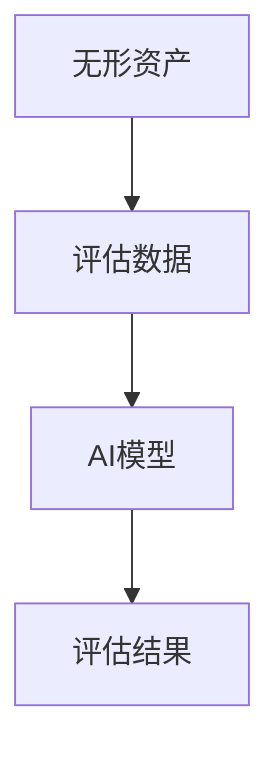
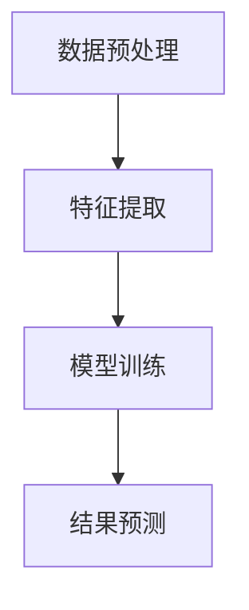
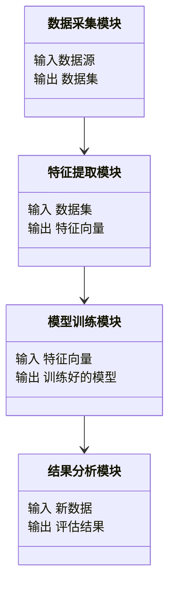
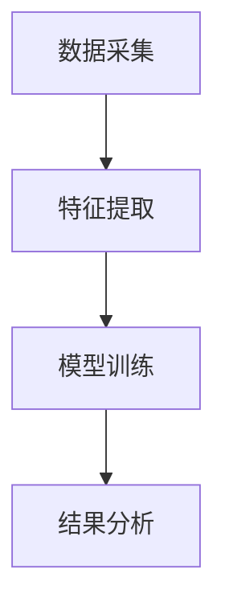
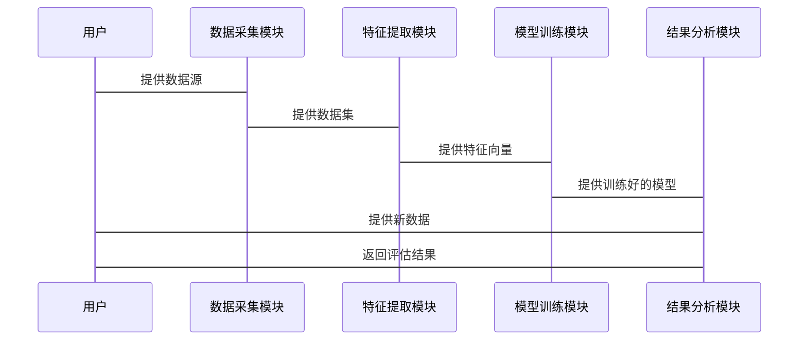

                 


# AI在企业无形资产评估中的应用与挑战

> 关键词：企业无形资产评估，人工智能，机器学习，深度学习，算法原理，系统架构

> 摘要：本文深入探讨了人工智能在企业无形资产评估中的应用与挑战。通过分析无形资产评估的传统方法及其局限性，结合人工智能技术的特点，提出了基于机器学习和深度学习的创新解决方案。文章详细阐述了AI技术在无形资产评估中的核心概念、算法原理、系统架构，并通过实际案例展示了AI技术的应用效果。同时，本文还探讨了AI技术在无形资产评估中的未来发展方向和潜在挑战。

---

# 第一部分: 企业无形资产评估的背景与挑战

## 第1章: 无形资产评估的背景与挑战

### 1.1 无形资产评估的背景

#### 1.1.1 无形资产的定义与分类
无形资产是指企业拥有或控制的，没有实物形态，但能够为企业创造价值的资源。常见的无形资产包括专利权、商标权、版权、商誉、客户关系、品牌价值等。无形资产在企业价值评估中占据重要地位，尤其是在科技驱动型企业和创新型行业中。

#### 1.1.2 无形资产评估的重要性与现状
企业无形资产评估的重要性体现在以下几个方面：
1. **企业价值评估**：无形资产是企业整体价值的重要组成部分，尤其是在高科技企业和创新型企业中。
2. **投资决策**：投资者在评估企业价值时，需要准确评估无形资产的价值。
3. **税务规划**：无形资产的价值直接影响企业的税务负担，如企业所得税、并购交易中的税务处理等。
4. **风险管理**：无形资产的价值波动可能影响企业的财务健康状况。

目前，传统的无形资产评估方法主要包括成本法、市场法和收益法。然而，这些方法在实践中存在以下局限性：
1. **数据依赖性**：传统方法通常依赖于历史数据和市场交易数据，但在数据不足的情况下难以准确评估。
2. **主观性**：评估过程中涉及大量主观判断，可能导致评估结果不准确。
3. **复杂性**：对于复杂的无形资产（如商誉），传统方法难以量化其价值。

#### 1.1.3 数字化转型对企业无形资产评估的影响
随着数字化转型的推进，企业无形资产的重要性进一步凸显。数字化转型不仅改变了企业的运营模式，还催生了新的无形资产类型，例如数据资产、数字品牌价值等。然而，数字化转型也带来了新的挑战，例如如何准确评估数据资产的价值、如何处理数据隐私和安全等问题。

### 1.2 AI技术在无形资产评估中的应用背景

#### 1.2.1 AI技术的基本概念与发展趋势
人工智能（AI）是指模拟人类智能的计算机系统，包括机器学习、自然语言处理、计算机视觉等技术。近年来，AI技术在各个领域的应用取得了显著进展，尤其是在数据处理和模式识别方面。

AI技术在无形资产评估中的应用前景广阔。通过AI技术，可以更准确地预测无形资产的价值，优化评估过程，并提高评估效率。

#### 1.2.2 无形资产评估中的传统方法与局限性
传统的无形资产评估方法主要包括以下几种：
1. **成本法**：基于无形资产的开发成本进行评估。
2. **市场法**：通过市场上的类似资产交易数据进行比较分析。
3. **收益法**：基于无形资产为企业带来的未来收益进行评估。

这些方法在实践中存在以下问题：
1. **数据不足**：在某些情况下，市场数据不足，导致评估结果不准确。
2. **主观性**：评估过程中涉及大量主观判断，可能导致结果偏差。
3. **复杂性**：对于复杂的无形资产（如商誉），传统方法难以量化其价值。

#### 1.2.3 AI技术如何解决传统评估中的问题
AI技术可以通过以下方式解决传统评估中的问题：
1. **数据驱动**：AI技术可以利用大数据分析，提取更多的特征信息，提高评估的准确性。
2. **自动化**：AI技术可以自动化处理数据，减少人为干预，提高评估效率。
3. **模型优化**：通过机器学习算法，可以构建更复杂的模型，更好地捕捉无形资产的价值驱动因素。

---

## 第2章: AI在企业无形资产评估中的核心概念与联系

### 2.1 核心概念原理

#### 2.1.1 无形资产评估的特征工程
特征工程是机器学习中的关键步骤，其目的是从原始数据中提取有用的特征，用于模型训练。在无形资产评估中，特征工程的关键在于如何将无形资产的特性转化为可量化的指标。

例如，对于专利权的评估，可以提取以下特征：
- **专利数量**：企业的专利申请数量。
- **专利类型**：发明专利、实用新型专利等。
- **专利领域**：专利所属的技术领域。
- **专利引用次数**：专利被引用的次数。

#### 2.1.2 AI模型在评估中的作用机制
AI模型在无形资产评估中的作用机制可以分为以下几个步骤：
1. **数据预处理**：对原始数据进行清洗和归一化处理。
2. **特征提取**：从数据中提取有用的特征。
3. **模型训练**：利用训练数据训练AI模型。
4. **结果预测**：利用模型对新数据进行预测。

#### 2.1.3 评估结果的可解释性与可靠性
AI模型的可解释性是评估结果可靠性的重要因素。在无形资产评估中，需要确保模型的预测结果能够被企业管理层理解和信任。为此，可以采用以下方法：
1. **特征重要性分析**：通过模型解释技术（如SHAP值）分析各个特征对预测结果的影响。
2. **模型验证**：通过交叉验证等方法验证模型的可靠性。

### 2.2 核心概念对比表格

| 评估方法 | 优点 | 缺点 |
|----------|------|------|
| 成本法 | 数据来源可靠 | 无法反映市场价值 |
| 市场法 | 结果更接近市场价值 | 数据不足时难以应用 |
| 收益法 | 考虑未来收益 | 需要假设未来现金流 |

### 2.3 实体关系图



---

## 第3章: 基于机器学习的无形资产评估算法

### 3.1 算法原理

#### 3.1.1 机器学习在无形资产评估中的应用
机器学习是一种人工智能技术，通过训练数据学习特征与目标变量之间的关系。在无形资产评估中，机器学习可以用于预测无形资产的价值。

#### 3.1.2 常见算法选择与优化
在无形资产评估中，常用的机器学习算法包括线性回归、随机森林、支持向量机（SVM）和神经网络等。选择算法时需要考虑以下因素：
1. **数据规模**：数据量大的情况下，可以选择随机森林或神经网络。
2. **特征复杂性**：特征复杂的情况下，可以选择神经网络。
3. **模型解释性**：需要模型解释性时，可以选择随机森林或线性回归。

#### 3.1.3 算法流程图



### 3.2 数学模型与公式

#### 3.2.1 特征重要性计算
随机森林模型可以通过特征重要性系数来评估各个特征对预测结果的影响。特征重要性系数的计算公式如下：

$$ \text{特征重要性} = \sum_{i=1}^{n} (f(i) \times w_i) $$

其中，$f(i)$表示特征$i$的重要性，$w_i$表示特征$i$的权重。

#### 3.2.2 模型评估公式
模型的准确率可以通过以下公式计算：

$$ \text{准确率} = \frac{\text{正确预测数}}{\text{总预测数}} $$

---

## 第4章: 深度学习在无形资产评估中的应用

### 4.1 深度学习模型的选择与优化

#### 4.1.1 神经网络结构设计
深度学习模型通常采用多层神经网络结构，例如卷积神经网络（CNN）和循环神经网络（RNN）。在无形资产评估中，可以根据具体的特征类型选择合适的网络结构。

例如，对于文本类型的无形资产（如专利文档），可以使用文本嵌入技术（如Word2Vec）将文本转换为向量，然后输入到神经网络中进行训练。

#### 4.1.2 深度学习模型的优化
深度学习模型的优化可以通过以下方法实现：
1. **参数调节**：调整学习率、批量大小等超参数。
2. **正则化**：使用L1/L2正则化防止过拟合。
3. **数据增强**：通过数据增强技术增加训练数据的多样性。

---

## 第5章: 系统分析与架构设计

### 5.1 问题场景介绍
本文设计了一个基于机器学习的无形资产评估系统，旨在利用AI技术提高评估的准确性和效率。

### 5.2 系统功能设计

#### 5.2.1 数据采集
系统需要采集以下数据：
- **资产信息**：包括资产类型、资产描述、资产年限等。
- **市场数据**：包括类似资产的交易数据、市场趋势等。
- **财务数据**：包括企业财务报表、收益数据等。

#### 5.2.2 特征提取
系统通过特征工程从原始数据中提取有用的特征，例如：
- **文本特征**：从专利文档中提取关键词、主题等。
- **数值特征**：从财务数据中提取收入、利润等。

#### 5.2.3 模型训练
系统通过机器学习算法对特征数据进行训练，生成评估模型。

#### 5.2.4 结果分析
系统利用训练好的模型对新数据进行预测，生成评估结果。

### 5.3 系统架构设计

#### 5.3.1 类图


#### 5.3.2 架构图


#### 5.3.3 序列图


---

## 第6章: 项目实战

### 6.1 环境安装与配置
本文基于Python语言实现，需要安装以下库：
- **numpy**
- **pandas**
- **scikit-learn**
- **xgboost**
- **mermaid**

安装命令如下：
```bash
pip install numpy pandas scikit-learn xgboost mermaid
```

### 6.2 系统核心实现源代码

#### 6.2.1 数据预处理代码
```python
import pandas as pd
from sklearn.model_selection import train_test_split
from sklearn.preprocessing import StandardScaler

# 读取数据
data = pd.read_csv('asset.csv')

# 分离特征与目标变量
X = data.drop('value', axis=1)
y = data['value']

# 数据标准化
scaler = StandardScaler()
X_scaled = scaler.fit_transform(X)

# 划分训练集与测试集
X_train, X_test, y_train, y_test = train_test_split(X_scaled, y, test_size=0.2, random_state=42)
```

#### 6.2.2 模型训练代码
```python
from sklearn.ensemble import RandomForestRegressor
from sklearn.metrics import mean_squared_error

# 初始化模型
model = RandomForestRegressor(n_estimators=100, random_state=42)

# 训练模型
model.fit(X_train, y_train)

# 预测结果
y_pred = model.predict(X_test)

# 计算准确率
mse = mean_squared_error(y_test, y_pred)
print(f'Mean Squared Error: {mse}')
```

---

## 第7章: 最佳实践与未来展望

### 7.1 最佳实践 tips
1. **数据预处理**：在数据预处理阶段，需要仔细清洗数据，确保数据的完整性和准确性。
2. **特征工程**：特征工程是机器学习的核心，需要根据具体场景设计合适的特征。
3. **模型调优**：通过交叉验证等方法优化模型参数，提高模型的准确率。

### 7.2 小结
本文通过分析企业无形资产评估的传统方法及其局限性，提出了基于机器学习的创新解决方案。通过实际案例展示了AI技术在无形资产评估中的应用效果，并探讨了未来的发展方向。

### 7.3 注意事项
1. **数据隐私**：在处理企业数据时，需要遵守相关法律法规，确保数据隐私。
2. **模型解释性**：需要确保模型的解释性，以便企业管理层能够理解和信任模型的预测结果。

### 7.4 拓展阅读
1. **《机器学习实战》**：通过实际案例学习机器学习技术。
2. **《深度学习》**：深入理解深度学习的原理与应用。

---

# 作者：AI天才研究院/AI Genius Institute & 禅与计算机程序设计艺术 /Zen And The Art of Computer Programming

