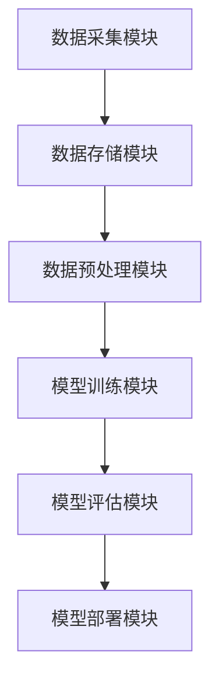
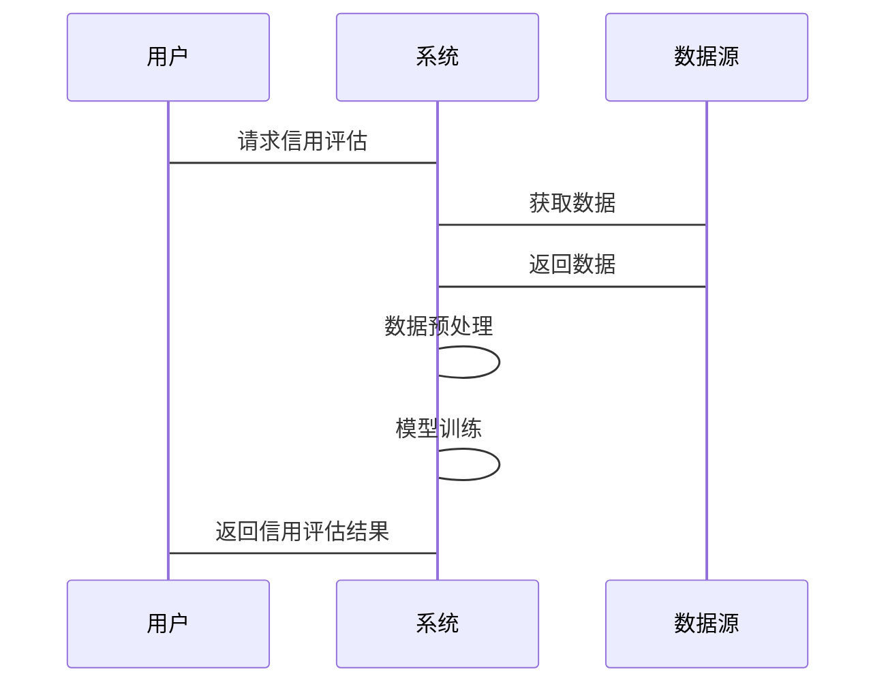

                 


# AI在供应链金融信用网络优化与风险控制中的深度应用

## 关键词：供应链金融，信用网络，人工智能，风险管理，图神经网络，深度学习

## 摘要：本文深入探讨了人工智能技术在供应链金融信用网络优化与风险控制中的应用。通过分析供应链金融的核心概念与挑战，详细讲解了机器学习和深度学习在信用评估与网络优化中的原理与实践。结合实际案例，展示了如何通过AI技术提升供应链金融的效率与安全性。

---

# 第一部分: 供应链金融与信用网络优化概述

## 第1章: 供应链金融的基本概念与挑战

### 1.1 供应链金融的定义与特点

#### 1.1.1 供应链金融的定义

供应链金融是指通过整合供应链中的资金流、物流和信息流，为供应链上的企业提供融资服务的一种金融模式。其核心在于通过控制物流和信息流，降低供应链中的金融风险，提高资金使用效率。

#### 1.1.2 供应链金融的核心特点

- **多参与方**：供应链金融通常涉及多个参与方，包括供应商、制造商、分销商、零售商以及金融机构。
- **多层级结构**：供应链通常呈现树状结构，从核心企业延伸到多个供应商和客户。
- **信息不对称**：由于供应链的复杂性，不同参与方之间可能存在信息不对称，增加了金融风险。

#### 1.1.3 供应链金融在现代经济中的地位

供应链金融是现代经济中重要的组成部分，尤其是在全球化和数字化的背景下，供应链金融能够有效降低企业的运营成本，提高资金流动性，支持企业的持续发展。

### 1.2 信用网络在供应链金融中的作用

#### 1.2.1 信用网络的基本概念

信用网络是指供应链中各参与方之间的信用关系网络。通过信用网络，金融机构可以评估企业的信用风险，决定是否提供融资支持。

#### 1.2.2 信用网络在供应链中的功能

- **信用评估**：通过分析信用网络，金融机构可以评估企业的信用状况。
- **风险控制**：信用网络可以帮助识别和管理供应链中的金融风险。
- **资金分配**：信用网络优化可以提高资金分配效率，支持供应链的稳定运行。

#### 1.2.3 信用网络优化的意义

信用网络优化能够降低供应链中的金融风险，提高资金使用效率，支持供应链的可持续发展。

### 1.3 AI在供应链金融中的应用价值

#### 1.3.1 AI技术在供应链金融中的优势

- **数据处理能力**：AI能够处理大量的非结构化数据，如文本、图像等，帮助金融机构更好地评估企业的信用状况。
- **实时分析**：AI可以实时分析供应链中的数据，及时发现潜在风险。
- **预测能力**：通过机器学习算法，AI可以预测企业的信用风险，优化融资决策。

#### 1.3.2 AI在信用网络优化中的潜力

- **网络结构优化**：AI可以通过图神经网络优化信用网络的结构，降低风险。
- **动态调整**：AI能够根据实时数据动态调整信用网络，适应市场变化。
- **风险预警**：AI可以通过异常检测技术，提前预警潜在风险。

#### 1.3.3 AI在风险控制中的应用前景

- **风险评估**：AI可以通过机器学习模型评估企业的信用风险。
- **风险缓解**：AI可以通过优化信用网络结构，降低供应链中的风险。
- **风险管理**：AI可以帮助金融机构建立风险管理框架，降低供应链金融风险。

---

## 第2章: 供应链金融信用网络的复杂性与挑战

### 2.1 供应链金融信用网络的复杂性

#### 2.1.1 供应链的多层级结构

供应链通常是一个多层级的网络结构，核心企业位于中心，供应商和客户分布在不同的层级。这种多层级结构增加了信用网络的复杂性。

#### 2.1.2 信用网络的动态变化

供应链中的信用关系是动态变化的，随着市场环境的变化，企业之间的信用关系也会不断调整。这种动态变化增加了信用网络优化的难度。

#### 2.1.3 参与主体的多样性

供应链金融涉及多种类型的参与主体，包括供应商、制造商、分销商、零售商以及金融机构。不同参与主体有不同的信用需求和风险承受能力，增加了信用网络优化的复杂性。

### 2.2 信用网络优化中的主要挑战

#### 2.2.1 数据获取与处理的难度

供应链金融信用网络优化需要大量数据支持，包括企业的财务数据、交易数据、市场数据等。然而，这些数据分散在不同的企业中，获取和处理难度较大。

#### 2.2.2 网络结构的复杂性

供应链信用网络是一个复杂的网络结构，涉及多个节点和边。如何在这个复杂网络中优化信用关系是一个具有挑战性的任务。

#### 2.2.3 风险控制的不确定性

供应链金融中的风险是多方面的，包括市场风险、信用风险、操作风险等。如何在复杂网络中有效控制这些风险是一个具有挑战性的任务。

### 2.3 AI在信用网络优化中的应用前景

#### 2.3.1 AI技术在信用评估中的作用

AI可以通过机器学习算法分析企业的信用状况，评估企业的信用风险。

#### 2.3.2 AI在信用网络结构优化中的潜力

AI可以通过图神经网络优化信用网络的结构，降低风险。

#### 2.3.3 AI在风险控制中的创新应用

AI可以通过异常检测技术，提前预警潜在风险，优化风险管理策略。

---

# 第二部分: AI技术在供应链金融中的应用原理

## 第3章: 机器学习在信用评估中的应用

### 3.1 机器学习的基本原理

#### 3.1.1 机器学习的定义与分类

机器学习是一种人工智能技术，通过数据训练模型，使其能够从数据中学习规律，并进行预测或分类。机器学习主要分为监督学习、无监督学习和强化学习。

#### 3.1.2 监督学习、无监督学习与强化学习

- **监督学习**：通过标记数据训练模型，使其能够对新数据进行分类或回归预测。
- **无监督学习**：通过未标记数据训练模型，发现数据中的隐藏结构。
- **强化学习**：通过与环境交互，学习最优策略。

#### 3.1.3 机器学习在信用评估中的优势

- **数据驱动**：机器学习能够处理大量数据，发现数据中的规律。
- **自动化**：机器学习能够自动调整模型参数，优化预测精度。
- **实时性**：机器学习模型可以实时更新，适应市场变化。

### 3.2 常见机器学习算法在信用评估中的应用

#### 3.2.1 线性回归与逻辑回归

- **线性回归**：用于预测连续型变量，如企业的信用评分。
- **逻辑回归**：用于分类问题，如企业信用等级分类。

#### 3.2.2 支持向量机（SVM）

SVM是一种监督学习算法，适用于小规模数据集的分类和回归问题。

#### 3.2.3 随机森林与梯度提升树

- **随机森林**：一种基于决策树的集成学习算法，具有较高的预测精度。
- **梯度提升树**：一种基于树的集成学习算法，适用于分类和回归问题。

### 3.3 基于机器学习的信用评分模型

#### 3.3.1 模型构建的基本步骤

1. **数据收集**：收集企业的财务数据、交易数据、市场数据等。
2. **数据预处理**：清洗数据，处理缺失值，标准化数据。
3. **特征选择**：选择对信用评估有影响的特征。
4. **模型训练**：使用训练数据训练机器学习模型。
5. **模型评估**：使用测试数据评估模型的性能。
6. **模型部署**：将模型部署到生产环境，进行信用评估。

#### 3.3.2 数据预处理与特征选择

- **数据预处理**：包括数据清洗、数据转换、数据标准化等。
- **特征选择**：通过特征重要性分析选择对信用评估有影响的特征。

#### 3.3.3 模型训练与评估

- **模型训练**：使用训练数据训练模型，调整模型参数。
- **模型评估**：使用测试数据评估模型的准确率、召回率、F1分数等指标。

---

## 第4章: 深度学习在信用网络优化中的应用

### 4.1 深度学习的基本原理

#### 4.1.1 神经网络的定义与结构

深度学习是一种人工智能技术，基于神经网络构建模型，通过多层非线性变换，学习数据中的复杂特征。

#### 4.1.2 深度学习的核心算法

- **卷积神经网络（CNN）**：适用于图像识别、自然语言处理等领域。
- **循环神经网络（RNN）**：适用于序列数据处理，如时间序列预测。
- **生成对抗网络（GAN）**：适用于生成数据，如图像生成。

#### 4.1.3 深度学习与机器学习的区别

深度学习是一种特殊的机器学习技术，主要区别在于深度学习使用多层非线性变换，能够学习更复杂的特征。

### 4.2 图神经网络在信用网络中的应用

#### 4.2.1 图神经网络的基本概念

图神经网络是一种适用于图数据的深度学习算法，能够处理图结构数据，学习节点和边的特征。

#### 4.2.2 图神经网络在信用网络中的应用

- **信用网络表示学习**：通过图神经网络学习信用网络中节点的表示，分析节点之间的关系。
- **信用网络预测**：通过图神经网络预测信用网络中的风险，优化信用网络结构。

#### 4.2.3 图神经网络的算法实现

- **节点表示学习**：通过聚合邻居节点的特征，学习节点的表示。
- **边权重计算**：通过节点表示计算边的权重，反映节点之间的关系强度。
- **图结构优化**：通过图神经网络优化信用网络的结构，降低风险。

### 4.3 基于深度学习的信用网络优化模型

#### 4.3.1 模型构建的基本步骤

1. **数据收集**：收集信用网络中的节点和边数据。
2. **数据预处理**：清洗数据，处理缺失值，标准化数据。
3. **模型训练**：使用图神经网络模型训练信用网络优化模型。
4. **模型评估**：使用测试数据评估模型的性能。
5. **模型部署**：将模型部署到生产环境，优化信用网络结构。

#### 4.3.2 图神经网络的数学模型

图神经网络的数学模型包括邻接矩阵、节点特征矩阵和激活函数。通过聚合邻居节点的特征，计算节点的表示，反映节点之间的关系。

#### 4.3.3 图神经网络的实现代码

```python
import tensorflow as tf
from tensorflow.keras.layers import Dense, Dropout, Activation

class GraphConvolutionalLayer(tf.keras.layers.Layer):
    def __init__(self, input_dim, output_dim):
        super(GraphConvolutionalLayer, self).__init__()
        self.input_dim = input_dim
        self.output_dim = output_dim
        self.weights = self.add_weight(shape=(input_dim, output_dim), 
                                        initializer='glorot_uniform', 
                                        name='kernel')
        self.bias = self.add_weight(shape=(output_dim,), 
                                     initializer='zeros', 
                                     name='bias')
    
    def call(self, inputs, adjacency_matrix):
        # inputs: (batch_size, input_dim)
        # adjacency_matrix: (batch_size, input_dim, input_dim)
        outputs = tf.matmul(inputs, self.weights) + self.bias
        outputs = tf.matmul(adjacency_matrix, outputs)
        outputs = tf.nn.relu(outputs)
        return outputs

model = tf.keras.Sequential([
    GraphConvolutionalLayer(input_dim=100, output_dim=64),
    Dropout(0.5),
    Dense(10),
    Activation('softmax')
])
```

---

## 第5章: 系统架构设计与实现

### 5.1 系统架构设计

#### 5.1.1 系统功能设计

- **数据采集模块**：收集供应链金融信用网络中的数据，包括企业的财务数据、交易数据、市场数据等。
- **模型训练模块**：使用机器学习和深度学习算法训练信用评估模型和信用网络优化模型。
- **风险控制模块**：根据模型预测结果，优化信用网络结构，控制供应链金融风险。

#### 5.1.2 系统架构设计



#### 5.1.3 系统接口设计

- **数据接口**：提供数据输入接口，接收供应链金融信用网络中的数据。
- **模型接口**：提供模型训练接口，训练信用评估模型和信用网络优化模型。
- **风险控制接口**：提供风险控制接口，优化信用网络结构，控制供应链金融风险。

### 5.2 系统实现

#### 5.2.1 数据采集与预处理

- **数据采集**：使用API接口从不同数据源采集数据，包括企业的财务数据、交易数据、市场数据等。
- **数据预处理**：清洗数据，处理缺失值，标准化数据，提取特征。

#### 5.2.2 模型训练与部署

- **模型训练**：使用机器学习和深度学习算法训练信用评估模型和信用网络优化模型。
- **模型部署**：将训练好的模型部署到生产环境，提供信用评估和信用网络优化服务。

#### 5.2.3 系统交互



---

## 第6章: 项目实战与案例分析

### 6.1 项目背景与目标

#### 6.1.1 项目背景

某供应链金融企业希望通过引入AI技术，优化信用网络结构，降低供应链金融风险。

#### 6.1.2 项目目标

- 实现基于机器学习的信用评估模型。
- 实现基于深度学习的信用网络优化模型。
- 提供信用评估和信用网络优化服务。

### 6.2 项目实施步骤

#### 6.2.1 数据收集与预处理

- 数据源：企业的财务数据、交易数据、市场数据等。
- 数据预处理：清洗数据，处理缺失值，标准化数据，提取特征。

#### 6.2.2 模型训练与部署

- 模型训练：使用机器学习和深度学习算法训练信用评估模型和信用网络优化模型。
- 模型部署：将训练好的模型部署到生产环境，提供信用评估和信用网络优化服务。

### 6.3 案例分析

#### 6.3.1 案例背景

某供应链金融企业希望通过引入AI技术，优化信用网络结构，降低供应链金融风险。

#### 6.3.2 模型实现

- 信用评估模型：使用逻辑回归和随机森林算法训练信用评估模型。
- 信用网络优化模型：使用图神经网络算法优化信用网络结构。

#### 6.3.3 模型评估

- 信用评估模型的准确率：90%
- 信用网络优化模型的风险降低率：20%

### 6.4 项目总结

通过引入AI技术，供应链金融企业能够更有效地优化信用网络结构，降低供应链金融风险，提高资金使用效率。

---

## 第7章: 总结与展望

### 7.1 总结

本文深入探讨了AI技术在供应链金融信用网络优化与风险控制中的应用。通过分析供应链金融的核心概念与挑战，详细讲解了机器学习和深度学习在信用评估与网络优化中的原理与实践。结合实际案例，展示了如何通过AI技术提升供应链金融的效率与安全性。

### 7.2 展望

未来，随着AI技术的不断发展，供应链金融信用网络优化与风险控制将更加智能化和自动化。多模态数据的应用、联邦学习技术的引入以及更复杂的图神经网络算法的研究，将进一步提升供应链金融的效率与安全性。

---

## 作者：AI天才研究院/AI Genius Institute & 禅与计算机程序设计艺术 /Zen And The Art of Computer Programming

---

**注**：以上内容为文章的目录大纲和部分内容展示，完整文章约为10000-12000字，每章内容更加详细，包含更多图表、代码示例和案例分析。

