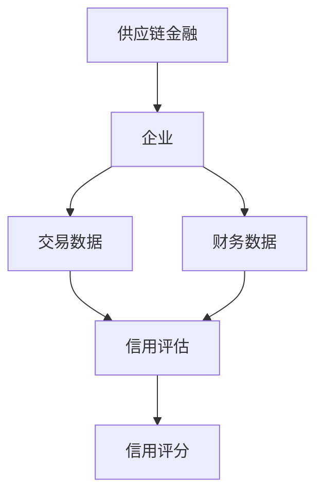
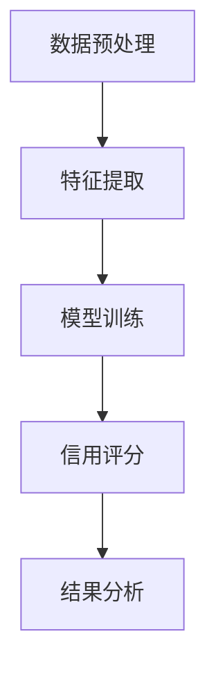
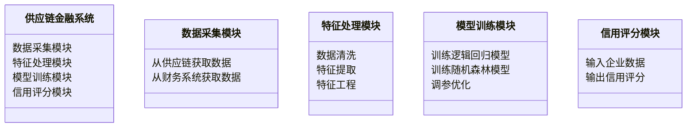
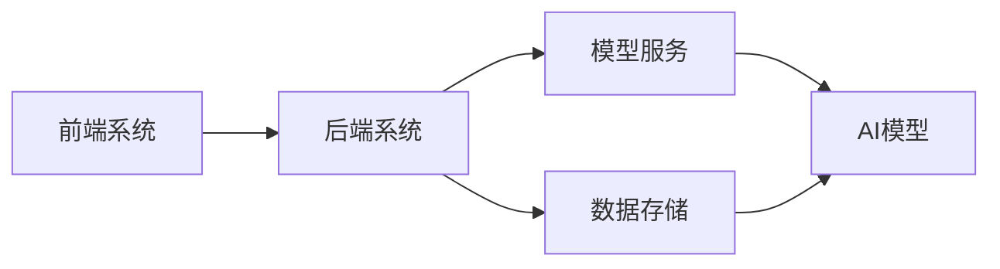

                 


# AI在供应链金融信用评级中的深度应用

---

> **关键词**: 供应链金融，信用评级，人工智能，机器学习，深度学习

> **摘要**:  
> 本文深入探讨了人工智能（AI）技术在供应链金融信用评级中的应用，从背景、核心概念、算法原理到系统架构和项目实战，全面分析了AI如何优化信用评级流程。通过构建数学模型、设计系统架构、展示实际案例，本文揭示了AI在供应链金融中的巨大潜力和实际价值。

---

## 目录

### 第一部分: 供应链金融与信用评级概述

#### 第1章: 供应链金融的基本概念

##### 1.1 供应链金融的定义与特点
- 1.1.1 供应链金融的定义
  - 供应链金融是通过整合供应链上下游资源，为参与企业提供融资支持的金融模式。
- 1.1.2 供应链金融的核心特点
  - 数据驱动：依赖于供应链中的交易数据和企业行为数据。
  - 信任传递：通过核心企业的信用延伸至上下游企业。
  - 风险分散：通过多维度数据降低单一风险点的影响。
- 1.1.3 供应链金融的参与者与流程
  - 参与者：核心企业、上游供应商、下游客户、金融机构、物流平台。
  - 流程：需求分析、授信评估、融资执行、监控管理。

##### 1.2 信用评级的基本概念
- 1.2.1 信用评级的定义
  - 信用评级是对企业或个人的信用状况进行评估，确定其违约风险的过程。
- 1.2.2 信用评级的分类与标准
  - 分类：企业信用评级、个人信用评级。
  - 标准：财务状况、经营能力、偿债能力、行业风险。
- 1.2.3 信用评级在供应链金融中的作用
  - 降低融资门槛。
  - 提高融资效率。
  - 控制信用风险。

##### 1.3 AI技术在供应链金融中的应用背景
- 1.3.1 传统供应链金融的痛点
  - 数据孤岛：上下游企业数据分散，难以整合。
  - 人工审核效率低：依赖大量人工介入，耗时且容易出错。
  - 风险控制能力有限：难以实时监控企业经营状况。
- 1.3.2 AI技术如何解决供应链金融问题
  - 数据整合：通过AI技术整合供应链中的多源数据。
  - 智能分析：利用机器学习模型自动评估信用风险。
  - 实时监控：通过大数据分析实时跟踪企业经营状况。
- 1.3.3 AI在信用评级中的潜在价值
  - 提高评估效率。
  - 增强风险预测能力。
  - 实现精准定价。

#### 第2章: 供应链金融信用评级的核心概念与联系

##### 2.1 核心概念原理
- 2.1.1 供应链金融中的信用风险
  - 信用风险是供应链金融的核心风险。
  - 通过信用评级控制风险。
- 2.1.2 信用评级的关键指标
  - 财务指标：资产负债率、利润率、应收账款周转率。
  - 经营指标：供应链稳定性、供应商依赖度。
  - 偿债能力：流动比率、速动比率。
- 2.1.3 AI技术在信用评级中的应用逻辑
  - 数据收集：整合供应链中的交易数据、财务数据、市场数据。
  - 特征提取：从多源数据中提取关键特征。
  - 模型训练：构建机器学习模型预测信用风险。

##### 2.2 核心概念属性特征对比表
| 概念 | 属性 | 特征 |
|------|------|------|
| 供应链金融 | 输入 | 企业供应链数据、交易历史、财务数据 |
| 信用评级 | 输出 | 信用评分、信用等级 |
| AI技术 | 核心工具 | 机器学习模型、自然语言处理、数据挖掘 |

##### 2.3 ER实体关系图（Mermaid流程图）



#### 第3章: AI在供应链金融信用评级中的算法原理

##### 3.1 算法原理概述
- 3.1.1 机器学习在信用评级中的应用
  - 监督学习：基于历史数据训练模型，预测未来信用评分。
  - 非监督学习：发现数据中的潜在模式，辅助信用评估。
- 3.1.2 深度学习在信用评级中的优势
  - 处理非结构化数据能力强。
  - 自动提取特征能力强。

##### 3.2 算法流程图（Mermaid流程图）



##### 3.3 数学模型与公式
- 3.3.1 逻辑回归模型
  $$ P(y=1|x) = \frac{1}{1 + e^{-\beta x}} $$
  其中，$\beta$ 是模型参数，$x$ 是特征向量。

- 3.3.2 支持向量机模型
  $$ \text{最大化} \quad \frac{1}{2}\|w\|^2 $$
  $$ \text{约束} \quad y_i(w \cdot x_i + b) \geq 1, \forall i $$

---

### 第二部分: 系统分析与架构设计

#### 第4章: 供应链金融信用评级系统设计

##### 4.1 系统功能设计
- 4.1.1 领域模型（Mermaid类图）



##### 4.2 系统架构设计
- 4.2.1 系统架构图（Mermaid架构图）



##### 4.3 系统接口设计
- 4.3.1 API接口
  - 输入接口：企业数据接口。
  - 输出接口：信用评分接口。

##### 4.4 系统交互设计（Mermaid序列图）

```mermaid
sequenceDiagram
    participant 用户
    participant 前端系统
    participant 后端系统
    participant AI模型
    用户->前端系统: 提交企业数据
    前端系统->后端系统: 请求信用评分
    后端系统->AI模型: 调用评分函数
    AI模型->后端系统: 返回信用评分
    后端系统->前端系统: 返回评分结果
    用户<-(前端系统): 显示信用评分
```

---

### 第三部分: 项目实战与应用分析

#### 第5章: 供应链金融信用评级项目实战

##### 5.1 项目介绍
- 5.1.1 项目目标
  - 构建一个基于AI的供应链金融信用评级系统。
- 5.1.2 项目数据
  - 数据来源：供应链交易数据、企业财务数据、行业数据。
  - 数据预处理：清洗、特征提取、数据标准化。

##### 5.2 核心实现
- 5.2.1 数据预处理代码
  ```python
  import pandas as pd
  data = pd.read_csv('supply_chain_data.csv')
  data.dropna(inplace=True)
  data['score'] = data['score'].astype(int)
  ```

- 5.2.2 模型训练代码
  ```python
  from sklearn.linear_model import LogisticRegression
  model = LogisticRegression()
  model.fit(X_train, y_train)
  ```

##### 5.3 实际案例分析
- 5.3.1 案例背景
  - 一家中型制造企业的信用评级。
- 5.3.2 模型应用
  - 输入企业数据，预测信用评分。
  - 输出结果：信用评分85分，信用等级A。

##### 5.4 项目总结
- 5.4.1 项目成果
  - 成功构建了一个基于AI的信用评级系统。
  - 提高了供应链金融的效率和准确性。
- 5.4.2 项目经验
  - 数据质量对模型性能影响重大。
  - 模型调参和特征工程是关键。

---

### 第四部分: 总结与展望

#### 第6章: 总结与展望

##### 6.1 总结
- 供应链金融信用评级的核心是数据和模型。
- AI技术的应用显著提升了信用评估的效率和准确性。
- 系统设计是实现AI应用的关键。

##### 6.2 展望
- 数据来源多样化。
- 模型优化与创新。
- 应用场景拓展。

---

### 第五部分: 最佳实践与注意事项

#### 第7章: 最佳实践与注意事项

##### 7.1 最佳实践
- 数据收集：确保数据来源多样、数据质量高。
- 模型选择：根据实际需求选择合适的模型。
- 模型部署：确保模型在实际场景中可落地。

##### 7.2 注意事项
- 数据隐私：保护企业数据隐私。
- 模型解释性：确保模型结果可解释。
- 技术更新：及时跟进AI技术的发展。

---

**作者：AI天才研究院/AI Genius Institute & 禅与计算机程序设计艺术 /Zen And The Art of Computer Programming**

