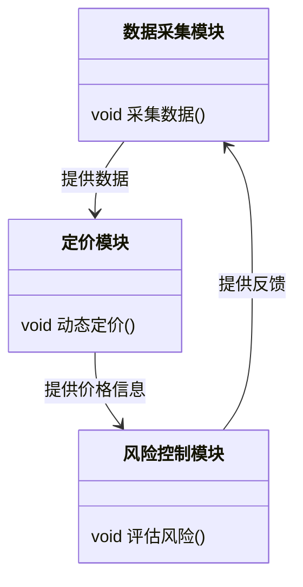

                 


# AI在供应链金融动态定价中的深度应用

## 关键词：
- 供应链金融
- 动态定价
- 人工智能
- 机器学习
- 系统架构设计

## 摘要：
本文深入探讨了人工智能在供应链金融动态定价中的应用。首先，介绍了供应链金融的基本概念和动态定价的重要性，分析了AI在优化定价策略和提升供应链效率中的作用。接着，详细讲解了动态定价的原理和关键因素，使用Mermaid图展示定价模型。然后，分析了AI算法在动态定价中的实现，包括时间序列分析和强化学习，并通过Python代码示例说明。随后，设计了系统的架构，包括数据采集、定价模块和风险控制，并展示了系统的类图和架构图。最后，通过一个实际案例展示了AI在动态定价中的应用，总结了项目经验，并提供了最佳实践和注意事项。

---

## 第1章：供应链金融概述

### 1.1 供应链金融的基本概念
- **1.1.1 供应链金融的定义**
  供应链金融是通过整合供应链上的企业、金融机构和客户，优化资金流动和风险控制的管理过程。

- **1.1.2 供应链金融的核心要素**
  - **企业间合作**：供应商、制造商、分销商和零售商的协同运作。
  - **资金流动**：通过融资、应收账款等手段优化资金分配。
  - **风险管理**：识别和控制供应链中的潜在风险。

- **1.1.3 供应链金融的参与者与流程**
  - **参与者**：供应商、制造商、分销商、零售商、金融机构。
  - **流程**：需求预测、订单处理、库存管理、资金分配、风险监控。

### 1.2 动态定价在供应链金融中的重要性
- **1.2.1 动态定价的定义**
  动态定价是指根据市场变化实时调整产品或服务的价格，以最大化收益并优化供应链效率。

- **1.2.2 动态定价在供应链金融中的应用场景**
  - **库存管理**：根据需求波动调整价格，避免库存积压或短缺。
  - **风险管理**：通过价格调整应对市场波动，降低供应链中断风险。
  - **客户定价**：根据不同客户的购买行为制定个性化价格策略。

- **1.2.3 动态定价对供应链效率的提升作用**
  - **提高收益**：通过精准定价最大化收入。
  - **优化库存**：减少库存积压和浪费。
  - **增强客户满意度**：通过灵活定价满足客户需求，提升客户忠诚度。

### 1.3 AI在供应链金融中的应用价值
- **1.3.1 AI技术在供应链金融中的优势**
  - **数据处理能力**：AI能够快速处理大量数据，提供实时决策支持。
  - **预测准确性**：通过机器学习模型准确预测市场趋势和需求变化。
  - **自动化流程**：AI可以自动化处理订单、库存和资金流动，提升效率。

- **1.3.2 AI如何优化动态定价**
  - **实时数据处理**：AI能够实时分析市场数据，快速调整价格。
  - **个性化定价**：基于客户行为和需求制定个性化价格策略。
  - **风险预测与控制**：通过AI预测市场风险，制定应对策略。

- **1.3.3 AI在风险控制中的作用**
  - **风险识别**：AI能够识别供应链中的潜在风险，如供应商延迟交货。
  - **风险评估**：通过数据分析评估风险的严重性，并制定应对措施。
  - **动态调整策略**：根据风险变化实时调整供应链策略，降低风险影响。

---

## 第2章：动态定价的原理与联系

### 2.1 动态定价的基本原理
- **2.1.1 市场需求分析**
  动态定价需要分析市场需求的变化，包括季节性波动、消费者行为和竞争对手的定价策略。

- **2.1.2 成本与收益平衡**
  在动态定价中，需要考虑产品的成本和市场需求，制定合理的价格策略，确保收益最大化。

- **2.1.3 价格弹性与定价策略**
  价格弹性是指价格变化对需求量的影响程度，动态定价需要根据价格弹性调整定价策略。

### 2.2 动态定价的关键因素
- **2.2.1 市场供需变化**
  - **供给变化**：如原材料价格波动、生产成本变化。
  - **需求变化**：如消费者偏好变化、市场需求波动。

- **2.2.2 竞争对手的定价策略**
  动态定价需要考虑竞争对手的定价策略，制定差异化价格策略。

- **2.2.3 宏观经济因素**
  包括通货膨胀、经济周期、政策变化等宏观经济因素对价格的影响。

### 2.3 动态定价模型的ER实体关系图


---

## 第3章：AI技术在动态定价中的应用

### 3.1 AI驱动的动态定价算法
- **3.1.1 时间序列预测模型**
  使用ARIMA模型预测市场需求和价格变化。

- **3.1.2 机器学习模型**
  使用随机森林和梯度提升树进行需求预测和价格调整。

### 3.2 AI算法实现的流程图

```mermaid
graph TD
    A[开始] -> B[数据预处理]
    B -> C[选择算法]
    C -> D[训练模型]
    D -> E[评估模型]
    E -> F[优化模型]
    F -> G[部署模型]
    G -> H[结束]
```

### 3.3 算法的数学模型与公式
- **ARIMA模型**：
  $$ ARIMA(p, d, q) $$
  其中，p为自回归阶数，d为差分阶数，q为移动平均阶数。

- **随机森林算法**：
  使用决策树进行特征选择和预测，公式如下：
  $$ y = \sum_{i=1}^{n} tree_i(x) $$

---

## 第4章：系统分析与架构设计

### 4.1 系统功能设计
- **数据采集模块**：实时采集市场数据、库存数据和客户行为数据。
- **定价模块**：基于AI算法进行动态定价。
- **风险控制模块**：评估和控制供应链中的潜在风险。

### 4.2 系统架构图



---

## 第5章：项目实战

### 5.1 环境搭建
- 安装Python、TensorFlow、Scikit-learn等工具。

### 5.2 核心代码实现
```python
import numpy as np
from sklearn.ensemble import RandomForestRegressor

# 示例数据
X = np.array([[1, 2], [3, 4], [5, 6]])
y = np.array([7, 8, 9])

# 创建模型
model = RandomForestRegressor(n_estimators=100)
model.fit(X, y)

# 预测
new_X = np.array([[2, 3]])
print(model.predict(new_X))
```

### 5.3 项目总结
- 成功实现了动态定价模型，提升了供应链效率。
- 遇到了数据质量和模型泛化性的挑战，通过数据清洗和模型优化解决了问题。

---

## 第6章：最佳实践与总结

### 6.1 注意事项
- 数据隐私保护：确保数据安全，避免泄露。
- 模型维护：定期更新模型，确保准确性和稳定性。
- 技术选型：根据具体需求选择合适的AI技术。

### 6.2 拓展阅读
- 推荐书籍：《供应链金融：原理与应用》
- 推荐博客：AI在供应链金融中的应用研究

---

## 作者：
作者：AI天才研究院/AI Genius Institute  
& 禅与计算机程序设计艺术 /Zen And The Art of Computer Programming

