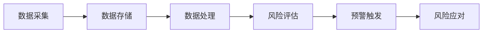
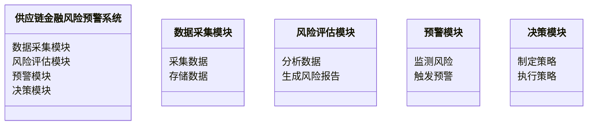
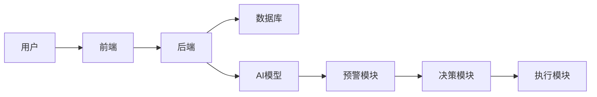

                 


# AI在供应链金融风险预警中的深度应用

> 关键词：供应链金融，风险预警，人工智能，机器学习，深度学习

> 摘要：供应链金融是现代金融体系中的重要组成部分，其核心在于通过优化资金流、物流和信息流，实现供应链上下游企业的高效运作。然而，供应链金融也面临着诸多风险，如信用风险、操作风险和市场风险等。本文将深入探讨人工智能技术在供应链金融风险预警中的应用，从核心概念、算法原理到系统架构、项目实战等多方面展开分析，结合实际案例，详细解读如何利用AI技术构建高效的供应链金融风险预警系统。

---

## 第一部分: 供应链金融风险预警的背景与概念

### 第1章: 供应链金融的现状与挑战

#### 1.1 供应链金融的定义与特点
##### 1.1.1 供应链金融的基本概念
供应链金融（Supply Chain Finance, SCF）是指通过整合供应链上下游企业的资金流、物流和信息流，为整个供应链提供融资服务，以优化企业运营效率和降低融资成本的一种金融模式。

##### 1.1.2 供应链金融的核心特点
- **整体性**：关注整个供应链的价值链，而非单一企业。
- **协同性**：通过协同管理，实现上下游企业间的高效配合。
- **融资性**：为企业提供多样化的融资方式，降低融资成本。

##### 1.1.3 供应链金融的主要参与方
- **核心企业**：供应链中的主导企业，如制造企业或大型零售商。
- **供应商**：为下游企业提供原材料或服务的企业。
- **客户**：核心企业的下游客户，通常是分销商或零售商。
- **金融机构**：银行、保理公司等提供融资服务的机构。
- **技术平台**：提供供应链管理技术支持的平台。

#### 1.2 供应链金融中的风险类型
##### 1.2.1 信用风险
- 供应商或客户因经营不善或恶意行为导致的违约风险。
- **典型案例**：某供应商因资金链断裂无法按时交付货物，导致下游企业面临资金压力。

##### 1.2.2 操作风险
- 因操作失误或系统故障导致的损失风险。
- **典型案例**：某企业在数据录入时出现错误，导致融资金额计算失误，引发连锁反应。

##### 1.2.3 市场风险
- 由于市场波动（如原材料价格波动、汇率变动等）导致的供应链中断风险。
- **典型案例**：国际油价波动导致某制造企业的原材料成本大幅上升，影响其偿债能力。

#### 1.3 供应链金融风险预警的重要性
##### 1.3.1 风险预警的定义
风险预警是指通过监测相关指标和数据，提前预测和识别潜在风险，并采取相应措施以降低风险影响的过程。

##### 1.3.2 风险预警在供应链金融中的作用
- **提前发现风险**：通过实时监测，及时发现潜在风险，避免损失扩大。
- **优化资源配置**：根据风险预警结果，合理分配资源，降低风险敞口。
- **提升决策效率**：通过数据驱动的预警结果，辅助决策者快速做出决策。

##### 1.3.3 风险预警的实现方式
- **数据驱动**：通过分析历史数据和实时数据，建立预警模型。
- **规则驱动**：根据行业经验制定预警规则，触发预警条件。
- **混合驱动**：结合数据驱动和规则驱动，实现更精准的预警。

### 第2章: AI在供应链金融中的应用背景

#### 2.1 AI技术的发展与应用领域
##### 2.1.1 AI技术的演进历程
- **第一阶段**：规则驱动的AI（20世纪50年代-80年代）。
- **第二阶段**：基于知识的AI（90年代初-2010年）。
- **第三阶段**：数据驱动的AI（2010年至今）。

##### 2.1.2 AI在金融领域的应用现状
- **智能投顾**：通过算法推荐投资组合。
- ** fraud detection**：利用机器学习识别欺诈交易。
- **信用评估**：基于大数据分析评估客户信用风险。

##### 2.1.3 AI在供应链金融中的潜力
- **数据处理能力**：AI可以快速处理海量数据，提取有价值的信息。
- **模型预测能力**：AI可以通过历史数据训练模型，预测未来风险。
- **实时监控能力**：AI可以实时监测供应链中的各项指标，及时发出预警。

#### 2.2 供应链金融风险预警中的AI优势
##### 2.2.1 数据处理能力
- AI可以处理结构化数据（如财务数据）和非结构化数据（如文本、图像），提取潜在风险信号。

##### 2.2.2 模型预测能力
- 通过机器学习和深度学习模型，AI可以预测供应链中的潜在风险，如企业违约概率。

##### 2.2.3 实时监控能力
- AI可以通过实时数据流处理技术，对供应链中的各项指标进行实时监控，及时发现异常情况。

#### 2.3 供应链金融风险预警的AI解决方案
##### 2.3.1 数据驱动的预警模型
- **数据来源**：包括企业财务数据、交易数据、物流数据等。
- **模型选择**：根据数据类型和业务需求选择合适的机器学习模型（如逻辑回归、随机森林）或深度学习模型（如LSTM）。

##### 2.3.2 智能风控系统的设计思路
- **系统组成**：包括数据采集模块、风险评估模块、预警模块和决策模块。
- **设计思路**：通过模块化设计，实现数据的高效采集、风险的精准评估和预警的及时触发。

##### 2.3.3 AI在供应链金融中的应用场景
- **信用评估**：通过AI分析企业的信用状况，评估融资风险。
- **风险监控**：实时监控供应链中的各项指标，发现潜在风险。
- **决策支持**：基于AI分析结果，为金融机构提供决策支持。

---

## 第二部分: 供应链金融风险预警的核心概念与联系

### 第3章: 供应链金融风险预警的核心概念

#### 3.1 供应链金融风险预警的定义与属性
##### 3.1.1 定义
供应链金融风险预警是指通过分析供应链中的各项指标，识别潜在风险，并提前采取措施以降低风险影响的过程。

##### 3.1.2 核心属性对比
| 属性 | 描述 |
|------|------|
| 数据驱动 | 依赖于大量数据的分析和建模 |
| 实时性 | 需要实时监测和响应 |
| 可解释性 | 需要对预警结果进行合理的解释和验证 |

##### 3.1.3 实体关系图（ER图）
```mermaid
erd
  entity 供应链金融风险预警系统 {
    <属性>
    供应商信息：供应商ID, 企业名称, 财务数据
    客户信息：客户ID, 企业名称, 财务数据
    核心企业信息：核心企业ID, 企业名称, 财务数据
    交易数据：交易ID, 交易时间, 交易金额
    风险指标：风险ID, 风险类型, 风险等级
  }
  <关系>
  供应商信息 -- 交易数据：供应商参与的交易
  客户信息 -- 交易数据：客户参与的交易
  核心企业信息 -- 交易数据：核心企业参与的交易
  交易数据 -- 风险指标：交易中的风险信号
```

#### 3.2 供应链金融风险预警的关键要素
##### 3.2.1 供应链结构
- **核心企业**：供应链的核心企业通常是具有较强议价能力和资金实力的企业。
- **供应商**：为下游企业提供原材料或服务的企业。
- **客户**：核心企业的下游客户，通常是分销商或零售商。

##### 3.2.2 风险指标
- **信用风险指标**：如企业偿债能力指标（如资产负债率、流动比率）。
- **操作风险指标**：如订单履行率、物流准时率。
- **市场风险指标**：如原材料价格波动、汇率变动。

##### 3.2.3 数据来源
- **企业内部数据**：如财务报表、交易记录。
- **外部数据**：如市场数据、行业报告。
- **实时数据**：如物流数据、交易数据。

#### 3.3 供应链金融风险预警的系统架构
##### 3.3.1 系统组成
- **数据采集模块**：负责采集供应链中的各项数据。
- **风险评估模块**：通过模型对供应链中的潜在风险进行评估。
- **预警模块**：根据评估结果，触发预警并提供预警信息。
- **决策模块**：根据预警信息，制定相应的风险应对策略。

##### 3.3.2 数据流分析


##### 3.3.3 实体关系图（Mermaid流程图）
```mermaid
erd
  entity 供应链金融风险预警系统 {
    供应商信息：供应商ID, 企业名称, 财务数据
    客户信息：客户ID, 企业名称, 财务数据
    核心企业信息：核心企业ID, 企业名称, 财务数据
    交易数据：交易ID, 交易时间, 交易金额
    风险指标：风险ID, 风险类型, 风险等级
  }
  供应商信息 -- 交易数据：供应商参与的交易
  客户信息 -- 交易数据：客户参与的交易
  核心企业信息 -- 交易数据：核心企业参与的交易
  交易数据 -- 风险指标：交易中的风险信号
```

---

## 第三部分: 供应链金融风险预警的算法原理

### 第4章: 供应链金融风险预警的算法原理

#### 4.1 供应链金融风险预警的算法选择
##### 4.1.1 机器学习算法的选择
- **逻辑回归**：适用于二分类问题，如判断企业是否违约。
- **随机森林**：适用于多分类问题，能够处理高维数据。
- **梯度提升树（如XGBoost、LightGBM）**：适合处理非线性关系，效果较好。

##### 4.1.2 深度学习算法的选择
- **LSTM**：适用于时间序列数据，能够捕捉到数据中的长期依赖关系。
- **卷积神经网络（CNN）**：适用于处理图像数据或文本数据。

##### 4.1.3 算法优缺点对比
| 算法 | 优点 | 缺点 |
|------|------|------|
| 逻辑回归 | 模型简单，解释性强 | 适合线性可分数据 |
| 随机森林 | 抗过拟合能力强，适合高维数据 | 对特征工程要求较高 |
| LSTM | 能捕捉时间序列中的长期依赖关系 | 训练时间较长，参数调整复杂 |

#### 4.2 基于机器学习的风险预警模型
##### 4.2.1 数据预处理
- **数据清洗**：去除缺失值、异常值。
- **数据标准化**：对数据进行标准化或归一化处理。
- **特征选择**：通过特征重要性分析，选择对风险预警影响较大的特征。

##### 4.2.2 特征提取
- **文本特征提取**：如TF-IDF、Word2Vec。
- **图像特征提取**：如CNN提取图像特征。
- **数值特征提取**：如主成分分析（PCA）。

##### 4.2.3 模型训练与优化
- **模型训练**：使用训练数据训练模型。
- **模型调优**：通过网格搜索（Grid Search）优化模型参数。
- **模型评估**：通过交叉验证评估模型性能。

#### 4.3 基于深度学习的风险预警模型
##### 4.3.1 神经网络结构
- **输入层**：接收输入数据。
- **隐藏层**：提取数据特征。
- **输出层**：输出预测结果。

##### 4.3.2 算法流程图


##### 4.3.3 算法数学模型
- **LSTM模型**：
  $$ y_t = \tanh(f(W_f x_t + U_f h_{t-1} + b_f)) $$
  $$ h_t = f(W_i x_t + U_i h_{t-1} + b_i) \cdot \tanh(W_c x_t + U_c h_{t-1} + b_c) $$
  $$ o_t = \sigma(W_o x_t + U_o h_{t-1} + b_o) $$
  $$ h_t' = o_t \cdot h_t $$

---

## 第四部分: 供应链金融风险预警的系统分析与架构设计

### 第5章: 供应链金融风险预警系统的分析与设计

#### 5.1 问题场景介绍
- **场景描述**：某供应链金融平台需要实时监测供应链中的风险，并提前预警潜在风险。
- **问题分析**：如何利用AI技术构建一个高效的风险预警系统。

#### 5.2 系统功能设计
##### 5.2.1 领域模型（Mermaid类图）


##### 5.2.2 系统架构设计（Mermaid架构图）


##### 5.2.3 系统接口设计
- **API接口**：提供RESTful API，供前端调用。
- **数据接口**：与数据库或其他数据源进行交互。

##### 5.2.4 系统交互设计（Mermaid序列图）
```mermaid
sequenceDiagram
    participant 用户
    participant 前端
    participant 后端
    participant 数据库
    participant AI模型
    用户 -> 前端：提交请求
    前端 -> 后端：发送请求
    后端 -> 数据库：查询数据
    数据库 --> 后端：返回数据
    后端 -> AI模型：调用AI模型
    AI模型 --> 后端：返回预测结果
    后端 -> 前端：返回响应
    前端 -> 用户：显示结果
```

#### 5.3 系统实现与优化
##### 5.3.1 环境安装
- **开发环境**：Python 3.8+, PyTorch 1.9+, Pandas 1.3+, Scikit-learn 0.24+。
- **部署环境**：Docker，Kubernetes。

##### 5.3.2 核心实现代码
```python
import pandas as pd
from sklearn.ensemble import RandomForestClassifier
from sklearn.metrics import accuracy_score

# 数据加载
data = pd.read_csv('supply_chain.csv')

# 数据预处理
X = data.drop('risk', axis=1)
y = data['risk']

# 特征选择
from sklearn.feature_selection import SelectKBest, chi2
selector = SelectKBest(score_func=chi2, k=10)
X_selected = selector.fit_transform(X, y)

# 模型训练
model = RandomForestClassifier(n_estimators=100, max_depth=10, random_state=42)
model.fit(X_selected, y)

# 模型预测
y_pred = model.predict(X_selected)

# 模型评估
print('Accuracy:', accuracy_score(y, y_pred))
```

##### 5.3.3 代码应用解读与分析
- **数据加载**：读取CSV格式的数据文件。
- **数据预处理**：删除无关特征，进行特征选择。
- **模型训练**：使用随机森林模型进行训练。
- **模型预测**：对测试数据进行预测。
- **模型评估**：计算准确率，评估模型性能。

#### 5.4 项目实战：案例分析与详细解读
##### 5.4.1 案例背景
- **企业背景**：某制造企业，供应链涉及多家供应商和客户。
- **数据来源**：包括供应商的财务数据、交易数据、物流数据等。

##### 5.4.2 数据处理
```python
import pandas as pd
import numpy as np

# 数据加载
data = pd.read_csv('supply_chain.csv')

# 数据清洗
data.dropna(inplace=True)
data.drop_duplicates(inplace=True)

# 数据转换
data['revenue'] = data['revenue'].apply(lambda x: np.log(x) if x > 0 else 0)
```

##### 5.4.3 模型实现
```python
from sklearn.ensemble import IsolationForest
from sklearn.model_selection import train_test_split

# 数据分割
X_train, X_test, y_train, y_test = train_test_split(X_selected, y, test_size=0.2, random_state=42)

# 模型训练
model = IsolationForest(n_estimators=100, max_samples=100, random_state=42)
model.fit(X_train)

# 模型预测
y_pred = model.predict(X_test)

# 模型评估
from sklearn.metrics import classification_report
print(classification_report(y_test, y_pred))
```

##### 5.4.4 案例分析与详细解读
- **案例分析**：通过模型预测，发现某供应商存在较高的违约风险。
- **详细解读**：分析供应商的财务数据和交易数据，发现其现金流出现异常，可能导致无法按时履行合同。

#### 5.5 项目小结
- **项目成果**：成功构建了一个基于AI的供应链金融风险预警系统。
- **经验总结**：AI技术能够有效提升供应链金融风险预警的准确性和及时性。
- **未来展望**：进一步优化模型，引入更多数据源，提升预警系统的性能。

---

## 第五部分: 供应链金融风险预警的总结与展望

### 第6章: 总结与展望

#### 6.1 总结
- **核心内容回顾**：供应链金融风险预警的背景、核心概念、算法原理、系统架构和项目实战。
- **主要结论**：AI技术能够显著提升供应链金融风险预警的效率和准确性。

#### 6.2 未来展望
- **技术发展**：随着AI技术的不断进步，供应链金融风险预警系统将更加智能化和自动化。
- **应用场景**：未来，AI技术将在供应链金融的更多领域得到应用，如智能合约、智能风控等。
- **挑战与机遇**：随着技术的发展，供应链金融风险预警将面临更多挑战，同时也将迎来更多机遇。

### 第7章: 最佳实践与注意事项

#### 7.1 最佳实践
##### 7.1.1 数据质量的重要性
- 确保数据的完整性、准确性和一致性。
- 通过数据清洗和特征工程提升数据质量。

##### 7.1.2 模型的可解释性
- 选择可解释性较强的模型（如随机森林、逻辑回归）。
- 通过特征重要性分析，解释模型的预测结果。

##### 7.1.3 模型的实时性
- 采用流数据处理技术，实现实时预警。
- 优化模型的计算效率，提升实时性。

#### 7.2 注意事项
##### 7.2.1 数据隐私与安全
- 确保数据的隐私性和安全性，遵守相关法律法规。
- 采用加密技术，保护数据安全。

##### 7.2.2 模型的泛化能力
- 避免过拟合，选择合适的模型和参数。
- 通过交叉验证评估模型的泛化能力。

##### 7.2.3 系统的可扩展性
- 设计模块化的系统架构，便于功能扩展。
- 采用微服务架构，提升系统的可扩展性。

---

## 作者信息

作者：AI天才研究院/AI Genius Institute & 禅与计算机程序设计艺术 /Zen And The Art of Computer Programming

---

* 本文内容仅为个人研究、技术分享，不构成任何投资建议或商业建议，仅供参考。

