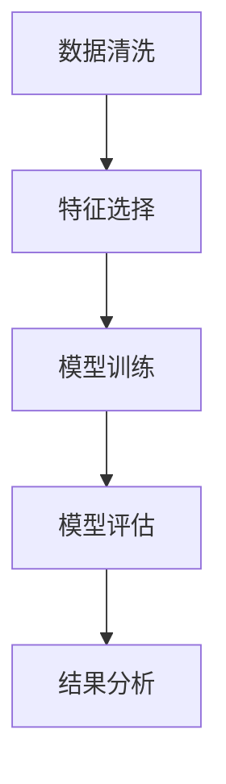
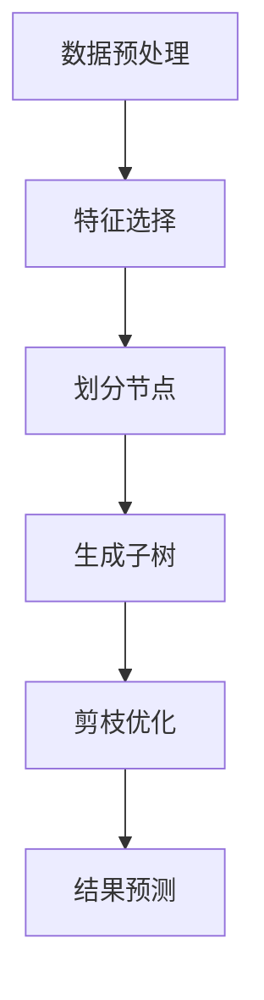
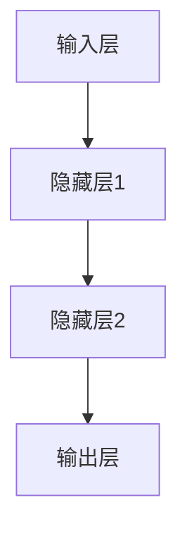
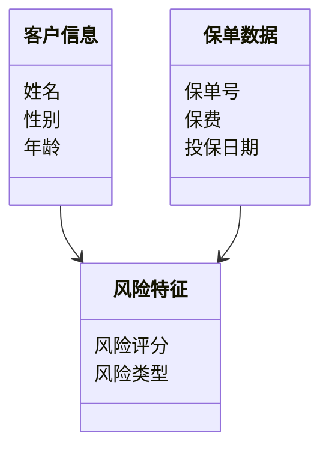
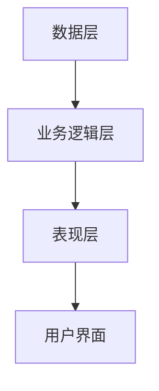

                 


# AI在保险产品定价优化中的创新应用

> 关键词：人工智能、保险定价、机器学习、深度学习、神经网络

> 摘要：本文探讨了人工智能技术在保险产品定价中的创新应用，详细分析了传统定价模式的局限性，以及AI技术如何通过机器学习、深度学习和自然语言处理等手段，优化保险定价的精准度和效率。文章从核心概念、算法原理、系统架构到项目实战，全面解析了AI在保险定价中的创新应用，为读者提供了系统化的知识体系。

---

## 第1章: 保险产品定价概述

### 1.1 保险产品的基本概念

#### 1.1.1 保险产品的定义与分类

保险产品是保险公司为客户提供风险保障的契约形式，通过收取保费来分散和补偿风险损失。常见的保险产品包括人寿保险、健康保险、财产保险和责任保险等。

#### 1.1.2 保险产品的定价模式

保险产品的定价模式主要分为传统定价和数据驱动定价两种。传统定价依赖精算模型和历史数据，而数据驱动定价则利用大数据和机器学习技术进行实时分析。

#### 1.1.3 保险产品的定价流程

定价流程通常包括数据收集、风险评估、费率计算、市场分析和最终定价策略制定等步骤。

---

### 1.2 保险定价的核心要素

#### 1.2.1 风险评估与客户画像

风险评估是定价的关键，通过分析客户的历史数据、健康状况、驾驶记录等因素，构建客户画像，评估风险程度。

#### 1.2.2 保险费率的计算方法

费率计算基于风险评估、市场供需和公司利润目标。常用的方法包括经验费率法和精算模型法。

#### 1.2.3 市场需求与竞争分析

了解市场需求和竞争状况，制定具有竞争力的定价策略，确保产品在市场中的竞争力。

---

## 第2章: AI技术在保险定价中的应用背景

### 2.1 传统保险定价的局限性

#### 2.1.1 数据依赖性与模型局限性

传统定价高度依赖历史数据，但数据的局限性可能导致定价不够精准，难以捕捉新兴风险因素。

#### 2.1.2 人工分析的低效性

人工分析耗时且效率低下，难以应对海量数据和复杂场景的分析需求。

#### 2.1.3 市场变化的快速响应需求

保险市场变化迅速，传统定价模式难以快速响应，错失市场机会。

---

### 2.2 AI技术的优势与潜力

#### 2.2.1 数据处理能力的提升

AI能够处理海量数据，提取更多有价值的信息，提升定价的精准度。

#### 2.2.2 智能分析与预测能力

通过机器学习和深度学习，AI能够预测风险和市场趋势，优化定价策略。

#### 2.2.3 定价策略的个性化与精准化

AI技术能够根据客户的个性化需求，制定差异化定价策略，提高客户满意度和市场竞争力。

---

## 第3章: AI在保险定价中的核心概念与联系

### 3.1 核心概念原理

#### 3.1.1 机器学习在定价中的应用

机器学习通过训练模型，识别数据中的模式和关联，用于风险评估和定价预测。

#### 3.1.2 深度学习与保险定价的关系

深度学习能够处理复杂的非线性关系，提高定价模型的准确性。

#### 3.1.3 自然语言处理在保单文本分析中的作用

自然语言处理技术用于分析保单条款，提取关键信息，辅助定价决策。

---

### 3.2 核心概念属性特征对比表

| **概念**       | **属性**         | **特征**                     |
|-----------------|------------------|------------------------------|
| 机器学习        | 数据驱动         | 需大量数据训练                |
| 深度学习        | 多层神经网络      | 强大的非线性特征提取能力      |
| 自然语言处理    | 文本分析          | 理解与处理保单条款的能力      |

---

### 3.3 ER实体关系图

```mermaid
e
```

---

## 第4章: 算法原理

### 4.1 线性回归

#### 4.1.1 线性回归模型

线性回归是一种简单的回归模型，用于预测连续变量。其数学模型如下：

$$ y = \beta_0 + \beta_1x + \epsilon $$

其中，$\beta_0$是截距，$\beta_1$是回归系数，$\epsilon$是误差项。

#### 4.1.2 线性回归流程图



---

### 4.2 决策树

#### 4.2.1 决策树算法

决策树是一种基于树状结构的分类模型，适用于非线性关系的分析。常用的决策树算法有ID3、C4.5和CART。

#### 4.2.2 决策树流程图



---

### 4.3 神经网络

#### 4.3.1 神经网络模型

神经网络是一种模拟人脑结构的深度学习模型，具有强大的非线性特征提取能力。典型的神经网络结构包括输入层、隐藏层和输出层。

#### 4.3.2 神经网络流程图



---

## 第5章: 系统分析与架构设计方案

### 5.1 系统功能设计

#### 5.1.1 数据采集模块

负责收集客户信息、保单数据和市场数据，构建数据仓库。

#### 5.1.2 特征工程模块

对数据进行清洗、特征提取和特征选择，为模型训练提供高质量数据。

#### 5.1.3 模型训练模块

基于特征工程后的数据，训练机器学习模型，生成定价策略。

---

### 5.2 系统架构设计

#### 5.2.1 领域模型类图



#### 5.2.2 系统架构图



---

## 第6章: 项目实战

### 6.1 环境安装

安装Python 3.8及以上版本，安装必要的库：

```bash
pip install numpy scikit-learn pandas tensorflow
```

---

### 6.2 核心实现代码

#### 数据清洗代码

```python
import pandas as pd

# 读取数据
data = pd.read_csv('insurance.csv')

# 删除缺失值
data = data.dropna()

# 去重
data = data.drop_duplicates()
```

#### 模型训练代码

```python
from sklearn.linear_model import LinearRegression
from sklearn.model_selection import train_test_split

# 划分训练集和测试集
X_train, X_test, y_train, y_test = train_test_split(X, y, test_size=0.2)

# 训练模型
model = LinearRegression()
model.fit(X_train, y_train)
```

#### 模型部署代码

```python
from flask import Flask, request, jsonify

app = Flask(__name__)

@app.route('/predict', methods=['POST'])
def predict():
    data = request.json
    # 数据预处理
    # 模型预测
    prediction = model.predict(data)
    return jsonify({'prediction': prediction.tolist()})

if __name__ == '__main__':
    app.run(debug=True)
```

---

## 第7章: 最佳实践

### 7.1 小结

本文详细探讨了AI在保险定价中的创新应用，从核心概念到算法实现，再到系统架构，为读者提供了全面的知识体系。

### 7.2 注意事项

- 数据质量是关键，需确保数据的完整性和准确性。
- 模型选择需结合业务需求，灵活调整参数。
- 系统部署需考虑稳定性，确保模型的持续优化。

### 7.3 拓展阅读

建议读者深入学习机器学习、深度学习和自然语言处理的相关知识，关注保险行业的最新动态和技术趋势。

---

## 作者：AI天才研究院/AI Genius Institute & 禅与计算机程序设计艺术 /Zen And The Art of Computer Programming

---

感谢您的阅读，希望本文能为您提供有价值的信息和启发！

