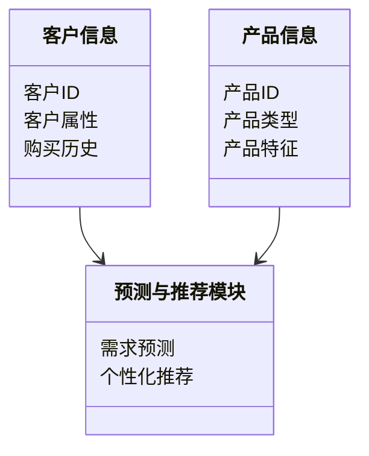
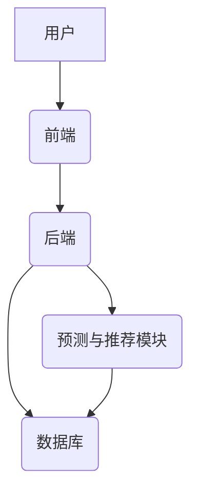
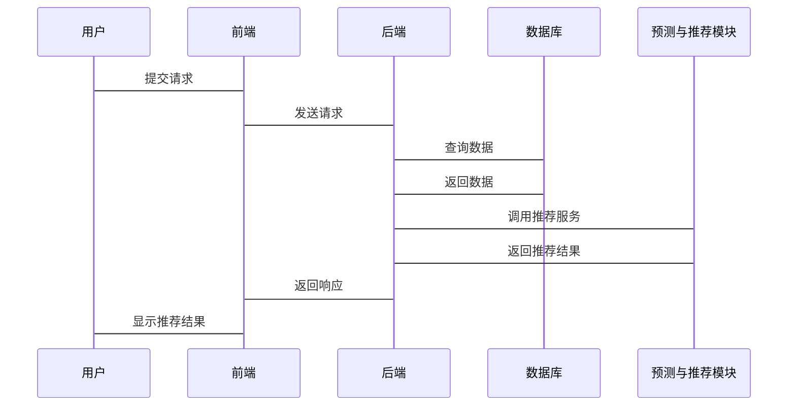

                 


# AI在保险产品需求预测与个性化推荐中的深度应用

**关键词**：保险，AI，需求预测，推荐系统，机器学习

**摘要**：本文深入探讨了人工智能技术在保险产品需求预测与个性化推荐中的应用。通过分析保险行业的现状与挑战，详细介绍了需求预测和推荐系统的核心概念、算法原理及系统架构设计。结合实际案例，展示了如何通过机器学习和协同过滤等技术实现精准的需求预测与个性化推荐，从而提升保险行业的效率和客户满意度。本文还提供了系统架构图和算法流程图，帮助读者更好地理解和应用相关技术。

---

# 1. 保险行业的现状与挑战

## 1.1 保险行业的现状分析

### 1.1.1 保险行业的基本概念与运作模式

保险行业是通过分散风险来提供经济保障的行业，主要包括寿险、财险、健康险等多种类型。传统保险业务主要依赖人工销售和服务，存在效率低、成本高等问题。随着数字化转型的推进，保险行业正逐步引入人工智能技术，以提高业务效率和客户体验。

### 1.1.2 保险行业面临的挑战与痛点

1. **市场竞争加剧**：保险公司数量增加，产品同质化严重，差异化竞争不足。
2. **客户需求多样化**：客户对保险产品的需求日益多样化，传统的产品推荐方式难以满足个性化需求。
3. **数据利用率低**：保险公司积累了大量的客户数据，但如何有效利用这些数据进行精准营销和风险评估是关键挑战。
4. **效率与成本问题**：传统的人工销售模式效率低，成本高，难以应对快速变化的市场需求。

### 1.1.3 AI技术在保险行业的应用前景

AI技术在保险行业的应用前景广阔，尤其是在需求预测和个性化推荐方面。通过AI技术，保险公司可以更精准地预测客户需求，优化产品设计和销售策略，从而提高客户满意度和市场竞争力。

## 1.2 AI技术如何改变保险行业

### 1.2.1 AI技术的核心概念与特点

AI（人工智能）是模拟人类智能的技术，主要包含机器学习、自然语言处理、计算机视觉等核心技术。AI技术的特点包括数据驱动、自动化、高效率和精准性。

### 1.2.2 AI技术在保险行业中的应用场景

1. **客户画像与精准营销**：通过AI技术分析客户数据，建立客户画像，实现精准营销。
2. **风险评估与定价**：利用机器学习模型分析客户风险，优化保险产品定价。
3. **自动化服务与理赔**：通过自然语言处理和图像识别技术，实现自动化理赔和服务。
4. **需求预测与产品推荐**：基于历史数据和客户行为分析，预测客户需求并推荐合适的产品。

### 1.2.3 AI技术对保险行业的影响与价值

AI技术的应用可以显著提高保险行业的效率和客户满意度，降低运营成本，增强市场竞争优势。通过AI技术，保险公司可以更好地理解客户需求，优化产品设计和销售策略，从而实现可持续发展。

## 1.3 保险产品需求预测与个性化推荐的重要性

### 1.3.1 需求预测在保险产品开发中的作用

需求预测是保险产品开发的重要环节，通过预测客户需求，保险公司可以更好地设计产品，满足市场多样化的需求。

### 1.3.2 个性化推荐在保险产品销售中的价值

个性化推荐可以通过精准匹配客户需求和产品，提高客户满意度和销售效率，同时降低营销成本。

### 1.3.3 需求预测与个性化推荐的结合

通过结合需求预测和个性化推荐，保险公司可以实现从产品开发到销售的全流程优化，提高市场竞争力。

## 1.4 本章小结

### 1.4.1 保险行业面临的挑战

保险行业面临市场竞争加剧、客户需求多样化、数据利用率低等挑战。

### 1.4.2 AI技术对保险行业的影响

AI技术的应用可以提高保险行业的效率和客户满意度，降低运营成本，增强市场竞争优势。

### 1.4.3 需求预测与个性化推荐的核心作用

需求预测和个性化推荐是AI技术在保险行业中的重要应用，可以实现精准营销和产品设计优化。

---

# 2. 保险产品需求预测的核心概念与方法

## 2.1 需求预测的基本概念

### 2.1.1 需求预测的定义与分类

需求预测是对未来市场需求的估计和预测，主要分为定量预测和定性预测两大类。

### 2.1.2 需求预测的主要方法

1. **时间序列分析**：基于历史数据预测未来需求。
2. **机器学习方法**：利用机器学习算法进行需求预测。
3. **综合模型**：结合时间序列和机器学习的优势进行预测。

### 2.1.3 需求预测的流程与步骤

1. **数据收集**：收集历史销售数据、市场数据、客户数据等。
2. **数据预处理**：清洗数据，处理缺失值、异常值等。
3. **模型选择**：选择合适的预测模型，如ARIMA、LSTM等。
4. **模型训练**：利用训练数据训练模型。
5. **模型评估**：通过测试数据评估模型的准确性。
6. **预测与优化**：根据模型预测结果进行优化调整。

## 2.2 时间序列分析在需求预测中的应用

### 2.2.1 时间序列分析的基本原理

时间序列分析是通过分析历史数据的变化趋势，预测未来的需求。常用的方法包括ARIMA（自回归积分滑动平均）模型和LSTM（长短期记忆网络）模型。

### 2.2.2 常见的时间序列模型

#### 2.2.2.1 ARIMA模型

ARIMA模型是一种经典的统计模型，适用于线性时间序列数据的预测。模型主要包括自回归部分（AR）和滑动平均部分（MA）。

**公式**：
$$ ARIMA(p, d, q) $$
其中，p为自回归阶数，d为差分阶数，q为滑动平均阶数。

#### 2.2.2.2 LSTM模型

LSTM模型是一种基于深度学习的时间序列模型，能够捕捉长期依赖关系，适用于非线性时间序列数据的预测。

### 2.2.3 时间序列分析在保险需求预测中的应用案例

通过时间序列分析，保险公司可以预测未来保险产品的销售情况，优化库存管理和销售策略。

## 2.3 机器学习在需求预测中的应用

### 2.3.1 机器学习的基本概念与分类

机器学习是一种人工智能技术，通过数据训练模型，实现对未知数据的预测和分类。常用算法包括线性回归、随机森林、神经网络等。

### 2.3.2 常见的机器学习算法

#### 2.3.2.1 线性回归

线性回归是一种简单的需求预测方法，适用于线性关系的数据。

**公式**：
$$ y = \beta_0 + \beta_1x + \epsilon $$
其中，y为预测值，x为自变量，$\beta_0$和$\beta_1$为模型参数，$\epsilon$为误差项。

#### 2.3.2.2 随机森林

随机森林是一种基于决策树的集成学习方法，适用于非线性关系的数据。

#### 2.3.2.3 神经网络

神经网络是一种深度学习模型，适用于复杂非线性关系的数据。

### 2.3.3 机器学习在保险需求预测中的应用案例

通过机器学习算法，保险公司可以更准确地预测客户需求，优化产品设计和销售策略。

## 2.4 综合模型在保险需求预测中的应用

### 2.4.1 综合模型的概念与优势

综合模型是将时间序列分析和机器学习算法相结合的模型，能够同时捕捉数据的线性趋势和非线性特征。

### 2.4.2 基于机器学习的时间序列模型

综合模型通过结合时间序列和机器学习的优势，提高了需求预测的准确性和稳定性。

### 2.4.3 综合模型的实际应用与效果评估

通过实际应用案例，验证了综合模型在保险需求预测中的效果优于单一模型。

## 2.5 本章小结

### 2.5.1 需求预测的核心概念

需求预测是对未来市场需求的估计和预测，主要包括时间序列分析和机器学习方法。

### 2.5.2 时间序列分析与机器学习的应用

时间序列分析适用于线性数据，机器学习适用于非线性数据，两者结合可以提高预测的准确性。

### 2.5.3 综合模型的优势与挑战

综合模型结合了时间序列和机器学习的优势，但实现复杂，需要大量的数据和计算资源。

---

# 3. 个性化推荐系统的核心原理与方法

## 3.1 推荐系统的基本概念

### 3.1.1 推荐系统的定义与分类

推荐系统是一种通过分析用户行为和偏好，向用户推荐相关产品或服务的技术。主要分为协同过滤推荐和基于内容的推荐两大类。

### 3.1.2 推荐系统的评价指标

1. **准确率**：推荐结果与实际需求的匹配程度。
2. **召回率**：推荐结果中包含实际需求的比例。
3. **F1分数**：准确率和召回率的调和平均数。

### 3.1.3 推荐系统的应用场景

推荐系统广泛应用于电商、音乐、电影等领域，保险行业也可以通过推荐系统实现精准营销。

## 3.2 协同过滤推荐算法

### 3.2.1 协同过滤的基本原理

协同过滤是基于用户相似性或物品相似性，推荐用户可能感兴趣的产品或服务。

### 3.2.2 基于用户的协同过滤

基于用户的协同过滤通过分析用户行为和偏好，找到相似的用户群体，推荐相似的产品。

### 3.2.3 基于物品的协同过滤

基于物品的协同过滤通过分析物品的属性和关系，推荐用户可能感兴趣的产品。

### 3.2.4 协同过滤的实际应用与优缺点

协同过滤推荐算法简单易懂，但存在冷启动问题，难以处理数据稀疏性。

## 3.3 基于内容的推荐算法

### 3.3.1 基于内容推荐的基本原理

基于内容的推荐通过分析物品的属性和特征，推荐与用户兴趣相关的产品。

### 3.3.2 基于文本挖掘的内容推荐

通过文本挖掘技术分析产品描述和客户评论，提取关键词和主题，推荐相关产品。

### 3.3.3 基于特征提取的内容推荐

通过特征提取技术（如TF-IDF、Word2Vec）分析物品的特征，推荐与用户兴趣相关的产品。

### 3.3.4 基于内容推荐的实际应用与优缺点

基于内容的推荐算法能够处理数据稀疏性问题，但对文本数据的依赖较高。

## 3.4 综合推荐系统的应用

### 3.4.1 综合推荐系统的概念与优势

综合推荐系统结合了协同过滤和基于内容的推荐算法，能够同时考虑用户行为和物品特征。

### 3.4.2 综合推荐系统的实现步骤

1. **数据收集**：收集用户行为和物品特征数据。
2. **数据预处理**：清洗和转换数据。
3. **模型训练**：训练协同过滤和基于内容的推荐模型。
4. **推荐生成**：根据用户需求生成推荐结果。
5. **效果评估**：评估推荐系统的准确率和召回率。

### 3.4.3 综合推荐系统的实际应用案例

通过综合推荐系统，保险公司可以实现精准的保险产品推荐，提高客户满意度和销售效率。

## 3.5 本章小结

### 3.5.1 推荐系统的核心概念

推荐系统是通过分析用户行为和偏好，向用户推荐相关产品或服务的技术。

### 3.5.2 协同过滤与基于内容的推荐方法

协同过滤推荐算法适用于用户行为数据丰富的场景，基于内容的推荐算法适用于物品特征丰富的场景。

### 3.5.3 综合推荐系统的优势

综合推荐系统结合了协同过滤和基于内容的优势，能够提高推荐的准确性和多样性。

---

# 4. 保险产品需求预测与个性化推荐的系统架构设计

## 4.1 问题场景介绍

保险公司在实际业务中需要通过需求预测和个性化推荐，实现精准的保险产品设计和销售。系统需要处理大量的客户数据和市场数据，提供高效的预测和推荐服务。

## 4.2 项目介绍

本项目旨在通过AI技术实现保险产品的需求预测和个性化推荐，提高保险公司的市场竞争力和客户满意度。

## 4.3 系统功能设计

### 4.3.1 领域模型设计

#### 4.3.1.1 客户信息管理

- **客户ID**：唯一标识客户。
- **客户属性**：包括年龄、性别、职业等。
- **购买历史**：记录客户的购买记录和偏好。

#### 4.3.1.2 产品信息管理

- **产品ID**：唯一标识产品。
- **产品类型**：包括寿险、财险、健康险等。
- **产品特征**：包括保费、保障范围、免赔额等。

#### 4.3.1.3 预测与推荐模块

- **需求预测**：基于历史数据和机器学习模型，预测未来需求。
- **个性化推荐**：根据客户需求和产品特征，推荐合适的产品。

**领域模型类图**：


### 4.3.2 系统架构设计

#### 4.3.2.1 系统架构图

**系统架构图**：


#### 4.3.2.2 系统接口设计

- **前端接口**：提供用户交互界面，接收用户请求。
- **后端接口**：处理用户请求，调用预测与推荐模块。
- **数据库接口**：存储和管理客户数据和产品数据。
- **预测与推荐接口**：提供需求预测和个性化推荐服务。

#### 4.3.2.3 系统交互设计

**系统交互序列图**：


## 4.4 本章小结

### 4.4.1 问题场景的描述

保险公司需要通过需求预测和个性化推荐，实现精准的产品设计和销售。

### 4.4.2 系统功能设计

系统功能包括客户信息管理、产品信息管理、预测与推荐模块。

### 4.4.3 系统架构设计

系统架构包括前端、后端、数据库和预测与推荐模块，各模块之间的交互关系清晰。

---

# 5. 保险产品需求预测与个性化推荐的项目实战

## 5.1 环境安装

### 5.1.1 安装Python环境

安装Python 3.8及以上版本，推荐使用Anaconda或Miniconda。

### 5.1.2 安装机器学习库

安装必要的机器学习库，如scikit-learn、xgboost、TensorFlow、Keras等。

### 5.1.3 安装数据处理库

安装Pandas、NumPy、Matplotlib等数据处理和可视化库。

### 5.1.4 安装推荐系统库

安装Surprise、scikit-learn等推荐系统库。

## 5.2 系统核心实现源代码

### 5.2.1 数据预处理代码

```python
import pandas as pd
import numpy as np

# 读取数据
data = pd.read_csv('insurance.csv')

# 数据清洗
data.dropna(inplace=True)
data = pd.get_dummies(data)  # 独热编码
```

### 5.2.2 需求预测模型代码

```python
from sklearn.model_selection import train_test_split
from sklearn.ensemble import RandomForestRegressor
from sklearn.metrics import mean_absolute_error

# 划分数据集
X = data.drop('demand', axis=1)
y = data['demand']

X_train, X_test, y_train, y_test = train_test_split(X, y, test_size=0.2, random_state=42)

# 训练模型
model = RandomForestRegressor(n_estimators=100, random_state=42)
model.fit(X_train, y_train)

# 预测结果
y_pred = model.predict(X_test)

# 评估模型
mae = mean_absolute_error(y_test, y_pred)
print(f'MAE: {mae}')
```

### 5.2.3 个性化推荐系统代码

```python
from surprise import SVD
from surprise.dataset import Dataset
from surprise import accuracy

# 加载数据集
data = Dataset.load_from_file('insurance.csv', format='csv', sep=',', header=True)

# 划分数据集
train_set = data.build_trainset()

# 训练模型
model = SVD(n_factors=100, random_state=42)
model.train(train_set)

# 测试推荐
test_set = data.build_testset()
predictions = model.test(test_set)

# 评估模型
accuracy.mae(predictions)
```

## 5.3 代码应用解读与分析

### 5.3.1 需求预测模型的实现

需求预测模型使用随机森林算法，通过训练数据预测未来的需求。模型的准确率和召回率是评估模型性能的重要指标。

### 5.3.2 个性化推荐系统的实现

个性化推荐系统使用协同过滤算法，通过分析用户行为和偏好，推荐合适的产品。Surprise库是一个常用的推荐系统库，支持多种推荐算法。

## 5.4 实际案例分析和详细讲解剖析

### 5.4.1 案例背景介绍

以健康保险产品为例，分析需求预测和个性化推荐的实际应用。

### 5.4.2 数据分析与处理

通过对健康保险产品的销售数据和客户数据进行分析，提取关键特征，建立需求预测和推荐模型。

### 5.4.3 模型训练与优化

通过多次训练和参数调优，优化模型的准确率和召回率，提高推荐的精准度。

### 5.4.4 实验结果与分析

通过实际实验，验证模型的性能和推荐效果，总结经验和教训。

## 5.5 本章小结

### 5.5.1 项目实战的内容

通过实际案例，展示了需求预测和个性化推荐系统的实现过程。

### 5.5.2 代码实现的关键点

代码实现包括数据预处理、模型训练、结果评估和推荐系统实现。

### 5.5.3 实验结果与经验总结

通过实验结果，总结了模型优化的经验和推荐系统的实际应用效果。

---

# 6. 总结与展望

## 6.1 本章总结

### 6.1.1 保险产品需求预测的核心概念

需求预测是对未来市场需求的估计和预测，主要方法包括时间序列分析和机器学习。

### 6.1.2 个性化推荐系统的核心原理

推荐系统通过分析用户行为和偏好，推荐相关的产品或服务。

### 6.1.3 系统架构与实现

系统架构包括前端、后端、数据库和预测与推荐模块，各模块之间的交互关系清晰。

## 6.2 未来展望

### 6.2.1 AI技术的进一步发展

随着AI技术的不断发展，需求预测和推荐系统的准确性将进一步提高。

### 6.2.2 保险行业的数字化转型

保险行业的数字化转型将推动需求预测和推荐系统的广泛应用。

### 6.2.3 更多应用场景的探索

需求预测和推荐系统在保险行业的应用将扩展到更多领域，如风险管理、客户服务等。

---

# 作者：AI天才研究院/AI Genius Institute & 禅与计算机程序设计艺术 /Zen And The Art of Computer Programming

---

本文系统地介绍了AI技术在保险产品需求预测与个性化推荐中的应用，通过理论分析和实际案例，展示了AI技术如何提升保险行业的效率和客户满意度。希望本文能够为保险行业的从业者和技术爱好者提供有价值的参考和启发。

