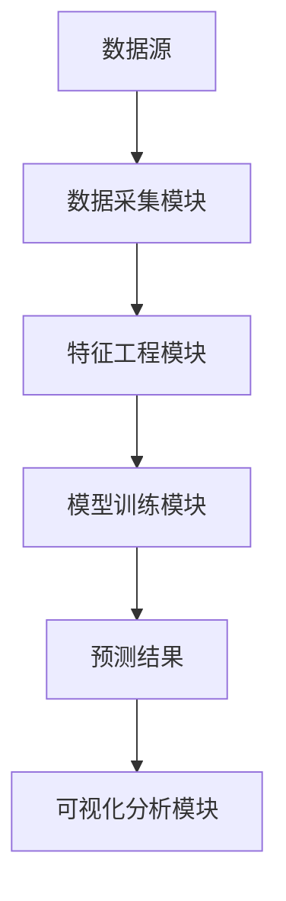
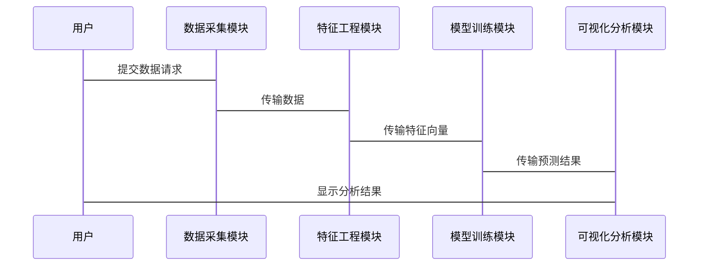

                 


# AI在保险产品需求预测中的创新应用

## 关键词：人工智能，保险产品，需求预测，机器学习，深度学习

## 摘要：  
随着人工智能技术的快速发展，保险行业正经历着前所未有的变革。传统的保险产品需求预测方法依赖于经验丰富的业务人员和统计模型，但在面对海量数据和复杂市场变化时，往往难以满足精准预测的需求。本文将深入探讨AI技术在保险产品需求预测中的创新应用，从背景、算法原理到系统架构设计，结合实际案例，详细阐述AI如何通过机器学习、深度学习等技术手段，帮助保险公司实现更精准、更高效的需求预测。

---

## 第一部分：保险产品需求预测的背景与挑战

### 第1章：保险行业现状与需求预测的重要性

#### 1.1 保险行业的现状与发展趋势

保险行业作为金融领域的重要组成部分，近年来在数字化转型的推动下，正逐步从传统模式向智能化、数据驱动型模式转变。以下是保险行业当前的几个主要发展趋势：

- **数字化营销**：通过大数据和AI技术，保险公司可以更精准地定位客户，提供个性化的保险产品和服务。
- **智能化理赔**：利用自然语言处理（NLP）和计算机视觉技术，实现自动化的理赔流程，提高效率并减少人为错误。
- **风险控制**：通过实时数据分析和预测模型，保险公司可以更有效地识别和管理风险，降低赔付率。

#### 1.2 需求预测在保险业务中的战略意义

保险产品的需求预测是保险公司制定市场策略、优化产品组合、控制成本的重要基础。以下是需求预测在保险业务中的几个关键作用：

- **精准市场定位**：通过预测不同客户群体的需求，保险公司可以制定更有针对性的营销策略。
- **优化产品设计**：基于需求预测结果，保险公司可以调整产品条款、保费定价等，以更好地满足市场需求。
- **降低运营成本**：通过预测销售量和客户需求，保险公司可以优化库存管理和资源配置，降低运营成本。

#### 1.3 AI技术在保险需求预测中的创新应用

AI技术的引入为保险产品需求预测带来了革命性的变化。以下是AI技术在保险需求预测中的几个创新应用方向：

- **机器学习算法**：利用监督学习、无监督学习等算法，从海量数据中提取潜在规律，提高预测精度。
- **深度学习模型**：通过神经网络模型，捕捉数据中的复杂模式，实现更精准的需求预测。
- **自然语言处理（NLP）**：通过对客户反馈、社交媒体评论等非结构化数据的分析，挖掘客户需求的变化趋势。

---

### 第2章：保险产品需求预测的核心问题

#### 2.1 需求预测的基本概念与问题背景

保险产品需求预测的核心目标是基于历史数据和市场信息，预测未来某一时期内某种保险产品的销售量或需求量。以下是需求预测面临的一些关键问题：

- **数据多样性**：保险产品的需求受到宏观经济环境、客户行为、政策法规等多种因素的影响，数据来源广泛且复杂。
- **数据稀疏性**：某些保险产品的历史数据可能较为稀缺，尤其是在新兴市场或创新型保险产品中。
- **模型可解释性**：复杂的AI模型虽然预测精度高，但其决策过程往往难以解释，这在保险行业尤其重要，因为需要满足监管要求和客户需求的透明性。

#### 2.2 保险产品需求预测的关键要素

保险产品需求预测涉及多个关键要素，这些要素相互关联，共同影响预测结果。以下是主要的关键要素：

| 关键要素 | 描述 |
|----------|------|
| **客户特征** | 包括年龄、性别、职业、收入水平等，用于分析客户群体的需求特征。 |
| **产品特性** | 包括保费、保障范围、保险期限等，影响客户购买决策的关键因素。 |
| **市场环境** | 包括宏观经济指标、政策法规、行业竞争状况等，影响市场需求的外部因素。 |
| **历史数据** | 包括过去一段时间内销售数据、客户购买行为等，用于训练预测模型的基础数据。 |

#### 2.3 AI技术在保险需求预测中的应用框架

AI技术的应用框架通常包括以下几个关键步骤：

1. **数据采集与预处理**：收集和整理相关数据，包括客户信息、历史销售数据、市场数据等。
2. **特征工程**：通过对数据进行清洗、特征提取和选择，构建适合模型输入的特征向量。
3. **模型训练与优化**：选择合适的机器学习或深度学习算法，训练预测模型并进行调优。
4. **模型部署与监控**：将训练好的模型部署到生产环境中，并实时监控模型性能，及时调整和优化。

---

### 第3章：AI技术在保险需求预测中的创新应用

#### 3.1 机器学习算法在保险需求预测中的应用

机器学习算法在保险需求预测中应用广泛，以下是几种常见的算法及其应用场景：

- **线性回归（Linear Regression）**：适用于简单的线性关系预测，如保费与销售量之间的关系。
- **支持向量机（SVM）**：适用于分类问题，如根据客户特征预测客户购买保险的概率。
- **随机森林（Random Forest）**：适用于特征重要性分析和非线性关系预测，能够处理高维数据。

#### 3.2 深度学习模型在保险需求预测中的应用

深度学习模型在处理复杂非线性关系和高维数据方面具有显著优势。以下是几种常用的深度学习模型：

- **神经网络（Neural Networks）**：适用于复杂模式识别，如客户行为模式分析。
- **长短期记忆网络（LSTM）**：适用于时间序列数据预测，如保费需求的时间变化趋势。

#### 3.3 基于NLP的客户需求分析

自然语言处理技术可以帮助保险公司从非结构化数据中提取客户需求信息。例如，通过分析客户评论和社交媒体数据，识别客户对保险产品的关注点和潜在需求。

---

### 第4章：保险产品需求预测系统的架构设计

#### 4.1 系统功能设计

保险产品需求预测系统通常包括以下几个核心功能模块：

- **数据采集模块**：负责收集客户信息、销售数据、市场数据等。
- **特征工程模块**：对数据进行清洗、特征提取和选择。
- **模型训练模块**：选择合适的算法训练预测模型。
- **预测与分析模块**：生成预测结果并进行可视化分析。

#### 4.2 系统架构设计

以下是保险产品需求预测系统的架构图：



#### 4.3 系统交互流程

以下是系统交互流程的序列图：



---

### 第5章：保险产品需求预测项目的实战分析

#### 5.1 项目背景与目标

某保险公司希望通过引入AI技术，提高保险产品需求预测的精度，优化市场策略。项目目标包括：

- 建立一个基于机器学习的预测模型，预测未来季度内不同保险产品的销售量。
- 分析客户特征和市场环境对需求的影响，为市场部门提供决策支持。

#### 5.2 数据集与数据预处理

项目使用的数据集包括以下几部分：

- **客户信息**：年龄、性别、收入水平等。
- **历史销售数据**：过去几个季度的销售量、保费收入等。
- **市场数据**：宏观经济指标、行业竞争状况等。

数据预处理步骤如下：

1. **数据清洗**：删除缺失值和异常值。
2. **特征提取**：从客户评论中提取关键词，生成新的特征。
3. **数据标准化**：对数值型特征进行归一化处理。

#### 5.3 模型实现与优化

选择随机森林算法进行模型训练，并通过网格搜索进行超参数调优。以下是代码示例：

```python
from sklearn.ensemble import RandomForestRegressor
from sklearn.model_selection import GridSearchCV

# 定义参数搜索空间
param_grid = {
    'n_estimators': [100, 200],
    'max_depth': [None, 10, 20],
    'min_samples_split': [2, 5, 10]
}

# 创建网格搜索对象
grid_search = GridSearchCV(RandomForestRegressor(), param_grid, cv=5)

# 拟合模型
grid_search.fit(X_train, y_train)

# 输出最佳参数
print("Best parameters found: ", grid_search.best_params_)
```

---

### 第6章：总结与展望

#### 6.1 项目总结

通过引入AI技术，保险公司可以显著提高保险产品需求预测的精度，优化市场策略，降低运营成本。本项目展示了机器学习算法在需求预测中的强大能力，为后续工作提供了宝贵的经验。

#### 6.2 最佳实践与注意事项

- **数据质量**：数据预处理是模型训练的基础，确保数据的完整性和准确性至关重要。
- **模型可解释性**：在保险行业中，模型的可解释性是决策的重要依据，需要在模型选择和优化过程中予以重视。
- **持续优化**：市场环境和客户需求不断变化，需要定期更新模型和优化算法。

#### 6.3 未来展望

随着AI技术的不断发展，保险产品需求预测将更加精准和智能化。未来的研究方向包括：

- **强化学习**：通过与环境的交互，动态调整预测策略。
- **多模态数据融合**：结合文本、图像等多种数据源，提高预测精度。

---

## 作者：AI天才研究院 & 禅与计算机程序设计艺术

---

本文通过系统的分析和实际案例，展示了AI技术在保险产品需求预测中的创新应用。从背景到技术实现，再到项目实战，为读者提供了全面的指导和启示。希望本文能够为保险行业的数字化转型提供有价值的参考。

