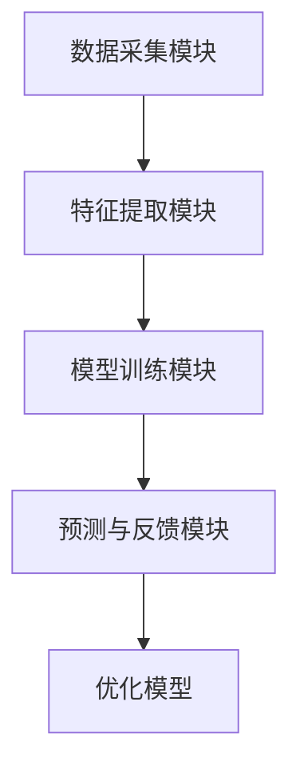
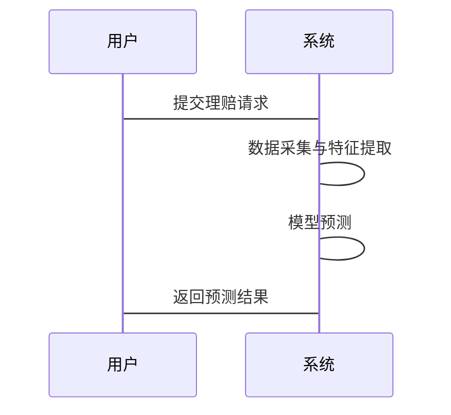

                 


# AI在保险理赔欺诈检测中的创新应用

> 关键词：保险欺诈检测，人工智能，机器学习，随机森林，XGBoost，保险行业，数据挖掘，深度学习，自然语言处理

> 摘要：本文深入探讨了人工智能在保险理赔欺诈检测中的创新应用。通过分析保险行业的现状、欺诈检测的重要性以及传统方法的局限性，提出了基于机器学习和深度学习的创新解决方案。文章详细介绍了随机森林和XGBoost等监督学习算法，以及深度学习模型在欺诈检测中的应用，结合实际案例分析，展示了如何通过特征工程、模型调优和系统架构设计来提升欺诈检测的准确性和效率。最后，本文总结了AI在保险欺诈检测中的优势，并提出了最佳实践建议。

---

# 第1章: 保险行业的现状与欺诈问题

## 1.1 保险行业的基本概念

### 1.1.1 保险的基本定义与分类
保险是一种风险管理工具，通过合同形式约定风险损失的赔偿责任。保险可以分为人寿保险、财产保险、责任保险和信用保险等。

### 1.1.2 保险理赔的核心流程
保险理赔通常包括报案、审核、调查、赔付等环节。这些环节需要对理赔请求的真实性进行验证，以防止欺诈行为。

### 1.1.3 保险行业的数字化转型趋势
随着技术的进步，保险行业正在加速数字化转型，利用大数据、人工智能等技术提升服务效率和风险控制能力。

## 1.2 欺诈检测在保险中的重要性

### 1.2.1 欺诈行为的定义与分类
欺诈行为是指故意编造虚假信息或隐瞒真实情况，以骗取保险赔偿的行为。常见的欺诈类型包括夸大损失、虚构事故、编造投保人信息等。

### 1.2.2 欺诈对保险行业的影响
欺诈行为会增加保险公司的赔付成本，降低保险产品的信任度，甚至导致保险公司财务损失和声誉损害。

### 1.2.3 欺诈检测的必要性与挑战
传统的欺诈检测方法依赖于人工审核和简单的规则匹配，效率低且容易漏检。随着数据量的增加，传统的检测方法已无法满足需求。

---

# 第2章: 人工智能与保险欺诈检测的结合

## 2.1 人工智能的基本概念

### 2.1.1 人工智能的定义与分类
人工智能（AI）是指模拟人类智能的计算机系统。根据智能水平，AI可以分为弱人工智能（专注于特定任务）和强人工智能（具备通用智能）。

### 2.1.2 机器学习与深度学习的区别
机器学习是AI的一种，通过训练数据模型来预测结果；深度学习是机器学习的一种，基于多层神经网络模型，能够自动提取数据特征。

### 2.1.3 人工智能在金融领域的应用现状
人工智能在金融领域的应用包括股票预测、信用评估、欺诈检测等。

## 2.2 AI在保险欺诈检测中的优势

### 2.2.1 数据处理能力的提升
AI能够快速处理大量数据，提取潜在特征，帮助发现传统方法难以察觉的欺诈模式。

### 2.2.2 模型的自适应学习能力
AI模型可以根据新的数据不断优化，适应欺诈行为的变化。

### 2.2.3 高效的自动化检测能力
AI可以在短时间内完成大量理赔请求的分析，显著提高欺诈检测效率。

## 2.3 欺诈检测中的核心概念与联系

### 2.3.1 欺诈行为的特征提取
特征包括理赔金额、理赔时间、投保人历史记录等。通过分析这些特征，可以识别潜在的欺诈行为。

### 2.3.2 模型的输入与输出关系
模型的输入是理赔数据，输出是欺诈概率或标签（正常/欺诈）。

### 2.3.3 数据特征与模型性能的关系
特征选择和特征工程直接影响模型的性能。例如，去除无关特征可以提高模型的准确率。

---

# 第3章: 保险欺诈检测中的监督学习算法

## 3.1 监督学习的基本原理

### 3.1.1 监督学习的定义与分类
监督学习是基于标记数据的训练方法，分为分类和回归任务。

### 3.1.2 监督学习的训练流程
包括数据预处理、特征提取、模型训练、模型评估等步骤。

### 3.1.3 监督学习的优缺点
优点是易于理解和实现，缺点是需要大量标记数据，且对噪声数据敏感。

## 3.2 常见监督学习算法在欺诈检测中的应用

### 3.2.1 决策树算法
决策树是一种树状结构，通过分支判断进行分类。例如，ID3、C4.5和CART算法。

### 3.2.2 支持向量机算法
支持向量机（SVM）通过构建超平面实现分类，适用于高维数据。

### 3.2.3 随机森林算法
随机森林是基于决策树的集成学习方法，具有高准确性和鲁棒性。

## 3.3 监督学习算法的优缺点对比

| 算法       | 优点                     | 缺点                     |
|------------|--------------------------|--------------------------|
| 决策树     | 易于理解和实现           | 易受噪声数据影响           |
| 支持向量机 | 高维数据表现好           | 计算复杂度高               |
| 随机森林   | 高准确率和鲁棒性         | 对参数敏感                |

---

# 第4章: 基于深度学习的保险欺诈检测

## 4.1 深度学习的基本原理

### 4.1.1 神经网络的定义与分类
神经网络是模仿人脑神经元结构的模型，包括卷积神经网络（CNN）、循环神经网络（RNN）和长短期记忆网络（LSTM）。

### 4.1.2 深度学习的训练流程
包括数据预处理、模型构建、反向传播和优化器调参。

### 4.1.3 深度学习的优缺点
优点是能够自动提取特征，缺点是需要大量计算资源和数据。

## 4.2 常见深度学习算法在欺诈检测中的应用

### 4.2.1 卷积神经网络（CNN）
CNN适用于图像识别任务，但在文本处理中也有应用。

### 4.2.2 长短期记忆网络（LSTM）
LSTM适用于时间序列数据，可以用于分析理赔历史记录。

### 4.2.3 图神经网络（GNN）
GNN适用于复杂关系网络，可以用于分析投保人之间的关联。

---

# 第5章: 系统分析与架构设计

## 5.1 问题场景介绍
保险欺诈检测系统需要处理大量理赔请求，识别潜在的欺诈行为。

## 5.2 系统功能设计

### 5.2.1 数据采集模块
负责收集理赔数据，包括投保人信息、理赔金额、理赔时间等。

### 5.2.2 特征提取模块
从原始数据中提取关键特征，例如历史赔付记录、投保人年龄等。

### 5.2.3 模型训练模块
基于特征数据训练机器学习或深度学习模型。

### 5.2.4 预测与反馈模块
对新理赔请求进行预测，并根据反馈结果优化模型。

## 5.3 系统架构设计

### 5.3.1 系统架构图


### 5.3.2 系统交互图


---

# 第6章: 项目实战

## 6.1 环境配置
使用Python 3.8及以上版本，安装Scikit-learn、XGBoost、TensorFlow等库。

## 6.2 核心实现代码

### 6.2.1 数据预处理
```python
import pandas as pd
from sklearn.model_selection import train_test_split
from sklearn.preprocessing import StandardScaler

# 加载数据
data = pd.read_csv('insurance_fraud.csv')

# 特征提取
X = data.drop('fraudulent', axis=1)
y = data['fraudulent']

# 数据分割
X_train, X_test, y_train, y_test = train_test_split(X, y, test_size=0.2)

# 标准化
scaler = StandardScaler()
X_train = scaler.fit_transform(X_train)
X_test = scaler.transform(X_test)
```

### 6.2.2 模型训练
```python
from sklearn.ensemble import RandomForestClassifier
from sklearn.metrics import accuracy_score

# 初始化模型
model = RandomForestClassifier(n_estimators=100, max_depth=10, random_state=42)

# 训练模型
model.fit(X_train, y_train)

# 预测与评估
y_pred = model.predict(X_test)
print("准确率:", accuracy_score(y_test, y_pred))
```

## 6.3 实际案例分析
通过具体案例分析模型的预测结果，优化特征选择和模型参数。

---

# 第7章: 总结与展望

## 7.1 总结
AI技术在保险欺诈检测中的应用显著提高了检测效率和准确性。通过监督学习和深度学习算法，可以有效识别潜在的欺诈行为。

## 7.2 注意事项
- 数据隐私保护
- 模型的实时更新
- 多模态数据的融合

## 7.3 拓展阅读
推荐阅读《机器学习实战》和《深度学习》等书籍，深入理解AI技术在金融领域的应用。

---

作者：AI天才研究院/AI Genius Institute & 禅与计算机程序设计艺术 /Zen And The Art of Computer Programming

