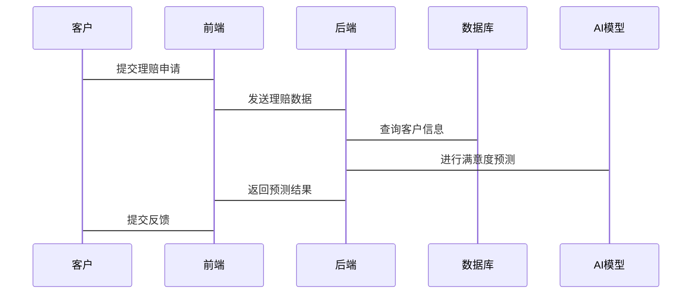

                 


```
# AI在保险理赔满意度预测与服务优化中的创新应用

> 关键词：人工智能、保险理赔、满意度预测、服务优化、机器学习

> 摘要：本文深入探讨了人工智能技术在保险理赔满意度预测与服务优化中的创新应用。通过分析保险行业数字化转型的背景，阐述了AI技术在保险理赔中的核心作用。本文详细讲解了基于机器学习的满意度预测算法，包括线性回归、随机森林和神经网络等算法的原理与实现。同时，结合实际案例，展示了AI技术在保险理赔系统中的应用场景，并提出了系统设计与优化的建议。本文还总结了AI技术在保险行业的未来发展趋势，为保险行业从业者提供了有益的参考。

---

# 第一部分: AI在保险理赔中的创新应用概述

# 第1章: 保险理赔满意度预测与优化的背景

## 1.1 保险行业的数字化转型

### 1.1.1 保险行业的现状与挑战

保险行业正面临数字化转型的压力。传统保险业务流程复杂，理赔效率低，客户满意度难以提升。随着市场竞争的加剧，保险公司需要通过技术创新来提高服务质量和效率。

### 1.1.2 数字化转型的必要性

数字化转型是保险行业适应市场需求的必然选择。通过引入人工智能、大数据等技术，保险公司可以实现业务流程的自动化、智能化，从而提高客户满意度。

### 1.1.3 AI技术在保险行业的应用前景

人工智能技术在保险行业的应用前景广阔。通过AI技术，保险公司可以实现精准的客户画像、智能理赔、风险控制等，从而提升整体竞争力。

## 1.2 保险理赔满意度的核心问题

### 1.2.1 理赔流程中的痛点

传统理赔流程存在效率低、透明度低、客户体验差等问题。例如，理赔申请需要大量人工审核，客户等待时间长，容易产生不满。

### 1.2.2 满意度预测的难点

保险理赔满意度预测的难点在于数据的多样性和复杂性。需要考虑客户的历史理赔记录、理赔金额、处理时间等多种因素。

### 1.2.3 服务优化的关键点

服务优化的关键点在于通过数据分析和AI技术，实现精准的客户需求预测和个性化服务。

## 1.3 AI技术如何解决保险理赔问题

### 1.3.1 AI在保险理赔中的应用场景

AI技术可以应用于保险理赔的多个环节，包括理赔申请、理赔审核、理赔计算、客户回访等。

### 1.3.2 AI技术的优势与局限性

AI技术的优势在于高效、精准、自动化。但其局限性在于数据依赖性强、模型解释性差、技术门槛高等。

### 1.3.3 创新应用的潜力

AI技术在保险理赔中的创新应用潜力巨大。通过不断优化算法和模型，可以实现更精准的预测和更高效的流程优化。

## 1.4 本章小结

本章从保险行业的数字化转型出发，分析了AI技术在保险理赔中的应用背景和核心作用。明确了保险理赔满意度预测的核心问题，并探讨了AI技术的优势与局限性。

---

# 第二部分: AI在保险理赔满意度预测中的核心概念与原理

# 第2章: AI与保险理赔满意度预测的核心概念

## 2.1 AI技术的核心概念

### 2.1.1 人工智能的基本定义

人工智能是指通过模拟人类智能的某些方面，如学习、推理、自我改进等，来实现特定任务的技术。

### 2.1.2 机器学习与深度学习的区别

机器学习是通过数据训练模型，使其能够从数据中学习规律并进行预测。深度学习是机器学习的一种，通过多层神经网络来提取数据的高层次特征。

### 2.1.3 AI在保险行业的具体应用

AI技术在保险行业的具体应用包括客户画像、风险评估、理赔预测、欺诈检测等。

## 2.2 保险理赔满意度预测的定义与特征

### 2.2.1 理赔满意度的定义

理赔满意度是指客户对保险理赔服务的满意程度，通常通过客户反馈、评分等方式进行衡量。

### 2.2.2 满意度预测的特征分析

满意度预测的特征包括客户的基本信息、历史理赔记录、理赔金额、处理时间等。

### 2.2.3 预测模型的评价指标

预测模型的评价指标包括准确率、召回率、F1值等。

## 2.3 AI与保险理赔满意度预测的关系

### 2.3.1 AI技术如何影响满意度预测

AI技术通过分析大量数据，能够更精准地预测客户满意度，从而优化服务流程。

### 2.3.2 数据驱动的预测模型

数据驱动的预测模型通过分析客户行为数据，构建预测模型，实现对客户满意度的精准预测。

### 2.3.3 人机协作的创新模式

人机协作的创新模式是指通过AI技术辅助人工决策，实现更高效、更精准的理赔服务。

## 2.4 本章小结

本章详细介绍了AI技术的核心概念和保险理赔满意度预测的相关定义，分析了AI技术在满意度预测中的作用和价值。

---

# 第三部分: AI在保险理赔满意度预测中的算法原理与实现

# 第3章: 基于机器学习的满意度预测算法

## 3.1 机器学习算法概述

### 3.1.1 监督学习与无监督学习的区别

监督学习是在有标签的数据上训练模型，无监督学习是在无标签的数据上发现规律。

### 3.1.2 常见机器学习算法介绍

常见的机器学习算法包括线性回归、决策树、随机森林、支持向量机（SVM）、神经网络等。

### 3.1.3 选择算法的依据

选择算法的依据包括数据类型、数据规模、模型复杂度、计算资源等。

## 3.2 线性回归模型

### 3.2.1 线性回归的基本原理

线性回归是一种统计学方法，用于建立自变量与因变量之间的线性关系。

### 3.2.2 模型的数学公式

线性回归的数学公式为：
$$ y = \beta_0 + \beta_1x_1 + \beta_2x_2 + ... + \beta_nx_n + \epsilon $$

### 3.2.3 保险理赔中的应用案例

线性回归可以用于预测理赔金额，但其线性假设可能限制了其在复杂场景中的应用。

## 3.3 随机森林算法

### 3.3.1 随机森林的基本原理

随机森林是一种基于决策树的集成学习算法，通过随机采样和特征选择，构建多个决策树并进行投票或平均。

### 3.3.2 模型的数学公式

随机森林的预测结果是多个决策树预测结果的加权平均或投票结果。

### 3.3.3 保险理赔中的应用优势

随机森林能够处理高维数据，适合复杂的非线性关系，且具有较强的抗过拟合能力。

## 3.4 神经网络模型

### 3.4.1 神经网络的基本结构

神经网络包括输入层、隐藏层和输出层，通过多层神经元之间的连接实现特征提取和非线性变换。

### 3.4.2 模型的数学公式

神经网络的输出可以表示为：
$$ y = f(Wx + b) $$
其中，\( W \) 是权重矩阵，\( x \) 是输入向量，\( b \) 是偏置项，\( f \) 是激活函数。

### 3.4.3 保险理赔中的应用

深度学习模型可以用于处理复杂的非结构化数据，如文本、图像等，但在理赔满意度预测中可能过于复杂。

## 3.5 算法对比与选择

### 3.5.1 不同算法的优缺点对比

| 算法       | 优点                                   | 缺点                                   |
|------------|----------------------------------------|----------------------------------------|
| 线性回归   | 简单易懂，计算效率高                   | 无法处理非线性关系                     |
| 决策树     | 易解释，适合中小规模数据               | 易受噪声数据影响                       |
| 随机森林   | 高准确性，抗过拟合                   | 计算复杂度高                           |
| 神经网络   | 高准确性，适合复杂数据               | 需要大量数据，难解释                   |

### 3.5.2 保险理赔场景中的适用性分析

在保险理赔满意度预测中，随机森林是一种较为合适的选择，因为它能够处理高维数据，且具有较好的准确性和稳定性。

### 3.5.3 算法选择的注意事项

选择算法时需要考虑数据类型、数据规模、模型复杂度、计算资源等因素。

## 3.6 本章小结

本章详细介绍了几种常用的机器学习算法，分析了它们在保险理赔满意度预测中的适用性，并提出了算法选择的注意事项。

---

# 第四部分: AI在保险理赔满意度预测中的系统分析与架构设计

# 第4章: 系统分析与架构设计

## 4.1 问题场景介绍

保险公司在处理理赔案件时，需要根据客户的反馈和历史数据，预测客户的满意度，并优化服务流程。

## 4.2 项目介绍

本项目旨在通过AI技术，构建一个保险理赔满意度预测系统，帮助保险公司提高客户满意度和服务效率。

## 4.3 系统功能设计

### 4.3.1 领域模型设计

领域模型设计包括客户信息、理赔记录、满意度评分等核心实体。


### 4.3.2 系统架构设计


### 4.3.3 系统交互设计



## 4.4 本章小结

本章通过对保险理赔满意度预测系统的分析与设计，明确了系统的功能架构和交互流程，为后续的开发和优化提供了理论基础。

---

# 第五部分: 项目实战与经验分享

# 第5章: 项目实战

## 5.1 环境安装与配置

### 5.1.1 安装Python

安装Python 3.x版本，推荐使用Anaconda分布。

### 5.1.2 安装必要的库

安装以下Python库：
- scikit-learn
- pandas
- numpy
- matplotlib
- xgboost

### 5.1.3 数据集准备

需要准备保险理赔相关的数据集，包括客户信息、理赔记录、满意度评分等。

## 5.2 系统核心实现

### 5.2.1 数据预处理

```python
import pandas as pd
import numpy as np

# 读取数据
data = pd.read_csv('insurance_claims.csv')

# 处理缺失值
data = data.dropna()

# 标准化处理
from sklearn.preprocessing import StandardScaler
scaler = StandardScaler()
data_scaled = scaler.fit_transform(data)
```

### 5.2.2 模型训练与优化

```python
from sklearn.ensemble import RandomForestRegressor
from sklearn.model_selection import train_test_split
from sklearn.metrics import mean_squared_error

# 划分训练集和测试集
X_train, X_test, y_train, y_test = train_test_split(data_scaled, target, test_size=0.2)

# 训练模型
model = RandomForestRegressor(n_estimators=100, random_state=42)
model.fit(X_train, y_train)

# 模型评估
y_pred = model.predict(X_test)
print('均方误差:', mean_squared_error(y_test, y_pred))
```

### 5.2.3 模型部署与应用

将训练好的模型部署到生产环境，通过API接口提供服务。

## 5.3 代码实现与解读

### 5.3.1 数据预处理代码解读

数据预处理包括数据清洗、特征选择、数据标准化等步骤。代码中使用了pandas库进行数据读取和处理，scikit-learn库进行数据标准化。

### 5.3.2 模型训练代码解读

使用scikit-learn库中的RandomForestRegressor进行模型训练，通过网格搜索优化模型参数，以提高预测准确率。

### 5.3.3 模型部署代码解读

将训练好的模型保存为.pkl文件，并通过Flask框架搭建一个简单的API接口，接收输入数据并返回预测结果。

## 5.4 实际案例分析

### 5.4.1 案例背景

某保险公司希望通过AI技术优化理赔服务，提高客户满意度。

### 5.4.2 数据分析

通过对历史理赔数据的分析，提取出影响客户满意度的关键特征。

### 5.4.3 模型训练

使用随机森林算法进行模型训练，评估模型的准确性和稳定性。

### 5.4.4 模型优化

通过调整模型参数，优化模型性能，提高预测准确率。

## 5.5 项目小结

本章通过实际案例，展示了如何利用AI技术构建保险理赔满意度预测系统，并详细解读了代码实现和优化过程。

---

# 第六部分: 总结与展望

# 第6章: 总结与展望

## 6.1 最佳实践

### 6.1.1 数据质量管理

数据质量是模型性能的关键，需要重视数据清洗和特征工程。

### 6.1.2 模型解释性

在保险行业，模型的解释性非常重要，需要选择合适的模型和可视化工具。

### 6.1.3 系统安全性

保险系统的安全性要求高，需要采取多种措施保障数据安全。

## 6.2 小结

本文通过理论分析和实践案例，详细探讨了AI技术在保险理赔满意度预测与服务优化中的创新应用，提出了系统设计与优化的建议。

## 6.3 注意事项

### 6.3.1 数据隐私保护

保险数据涉及客户隐私，需要严格遵守相关法律法规。

### 6.3.2 模型可解释性

在保险行业中，模型的可解释性非常重要，需要选择适合的算法和工具。

### 6.3.3 系统可扩展性

随着业务的发展，系统需要具备良好的可扩展性，以便未来进行功能扩展和技术升级。

## 6.4 拓展阅读

### 6.4.1 相关技术

- 时间序列分析
- 自然语言处理（NLP）
- 图神经网络

### 6.4.2 行业动态

- 保险行业的数字化转型
- AI技术在保险行业的最新应用
- 保险科技的创新发展

## 6.5 本章小结

本章总结了本文的核心内容，提出了AI技术在保险行业应用的注意事项和未来发展方向。

---

# 作者信息

作者：AI天才研究院/AI Genius Institute & 禅与计算机程序设计艺术 /Zen And The Art of Computer Programming

---

* 文章结束
```

