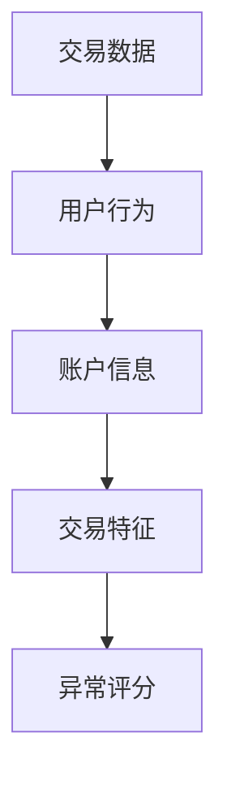
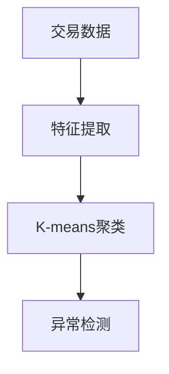
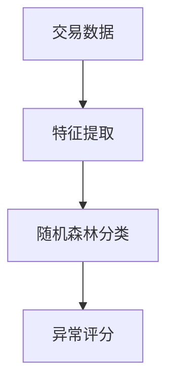
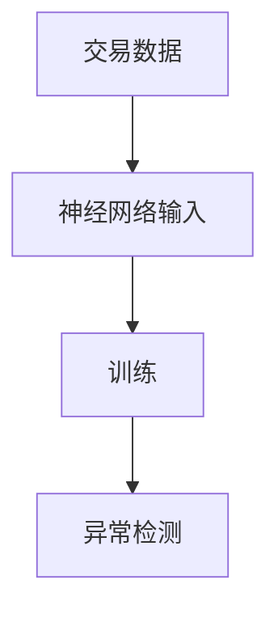
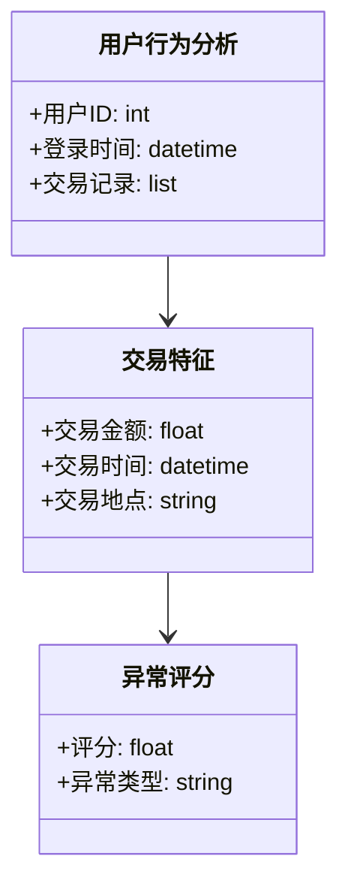
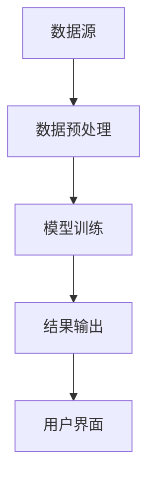
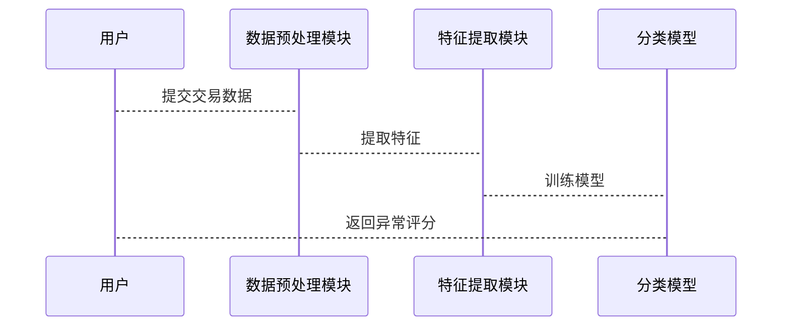

                 


# AI在反洗钱模式识别中的创新应用

## 关键词
反洗钱, 人工智能, 模式识别, 机器学习, 异常检测, 金融安全

## 摘要
本文探讨了人工智能技术在反洗钱模式识别中的创新应用，分析了传统反洗钱方法的局限性，详细讲解了基于AI的模式识别技术，包括核心概念、算法原理、系统架构设计和实际案例分析。通过结合理论与实践，展示了AI如何提升反洗钱的效率和准确性。

---

# 第一部分: AI在反洗钱模式识别中的背景与核心概念

## 第1章: 反洗钱模式识别的背景与问题

### 1.1 反洗钱的基本概念与挑战
#### 1.1.1 反洗钱的基本定义
反洗钱是指通过合法手段将非法获得的资金转化为看似合法的资产的行为。传统反洗钱方法依赖人工分析和规则匹配，效率低下且容易被规避。

#### 1.1.2 反洗钱的传统方法与局限性
- **传统方法**：基于规则的交易监控、人工审查。
- **局限性**：难以发现复杂、隐蔽的洗钱行为，误报率高。

#### 1.1.3 数字化时代的洗钱新特点
- 交易速度快、规模大。
- 利用匿名账户和加密货币。
- 洗钱行为更加隐蔽，难以识别。

### 1.2 AI技术在金融领域的应用现状
#### 1.2.1 AI技术在金融领域的核心应用
- 风险评估、信用评分、欺诈检测。
- 通过自然语言处理（NLP）分析财务报告。

#### 1.2.2 AI在反洗钱领域的潜力与优势
- **潜力**：实时分析大量数据，发现隐藏模式。
- **优势**：提高检测精度，减少误报率。

#### 1.2.3 当前反洗钱模式识别的主要痛点
- 数据量大，传统方法难以处理。
- 洗钱手段不断进化，规则难以覆盖所有情况。

### 1.3 AI在反洗钱模式识别中的创新点
#### 1.3.1 基于AI的模式识别新方法
- 使用聚类分析识别异常交易。
- 通过深度学习提取交易特征。

#### 1.3.2 AI技术如何提升反洗钱效率
- 自动化分析海量数据，提高效率。
- 实时监控，快速识别可疑交易。

#### 1.3.3 创新应用的边界与外延
- AI技术在反洗钱中的适用场景和局限性。
- 结合传统方法，形成混合模式。

## 第2章: AI在反洗钱模式识别中的核心概念

### 2.1 模式识别的基本原理
#### 2.1.1 模式识别的定义与分类
- 定义：通过计算机技术分析数据，识别模式。
- 分类：分类、聚类、异常检测。

#### 2.1.2 机器学习在模式识别中的作用
- 监督学习：分类问题。
- 无监督学习：聚类分析。

#### 2.1.3 深度学习与传统机器学习的对比
- 深度学习：自动提取特征，适合复杂模式。
- 传统机器学习：依赖特征工程。

### 2.2 反洗钱模式识别的核心要素
#### 2.2.1 交易数据的特征提取
- 交易金额、频率、时间、地点。
- 用户行为特征：登录时间、操作习惯。

#### 2.2.2 用户行为分析的关键指标
- 登录IP分布、交易地点变化。
- 账户活跃度、交易规模突变。

#### 2.2.3 异常检测的核心要素
- 统计异常：偏离正常分布。
- 行为异常：与用户历史行为不符。

### 2.3 AI技术与反洗钱业务的结合
#### 2.3.1 AI技术在反洗钱中的应用场景
- 实时监控：检测可疑交易。
- 历史数据分析：识别洗钱模式。
- 风险评估：预测潜在洗钱行为。

#### 2.3.2 模式识别在反洗钱中的核心流程
- 数据采集：收集交易数据。
- 特征提取：提取关键特征。
- 模型训练：训练分类或聚类模型。
- 结果分析：识别异常交易。

#### 2.3.3 AI驱动的反洗钱模式识别架构
- 数据预处理：清洗和格式化数据。
- 模型选择：根据需求选择算法。
- 结果优化：调整参数提高准确率。

---

# 第二部分: AI反洗钱模式识别的核心技术与应用

## 第3章: AI反洗钱模式识别的核心概念与联系

### 3.1 核心概念原理
#### 3.1.1 模式识别的数学模型
- 分类模型：逻辑回归、随机森林。
- 聚类模型：K-means、DBSCAN。

#### 3.1.2 AI算法在反洗钱中的应用逻辑
- 输入：交易数据。
- 输出：异常评分。
- 中间过程：特征提取、模型训练。

#### 3.1.3 异常检测的原理与实现
- 统计方法：Z-score、标准差。
- 深度学习：AE（自编码器）。

### 3.2 核心概念属性对比
#### 3.2.1 传统反洗钱方法与AI方法的对比
| 方法         | 优点                       | 缺点                       |
|--------------|----------------------------|--------------------------|
| 传统规则     | 明确的规则，易于解释       | 难以应对复杂模式           |
| AI模式识别   | 高准确性，适应复杂场景     | 黑箱问题，解释性差         |

#### 3.2.2 模式识别与异常检测的对比
| 技术         | 适用场景                   | 特点                       |
|--------------|----------------------------|--------------------------|
| 分类         | 已知类别                    | 需要大量标注数据           |
| 聚类         | 未知类别                    | 无需标注数据，发现潜在模式 |

#### 3.2.3 深度学习与传统机器学习的对比
| 技术         | 特点                       | 适用场景                   |
|--------------|----------------------------|--------------------------|
| 深度学习     | 自动提取特征，适合复杂模式 | 大数据环境                 |
| 传统机器学习 | 特征工程依赖，适合简单模式 | 数据量小，计算效率高         |

### 3.3 实体关系与ER图架构


---

## 第4章: AI反洗钱模式识别的算法原理

### 4.1 常用算法与流程图
#### 4.1.1 聚类算法

数学公式：
$$
\text{目标函数} = \sum_{i=1}^{k} \sum_{j=1}^{n_i} (x_i - c_j)^2
$$

#### 4.1.2 分类算法

数学公式：
$$
\text{概率} = \sum_{i=1}^{n} w_i x_i
$$

#### 4.1.3 深度学习算法

数学公式：
$$
\text{损失函数} = \sum_{i=1}^{m} (y_i - \hat{y}_i)^2
$$

### 4.2 数学模型与代码实现
#### 4.2.1 聚类算法代码
```python
from sklearn.cluster import KMeans
from sklearn.preprocessing import StandardScaler

# 数据预处理
scaler = StandardScaler()
data_scaled = scaler.fit_transform(data)

# 聚类
kmeans = KMeans(n_clusters=3)
labels = kmeans.fit_predict(data_scaled)
```

#### 4.2.2 分类算法代码
```python
from sklearn.ensemble import RandomForestClassifier

# 训练模型
model = RandomForestClassifier(n_estimators=100)
model.fit(X_train, y_train)

# 预测
y_pred = model.predict(X_test)
```

---

## 第5章: 系统分析与架构设计方案

### 5.1 系统功能设计


### 5.2 系统架构设计


### 5.3 接口设计
- 输入接口：交易数据API。
- 输出接口：异常评分API。

### 5.4 交互流程图


---

## 第6章: 项目实战

### 6.1 环境安装
- Python 3.8+
- Scikit-learn、TensorFlow、Pandas

### 6.2 核心代码实现
#### 特征提取
```python
import pandas as pd

data = pd.read_csv('transaction.csv')
features = data[['amount', 'time', 'location']]
```

#### 模型训练
```python
from sklearn.model_selection import train_test_split
from sklearn.metrics import accuracy_score

X_train, X_test, y_train, y_test = train_test_split(features, labels, test_size=0.2)
model = RandomForestClassifier().fit(X_train, y_train)
print("Accuracy:", accuracy_score(model.predict(X_test), y_test))
```

### 6.3 实际案例分析
- 数据来源：银行交易记录。
- 分析结果：识别高风险交易。
- 案例总结：AI技术显著提高了检测效率和准确性。

### 6.4 项目小结
通过项目实战，验证了AI技术在反洗钱中的有效性，为实际应用提供了参考。

---

## 第7章: 最佳实践与总结

### 7.1 小结
AI技术在反洗钱中的应用前景广阔，能够显著提升检测效率和准确性。

### 7.2 注意事项
- 数据隐私保护。
- 模型解释性问题。
- 持续优化模型。

### 7.3 拓展阅读
- 《机器学习实战》。
- 《深度学习》。

---

# 作者
作者：AI天才研究院 & 禅与计算机程序设计艺术

