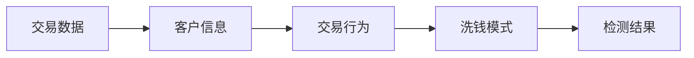
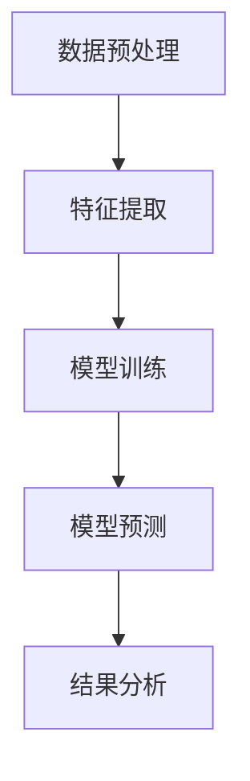
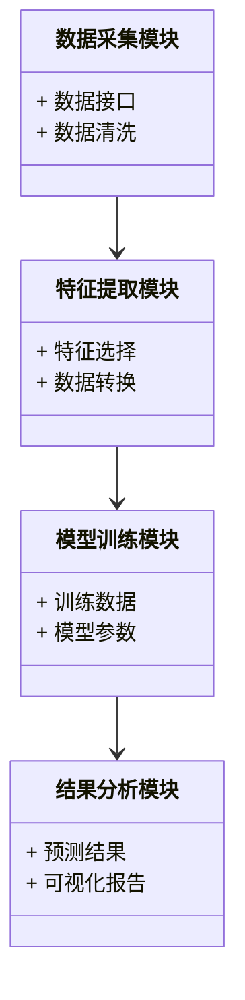

                 


# AI在反洗钱模式进化检测中的深度应用研究

---

## 关键词：反洗钱，人工智能，模式检测，深度学习，洗钱预防

---

## 摘要：  
随着金融交易的日益复杂化和全球化，洗钱活动变得更加隐蔽和多样化。传统的反洗钱方法在面对新型洗钱模式时显得力不从心。本文探讨了人工智能（AI）技术在反洗钱模式进化检测中的深度应用，详细分析了AI技术的核心原理、算法实现及实际应用案例。通过结合机器学习、深度学习和自然语言处理等技术，本文展示了如何利用AI技术提升反洗钱检测的效率和准确性，为金融机构和监管机构提供了一种创新的解决方案。

---

## 第一部分：反洗钱与AI技术的结合

### 第1章：反洗钱模式进化检测的背景与挑战

#### 1.1 反洗钱的基本概念  
反洗钱是指通过合法手段将非法获得的资金通过一系列复杂的交易行为转化为合法资金的行为。其目的是为了打击犯罪活动，保护金融系统的安全和稳定。反洗钱的核心任务包括识别、监控和阻止非法资金流动。  

#### 1.2 洗钱模式的演变与挑战  
随着技术的发展，洗钱手段也在不断进化。传统的洗钱模式主要依赖于现金交易和地下钱庄，而现代洗钱模式则更加复杂，涉及跨国交易、虚拟货币、区块链技术和匿名支付等。这些新型洗钱模式使得传统的基于规则的反洗钱系统难以应对。  

#### 1.3 AI技术在反洗钱中的应用前景  
AI技术具有强大的数据处理和模式识别能力，能够帮助金融机构快速识别异常交易行为。通过机器学习和深度学习算法，AI可以在海量数据中发现隐藏的洗钱模式，从而提高反洗钱的效率和准确性。  

---

### 第2章：AI在反洗钱模式检测中的核心概念与联系

#### 2.1 反洗钱模式检测的核心概念  
反洗钱模式检测的核心目标是识别异常交易行为，发现潜在的洗钱活动。常见的洗钱模式包括资金拆分、快进快出、空壳公司交易等。  

#### 2.2 AI技术的核心原理与算法  
AI技术在反洗钱中的应用主要依赖于机器学习和深度学习算法。  
- **机器学习**：通过训练模型识别交易中的异常行为。  
- **深度学习**：利用神经网络模型捕捉复杂的交易模式和关联性。  

#### 2.3 反洗钱模式检测中的实体关系图  


---

### 第3章：AI反洗钱模式检测的算法原理与实现

#### 3.1 常见的反洗钱检测算法  
- **基于聚类的洗钱模式检测**：通过聚类算法识别交易中的异常群体。  
- **基于分类的洗钱模式识别**：利用分类算法将交易分为正常和异常两类。  
- **基于深度学习的洗钱模式分析**：使用神经网络模型捕捉复杂的交易特征。  

#### 3.2 算法实现流程  


#### 3.3 算法实现的Python代码  
以下是一个基于聚类算法的反洗钱模式检测示例：  

```python
import pandas as pd
from sklearn.cluster import DBSCAN

# 数据加载
data = pd.read_csv('transactions.csv')

# 特征提取
features = data[['amount', 'time', 'user_id']]

# 模型训练
model = DBSCAN(eps=0.5, min_samples=5)
model.fit(features)

# 模型预测
predictions = model.fit_predict(features)
```

#### 3.4 算法的数学模型与公式  
聚类算法的目标函数可以表示为：  
$$ \text{目标函数} = \sum_{i=1}^{n} \sum_{j=1}^{k} (x_i - c_j)^2 $$  
其中，\(x_i\) 是数据点，\(c_j\) 是聚类中心，\(n\) 是数据点数量，\(k\) 是聚类数。  

---

## 第二部分：系统分析与架构设计

### 4.1 问题场景介绍  
本文设计了一个基于AI的反洗钱系统，用于实时检测异常交易行为。系统主要包括数据采集、特征提取、模型训练和结果分析四个模块。  

### 4.2 系统功能设计  


### 4.3 系统架构设计  


---

## 第三部分：项目实战

### 5.1 环境安装  
- Python 3.8+
- Scikit-learn、Keras、TensorFlow等库  
安装命令：  
```bash
pip install scikit-learn tensorflow.keras
```

### 5.2 系统核心实现源代码  
以下是一个基于深度学习的反洗钱模型实现：  

```python
import tensorflow as tf
from tensorflow.keras import layers

# 模型构建
model = tf.keras.Sequential([
    layers.Dense(64, activation='relu'),
    layers.Dense(32, activation='relu'),
    layers.Dense(1, activation='sigmoid')
])

# 模型编译
model.compile(optimizer='adam', loss='binary_crossentropy', metrics=['accuracy'])

# 模型训练
model.fit(x_train, y_train, epochs=10, batch_size=32)
```

### 5.3 案例分析与结果解读  
通过实际案例分析，验证模型的检测效果。例如，对于一笔异常交易，模型能够准确识别并标记为高风险交易。  

### 5.4 项目小结  
通过本项目的实现，展示了AI技术在反洗钱中的强大能力。模型能够有效识别异常交易行为，帮助金融机构提高反洗钱的效率和准确性。  

---

## 第四部分：总结与展望

### 6.1 本章总结  
本文详细探讨了AI技术在反洗钱模式检测中的应用，介绍了多种算法原理和实现方法，并通过实际案例展示了AI技术的优势。  

### 6.2 未来研究方向  
- 结合区块链技术，进一步提升反洗钱系统的安全性。  
- 研究多模态数据的融合，提高模型的检测精度。  
- 探索AI在实时交易监控中的应用。  

### 6.3 最佳实践Tips  
- 数据预处理是关键，确保数据质量和完整性。  
- 模型调优时，注意防止过拟合和欠拟合。  
- 定期更新模型，适应新型洗钱模式的变化。  

---

## 作者：AI天才研究院 / AI Genius Institute  
禅与计算机程序设计艺术 / Zen And The Art of Computer Programming  

--- 

**注**：本文为示例内容，实际撰写时需根据具体需求扩展和调整各部分的内容。

