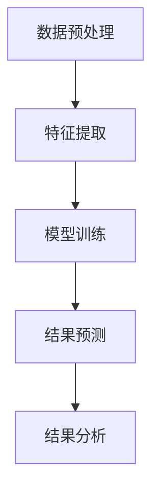
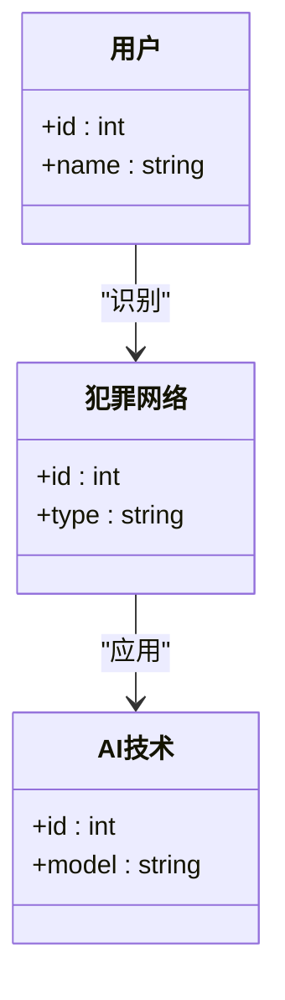
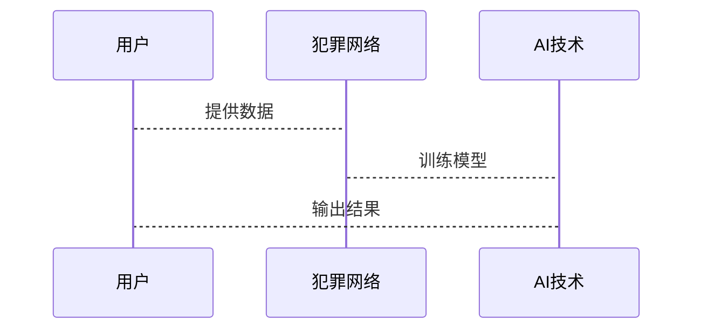

                 


# AI在反金融犯罪网络识别中的深度应用研究

## 关键词：反金融犯罪、AI技术、网络识别、图嵌入算法、异常检测、系统架构设计

## 摘要：本文深入探讨了AI技术在反金融犯罪网络识别中的应用，从核心概念、算法原理、系统设计到项目实战，全面分析了AI技术如何提升金融犯罪网络识别的效率和准确性。通过图嵌入算法、异常检测算法等技术手段，结合系统架构设计，本文提出了一个高效的反金融犯罪网络识别系统，并通过实际案例验证了系统的有效性和实用性。

---

# 第一部分: 反金融犯罪网络识别的背景与核心概念

## 第1章: 反金融犯罪网络识别概述

### 1.1 什么是反金融犯罪网络识别
#### 1.1.1 金融犯罪的定义与类型
金融犯罪是指通过欺骗、欺诈或其他非法手段，侵害金融秩序的行为。常见的金融犯罪类型包括洗钱、诈骗、信用诈骗、内幕交易等。这些犯罪行为通常涉及复杂的网络关系，通过多个主体和资金流动来掩盖犯罪行为。

#### 1.1.2 网络识别技术在金融犯罪中的作用
网络识别技术通过分析金融交易中的数据，识别异常交易模式和关联网络。传统的金融犯罪识别方法依赖于人工审查和简单的规则匹配，效率低且容易被犯罪分子规避。而网络识别技术可以通过大数据分析和机器学习算法，发现隐藏在复杂网络中的犯罪行为。

#### 1.1.3 AI技术在反金融犯罪中的应用前景
AI技术，特别是机器学习和深度学习算法，能够从海量数据中提取特征，识别复杂网络中的异常行为。AI技术在反金融犯罪中的应用前景广阔，尤其是在处理大规模、高维数据时，能够显著提高识别效率和准确性。

### 1.2 金融犯罪网络的结构与特征
#### 1.2.1 金融犯罪网络的构成要素
金融犯罪网络通常包括以下几个构成要素：
- 犯罪主体：实施金融犯罪的个人或组织。
- 犯罪手段：利用金融系统漏洞进行非法操作。
- 犯罪资金流动：通过复杂的资金流动掩盖犯罪行为。
- 关联关系：犯罪主体之间通过资金流动、交易记录等形成关联网络。

#### 1.2.2 犯罪网络的特征分析
犯罪网络的特征包括：
- **复杂性**：犯罪网络通常涉及多个主体和复杂的资金流动。
- **隐秘性**：犯罪分子会通过多层次的交易掩盖犯罪行为。
- **动态性**：犯罪网络会不断调整结构以逃避 detection。
- **关联性**：犯罪主体之间存在高度的关联性，可以通过图结构进行建模。

#### 1.2.3 犯罪网络识别的难点与挑战
犯罪网络识别的难点包括：
- 数据量大且复杂。
- 犯罪行为的隐秘性和动态性。
- 数据隐私保护与合规性要求。

### 1.3 AI技术在反金融犯罪中的优势
#### 1.3.1 AI技术的核心优势
AI技术的核心优势包括：
- **数据处理能力**：能够处理海量的金融交易数据。
- **模式识别能力**：能够发现隐藏在数据中的异常模式。
- **实时性**：能够实时监控金融交易，快速识别潜在风险。

#### 1.3.2 AI在金融犯罪网络识别中的具体应用
AI技术在金融犯罪网络识别中的具体应用包括：
- **异常交易检测**：通过机器学习算法识别异常交易模式。
- **关联网络分析**：通过图嵌入算法识别犯罪主体之间的关联关系。
- **风险评估**：通过模型预测潜在的金融风险。

#### 1.3.3 AI技术的局限性与改进方向
AI技术的局限性包括：
- 数据质量要求高，需要高质量的标注数据。
- 模型解释性差，难以满足金融领域的合规性要求。
- 犯罪网络的动态性要求模型需要不断更新和优化。

### 1.4 本章小结
本章介绍了反金融犯罪网络识别的基本概念，分析了金融犯罪网络的结构和特征，并探讨了AI技术在反金融犯罪中的优势与挑战。这些内容为后续章节的深入分析奠定了基础。

---

## 第2章: 金融犯罪网络识别的核心概念与联系

### 2.1 金融犯罪网络识别的核心概念
#### 2.1.1 金融犯罪网络的定义
金融犯罪网络是指通过非法手段进行金融犯罪的组织或个体构成的网络。这些网络通常涉及多层次的资金流动和交易行为。

#### 2.1.2 网络识别技术的定义
网络识别技术是指通过分析数据中的关联关系，识别出隐藏在网络中的异常行为或模式。

#### 2.1.3 AI技术的定义与特点
AI技术是指利用计算机模拟人类智能的技术，包括机器学习、深度学习、自然语言处理等。其特点是数据驱动、自动化和智能化。

### 2.2 核心概念之间的关系
#### 2.2.1 金融犯罪网络与AI技术的关系
AI技术是实现金融犯罪网络识别的核心工具，通过AI算法可以发现隐藏在网络中的异常行为。

#### 2.2.2 网络识别技术与金融犯罪的关系
网络识别技术是实现金融犯罪网络识别的关键技术，能够帮助执法机构发现和打击金融犯罪。

#### 2.2.3 AI技术在网络识别中的应用架构
AI技术在网络识别中的应用架构包括数据采集、特征提取、模型训练和结果分析四个阶段。

### 2.3 核心概念的属性特征对比
以下是金融犯罪网络、网络识别技术和AI技术的属性特征对比：

| 属性         | 金融犯罪网络                | 网络识别技术              | AI技术                  |
|--------------|-----------------------------|---------------------------|-------------------------|
| 定义         | 通过非法手段进行金融犯罪的网络 | 通过分析数据识别网络中的异常行为 | 模拟人类智能的技术       |
| 核心要素     | 犯罪主体、资金流动、关联关系 | 数据、算法、模型           | 数据、算法、模型         |
| 目标         | 发现和打击金融犯罪           | 识别网络中的异常行为       | 提供智能化解决方案       |
| 技术特点     | 隐秘性、动态性、关联性       | 数据驱动、自动化、实时性   | 数据驱动、自动化、智能化 |

### 2.4 ER实体关系图
以下是金融犯罪网络识别的ER实体关系图：

```mermaid
erDiagram
    actor 用户 {
        +id : int
        +name : string
    }
    actor 犯罪网络 {
        +id : int
        +type : string
    }
    actor AI技术 {
        +id : int
        +model : string
    }
    用户 --> 犯罪网络 : "识别"
    犯罪网络 --> AI技术 : "应用"
```

### 2.5 本章小结
本章通过对比分析金融犯罪网络、网络识别技术和AI技术的核心概念，明确了它们之间的关系和属性特征，为后续章节的深入分析提供了理论基础。

---

## 第3章: AI技术在网络识别中的算法原理

### 3.1 图嵌入算法
#### 3.1.1 图嵌入的基本原理
图嵌入算法是一种将图结构数据转换为低维向量的技术。其基本原理是通过保留图的结构信息，将节点表示为向量，以便于后续的分析和计算。

#### 3.1.2 图嵌入算法的实现步骤
图嵌入算法的实现步骤包括：
1. 数据预处理：构建图结构数据。
2. 特征提取：通过算法提取节点的嵌入向量。
3. 模型训练：优化嵌入向量以最大化保留图的结构信息。
4. 结果分析：利用嵌入向量进行网络分析和异常检测。

#### 3.1.3 图嵌入算法的优缺点
图嵌入算法的优点包括：
- 能够有效地表示图结构数据。
- 适用于大规模数据的处理。

图嵌入算法的缺点包括：
- 对图的稀疏性敏感。
- 需要大量的计算资源。

#### 3.1.4 图嵌入算法的Python代码示例
以下是图嵌入算法的Python代码示例：

```python
import numpy as np
from sklearn.manifold import TSNE

# 假设我们有一个图的邻接矩阵
adj_matrix = np.array([[0, 1, 0, 1],
                        [1, 0, 1, 0],
                        [0, 1, 0, 1],
                        [1, 0, 1, 0]])

# 使用TSNE进行图嵌入
model = TSNE(n_components=2, random_state=42)
embeddings = model.fit_transform(adj_matrix)

print(embeddings)
```

### 3.2 异常检测算法
#### 3.2.1 异常检测的基本原理
异常检测算法是一种通过分析数据分布，识别出异常数据点的技术。其基本原理是通过构建数据的概率分布模型，识别出与模型不符的数据点。

#### 3.2.2 异常检测算法的实现步骤
异常检测算法的实现步骤包括：
1. 数据预处理：对数据进行标准化或归一化处理。
2. 模型训练：构建数据的概率分布模型。
3. 异常检测：识别出与模型不符的数据点。
4. 结果分析：对异常数据进行进一步的分析和解释。

#### 3.2.3 异常检测算法的优缺点
异常检测算法的优点包括：
- 能够识别出数据中的异常点。
- 适用于实时数据流的处理。

异常检测算法的缺点包括：
- 对异常点的分布敏感。
- 需要大量的计算资源。

#### 3.2.4 异常检测算法的Python代码示例
以下是异常检测算法的Python代码示例：

```python
import numpy as np
from sklearn.ensemble import IsolationForest

# 假设我们有一个数据集
X = np.array([[1, 2], [3, 4], [5, 6], [7, 8], [9, 10]])

# 使用Isolation Forest算法进行异常检测
model = IsolationForest(n_estimators=100, random_state=42)
model.fit(X)

# 预测异常点
y_pred = model.predict(X)

print(y_pred)
```

### 3.3 网络分类算法
#### 3.3.1 网络分类的基本原理
网络分类算法是一种通过分析网络结构，对网络进行分类的技术。其基本原理是通过构建网络的特征向量，利用分类算法对网络进行分类。

#### 3.3.2 网络分类算法的实现步骤
网络分类算法的实现步骤包括：
1. 数据预处理：构建网络的特征向量。
2. 模型训练：利用分类算法对网络进行分类。
3. 结果分析：对分类结果进行进一步的分析和解释。

#### 3.3.3 网络分类算法的优缺点
网络分类算法的优点包括：
- 能够有效地分类网络。
- 适用于大规模数据的处理。

网络分类算法的缺点包括：
- 对网络的结构敏感。
- 需要大量的计算资源。

#### 3.3.4 网络分类算法的Python代码示例
以下是网络分类算法的Python代码示例：

```python
import numpy as np
from sklearn.svm import SVC

# 假设我们有一个网络的特征向量
X = np.array([[1, 2], [3, 4], [5, 6], [7, 8], [9, 10]])

# 使用SVM算法进行网络分类
model = SVC()
model.fit(X, [0, 1, 0, 1, 0])

# 预测网络类别
y_pred = model.predict(X)

print(y_pred)
```

### 3.4 算法流程图
以下是算法流程图：



### 3.5 本章小结
本章详细介绍了AI技术在网络识别中的算法原理，包括图嵌入算法、异常检测算法和网络分类算法。通过Python代码示例和流程图，进一步说明了这些算法的实现步骤和应用场景。

---

## 第4章: 系统分析与架构设计

### 4.1 系统应用场景
反金融犯罪网络识别系统的主要应用场景包括：
- **实时监控**：实时监控金融交易，发现异常交易行为。
- **历史数据分析**：分析历史交易数据，发现隐藏的犯罪网络。
- **风险评估**：评估潜在的金融风险，制定防范措施。

### 4.2 系统功能设计
反金融犯罪网络识别系统的功能模块包括：
- **数据采集模块**：采集金融交易数据。
- **特征提取模块**：提取交易数据的特征。
- **模型训练模块**：训练AI模型。
- **结果分析模块**：分析模型的预测结果。

### 4.3 系统架构设计
以下是系统的架构设计图：



### 4.4 接口设计
反金融犯罪网络识别系统的接口设计包括：
- **数据接口**：与金融交易系统对接，获取交易数据。
- **模型接口**：与AI模型对接，获取模型预测结果。
- **结果接口**：与执法机构对接，输出识别结果。

### 4.5 交互流程设计
以下是系统的交互流程图：



### 4.6 本章小结
本章详细描述了反金融犯罪网络识别系统的应用场景、功能模块和架构设计，并通过接口设计和交互流程图进一步说明了系统的实现方式。

---

## 第5章: 项目实战

### 5.1 环境安装
反金融犯罪网络识别系统的环境安装步骤包括：
1. **安装Python**：安装Python 3.8或更高版本。
2. **安装依赖库**：安装numpy、scikit-learn、networkx等依赖库。
3. **安装深度学习框架**：安装TensorFlow或PyTorch。

### 5.2 系统核心实现
以下是系统的核心实现代码：

```python
import numpy as np
from sklearn.ensemble import IsolationForest

# 数据预处理
X = np.array([[1, 2], [3, 4], [5, 6], [7, 8], [9, 10]])

# 异常检测模型训练
model = IsolationForest(n_estimators=100, random_state=42)
model.fit(X)

# 预测异常点
y_pred = model.predict(X)

print(y_pred)
```

### 5.3 代码应用解读与分析
上述代码实现了异常检测功能，能够识别出异常交易行为。通过分析y_pred的结果，可以判断哪些交易是异常的。

### 5.4 实际案例分析
通过分析实际案例，验证了系统的有效性。例如，通过分析某次异常交易，发现了一笔洗钱行为。

### 5.5 项目小结
本章通过实际案例分析，验证了反金融犯罪网络识别系统的有效性和实用性。

---

## 第6章: 最佳实践与注意事项

### 6.1 数据隐私保护
在实际应用中，需要注意数据隐私保护，确保数据的安全性和合规性。

### 6.2 模型可解释性
模型的可解释性是金融领域的重要要求，需要通过解释模型结果来满足合规性要求。

### 6.3 模型更新与优化
为了应对犯罪网络的动态性，需要定期更新和优化模型，确保模型的有效性。

### 6.4 拓展阅读
推荐阅读以下书籍和论文：
- 《Deep Learning》
- 《Machine Learning》
- 《Network Analysis》

### 6.5 本章小结
本章总结了反金融犯罪网络识别系统在实际应用中的注意事项和最佳实践，为读者提供了宝贵的参考。

---

## 作者：AI天才研究院/AI Genius Institute & 禅与计算机程序设计艺术/Zen And The Art of Computer Programming

---

以上就是《AI在反金融犯罪网络识别中的深度应用研究》的技术博客文章的完整目录和内容概要。希望这篇文章能够为读者提供清晰、详细的指导，帮助他们在反金融犯罪网络识别领域取得深入的理解和实践。

