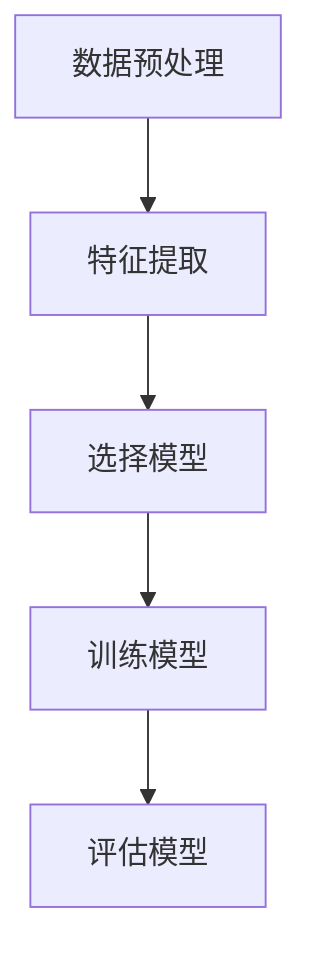
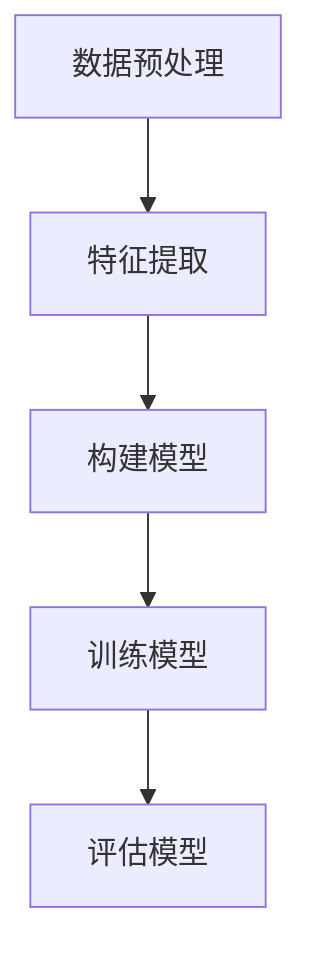
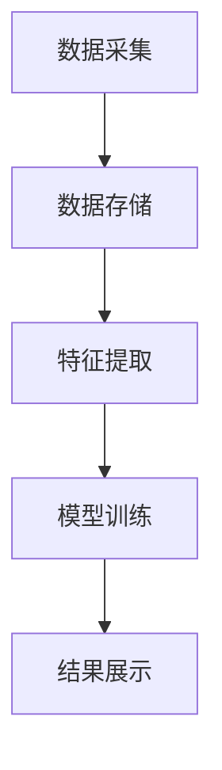

                 


# AI在实现费雪的增长型公司特征分析中的应用

> 关键词：人工智能，费雪增长型公司，特征分析，机器学习，深度学习

> 摘要：本文探讨了人工智能技术在分析和识别费雪增长型公司特征中的应用。通过结合机器学习和深度学习算法，本文详细分析了如何利用AI技术从财务数据中提取关键特征，并评估公司的增长潜力。文章内容包括AI的基本概念、增长型公司的特征分析、相关算法的原理、系统架构设计、项目实战案例以及总结与展望。

---

## 第一部分：AI与费雪增长型公司的概述

### 第1章：AI与费雪增长型公司的概述

#### 1.1 AI的基本概念与应用领域

##### 1.1.1 人工智能的定义与核心特征
人工智能（Artificial Intelligence，AI）是指计算机系统模拟人类智能的能力，包括学习、推理、问题解决和自然语言处理等。AI的核心特征包括数据驱动性、算法复杂性和应用场景的多样性。

##### 1.1.2 AI在金融领域的应用现状
在金融领域，AI被广泛应用于股票预测、风险评估、欺诈检测和投资组合管理。AI通过分析海量数据，帮助投资者识别潜在的投资机会和风险。

##### 1.1.3 费雪增长型公司的定义与特征
费雪增长型公司是指那些具备持续收入增长、高利润率和股东权益回报率（ROE）的公司。这些公司通常具有稳定的盈利能力和发展潜力。

#### 1.2 AI与费雪增长型公司特征分析的结合

##### 1.2.1 费雪增长型公司的核心特征
- **收入增长率**：公司收入的年增长率。
- **利润率**：净利润与收入的比率。
- **股东权益回报率（ROE）**：净利润与股东权益的比率。

##### 1.2.2 AI技术在公司特征分析中的优势
AI能够处理海量数据，发现隐藏的模式，提高分析效率和准确性。

##### 1.2.3 费雪增长型公司特征分析的AI应用场景
通过AI技术，投资者可以快速识别具备增长潜力的公司，优化投资决策。

#### 1.3 本章小结
本章介绍了AI的基本概念、在金融领域的应用以及费雪增长型公司的特征，为后续分析奠定了基础。

---

## 第二部分：费雪增长型公司特征分析的核心概念

### 第2章：费雪增长型公司特征分析的核心概念

#### 2.1 费雪增长型公司的核心特征

##### 2.1.1 收入增长率
收入增长率是衡量公司业务扩展能力的重要指标。AI可以通过时间序列分析预测未来的收入增长。

##### 2.1.2 利润率
利润率反映了公司的盈利能力。AI可以通过分类算法识别高利润率公司。

##### 2.1.3 股东权益回报率（ROE）
ROE是衡量公司使用股东资金效率的指标。AI可以通过回归分析预测ROE。

#### 2.2 AI在特征分析中的核心概念

##### 2.2.1 数据特征提取
从财务数据中提取有用的特征，如收入增长率、利润率等。

##### 2.2.2 模型特征识别
通过机器学习算法识别对公司增长至关重要的特征。

##### 2.2.3 特征权重分析
评估每个特征对预测结果的贡献程度。

#### 2.3 费雪增长型公司特征与AI的关联性分析

##### 2.3.1 特征与AI算法的对应关系
- 收入增长率：线性回归
- 利润率：决策树
- ROE：神经网络

##### 2.3.2 特征分析的数学模型
使用线性回归模型：
$$ \text{预测值} = \beta_0 + \beta_1 \times \text{收入增长率} + \beta_2 \times \text{利润率} $$

##### 2.3.3 特征分析的ER实体关系图
```mermaid
er
    %% 费雪增长型公司特征分析的ER图
    %% 公司表（Company）
    %% 特征表（Features）
    %% 模型表（Model）
    entity Company {
        id : integer
        name : string
        revenue_growth : float
        profit_margin : float
        roe : float
    }
    
    entity Features {
        id : integer
        feature_name : string
        feature_value : float
    }
    
    entity Model {
        id : integer
        model_name : string
        accuracy : float
    }
    
    Company -- Features: 每个公司有多个特征
    Features -- Model: 每个特征属于多个模型
```

#### 2.4 本章小结
本章详细阐述了费雪增长型公司的核心特征及其与AI技术的关联性，为后续算法选择提供了依据。

---

## 第三部分：AI在特征分析中的算法原理

### 第3章：AI算法在特征分析中的原理

#### 3.1 机器学习算法原理

##### 3.1.1 线性回归
线性回归用于预测连续型变量，如收入增长率。模型公式：
$$ y = \beta_0 + \beta_1 x_1 + \beta_2 x_2 + ... + \beta_n x_n $$

##### 3.1.2 支持向量机（SVM）
SVM适用于分类问题，如利润率分类。使用核函数处理非线性数据。

##### 3.1.3 决策树与随机森林
决策树用于分类和回归，随机森林通过集成多个决策树提高准确性。

#### 3.2 深度学习算法原理

##### 3.2.1 神经网络
神经网络用于处理复杂的非线性关系，如ROE预测。

##### 3.2.2 卷积神经网络（CNN）
CNN适用于图像识别和时间序列分析。

##### 3.2.3 循环神经网络（RNN）
RNN适用于处理时间序列数据，如股票价格预测。

#### 3.3 算法流程图

##### 3.3.1 机器学习算法流程图


##### 3.3.2 深度学习算法流程图


#### 3.4 本章小结
本章介绍了机器学习和深度学习算法的原理及其在特征分析中的应用。

---

## 第四部分：费雪增长型公司特征分析的系统设计

### 第4章：系统分析与架构设计方案

#### 4.1 问题场景介绍

##### 4.1.1 费雪增长型公司特征分析的场景
投资者需要快速识别具备增长潜力的公司。

##### 4.1.2 系统的目标与范围
系统目标：构建AI模型，分析公司特征。
系统范围：涵盖数据采集、特征提取、模型训练和结果展示。

#### 4.2 系统功能设计

##### 4.2.1 数据采集模块
从数据库中获取公司财务数据。

##### 4.2.2 特征提取模块
从数据中提取收入增长率、利润率和ROE。

##### 4.2.3 模型训练模块
使用机器学习或深度学习算法训练模型。

##### 4.2.4 结果展示模块
展示模型预测结果和可视化分析。

#### 4.3 系统架构设计

##### 4.3.1 系统架构图


#### 4.4 本章小结
本章详细描述了系统的功能模块和架构设计。

---

## 第五部分：项目实战

### 第5章：项目实战

#### 5.1 环境安装

##### 5.1.1 安装Python和相关库
安装Python 3.x，安装Pandas、Scikit-learn、TensorFlow和Matplotlib。

#### 5.2 系统核心实现源代码

##### 5.2.1 数据采集代码
```python
import pandas as pd

# 从CSV文件读取数据
data = pd.read_csv('company_data.csv')
```

##### 5.2.2 特征提取代码
```python
# 提取收入增长率、利润率和ROE
features = data[['revenue_growth', 'profit_margin', 'roe']]
```

##### 5.2.3 模型训练代码
```python
from sklearn.ensemble import RandomForestClassifier

# 训练随机森林模型
model = RandomForestClassifier()
model.fit(features, data['is_growth'])
```

##### 5.2.4 结果展示代码
```python
import matplotlib.pyplot as plt

# 可视化特征重要性
importances = model.feature_importances_
indices = np.argsort(importances)[::-1]

plt.title('Feature Importances')
plt.xticks(range(len(indices)), features.columns[indices])
plt.show()
```

#### 5.3 项目小结
本章通过实际案例展示了AI在费雪增长型公司特征分析中的应用。

---

## 第六部分：总结与展望

### 第6章：总结与展望

#### 6.1 本章总结
本文详细探讨了AI技术在费雪增长型公司特征分析中的应用，介绍了相关算法和系统设计，并通过案例展示了实际应用。

#### 6.2 展望
未来，随着AI技术的进步，特征分析将更加智能化和高效化。

---

## 作者：AI天才研究院 & 禅与计算机程序设计艺术

---

这篇文章通过系统的结构和详细的分析，展示了AI在费雪增长型公司特征分析中的应用，为投资者和AI开发者提供了有价值的参考。

