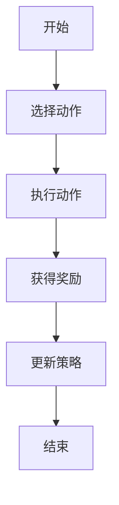
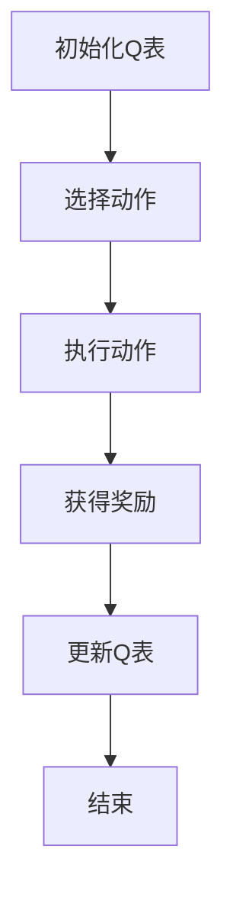
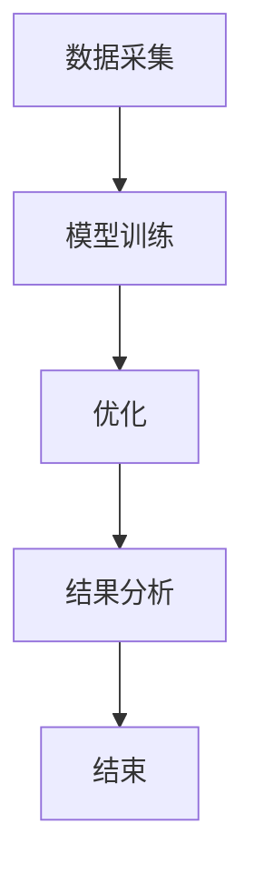
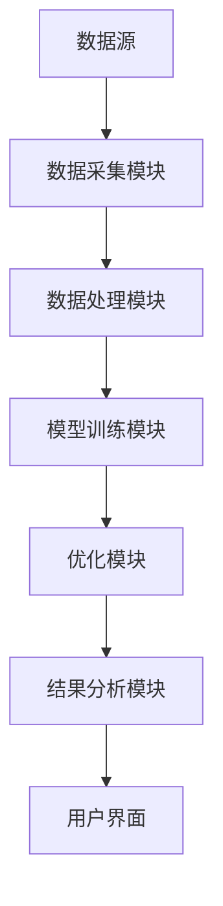
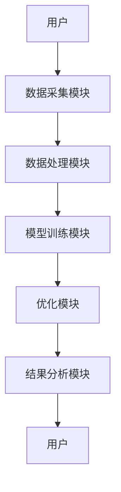

                 


# AI在资产负债管理动态优化中的应用

> 关键词：AI，资产负债管理，动态优化，强化学习，动态规划，金融风险管理

> 摘要：随着人工智能技术的快速发展，AI在金融领域的应用越来越广泛。本文探讨了AI在资产负债管理动态优化中的应用，详细分析了AI技术的核心概念、优化算法、系统架构设计以及实际项目实现。通过具体案例分析，展示了AI如何提升资产负债管理的效率和准确性，为金融行业提供了新的思路和解决方案。

---

# 第1章: 资产负债管理与AI的结合

## 1.1 资产负债管理概述

### 1.1.1 资产负债管理的定义

资产负债管理（Asset-Liability Management，ALM）是指通过合理配置和管理资产与负债，以实现风险最小化、收益最大化的目标。传统上，资产负债管理主要依赖于静态模型和规则-based方法，但在金融市场波动加剧的今天，这种方法已难以满足动态优化的需求。

---

### 1.1.2 资产负债管理的核心目标

资产负债管理的核心目标包括：
- **风险控制**：降低资产与负债之间的错配风险。
- **收益最大化**：通过优化资产配置，提升整体收益。
- **流动性管理**：确保资产的流动性，以应对短期负债的需求。

---

### 1.1.3 资产负债管理的传统方法与挑战

传统方法主要依赖于以下几种手段：
1. **静态模型**：基于历史数据和假设条件进行预测。
2. **规则-based方法**：根据经验制定固定规则，如“保持资产和负债期限匹配”。
3. **手动调整**：由人工根据市场变化进行资产再分配。

然而，这些方法存在以下挑战：
- **数据依赖性强**：难以应对市场环境的快速变化。
- **缺乏实时性**：无法实现动态优化。
- **计算复杂性**：面对海量数据和复杂场景时，效率低下。

---

## 1.2 AI技术在金融领域的应用背景

### 1.2.1 AI技术的基本概念与特点

人工智能（Artificial Intelligence，AI）是指通过模拟人类智能的思维方式，使计算机能够完成特定任务的技术。AI的核心特点包括：
- **数据驱动**：依赖大量数据进行训练。
- **自我学习**：能够通过反馈不断优化模型。
- **泛化能力**：能够在不同场景下进行推理和决策。

---

### 1.2.2 AI在金融领域的应用现状

AI在金融领域的应用已非常广泛，包括：
- **智能投顾**：根据客户需求自动配置投资组合。
- **风险管理**：利用AI进行信用评估和欺诈检测。
- **市场预测**：通过机器学习模型预测股票价格走势。

---

### 1.2.3 资产负债管理与AI技术的结合点

AI技术在资产负债管理中的应用主要体现在以下几个方面：
1. **动态优化**：利用强化学习和动态规划等算法，实现实时优化。
2. **风险预测**：通过AI模型预测市场波动，提前调整资产配置。
3. **数据处理**：AI能够快速处理海量数据，提供实时决策支持。

---

## 1.3 动态优化的基本概念

### 1.3.1 动态优化的定义

动态优化是指在不断变化的环境中，实时调整决策以达到最优目标的过程。与静态优化不同，动态优化强调灵活性和实时性。

---

### 1.3.2 动态优化的核心要素

动态优化的核心要素包括：
1. **状态**：系统当前的运行情况。
2. **动作**：为了达到目标而采取的行动。
3. **奖励**：行动的结果是否符合目标。
4. **策略**：决定如何选择动作的规则。

---

### 1.3.3 动态优化与静态优化的区别

| 特性 | 静态优化 | 动态优化 |
|------|---------|---------|
| 时间维度 | 离线，基于历史数据 | 实时，基于当前状态 |
| 环境变化 | 静态或简单变化 | 动态变化，不可预测 |
| 计算复杂度 | 较低 | 较高 |

---

## 1.4 本章小结

本章介绍了资产负债管理的基本概念、传统方法及其挑战，探讨了AI技术在金融领域的应用背景，最后重点阐述了动态优化的基本概念和核心要素。下一章将深入分析AI与动态优化的结合原理。

---

# 第2章: AI与动态优化的结合原理

## 2.1 AI在动态优化中的核心作用

### 2.1.1 AI算法在动态优化中的应用

AI算法，尤其是强化学习和动态规划，为动态优化提供了强大的工具。这些算法能够实时调整策略，适应市场环境的变化。

---

### 2.1.2 AI如何提升动态优化的效率

AI通过以下方式提升动态优化的效率：
1. **快速决策**：利用机器学习模型，快速生成最优策略。
2. **自我学习**：通过反馈不断优化模型，提升决策精度。
3. **数据驱动**：基于实时数据，动态调整优化目标。

---

### 2.1.3 AI在动态优化中的优势与局限

| 优势 | 局限 |
|------|------|
| 实时性 | 计算资源需求高 |
| 灵活性 | 算法复杂，实施难度大 |
| 数据驱动 | 数据质量对结果影响大 |

---

## 2.2 动态优化的数学模型

### 2.2.1 动态优化的基本数学模型

动态优化的数学模型通常包括以下部分：
1. **状态变量**：$s_t$，表示时间$t$的状态。
2. **动作变量**：$a_t$，表示在状态$s_t$下采取的动作。
3. **奖励函数**：$R(s_t, a_t)$，表示动作$a_t$在状态$s_t$下的奖励。
4. **转移函数**：$P(s_{t+1} | s_t, a_t)$，表示从状态$s_t$采取动作$a_t$后转移到状态$s_{t+1}$的概率。

---

### 2.2.2 资产负债管理中的动态优化模型

在资产负债管理中，动态优化模型可以表示为：
$$
\max_{a_t} \sum_{t=0}^{T} R(s_t, a_t)
$$
其中，$a_t$表示在时间$t$采取的资产调整动作，$R(s_t, a_t)$表示该动作的奖励。

---

### 2.2.3 AI算法在动态优化模型中的应用

AI算法，如强化学习，通过与环境交互，不断优化策略，以最大化累计奖励。

---

## 2.3 AI与动态优化的结合流程

### 2.3.1 数据采集与预处理

1. **数据采集**：从金融市场获取实时数据，包括资产价格、利率等。
2. **数据预处理**：清洗数据，去除噪声，提取特征。

---

### 2.3.2 模型训练与优化

1. **模型训练**：利用历史数据训练AI模型。
2. **策略优化**：通过强化学习算法，优化模型策略。

---

### 2.3.3 结果分析与反馈

1. **结果分析**：评估模型的优化效果。
2. **反馈调整**：根据实际效果调整模型参数。

---

## 2.4 本章小结

本章详细阐述了AI在动态优化中的核心作用，分析了动态优化的数学模型，并提出了AI与动态优化的结合流程。下一章将深入探讨强化学习和动态规划在动态优化中的具体应用。

---

# 第3章: 强化学习在动态优化中的应用

## 3.1 强化学习的基本原理

### 3.1.1 强化学习的定义

强化学习（Reinforcement Learning，RL）是一种通过与环境交互，学习最优策略的技术。其核心是通过试错，找到最优的动作序列，以最大化累计奖励。

---

### 3.1.2 强化学习的核心要素

1. **环境**：系统运行的外部条件。
2. **状态**：系统当前的运行状态。
3. **动作**：系统可以采取的行动。
4. **奖励**：动作的结果是否符合目标。

---

### 3.1.3 强化学习的算法流程



---

## 3.2 Q-learning算法在动态优化中的应用

### 3.2.1 Q-learning算法的数学模型

Q-learning算法通过以下公式更新Q值：
$$
Q(s, a) = Q(s, a) + \alpha \left[ R(s, a) + \gamma \max_{a'} Q(s', a') - Q(s, a) \right]
$$

---

### 3.2.2 Q-learning算法的实现步骤



---

### 3.2.3 Q-learning算法在资产负债管理中的应用案例

假设我们有一个简单的资产组合优化问题，Q-learning算法可以通过以下步骤实现：
1. **初始化Q表**：记录每个状态和动作的Q值。
2. **选择动作**：根据当前状态选择动作。
3. **执行动作**：调整资产配置。
4. **获得奖励**：根据收益和风险计算奖励。
5. **更新Q表**：根据奖励更新Q值。

---

## 3.3 动态规划在优化中的应用

### 3.3.1 动态规划的基本原理

动态规划（Dynamic Programming，DP）是一种通过分解问题，逐步求解的方法。其核心是将复杂问题分解为子问题，通过动态规划方程求解最优解。

---

### 3.3.2 动态规划在动态优化中的应用

动态规划在动态优化中的应用流程如下：
1. **问题分解**：将问题分解为子问题。
2. **状态转移**：通过状态转移方程，建立子问题之间的关系。
3. **动态规划方程**：通过递归方法，求解每个子问题的最优解。

---

### 3.3.3 动态规划与强化学习的区别与联系

| 特性 | 动态规划 | 强化学习 |
|------|---------|---------|
| 是否需要环境 | 需要 | 需要 |
| 是否需要反馈 | 需要 | 需要 |
| 适用场景 | 状态空间有限 | 状态空间有限 |

---

## 3.4 本章小结

本章详细介绍了强化学习和动态规划在动态优化中的应用，通过具体案例展示了Q-learning算法的实现过程。下一章将探讨系统的架构设计。

---

# 第4章: 资产负债管理动态优化的系统架构设计

## 4.1 系统功能设计与实现

### 4.1.1 系统功能模块

1. **数据采集模块**：负责采集金融市场数据。
2. **模型训练模块**：负责训练AI模型。
3. **优化模块**：负责根据模型输出优化资产配置。
4. **结果分析模块**：负责分析优化结果。

---

### 4.1.2 系统功能流程



---

## 4.2 系统架构设计

### 4.2.1 系统架构图



---

## 4.3 系统接口设计

### 4.3.1 数据接口

1. **数据输入接口**：接收金融市场数据。
2. **数据输出接口**：输出优化结果。

---

### 4.3.2 模型接口

1. **模型输入接口**：接收数据处理模块的输出。
2. **模型输出接口**：输出优化策略。

---

## 4.4 系统交互流程



---

## 4.5 本章小结

本章详细设计了资产负债管理动态优化系统的架构，包括功能模块、架构图和交互流程。下一章将通过具体案例展示系统的实现过程。

---

# 第5章: 项目实战

## 5.1 项目背景

本项目旨在利用AI技术实现资产负债管理的动态优化，通过实时调整资产配置，降低风险，提高收益。

---

## 5.2 项目环境搭建

### 5.2.1 环境需求

1. Python 3.8及以上版本
2. TensorFlow或PyTorch框架
3. 数据源：金融市场数据API

---

### 5.2.2 安装依赖

```bash
pip install numpy pandas tensorflow matplotlib
```

---

## 5.3 项目核心代码实现

### 5.3.1 数据处理代码

```python
import pandas as pd
import numpy as np

# 读取数据
data = pd.read_csv('market_data.csv')

# 数据预处理
data = data.dropna()
data = data.iloc[-100:]  # 取最后100天数据
```

---

### 5.3.2 模型训练代码

```python
import tensorflow as tf
from tensorflow.keras import layers

# 构建模型
model = tf.keras.Sequential([
    layers.Dense(64, activation='relu'),
    layers.Dense(32, activation='relu'),
    layers.Dense(1, activation='linear')
])

# 编译模型
model.compile(optimizer='adam', loss='mean_squared_error')
```

---

### 5.3.3 优化策略代码

```python
import numpy as np

# 定义状态空间
state_space = ['低风险', '中风险', '高风险']

# 定义动作空间
action_space = ['买入', '持有', '卖出']

# Q-learning算法实现
class QLearner:
    def __init__(self, state_space, action_space):
        self.state_space = state_space
        self.action_space = action_space
        self.q_table = pd.DataFrame(columns=state_space, index=action_space)

    def choose_action(self, state):
        # 随机选择动作
        return np.random.choice(self.action_space)

    def update_q_table(self, state, action, reward):
        # 更新Q值
        self.q_table[action][state] += reward
```

---

## 5.4 项目小结

本章通过具体案例展示了AI在资产负债管理动态优化中的应用，从环境搭建到代码实现，详细讲解了项目的整个流程。读者可以参考本章内容，快速上手实现类似的动态优化系统。

---

# 第6章: 扩展与展望

## 6.1 当前研究热点

当前，AI在资产负债管理动态优化中的研究热点包括：
1. **可解释性AI**：提升模型的透明度，便于决策者理解。
2. **多智能体系统**：通过多个AI模型协同优化，提升整体效率。
3. **实时性优化**：进一步提升算法的实时性，适应高频交易需求。

---

## 6.2 未来研究方向

未来的研究方向可能包括：
1. **深度强化学习**：结合深度学习和强化学习，提升模型的表达能力。
2. **多目标优化**：在优化过程中同时考虑多个目标，如风险、收益和流动性。
3. **分布式计算**：利用分布式计算技术，提升系统的计算效率。

---

## 6.3 本章小结

本章总结了当前的研究热点和未来的研究方向，为读者提供了进一步学习的方向。全书到此结束，感谢您的阅读！

---

# 作者

作者：AI天才研究院/AI Genius Institute & 禅与计算机程序设计艺术 /Zen And The Art of Computer Programming

---

以上是《AI在资产负债管理动态优化中的应用》的技术博客文章的完整目录和内容大纲。文章从背景介绍、核心概念、算法原理、系统架构设计到项目实战，逐步深入，层层剖析，结合理论与实践，为读者提供了全面而深入的讲解。

