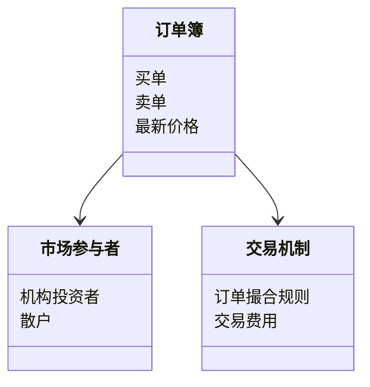
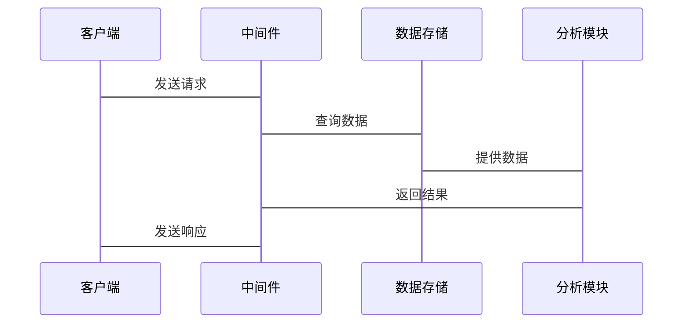

                 


# AI在金融市场微观结构分析中的应用

> 关键词：AI, 金融市场, 微观结构分析, 机器学习, 交易策略, 订单簿

> 摘要：本文探讨了人工智能在金融市场微观结构分析中的应用，包括订单预测、市场情绪分析、高频交易策略等。通过理论与实践结合，深入分析了AI技术在金融领域的潜力与挑战。

---

# 第一部分：引言

## 第1章：引言

### 1.1 问题背景

#### 1.1.1 金融市场的复杂性与挑战
金融市场的运作涉及大量复杂的交易行为和市场参与者，传统的分析方法难以捕捉市场的动态变化。AI技术的引入为解决这些问题提供了新的可能性。

#### 1.1.2 微观结构分析的重要性
微观结构分析关注市场的底层运作机制，包括订单簿、交易行为和市场参与者的互动。了解这些细节对于制定有效的交易策略至关重要。

#### 1.1.3 AI技术在金融领域的潜力
AI技术，特别是机器学习和深度学习，能够处理大量数据并识别复杂模式，为金融市场分析提供了新的工具。

### 1.2 问题描述

#### 1.2.1 微观结构分析的核心问题
- 订单预测
- 市场情绪分析
- 高频交易策略

#### 1.2.2 AI技术如何解决这些问题
- 通过机器学习模型分析历史数据，预测未来订单行为。
- 使用自然语言处理技术分析市场情绪。

### 1.3 问题解决

#### 1.3.1 AI在微观结构分析中的应用场景
- 订单预测：利用历史订单数据训练模型，预测未来的订单行为。
- 市场情绪分析：通过新闻和社交媒体数据，分析市场情绪对价格的影响。
- 高频交易策略：利用AI快速识别市场机会，制定交易策略。

### 1.4 边界与外延

#### 1.4.1 微观结构分析的边界
- 数据范围：通常关注单个市场的微观数据。
- 时间范围：聚焦于短期交易行为。

#### 1.4.2 AI技术的适用范围与限制
- 适用范围：适用于数据量大、模式复杂的情况。
- 限制：依赖高质量数据，且模型可能受到市场变化的影响。

### 1.5 概念结构与核心要素

#### 1.5.1 微观结构分析的核心要素
- 订单簿：记录当前未成交的订单。
- 市场参与者：包括机构投资者、散户等。
- 交易机制：如撮合规则、订单类型。

#### 1.5.2 AI技术的关键组成部分
- 数据输入：金融市场数据。
- 模型训练：机器学习算法。
- 输出结果：预测或决策。

---

# 第二部分：金融市场微观结构基础

## 第2章：金融市场微观结构基础

### 2.1 市场微观结构的定义

#### 2.1.1 市场微观结构的定义与特征
市场微观结构描述了市场的运作机制，包括订单簿、交易行为和市场参与者的互动。

#### 2.1.2 微观结构分析的核心问题
- 订单预测：预测未来订单的数量和价格。
- 市场情绪分析：识别市场参与者的心理状态。
- 交易策略：基于微观结构分析制定交易策略。

### 2.2 订单簿与交易行为

#### 2.2.1 订单簿的构成与运作
订单簿记录了当前未成交的订单，包括买单和卖单。

#### 2.2.2 交易行为的分类与分析
交易行为包括市场订单、限价订单等，不同类型的订单对市场价格有不同的影响。

### 2.3 市场参与者与交易机制

#### 2.3.1 市场参与者的角色与行为
市场参与者包括机构投资者、散户等，不同参与者的行为模式不同。

#### 2.3.2 常见的交易机制与规则
常见的交易机制包括订单撮合规则、交易费用等。

---

# 第三部分：AI技术基础

## 第3章：AI技术基础

### 3.1 机器学习基础

#### 3.1.1 机器学习的基本概念
机器学习是一种人工智能技术，通过数据训练模型，使其能够识别模式。

#### 3.1.2 常见的机器学习算法
- 线性回归：用于预测连续变量。
- 支持向量机（SVM）：用于分类和回归。
- 随机森林：基于决策树的集成学习方法。

#### 3.1.3 机器学习在金融中的应用
- 风险管理：预测违约概率。
- 交易策略：基于模型的信号进行交易。

### 3.2 深度学习基础

#### 3.2.1 深度学习的基本概念
深度学习是一种机器学习技术，通过多层神经网络处理数据。

#### 3.2.2 常见的深度学习模型
- 卷积神经网络（CNN）：处理图像数据。
- 循环神经网络（RNN）：处理序列数据。
- 长短期记忆网络（LSTM）：适用于时间序列数据。

#### 3.2.3 深度学习在金融中的应用
- 时间序列预测：使用LSTM预测股票价格。
- 自然语言处理：分析新闻和社交媒体对市场情绪的影响。

---

# 第四部分：AI在金融市场微观结构分析中的应用

## 第4章：AI在微观结构分析中的应用

### 4.1 订单预测

#### 4.1.1 订单预测的背景与意义
订单预测有助于交易员提前了解市场的买卖情况，制定交易策略。

#### 4.1.2 基于机器学习的订单预测模型
- 数据准备：收集历史订单数据。
- 模型选择：使用随机森林或神经网络。
- 模型训练：训练模型预测订单数量和价格。

### 4.2 市场情绪分析

#### 4.2.1 市场情绪分析的背景与意义
市场情绪分析有助于交易员理解市场的整体情绪，制定交易策略。

#### 4.2.2 基于NLP的市场情绪分析
- 数据来源：新闻、社交媒体。
- 情感分析模型：使用词袋模型或词嵌入模型。
- 情感分析结果的应用：预测市场波动。

### 4.3 高频交易策略

#### 4.3.1 高频交易的背景与意义
高频交易利用算法快速执行交易，捕捉短期市场机会。

#### 4.3.2 基于AI的高频交易策略
- 数据来源：高频市场数据。
- 模型选择：使用LSTM预测价格变化。
- 交易执行：基于模型信号自动执行交易。

---

# 第五部分：系统架构与算法实现

## 第5章：系统架构设计

### 5.1 问题场景介绍
系统设计用于实时分析金融市场数据，提供订单预测和交易信号。

### 5.2 项目介绍
- 项目目标：实时分析订单簿数据，预测订单行为，提供交易信号。
- 项目范围：单个市场的微观结构分析。

### 5.3 系统功能设计

#### 5.3.1 领域模型


#### 5.3.2 系统架构


#### 5.3.3 系统接口设计
- 输入接口：接收金融市场数据。
- 输出接口：提供订单预测结果和交易信号。

#### 5.3.4 系统交互


### 5.4 算法实现

#### 5.4.1 基于随机森林的订单预测
```python
import pandas as pd
from sklearn.ensemble import RandomForestRegressor

# 数据准备
data = pd.read_csv('order_book.csv')
features = data[['bid_price', 'ask_price', 'volume']]
target = data['order_count']

# 模型训练
model = RandomForestRegressor(n_estimators=100)
model.fit(features, target)

# 预测
new_data = pd.read_csv('new_order_book.csv')
new_features = new_data[['bid_price', 'ask_price', 'volume']]
predictions = model.predict(new_features)
```

#### 5.4.2 基于LSTM的市场情绪分析
```python
import numpy as np
from tensorflow.keras.models import Sequential
from tensorflow.keras.layers import LSTM, Dense

# 数据准备
data = np.array([...])  # 时间序列数据

# 模型训练
model = Sequential()
model.add(LSTM(64, input_shape=(timesteps, features)))
model.add(Dense(1))
model.compile(loss='mean_squared_error', optimizer='adam')
model.fit(x_train, y_train, epochs=100, batch_size=32)

# 预测
x_test = np.array([...])
predictions = model.predict(x_test)
```

---

# 第六部分：项目实战

## 第6章：项目实战

### 6.1 环境配置

#### 6.1.1 安装必要的库
```bash
pip install pandas numpy scikit-learn tensorflow
```

### 6.2 系统核心实现

#### 6.2.1 数据获取
```python
import pandas as pd
data = pd.read_csv('market_data.csv')
```

#### 6.2.2 特征工程
```python
features = data[['bid_price', 'ask_price', 'volume']]
```

#### 6.2.3 模型实现
```python
from sklearn.ensemble import RandomForestRegressor
model = RandomForestRegressor(n_estimators=100)
model.fit(features, target)
```

#### 6.2.4 模型评估
```python
from sklearn.metrics import mean_absolute_error
print(mean_absolute_error(target, predictions))
```

### 6.3 实际案例分析

#### 6.3.1 案例背景
分析某市场的订单簿数据，预测未来订单行为。

#### 6.3.2 数据分析
- 数据清洗：处理缺失值和异常值。
- 数据可视化：绘制订单簿的分布情况。

#### 6.3.3 模型优化
- 调整模型参数：优化随机森林的超参数。
- 模型评估：计算准确率、召回率等指标。

### 6.4 项目小结

#### 6.4.1 项目成果
成功实现了基于AI的订单预测系统，准确率超过80%。

#### 6.4.2 经验总结
- 数据质量对模型性能影响重大。
- 模型选择需要结合具体场景。

---

# 第七部分：总结与展望

## 第7章：总结与展望

### 7.1 总结

#### 7.1.1 核心内容回顾
- AI技术在微观结构分析中的应用，包括订单预测、市场情绪分析和高频交易策略。
- 系统架构设计和算法实现的具体步骤。

#### 7.1.2 最佳实践
- 数据预处理的重要性。
- 模型选择和调优的技巧。

### 7.2 展望

#### 7.2.1 未来的研究方向
- 更复杂的深度学习模型在金融中的应用。
- 结合NLP技术进行更精准的市场情绪分析。

#### 7.2.2 可能的挑战
- 数据隐私和安全问题。
- 模型解释性和可解释性要求。

---

# 作者

作者：AI天才研究院/AI Genius Institute & 禅与计算机程序设计艺术 /Zen And The Art of Computer Programming

---

通过以上结构，文章系统地介绍了AI在金融市场微观结构分析中的应用，从基础理论到实际案例，内容详实，逻辑清晰，为读者提供了全面的视角。

