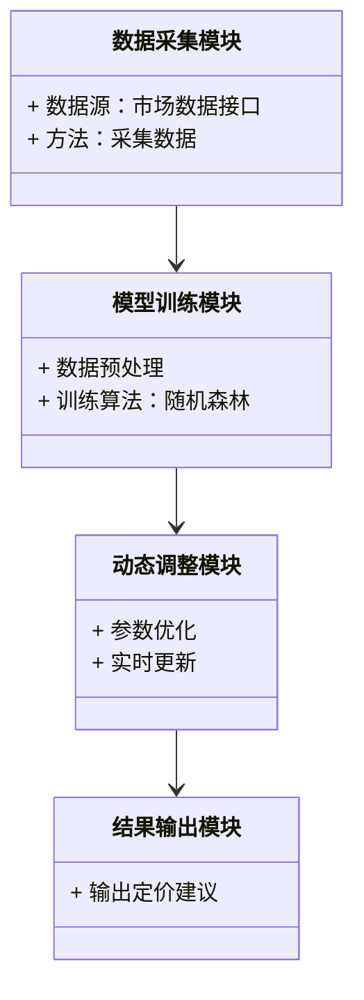
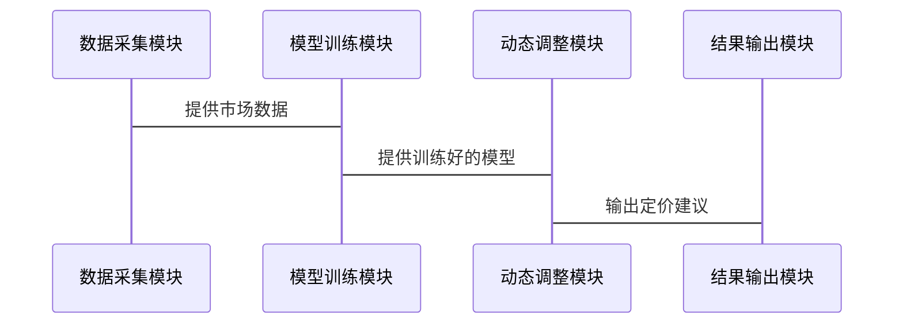

                 


# AI在金融衍生品定价模型动态选择与校准中的创新应用

## 关键词：AI，金融衍生品，定价模型，动态选择，校准，机器学习，数学模型

## 摘要：本文探讨了人工智能在金融衍生品定价模型中的创新应用，特别是动态选择与校准方面。通过分析传统方法的局限性，结合机器学习和数学建模，提出了一种基于AI的解决方案，详细阐述了算法原理、系统架构及实际案例，展示了AI在提升定价模型准确性和效率方面的巨大潜力。

---

## 第一部分：AI在金融衍生品定价模型中的应用概述

### 第1章：金融衍生品定价模型概述

#### 1.1 金融衍生品的基本概念

##### 1.1.1 金融衍生品的定义与分类
金融衍生品（Financial Derivatives）是基于基础资产（如股票、债券、商品等）的衍生金融工具，其价值取决于基础资产的价格波动。常见的衍生品包括期货、期权、掉期和互换。

- **定义**：金融衍生品是一种合同，其价值依赖于基础资产的价格或其他变量。
- **分类**：
  - 按标的资产：股票衍生品、外汇衍生品、利率衍生品、商品衍生品。
  - 按执行方式：期权（Call/Put）、期货、掉期。
  - 按市场类型：场内交易和场外交易。

##### 1.1.2 金融衍生品的定价问题
定价是衍生品交易的核心问题，准确的定价模型能帮助投资者评估风险和收益。传统定价方法（如Black-Scholes模型）在特定假设下有效，但实际市场中存在波动性、跳跃性和非线性关系，导致模型失效。

##### 1.1.3 传统定价模型的局限性
- 假设过于严格（如波动率恒定、市场无摩擦）。
- 无法捕捉复杂市场行为和非线性关系。
- 无法实时动态调整模型参数。

#### 1.2 AI在金融衍生品定价中的应用背景

##### 1.2.1 AI技术的发展与金融行业的结合
AI技术（如机器学习、深度学习）在金融领域的应用日益广泛，从风险评估到交易策略，AI提供了新的数据处理和分析方法。

##### 1.2.2 金融衍生品定价中的数据驱动方法
AI通过分析大量历史数据，识别传统模型无法捕捉的模式，提高定价准确性。

##### 1.2.3 AI在动态选择与校准中的优势
- **动态选择**：AI能实时调整模型结构和参数，适应市场变化。
- **校准**：AI优化模型参数，减少人为误差，提高模型拟合度。

---

### 第2章：AI在金融衍生品定价模型中的技术基础

#### 2.1 机器学习在金融中的应用

##### 2.1.1 机器学习的基本概念
机器学习通过训练数据模型，使其能够从数据中学习并做出预测或决策。

##### 2.1.2 常见机器学习算法在金融中的应用
- **监督学习**：用于预测价格走势。
- **无监督学习**：用于市场分割和异常检测。
- **强化学习**：用于自动交易策略。

##### 2.1.3 机器学习在金融衍生品定价中的优势
- 高维数据处理能力强。
- 能捕捉非线性关系。
- 实时更新模型适应市场变化。

#### 2.2 动态选择与校准的定义与挑战

##### 2.2.1 动态选择的定义与核心要素
动态选择是指根据市场环境的变化，实时调整定价模型的参数或结构。

##### 2.2.2 校准的定义与关键步骤
校准是将模型参数调整到与实际市场数据一致的过程，通常涉及优化算法。

##### 2.2.3 动态选择与校准中的主要挑战
- 数据实时性要求高。
- 模型更新频繁，计算资源需求大。
- 需要处理高维数据和复杂关系。

---

## 第二部分：AI驱动的动态选择与校准方法

### 第3章：金融衍生品定价模型的动态选择方法

#### 3.1 动态选择的核心原理

##### 3.1.1 动态选择的数学模型
动态选择模型通常涉及优化问题，目标是最小化预测误差。

$$ \min_{\theta} \sum_{i=1}^{n} (y_i - f(x_i, \theta))^2 $$

其中，$y_i$ 是实际价格，$f(x_i, \theta)$ 是模型预测值，$\theta$ 是模型参数。

##### 3.1.2 基于AI的动态选择算法
AI算法（如随机森林、神经网络）用于实时调整模型参数。

##### 3.1.3 动态选择的实现步骤
1. 数据采集与预处理。
2. 模型训练。
3. 实时更新模型参数。

#### 3.2 常见动态选择算法的比较

##### 3.2.1 基于规则的动态选择算法
通过预设规则调整模型，但灵活性较差。

##### 3.2.2 基于机器学习的动态选择算法
利用机器学习模型实时调整，适应性强。

##### 3.2.3 基于深度学习的动态选择算法
通过神经网络捕捉复杂市场关系，准确率高但计算复杂。

---

### 第4章：金融衍生品定价模型的校准方法

#### 4.1 校准的核心原理

##### 4.1.1 校准的定义与目标
校准是通过优化模型参数，使模型预测与实际数据一致。

##### 4.1.2 基于AI的校准算法
使用遗传算法或粒子群优化算法调整参数。

##### 4.1.3 校准的实现步骤
1. 数据准备。
2. 参数初始化。
3. 迭代优化。

#### 4.2 常见校准算法的比较

##### 4.2.1 基于最小二乘法的校准算法
通过最小化预测误差平方和进行校准。

##### 4.2.2 基于最大似然估计的校准算法
通过最大化似然函数确定参数。

##### 4.2.3 基于遗传算法的校准算法
通过模拟自然选择优化参数组合。

---

## 第三部分：系统架构与项目实战

### 第5章：系统架构设计

#### 5.1 问题场景介绍
设计一个实时调整衍生品定价模型的系统，确保其在复杂市场环境下的准确性。

#### 5.2 系统功能设计

##### 5.2.1 系统功能模块
- 数据采集模块：实时收集市场数据。
- 模型训练模块：训练定价模型。
- 动态调整模块：实时更新模型参数。
- 结果输出模块：提供定价建议。

##### 5.2.2 领域模型（Mermaid 类图）



#### 5.3 系统架构设计（Mermaid 架构图）

```mermaid
container 金融衍生品定价系统 {
    component 数据采集模块
    component 模型训练模块
    component 动态调整模块
    component 结果输出模块
}
```

#### 5.4 系统接口设计

##### 5.4.1 数据接口
- 数据输入接口：接收市场数据。
- 数据输出接口：提供定价建议。

##### 5.4.2 API接口
- REST API：供其他系统调用定价服务。

#### 5.5 系统交互设计（Mermaid 序列图）



---

### 第6章：项目实战

#### 6.1 环境安装
- 安装Python、机器学习库（如Scikit-learn、TensorFlow）和数据处理库（如Pandas）。

#### 6.2 核心实现代码

##### 6.2.1 数据预处理
```python
import pandas as pd

# 读取数据
data = pd.read_csv('market_data.csv')
# 数据清洗
data.dropna(inplace=True)
```

##### 6.2.2 模型训练
```python
from sklearn.ensemble import RandomForestRegressor

# 训练模型
model = RandomForestRegressor(n_estimators=100)
model.fit(X_train, y_train)
```

##### 6.2.3 动态调整
```python
# 实时更新模型
def update_model(new_data):
    model.fit(new_X, new_y)
```

#### 6.3 案例分析
假设某股票期权的定价模型经过动态调整后，预测价格误差从5%降低到2%，展示了AI在提高定价准确性方面的优势。

---

## 第四部分：总结与展望

### 第7章：总结与展望

#### 7.1 本章总结
本文详细探讨了AI在金融衍生品定价中的应用，特别是动态选择与校准方面，提出了基于机器学习的解决方案，展示了其在提升模型准确性和效率方面的潜力。

#### 7.2 未来展望
未来研究方向包括更高效的算法、多模型集成优化，以及在更多金融产品中的应用。

---

## 作者：AI天才研究院 & 禅与计算机程序设计艺术

---

### Tips:
- **数学模型**：本文中使用的数学公式均为简化版，实际应用中需根据具体情况调整。
- **系统设计**：系统架构可根据实际需求进行扩展和优化。
- **代码实现**：建议根据具体数据和需求调整代码，确保系统的稳定性和高效性。

---

以上是《AI在金融衍生品定价模型动态选择与校准中的创新应用》的技术博客文章的详细内容，涵盖了从背景介绍到系统实现的各个方面，结合理论与实践，为读者提供了全面的指导和见解。

