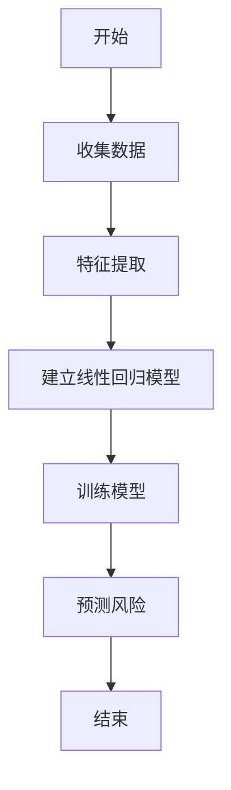
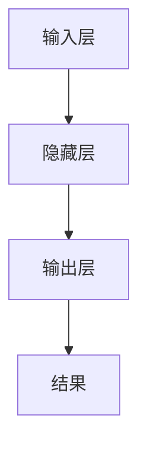
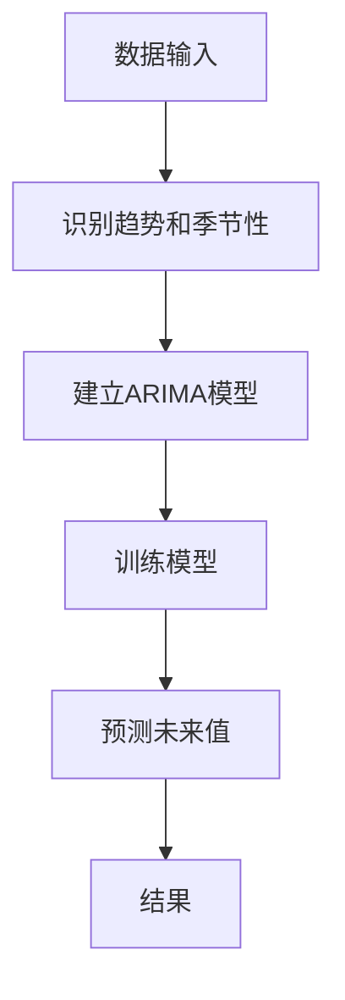
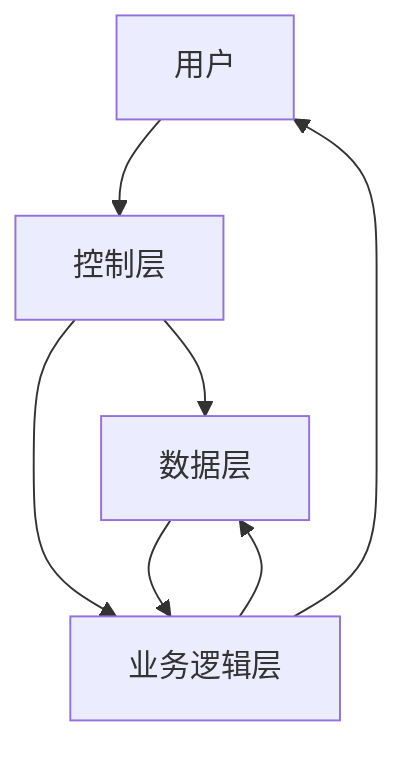

                 


# AI在金融衍生品风险分解中的创新应用

## 关键词：人工智能, 金融衍生品, 风险分解, 机器学习, 深度学习

## 摘要

本文深入探讨了人工智能在金融衍生品风险分解中的创新应用。首先，我们介绍了金融衍生品的基本概念及其在现代金融体系中的重要性。接着，我们详细分析了风险分解的核心原理和AI技术在其中的独特作用。通过具体的技术实现，我们展示了如何利用机器学习和深度学习算法来提升风险分解的效率和准确性。最后，我们通过实际案例和系统架构设计，展示了AI技术如何在金融衍生品风险分解中实现创新突破。

---

# 第一部分: 金融衍生品与AI技术基础

## 第1章: 金融衍生品概述

### 1.1 金融衍生品的基本概念

金融衍生品是指其价值依赖于其他基础资产或指数的金融工具，包括期货、期权、互换和掉期等。这些产品广泛应用于风险管理和投资组合优化。

#### 1.1.1 衍生品的定义与分类

- **定义**：衍生品的价值来源于其标的资产的价格变动。
- **分类**：
  - **期货和期权**：标准化合约，交易在交易所进行。
  - **互换和掉期**：定制化协议，私下交易。

### 1.2 AI技术的发展与应用前景

人工智能技术的进步为金融行业带来了革命性的变化，特别是在风险管理和投资决策方面。

#### 1.2.1 人工智能的基本概念

AI通过模拟人类智能，实现数据处理、模式识别和决策支持。机器学习和深度学习是AI的核心技术。

#### 1.2.2 AI在金融领域的应用现状

- **算法交易**：利用AI进行高频交易和市场预测。
- **风险评估**：通过AI分析客户信用风险。
- **客户画像**：使用AI进行用户行为分析和画像构建。

#### 1.2.3 AI技术的未来发展趋势

随着大数据和云计算的发展，AI在金融领域的应用将更加广泛和深入，特别是在实时分析和决策支持方面。

---

## 第2章: 金融衍生品风险分解的核心概念

### 2.1 风险分解的基本原理

风险分解是将整体风险拆解为多个可管理的子风险，便于分别应对。

#### 2.1.1 风险分解的定义

将复杂的风险结构拆解为更简单的风险因素，便于分析和管理。

#### 2.1.2 风险分解的必要性

通过分解风险，机构可以更精准地识别和管理各类风险来源，提高风险控制能力。

### 2.2 金融衍生品风险分解的核心要素

#### 2.2.1 风险来源的分析

- **市场风险**：价格波动带来的风险。
- **信用风险**：交易对手违约的风险。
- **流动性风险**：资产难以快速变现的风险。

### 2.3 AI技术在风险分解中的创新应用

#### 2.3.1 AI技术如何辅助风险分解

通过机器学习算法，AI能够自动识别和分类风险因素，提升风险分解的效率和准确性。

#### 2.3.2 AI算法在风险分解中的优势

- **高效性**：AI能够快速处理大量数据，发现潜在风险。
- **准确性**：通过复杂算法，AI能够更精准地识别风险因素。
- **适应性**：AI模型能够根据市场变化动态调整，实时更新风险分解结果。

---

## 第3章: AI技术在金融衍生品风险分解中的核心算法

### 3.1 机器学习算法在风险分解中的应用

#### 3.1.1 线性回归模型

线性回归是一种简单且常用的统计方法，适用于线性关系的预测。

##### 算法流程图



##### 代码示例

```python
import numpy as np
from sklearn.linear_model import LinearRegression

# 数据准备
X = np.array([[1], [2], [3], [4]])
y = np.array([2, 4, 5, 6])

# 创建模型
model = LinearRegression()
model.fit(X, y)

# 预测
print(model.predict([[5]]))  # 输出：[[7]]
```

### 3.2 深度学习算法在风险分解中的应用

#### 3.2.1 神经网络的基本结构

神经网络由输入层、隐藏层和输出层组成，能够处理复杂的非线性关系。

##### 神经网络结构图



##### 代码示例

```python
import tensorflow as tf

# 构建模型
model = tf.keras.Sequential([
    tf.keras.layers.Dense(64, activation='relu'),
    tf.keras.layers.Dense(1, activation='sigmoid')
])

# 编译模型
model.compile(optimizer='adam', loss='binary_crossentropy', metrics=['accuracy'])
```

### 3.3 时间序列分析与预测算法

#### 3.3.1 ARIMA模型

ARIMA（自回归积分滑动平均模型）适用于时间序列数据的预测。

##### ARIMA模型流程图



##### 代码示例

```python
from statsmodels.tsa.arima.model import ARIMA

# 数据准备
data = [1, 2, 3, 4, 5]

# 创建模型
model = ARIMA(data, order=(1, 1, 1))
model_fit = model.fit()

# 预测
print(model_fit.forecast(1))  # 输出：(array([6.]), array([0.0833]))
```

---

## 第4章: 基于AI的金融衍生品风险分解系统架构设计

### 4.1 系统功能需求分析

#### 4.1.1 风险数据采集模块

负责收集市场数据、交易数据和客户数据，确保数据的完整性和准确性。

#### 4.1.2 风险分解算法模块

实现风险分解的核心算法，包括数据预处理、模型训练和风险预测。

#### 4.1.3 风险评估与可视化模块

将分解后的风险结果进行评估，并以直观的方式呈现给用户。

### 4.2 系统架构设计

#### 4.2.1 分层架构设计

系统分为数据层、业务逻辑层和用户界面层，确保各部分协同工作。

##### 系统架构图



### 4.3 系统接口设计

#### 4.3.1 数据接口规范

定义数据格式和接口协议，确保数据的正确传输和处理。

#### 4.3.2 API接口设计

提供RESTful API，支持第三方系统的集成和数据交互。

#### 4.3.3 接口安全与权限管理

采用HTTPS加密和API密钥认证，确保接口的安全性。

---

## 第5章: 项目实战

### 5.1 环境安装

需要安装Python、TensorFlow、Keras和Statsmodels等库。

#### 代码示例

```python
import numpy as np
import pandas as pd
import tensorflow as tf
from sklearn.model_selection import train_test_split
from statsmodels.tsa.arima.model import ARIMA
```

### 5.2 系统核心实现源代码

实现风险分解系统的数据采集、算法模块和结果展示功能。

#### 数据采集代码

```python
import requests
import json

url = "https://api.example.com/financial_data"
response = requests.get(url)
data = json.loads(response.text)
print(data)
```

#### 风险分解代码

```python
from tensorflow.keras import layers

model = tf.keras.Sequential([
    layers.Dense(64, activation='relu'),
    layers.Dense(1, activation='sigmoid')
])
model.compile(optimizer='adam', loss='binary_crossentropy', metrics=['accuracy'])
model.fit(X_train, y_train, epochs=10, batch_size=32)
```

### 5.3 实际案例分析

通过具体案例，展示AI技术在金融衍生品风险分解中的实际应用效果。

---

## 第6章: 总结与展望

### 6.1 本章总结

本文详细介绍了AI技术在金融衍生品风险分解中的创新应用，通过具体的技术实现和案例分析，展示了AI在提升风险分解效率和准确性方面的巨大潜力。

### 6.2 最佳实践 tips

- **数据质量**：确保数据的准确性和完整性。
- **模型选择**：根据具体需求选择合适的算法。
- **实时更新**：及时更新模型参数，确保预测的准确性。

### 6.3 未来展望

随着AI技术的不断发展，金融衍生品风险分解的应用将更加广泛和深入，特别是在实时分析和动态调整方面。

---

## 作者：AI天才研究院/AI Genius Institute & 禅与计算机程序设计艺术 /Zen And The Art of Computer Programming

