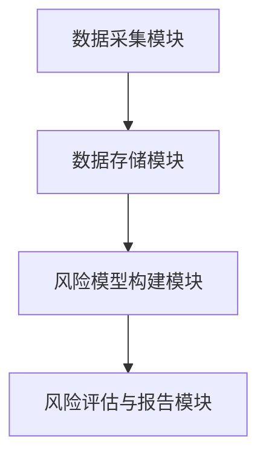

                 


# AI在金融衍生品风险度量中的应用

> 关键词：人工智能, 金融衍生品, 风险度量, 机器学习, 深度学习

> 摘要：本文深入探讨了人工智能技术在金融衍生品风险度量中的应用。首先介绍了金融衍生品和风险度量的基本概念，接着分析了AI技术在金融领域的潜力与挑战。然后详细讲解了AI算法在风险预测中的应用，包括机器学习、深度学习等技术的原理与实现。最后，本文提出了基于AI的金融衍生品风险度量系统架构设计方案，并通过具体案例展示了如何将这些技术应用于实际项目中。

---

# 第1章: 金融衍生品与风险度量基础

## 1.1 金融衍生品的基本概念

### 1.1.1 衍生品的定义与分类
金融衍生品是一种金融合约，其价值取决于基础资产（如股票、债券、商品等）的价格变动。衍生品可以分为以下几类：
- 远期合约（Forwards）
- 期货（Futures）
- 期权（Options）
- 互换（Swaps）

### 1.1.2 衍生品的市场功能与作用
衍生品在金融市场中起到以下作用：
- **风险对冲**：通过衍生品对冲价格波动风险。
- **杠杆效应**：允许投资者以较小的资金控制更大的头寸。
- **价格发现**：衍生品市场反映了市场参与者对资产未来价格的预期。

### 1.1.3 衍生品的主要类型：期货、期权、掉期等
- **期货**：标准的场内交易合约，具有高流动性和透明性。
- **期权**：买方有权在特定时间以特定价格买入或卖出资产，灵活性高。
- **掉期**：长期协议，允许双方交换现金流。

### 1.1.4 衍生品的风险特征
- **信用风险**：交易对手违约的风险。
- **市场风险**：市场价格波动导致的损失。
- **流动性风险**：难以迅速以合理价格买卖的风险。

---

## 1.2 风险度量的核心概念

### 1.2.1 风险的定义与分类
风险是指资产价格波动导致损失的可能性。常见的风险类型包括：
- **系统性风险**：影响整个市场的风险，如经济衰退。
- **非系统性风险**：影响特定资产或行业的风险。

### 1.2.2 风险度量的主要方法
- **VaR（Value at Risk）**：在给定置信水平下，资产可能遭受的最大损失。
- **CVaR（Conditional Value at Risk）**：VaR的条件期望值，表示在VaR水平下的平均损失。
- **RAROC（Risk-Adjusted Return on Capital）**：风险调整后的资本回报率。

### 1.2.3 风险度量的数学模型基础
- **VaR模型**：基于统计方法，计算资产组合在给定置信水平下的最大损失。
- **GARCH模型**：用于估计资产价格的波动性。

---

## 1.3 AI技术在金融领域的应用背景

### 1.3.1 人工智能的基本概念与技术发展
人工智能（AI）是指计算机系统模拟人类智能的技术，包括学习、推理、自我改进等能力。近年来，AI技术在金融领域的应用日益广泛。

### 1.3.2 AI在金融领域的典型应用
- **智能投顾**：通过算法为投资者提供个性化的投资建议。
- **风险控制**：利用AI技术预测市场波动，评估信用风险。
- **欺诈检测**：通过机器学习识别异常交易行为。

### 1.3.3 AI在金融风险度量中的潜力与挑战
- **潜力**：AI能够处理海量数据，发现非线性关系，提高风险预测的准确性。
- **挑战**：数据质量、模型解释性、监管合规性等问题需要克服。

---

## 1.4 本章小结
本章介绍了金融衍生品的基本概念和风险度量的核心方法，探讨了AI技术在金融领域的应用背景，为后续章节奠定了基础。

---

# 第2章: AI技术在金融衍生品风险度量中的核心概念

## 2.1 AI驱动的风险度量框架

### 2.1.1 数据驱动的风险度量方法
- **监督学习**：基于历史数据训练模型，预测未来的风险。
- **无监督学习**：发现数据中的隐含结构，识别潜在风险因素。

### 2.1.2 模型驱动的风险度量方法
- **统计模型**：如GARCH模型，基于概率分布估计风险。
- **机器学习模型**：如随机森林、梯度提升树，用于复杂非线性关系的建模。

### 2.1.3 AI在风险度量中的独特优势
- **数据处理能力**：AI能够处理海量的结构化和非结构化数据。
- **非线性关系建模**：AI擅长捕捉复杂的非线性关系，提高预测精度。

---

## 2.2 机器学习与深度学习在风险预测中的应用

### 2.2.1 机器学习的基本原理
- **监督学习**：输入特征和目标变量，训练模型预测新数据。
- **无监督学习**：从无标签数据中发现隐藏结构。
- **特征工程**：通过提取和选择特征，提高模型性能。

### 2.2.2 深度学习在金融时间序列分析中的应用
- **神经网络结构**：如LSTM（长短期记忆网络）适合处理时间序列数据。
- **深度学习的优势**：能够捕捉复杂的时间依赖性，提高预测准确性。

### 2.2.3 非线性关系建模的优势
- **传统统计模型**：假设数据服从某种分布，可能无法捕捉复杂关系。
- **AI模型**：能够自动学习数据的非线性特征，适应性强。

---

## 2.3 风险度量中的特征工程与数据处理

### 2.3.1 数据清洗与预处理
- **数据清洗**：去除噪声数据，处理缺失值。
- **特征标准化**：将特征缩放到相同范围，避免模型偏差。

### 2.3.2 特征提取与选择
- **特征提取**：从原始数据中提取有用的特征，如技术指标。
- **特征选择**：通过统计或机器学习方法选择重要特征。

### 2.3.3 时间序列数据的特殊处理方法
- **滑动窗口法**：处理时间序列数据，提取局部特征。
- **模型调参**：根据数据特征调整模型参数。

---

## 2.4 本章小结
本章重点介绍了AI驱动的风险度量框架，分析了机器学习和深度学习在风险预测中的应用，探讨了特征工程和数据处理的关键步骤。

---

# 第3章: 金融衍生品风险度量的数学模型与AI算法

## 3.1 风险度量的数学模型

### 3.1.1 VaR（Value at Risk）模型
- **定义**：在给定置信水平下，资产可能遭受的最大损失。
- **计算方法**：基于历史模拟、方差-协方差方法或蒙特卡洛模拟。

### 3.1.2 CVaR（Conditional Value at Risk）模型
- **定义**：VaR的条件期望值，表示在VaR水平下的平均损失。
- **应用**：用于优化资产组合的风险调整后回报。

### 3.1.3 GARCH模型在风险预测中的应用
- **GARCH模型**：广义自回归条件异方差模型，用于估计资产价格的波动性。
- **实现步骤**：
  1. 收集历史价格数据。
  2. 计算资产的收益率序列。
  3. 估计GARCH模型参数。
  4. 预测未来波动性。

---

## 3.2 AI算法在风险度量中的应用

### 3.2.1 线性回归模型
- **简单线性回归**：$y = \beta_0 + \beta_1x + \epsilon$。
- **多元线性回归**：$y = \beta_0 + \beta_1x_1 + \beta_2x_2 + ... + \epsilon$。

### 3.2.2 支持向量机（SVM）模型
- **原理**：通过构建超平面将数据点分为两类，用于分类和回归。
- **应用**：用于预测资产价格的涨跌。

### 3.2.3 神经网络模型（DNN、RNN、LSTM等）
- **DNN（深度神经网络）**：适合处理复杂的非线性关系。
- **RNN（循环神经网络）**：适合处理时间序列数据。
- **LSTM（长短期记忆网络）**：用于捕捉长期依赖关系。

---

## 3.3 基于AI的组合风险度量方法

### 3.3.1 蒙特卡洛模拟方法
- **原理**：通过模拟大量随机场景，估计资产组合的可能损失分布。
- **步骤**：
  1. 确定资产价格的分布模型。
  2. 生成大量随机价格路径。
  3. 计算每条路径的损失。
  4. 统计分析损失分布。

### 3.3.2 非参数化风险度量方法
- **Kernel Density Estimation**：通过核密度估计方法，估计损失分布。
- **Bootstrap方法**：通过重采样技术，估计统计量的分布。

### 3.3.3 集成学习方法在风险度量中的应用
- **Bagging**：通过 bootstrap 方法生成多个训练集，构建多个模型，最终取平均或投票结果。
- **Boosting**：通过迭代提升模型性能，如AdaBoost、XGBoost。

---

## 3.4 本章小结
本章详细讲解了金融衍生品风险度量的数学模型，分析了AI算法在风险预测中的应用，探讨了基于AI的组合风险度量方法。

---

# 第4章: 基于AI的金融衍生品风险度量系统架构设计

## 4.1 系统功能模块划分

### 4.1.1 数据采集模块
- **功能**：从金融市场数据源获取实时或历史数据。
- **数据源**：股票交易所、期货市场、外汇市场等。
- **数据类型**：价格、成交量、订单簿等。

### 4.1.2 风险模型构建模块
- **功能**：基于AI算法构建风险度量模型。
- **算法选择**：根据数据特征选择合适的算法，如LSTM、XGBoost等。
- **模型训练**：使用历史数据训练模型，调整模型参数。

### 4.1.3 风险评估与报告模块
- **功能**：计算资产组合的风险指标，生成风险评估报告。
- **报告内容**：VaR、CVaR、风险价值分布等。

---

## 4.2 系统架构设计

### 4.2.1 系统架构图


### 4.2.2 接口设计
- **数据接口**：与数据源对接，获取实时数据。
- **模型接口**：与其他系统或模块共享风险模型。
- **报告接口**：输出风险评估结果，供用户查看。

---

## 4.3 本章小结
本章设计了一个基于AI的金融衍生品风险度量系统架构，详细描述了各功能模块的划分和系统架构设计。

---

# 项目实战: 基于AI的金融衍生品风险度量系统实现

## 5.1 项目背景
- **目标**：构建一个基于AI的金融衍生品风险度量系统。
- **数据来源**：股票市场数据，如历史价格、成交量等。
- **工具**：Python、TensorFlow、Pandas等。

## 5.2 系统实现

### 5.2.1 数据处理
```python
import pandas as pd
import numpy as np

# 读取数据
data = pd.read_csv('stock_data.csv')

# 数据清洗
data.dropna()  # 删除缺失值
data = data[~data['volume'].isin([0])]  # 去除成交量为0的行

# 特征提取
data['log_return'] = np.log(data['close'] / data['open'])
```

### 5.2.2 模型训练
```python
import tensorflow as tf
from tensorflow.keras import layers

# 构建LSTM模型
model = tf.keras.Sequential()
model.add(layers.LSTM(64, input_shape=(None, 1)))
model.add(layers.Dense(1))
model.compile(loss='mse', optimizer='adam')
```

### 5.2.3 模型预测
```python
# 预测VaR
def calculate VaR(model, data, confidence_level=0.95):
    predictions = model.predict(data)
    losses = predictions - data['close']
    VaR = np.percentile(losses, 100 * (1 - confidence_level))
    return VaR

VaR_value = calculate_VaR(model, data)
print(f"VaR at {confidence_level} confidence level: {VaR_value}")
```

---

## 5.3 项目小结
通过具体案例展示了如何将AI技术应用于金融衍生品风险度量，详细讲解了数据处理、模型训练和结果分析的过程。

---

# 总结

## 6.1 最佳实践 tips
- **数据质量**：确保数据的完整性和准确性。
- **模型解释性**：选择可解释性强的模型，便于分析和调整。
- **模型更新**：定期更新模型，适应市场变化。

## 6.2 小结
本文全面探讨了AI技术在金融衍生品风险度量中的应用，从理论到实践，详细讲解了AI算法、系统架构和项目实现。

## 6.3 注意事项
- **数据隐私**：注意数据的隐私保护和合规性。
- **模型风险**：避免过度依赖模型，结合人工分析。

## 6.4 拓展阅读
- **推荐书籍**：《Python机器学习实战》、《深度学习入门》。
- **推荐论文**：查阅相关领域的最新研究论文。

---

作者：AI天才研究院/AI Genius Institute & 禅与计算机程序设计艺术 /Zen And The Art of Computer Programming

