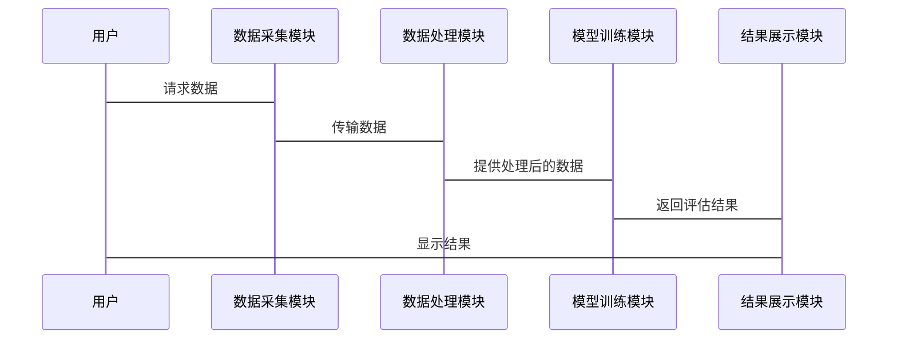
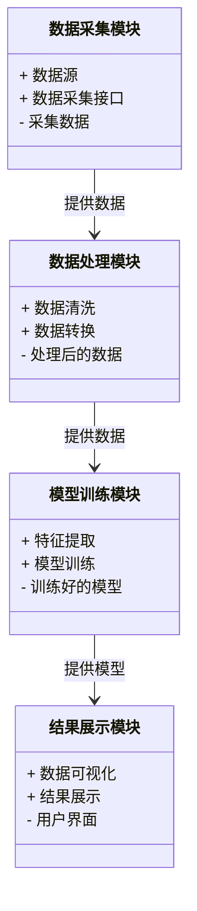

                 


# AI增强型公司治理风险评估

## 关键词：AI增强型公司治理、风险评估、机器学习、自然语言处理、公司治理模型

## 摘要：本文探讨了如何利用人工智能技术提升公司治理的风险评估效率和准确性。通过结合机器学习、自然语言处理等技术，AI能够优化风险识别和预测，增强传统公司治理模式的决策支持能力。文章详细介绍了AI在公司治理中的应用背景、核心概念、算法原理、系统架构以及实际项目案例，为读者提供全面的技术指导和实践参考。

---

## 第1章: AI与公司治理概述

### 1.1 公司治理的基本概念

#### 1.1.1 公司治理的定义与核心要素
公司治理是指通过明确的制度和机制，确保公司管理层和董事会有效运作，实现公司战略目标和股东价值最大化。核心要素包括股权结构、董事会构成、管理层职责、利益相关者权益保护等。

#### 1.1.2 公司治理的目标与意义
公司治理的目标是优化公司运作效率，降低经营风险，提升企业透明度和合规性。其意义在于保障股东权益，促进企业可持续发展，增强投资者信心。

#### 1.1.3 公司治理的演变与挑战
随着数字化转型的推进，公司治理面临数据化、智能化的新挑战。传统治理模式依赖人工经验，效率低下且容易遗漏潜在风险。AI技术的应用为公司治理注入了新的活力，能够快速处理大量数据，提高决策的精准性和及时性。

### 1.2 AI技术的基本概念

#### 1.2.1 人工智能的定义与技术架构
人工智能（AI）是指模拟人类智能的计算机系统，涵盖学习、推理、问题解决等能力。技术架构包括数据采集、特征提取、模型训练、结果输出等模块。

#### 1.2.2 机器学习与深度学习的核心原理
机器学习是AI的核心技术，通过数据训练模型，使其能够识别模式和做出预测。深度学习作为机器学习的分支，利用多层神经网络处理复杂数据，提升模型的表达能力。

#### 1.2.3 自然语言处理在AI中的应用
自然语言处理（NLP）是AI的重要组成部分，用于理解和处理人类语言。在公司治理中，NLP可用于分析财务报告、新闻资讯等文本数据，提取关键信息辅助决策。

### 1.3 AI与公司治理的结合背景

#### 1.3.1 数字化转型对治理的影响
数字化转型推动企业数据化运营，AI技术的应用使得公司治理更加数据驱动，能够快速响应市场变化和内部风险。

#### 1.3.2 AI技术在企业治理中的潜力
AI技术能够通过大数据分析识别潜在风险，优化决策流程，提高公司治理的效率和效果。

#### 1.3.3 当前企业治理中的痛点与AI解决方案
传统治理模式依赖人工经验，效率低且容易遗漏风险。AI解决方案通过自动化数据处理和智能分析，帮助企业在复杂环境中快速做出决策。

---

## 第2章: AI增强型公司治理的核心概念

### 2.1 公司治理风险评估的定义

#### 2.1.1 风险评估的基本概念
风险评估是识别、分析和量化潜在风险的过程，旨在制定有效的风险管理策略。在公司治理中，风险评估是确保企业稳健运营的关键环节。

#### 2.1.2 公司治理中的主要风险类型
常见的公司治理风险包括财务风险、法律风险、声誉风险、操作风险等。不同类型的风崄需要不同的评估方法和应对策略。

#### 2.1.3 风险评估的流程与方法
风险评估的流程通常包括数据收集、风险识别、风险分析、风险应对和监控评估。常用的方法有定量分析法和定性分析法。

### 2.2 AI在风险评估中的应用

#### 2.2.1 数据驱动的决策支持
AI通过收集和分析大量数据，为企业提供数据驱动的决策支持，帮助管理层识别潜在风险并制定应对策略。

#### 2.2.2 AI算法在风险预测中的作用
机器学习算法能够预测潜在风险，例如使用随机森林模型预测财务风险，利用支持向量机模型识别法律风险。

#### 2.2.3 自然语言处理在文本分析中的应用
NLP技术可以分析公司公告、新闻报道等文本数据，提取关键信息并评估其对公司的潜在影响。

### 2.3 AI增强型公司治理的核心要素

#### 2.3.1 数据收集与处理
AI增强型公司治理需要收集多源异构数据，包括财务数据、市场数据、文本数据等，并进行清洗和预处理。

#### 2.3.2 模型构建与训练
基于收集的数据，构建机器学习模型，进行特征提取、模型训练和优化，确保模型具有良好的泛化能力和预测精度。

#### 2.3.3 结果解释与反馈机制
AI模型的预测结果需要可解释，以便管理层理解和采取行动。同时，建立反馈机制，持续优化模型和治理策略。

---

## 第3章: AI增强型公司治理的算法原理

### 3.1 风险评估的数学模型

#### 3.1.1 线性回归模型
线性回归模型用于预测连续型变量，适用于简单的线性关系。例如，可以用来预测公司未来的财务状况。

#### 3.1.2 支持向量机模型
支持向量机（SVM）适用于分类问题，能够处理高维数据，适用于识别公司治理中的分类风险。

#### 3.1.3 随机森林模型
随机森林是一种集成学习方法，能够处理复杂的非线性关系，适用于多类型数据的分类和回归问题。

#### 3.1.4 神经网络模型
神经网络模型具有强大的非线性表达能力，适用于处理复杂的数据模式，如文本和图像数据。

### 3.2 基于机器学习的风险评估流程

#### 3.2.1 数据预处理
数据预处理包括数据清洗、特征提取、数据标准化等步骤，确保数据质量和一致性。

#### 3.2.2 特征提取与选择
特征提取是指从原始数据中提取有用的特征，特征选择则是筛选出对模型性能影响最大的特征。

#### 3.2.3 模型训练与优化
模型训练包括选择合适的算法、调整超参数、防止过拟合等。优化过程通常使用交叉验证和网格搜索。

#### 3.2.4 模型评估与验证
模型评估包括准确率、召回率、F1分数等指标，验证模型的性能和泛化能力。

### 3.3 基于自然语言处理的文本分析

#### 3.3.1 文本清洗与分词
文本清洗包括去除停用词、标点符号等，分词则是将文本分割成词语或短语。

#### 3.3.2 词袋模型与词嵌入
词袋模型是一种文本表示方法，词嵌入则是通过神经网络学习词语的向量表示。

#### 3.3.3 情感分析与主题提取
情感分析用于判断文本的情感倾向，主题提取则是从文本中提取主要主题。

### 3.4 算法实现的代码示例

#### 3.4.1 数据预处理代码
```python
import pandas as pd
from sklearn.preprocessing import StandardScaler

# 数据预处理
data = pd.read_csv('data.csv')
features = data.drop('target', axis=1)
labels = data['target']

scaler = StandardScaler()
features_scaled = scaler.fit_transform(features)
```

#### 3.4.2 模型训练代码
```python
from sklearn.ensemble import RandomForestClassifier

model = RandomForestClassifier(n_estimators=100, max_depth=5, random_state=42)
model.fit(features_scaled, labels)
```

#### 3.4.3 模型评估代码
```python
from sklearn.metrics import accuracy_score, classification_report

y_pred = model.predict(features_scaled)
print("Accuracy:", accuracy_score(labels, y_pred))
print(classification_report(labels, y_pred))
```

### 3.5 本章小结
本章详细介绍了AI增强型公司治理中常用的机器学习算法及其原理，并通过代码示例展示了模型的训练和评估过程。理解这些算法和流程是实现AI增强型公司治理风险评估的关键。

---

## 第4章: 系统架构与设计

### 4.1 系统功能需求分析

#### 4.1.1 数据采集模块
数据采集模块负责收集公司内外部数据，包括财务数据、市场数据、文本数据等。

#### 4.1.2 数据处理模块
数据处理模块负责对采集的数据进行清洗、转换和预处理，确保数据的可用性。

#### 4.1.3 模型训练模块
模型训练模块负责构建和训练机器学习模型，生成风险评估结果。

#### 4.1.4 结果展示模块
结果展示模块以可视化的方式呈现风险评估结果，便于管理层理解和决策。

### 4.2 系统架构设计

#### 4.2.1 分层架构设计
分层架构将系统划分为数据层、业务逻辑层和表现层，确保系统的模块化和可维护性。

#### 4.2.2 微服务架构设计
微服务架构将系统功能分解为多个独立的服务，通过API进行通信，提升系统的扩展性和灵活性。

#### 4.2.3 数据流与交互
数据流从数据源流向数据处理模块，经过模型训练生成结果，最终在表现层展示给用户。

### 4.3 系统接口设计

#### 4.3.1 数据接口
数据接口负责与数据源进行交互，获取所需数据并进行预处理。

#### 4.3.2 模型接口
模型接口负责与机器学习模型进行交互，接收输入数据并返回预测结果。

#### 4.3.3 用户接口
用户接口负责与最终用户交互，展示风险评估结果和相关分析。

### 4.4 系统交互序列图



### 4.5 本章小结
本章详细描述了AI增强型公司治理风险评估系统的架构设计和功能模块，强调了系统的模块化、扩展性和灵活性。

---

## 第5章: 项目实战

### 5.1 项目背景与目标

#### 5.1.1 项目背景
某公司希望通过引入AI技术优化公司治理，降低经营风险，提升决策效率。

#### 5.1.2 项目目标
构建一个基于机器学习的公司治理风险评估系统，实现对潜在风险的智能识别和预测。

### 5.2 系统设计

#### 5.2.1 领域模型设计


#### 5.2.2 系统架构设计


### 5.3 核心功能实现

#### 5.3.1 数据采集与处理
```python
import pandas as pd
from sklearn.preprocessing import StandardScaler

data = pd.read_csv('data.csv')
features = data.drop('target', axis=1)
labels = data['target']

scaler = StandardScaler()
features_scaled = scaler.fit_transform(features)
```

#### 5.3.2 模型训练与评估
```python
from sklearn.ensemble import RandomForestClassifier
from sklearn.metrics import accuracy_score, classification_report

model = RandomForestClassifier(n_estimators=100, max_depth=5, random_state=42)
model.fit(features_scaled, labels)

y_pred = model.predict(features_scaled)
print("Accuracy:", accuracy_score(labels, y_pred))
print(classification_report(labels, y_pred))
```

### 5.4 案例分析与结果解读

#### 5.4.1 案例分析
以某公司为例，分析其财务数据和市场动态，利用AI模型预测潜在风险。

#### 5.4.2 结果解读
通过模型预测结果，识别公司治理中的高风险领域，并提出相应的风险管理建议。

### 5.5 项目小结
本章通过一个实际项目展示了AI增强型公司治理风险评估系统的实施过程，从需求分析到系统设计，再到核心功能实现和案例分析，为读者提供了宝贵的实战经验。

---

## 第6章: 总结与展望

### 6.1 总结
本文详细探讨了AI增强型公司治理风险评估的核心概念、算法原理和系统架构，展示了AI技术在公司治理中的巨大潜力和实际应用价值。

### 6.2 注意事项
在实际应用中，需要注意数据质量和模型解释性，确保AI系统的透明性和合规性。

### 6.3 拓展阅读
建议读者进一步学习机器学习和自然语言处理的最新技术，探索其在公司治理中的更多应用场景。

### 6.4 未来研究方向
未来的研究可以关注多模态数据融合和自适应模型的应用，进一步提升AI增强型公司治理的风险评估能力。

---

## 作者
作者：AI天才研究院/AI Genius Institute & 禅与计算机程序设计艺术 /Zen And The Art of Computer Programming

