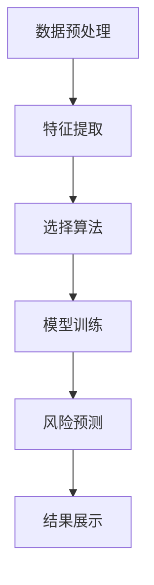

                 


# AI增强型公司治理风险评估工具

## 关键词：AI增强, 公司治理, 风险评估, 机器学习, 实体关系图, 算法流程图

## 摘要：随着人工智能技术的快速发展，公司治理中的风险评估逐渐从传统的人工分析模式向智能化、数据驱动的AI增强型模式转变。本文通过详细分析AI增强型公司治理风险评估工具的核心概念、算法原理、系统架构及实际应用案例，全面阐述了如何利用AI技术提升风险评估的效率和准确性。文章从背景介绍、核心概念、算法原理、系统设计到项目实战，层层递进，为读者提供了一个完整的解决方案。

---

## 第1章: 公司治理风险评估的背景与挑战

### 1.1 问题背景

#### 1.1.1 公司治理的基本概念
公司治理是指通过一系列制度和机制，确保公司战略目标的实现、股东权益的保护、管理层的有效监督以及利益相关者的权益平衡。它是企业运营的核心支柱之一，直接关系到企业的长期发展和稳定。

#### 1.1.2 风险评估在公司治理中的重要性
风险评估是公司治理的关键环节，它帮助企业识别潜在的财务风险、法律风险、市场风险和运营风险等，并制定相应的应对策略。传统上，风险评估主要依赖人工分析，这种方式效率低下、耗时且容易受到主观因素的影响。

#### 1.1.3 当前公司治理风险评估的主要挑战
- 数据多样性：企业运营涉及大量异构数据，包括财务数据、市场数据、法律文本等，如何有效整合这些数据是一个难题。
- 数据不完整性：部分数据缺失或不可靠，影响评估结果的准确性。
- 传统方法的局限性：基于经验的评估方法主观性强，难以量化和优化。

### 1.2 问题描述

#### 1.2.1 风险评估的复杂性
现代企业面临的风险种类繁多，且相互关联，传统的线性思维方式难以捕捉复杂的因果关系。

#### 1.2.2 数据的多样性和不完整性
企业数据来源广泛，格式多样，且可能存在缺失或错误，这增加了风险评估的难度。

#### 1.2.3 传统方法的局限性
传统风险评估方法依赖专家经验，缺乏数据支持，且难以快速响应变化。

### 1.3 问题解决

#### 1.3.1 引入AI技术的必要性
AI技术能够处理大量异构数据，发现数据中的隐含模式，提供自动化、智能化的分析能力。

#### 1.3.2 AI在风险评估中的潜在优势
- 自动化处理：AI可以快速处理大量数据，提取关键特征。
- 高准确性：通过机器学习算法，AI能够发现人类难以察觉的规律。
- 实时监控：AI系统可以实时分析数据，提供动态风险评估。

#### 1.3.3 解决方案的初步框架
初步框架包括数据采集、特征提取、模型训练、风险预测和结果展示五个阶段。

---

## 第2章: AI增强型风险评估的核心概念与联系

### 2.1 核心概念原理

#### 2.1.1 AI在风险评估中的应用原理
AI通过机器学习算法，从历史数据中学习风险特征，构建预测模型，实现风险的自动化评估。

#### 2.1.2 数据驱动的风险评估模型
数据驱动模型依赖于大量高质量的数据，利用统计方法和机器学习算法，构建预测模型。

#### 2.1.3 机器学习算法在风险预测中的作用
机器学习算法能够从数据中学习非线性关系，提高风险预测的准确性。

### 2.2 核心概念属性特征对比

| 特征对比维度 | 传统风险评估 | AI增强型风险评估 |
|--------------|--------------|-------------------|
| 数据处理能力 | 依赖人工筛选 | 自动化处理，支持异构数据 |
| 预测准确性   | 主观性强，准确性低 | 数据驱动，准确性高 |
| 可扩展性     | 有限，难以扩展 | 支持大规模数据处理 |

### 2.3 ER实体关系图

```mermaid
er
    entity 公司 {
        key 公司ID
        attribute 公司名称, 成立时间, 注册资本
    }
    entity 风险因素 {
        key 风险因素ID
        attribute 风险类型, 风险描述
    }
    entity 评估结果 {
        key 评估结果ID
        attribute 风险等级, 评估时间
    }
    公司 --> 风险因素: 可能性
    公司 --> 评估结果: 评估结果
```

---

## 第3章: AI增强型风险评估的算法原理

### 3.1 算法原理概述

#### 3.1.1 机器学习在风险评估中的应用
机器学习算法可以分为监督学习、无监督学习和半监督学习，分别适用于不同的风险评估场景。

#### 3.1.2 深度学习在风险预测中的优势
深度学习能够自动提取特征，适用于复杂的数据模式。

#### 3.1.3 算法选择的依据
算法选择需要考虑数据类型、特征数量、模型复杂度和计算资源。

### 3.2 算法流程图



### 3.3 数学模型与公式

#### 3.3.1 线性回归模型
线性回归模型用于预测连续型风险指标，其数学表达式为：

$$ y = \beta_0 + \beta_1x_1 + \beta_2x_2 + \cdots + \beta_nx_n + \epsilon $$

其中，$y$ 是预测值，$x_i$ 是特征变量，$\beta_i$ 是系数，$\epsilon$ 是误差项。

#### 3.3.2 随机森林模型
随机森林是一种集成学习方法，通过构建多个决策树并进行投票或平均来提高预测准确性和鲁棒性。

---

## 总结与展望

AI增强型公司治理风险评估工具通过结合人工智能技术和公司治理需求，显著提高了风险评估的效率和准确性。随着技术的不断进步，未来AI在公司治理中的应用将更加广泛和深入。

作者：AI天才研究院/AI Genius Institute & 禅与计算机程序设计艺术 /Zen And The Art of Computer Programming

