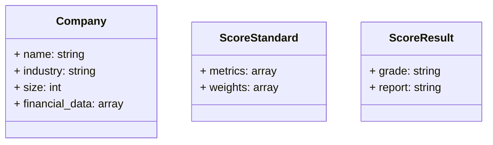
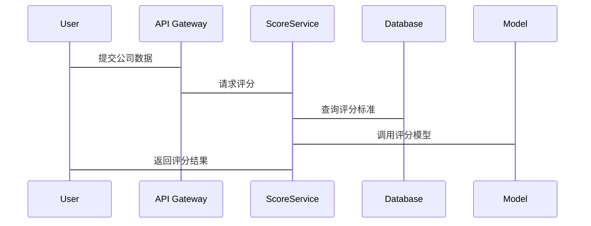

                 


# AI增强型公司质量评分系统

> 关键词：AI, 公司质量评分, 机器学习, 系统架构, 数据分析

> 摘要：本文详细探讨了如何利用人工智能技术构建公司质量评分系统，涵盖从数据采集到模型训练的全过程，结合系统架构设计和实际案例分析，为读者提供全面的技术指导。

---

## 第一部分：背景介绍

### 第1章：AI增强型公司质量评分系统的背景与概念

#### 1.1 问题背景
- **传统公司质量评估的局限性**：传统评估方法依赖人工经验，耗时且主观性强，难以量化。
- **数据驱动评估的需求**：现代企业数据丰富，亟需高效的数据分析工具。
- **AI在质量评估中的潜力**：AI能够处理海量数据，提供客观、精准的评估结果。

#### 1.2 问题描述
- **公司质量评估的核心要素**：包括财务指标、市场表现、创新能力等。
- **数据获取与处理的挑战**：数据清洗、特征提取的复杂性。
- **AI技术在评估中的应用需求**：提升评估效率和准确性。

#### 1.3 问题解决
- **AI增强型系统的解决方案**：利用机器学习模型自动分析数据，生成评分。
- **系统设计的目标与范围**：构建一个高效、准确的评分系统，支持多维度评估。
- **边界与外延**：限定评估范围，明确系统输入和输出。

#### 1.4 核心概念与结构
- **系统核心要素**：公司实体、评分标准、评分结果。
- **系统功能模块**：数据采集、特征提取、模型训练、评分输出。
- **系统运行流程**：从数据输入到评分输出的完整流程。

---

## 第二部分：核心概念与联系

### 第2章：核心概念与ER实体关系图

#### 2.1 核心概念原理
- **公司实体**：包含基本信息、财务数据、市场表现。
- **评分标准**：定义评估指标及其权重。
- **评分结果**：输出评估等级和报告。

#### 2.2 实体关系图
```mermaid
er
actor: User
company: 公司
standard: 评分标准
result: 评分结果

User --> company: 提交公司信息
company --> standard: 依据评分标准
company --> result: 输出评分结果
```

#### 2.3 概念对比表
| 概念 | 属性 | 描述 |
|------|------|------|
| 公司 | 基本信息 | 名称、行业、规模 |
| 评分标准 | 指标权重 | 财务指标、市场表现权重 |
| 评分结果 | 评分等级 | A、B、C、D、E |

---

## 第三部分：算法原理

### 第3章：算法原理与实现

#### 3.1 数据预处理与特征工程
- **数据清洗**：去除缺失值和异常值。
- **特征提取**：从财务数据、市场表现等提取特征。
- **特征选择**：使用相关性分析选择重要特征。

#### 3.2 机器学习模型训练
- **模型选择**：比较随机森林和SVM的性能。
- **模型训练**：使用训练数据训练模型。
- **模型调优**：通过网格搜索优化模型参数。

#### 3.3 模型评估与部署
- **评估指标**：准确率、召回率、F1分数。
- **部署流程**：将模型封装为API，供系统调用。

#### 3.4 算法实现代码
```python
from sklearn.ensemble import RandomForestClassifier
from sklearn.metrics import accuracy_score
from sklearn.model_selection import train_test_split

# 数据预处理
X = ...  # 特征矩阵
y = ...  # 标签

# 划分训练集和测试集
X_train, X_test, y_train, y_test = train_test_split(X, y, test_size=0.2)

# 模型训练
model = RandomForestClassifier(n_estimators=100)
model.fit(X_train, y_train)

# 模型预测
y_pred = model.predict(X_test)

# 评估指标
accuracy = accuracy_score(y_test, y_pred)
print(f'Accuracy: {accuracy}')
```

#### 3.5 算法原理公式
随机森林的投票机制：
$$
\text{预测结果} = \text{多数投票结果}
$$
SVM的优化目标：
$$
\min_{w,b,\xi} \frac{1}{2}w^Tw + C\sum_{i=1}^n \xi_i
$$

---

## 第四部分：系统分析与架构设计

### 第4章：系统分析与架构设计

#### 4.1 问题场景介绍
- **系统目标**：构建实时、准确的评分系统。
- **项目介绍**：从数据采集到评分输出的全流程设计。

#### 4.2 系统功能设计
- **领域模型类图**


#### 4.3 系统架构设计


#### 4.4 系统接口设计
- **输入接口**：接收公司数据。
- **输出接口**：返回评分结果。

#### 4.5 系统交互流程图


---

## 第五部分：项目实战

### 第5章：项目实战与代码实现

#### 5.1 环境搭建
- **安装依赖**：Python、Scikit-learn、Flask。

#### 5.2 核心代码实现
```python
from flask import Flask, request, jsonify

app = Flask(__name__)
model = RandomForestClassifier(n_estimators=100)

@app.route('/score', methods=['POST'])
def score_company():
    data = request.json
    prediction = model.predict([data['features']])
    return jsonify({'result': prediction[0]})

if __name__ == '__main__':
    app.run(debug=True)
```

#### 5.3 代码解读与分析
- **Flask接口**：实现RESTful API，处理评分请求。
- **模型调用**：将公司数据传递给训练好的模型，返回预测结果。

#### 5.4 案例分析
- **输入数据**：公司A的财务数据。
- **预测结果**：评分结果为B级。

#### 5.5 项目小结
- **实现过程**：从数据预处理到API部署的完整流程。
- **关键点**：数据清洗、特征选择、模型调优。

---

## 第六部分：优化与扩展

### 第6章：优化与扩展

#### 6.1 系统优化
- **模型优化**：使用超参数调优提升准确率。
- **性能优化**：优化API响应速度，提升并发处理能力。

#### 6.2 系统扩展
- **多维度评估**：引入更多指标，如社会责任、可持续发展。
- **实时更新**：实现数据流处理，实时更新评分结果。

#### 6.3 与其他系统集成
- **企业系统集成**：与ERP、CRM系统集成，提供实时评分。
- **数据源扩展**：引入更多数据源，如社交媒体、行业报告。

---

## 附录

### 附录A：术语表
- **AI增强型系统**：利用人工智能技术提升系统性能的系统。
- **特征工程**：通过处理数据特征提升模型性能的技术。

### 附录B：工具安装指南
- **Python安装**：使用Anaconda或Pyenv安装Python。
- **依赖安装**：使用pip安装scikit-learn、Flask。

### 附录C：参考文献
- [1] 周志华.《机器学习实战》
- [2] scikit-learn官方文档

---

## 作者

作者：AI天才研究院 & 禅与计算机程序设计艺术

---

通过以上目录和内容的详细展开，我们可以清晰地看到AI增强型公司质量评分系统的构建过程，从理论到实践，从算法到系统设计，为读者提供了一个完整的解决方案。

