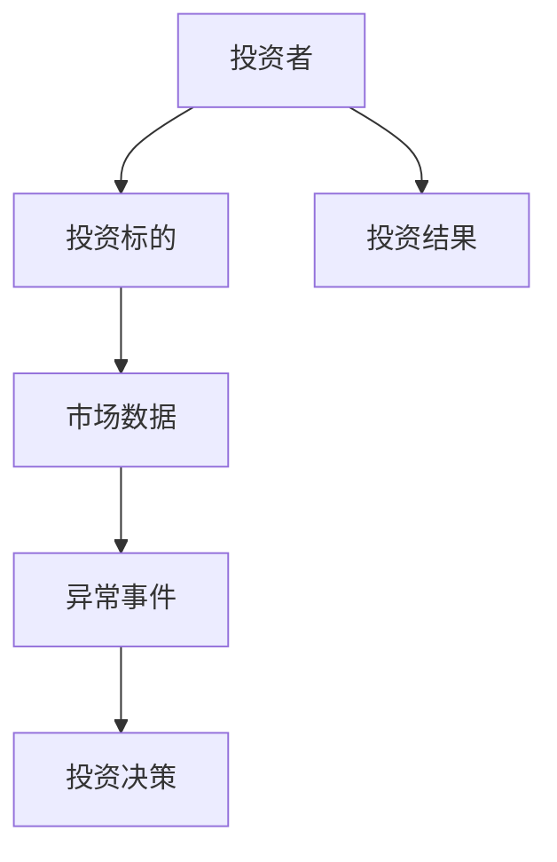
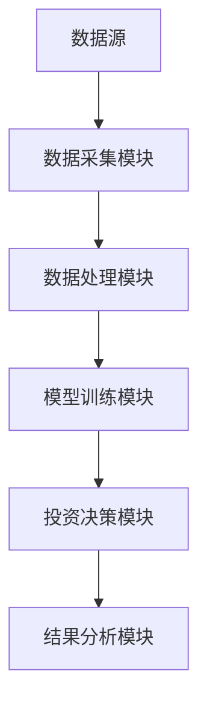
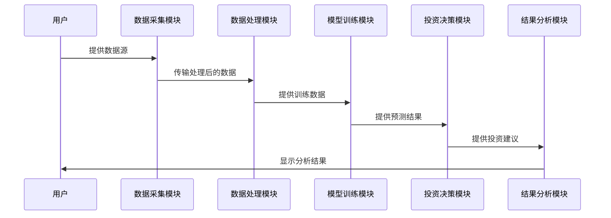

                 


---

# AI增强型特殊情况投资分析

> 关键词：AI，投资分析，特殊情况，时间序列分析，强化学习，系统架构

> 摘要：本文深入探讨了人工智能在特殊情况投资分析中的应用，结合算法原理、系统设计和项目实战，全面解析了AI如何增强投资决策的准确性和实时性。

---

# 第一部分：AI增强型特殊情况投资分析概述

# 第1章：特殊情况投资分析的背景与挑战

## 1.1 特殊情况投资分析的定义与特点
### 1.1.1 特殊情况投资分析的核心概念
特殊情况投资分析是指在金融市场中，针对突发事件、市场崩盘等异常情况，通过数据分析和模型预测，辅助投资者做出快速决策的过程。

### 1.1.2 特殊情况投资分析的难点与挑战
- 数据稀疏性：异常事件发生频率低，难以获取足够的样本数据。
- 高实时性要求：需要在短时间内做出决策，对系统响应速度要求高。
- 模型稳定性：异常事件往往破坏传统模型的假设，导致模型失效。

### 1.1.3 AI在特殊情况投资分析中的作用
- 提供实时监控和预警机制。
- 基于历史数据挖掘潜在模式。
- 快速调整投资策略以应对突发事件。

## 1.2 AI技术在金融领域的应用现状
### 1.2.1 AI在金融领域的典型应用
- 预测市场趋势。
- 风险评估与管理。
- 自动化交易策略。

### 1.2.2 AI在特殊情况投资分析中的优势
- 处理高维数据能力强。
- 能够快速适应市场变化。
- 可以发现传统方法难以察觉的模式。

### 1.2.3 当前AI技术的局限性与改进方向
- 数据质量依赖性高。
- 模型解释性不足。
- 计算资源消耗大。

## 1.3 本书的核心目标与框架
### 1.3.1 本书的研究目标
探讨AI技术在特殊情况投资分析中的应用，提出有效的解决方案。

### 1.3.2 本书的主要内容框架
- 介绍AI技术的基本概念和在金融领域的应用。
- 分析特殊情况投资分析的核心概念和挑战。
- 详细讲解AI算法在特殊情况投资分析中的应用。
- 设计完整的系统架构并提供项目实战案例。

### 1.3.3 本书的读者群体与适用场景
- 适用于金融从业者、数据科学家、技术投资人。
- 适合对AI和金融结合感兴趣的学生和研究人员。

---

# 第2章：特殊情况投资分析的核心概念与联系

## 2.1 核心概念原理
### 2.1.1 数据驱动的投资分析方法
基于大数据分析的投资决策方法，通过挖掘数据中的潜在模式来指导投资。

### 2.1.2 特殊情况下的市场行为分析
研究市场在异常事件下的反应，包括投资者情绪、交易量变化等。

### 2.1.3 AI算法在异常事件中的表现
分析不同AI算法在处理异常事件中的优劣，如LSTM在时间序列预测中的应用。

## 2.2 核心概念属性特征对比
### 2.2.1 不同投资分析方法的对比
| 方法 | 优点 | 缺点 |
|------|------|------|
| 传统金融分析 | 理论基础扎实 | 无法应对突发事件 |
| 数据驱动分析 | 适应性强 | 数据质量依赖高 |
| AI驱动分析 | 高效精准 | 解释性差 |

### 2.2.2 AI算法在特殊情况下的性能对比
| 算法 | 优点 | 缺点 |
|------|------|------|
| LSTM | 长期依赖关系捕捉好 | 易过拟合 |
| DQN | 强化学习策略灵活 | 计算资源消耗大 |
| K-Means | 分组能力强 | 对异常数据敏感 |

### 2.2.3 数据特征对投资分析结果的影响
- 数据稀疏性：影响模型的泛化能力。
- 数据实时性：影响决策的及时性。
- 数据相关性：影响模型的预测准确性。

## 2.3 ER实体关系图架构


---

# 第3章：AI增强型特殊情况投资分析的算法原理

## 3.1 时间序列分析算法
### 3.1.1 LSTM网络的原理与应用
- LSTM通过记忆单元捕捉长期依赖关系。
- 在时间序列预测中表现优异，适用于市场趋势预测。

### 3.1.2 GRU网络的原理与优势
- GRU简化了LSTM的结构，计算效率更高。
- 同样适用于时间序列预测，但参数更少，训练更快。

### 3.1.3 时间序列预测的数学模型
$$ y_t = \alpha y_{t-1} + \beta x_t + \gamma $$

## 3.2 强化学习算法
### 3.2.1 Q-Learning算法的原理与实现
- Q-Learning通过状态-动作-奖励机制更新策略。
- 适用于离散动作空间的投资决策问题。

### 3.2.2 DQN算法在投资决策中的应用
- DQN结合深度神经网络和Q-Learning。
- 适用于连续动作空间的投资决策问题。

### 3.2.3 强化学习策略的数学模型
$$ Q(s, a) = r + \gamma \max Q(s', a') $$

## 3.3 聚类分析算法
### 3.3.1 K-Means算法的原理与应用
- K-Means通过最小化距离函数进行聚类。
- 适用于市场分组和客户画像。

### 3.3.2 DBSCAN算法的原理与优势
- DBSCAN基于密度的聚类算法，不受参数影响。
- 适用于异常点检测。

### 3.3.3 聚类分析在市场分组中的应用
- 将市场分成不同的风险等级。
- 帮助投资者制定差异化投资策略。

---

# 第4章：AI增强型特殊情况投资分析的系统架构

## 4.1 系统功能设计
### 4.1.1 数据采集模块
- 实时采集市场数据和新闻事件。
- 数据格式转换和预处理。

### 4.1.2 数据处理模块
- 数据清洗和特征提取。
- 数据标准化和归一化。

### 4.1.3 模型训练模块
- 训练时间序列预测模型。
- 训练强化学习策略模型。

### 4.1.4 投资决策模块
- 基于模型输出生成投资策略。
- 调整投资组合以应对异常事件。

### 4.1.5 结果分析模块
- 分析投资结果的收益和风险。
- 反馈优化模型参数。

## 4.2 系统架构设计


## 4.3 系统接口设计
### 4.3.1 数据接口
- 数据输入接口：接收市场数据和事件信息。
- 数据输出接口：提供处理后的数据。

### 4.3.2 模型接口
- 模型输入接口：接收处理后的数据。
- 模型输出接口：提供预测结果和投资策略。

### 4.3.3 用户接口
- 用户输入接口：接收用户的投资目标和风险偏好。
- 用户输出接口：显示投资建议和结果分析。

## 4.4 系统交互流程


---

# 第5章：AI增强型特殊情况投资分析的项目实战

## 5.1 环境安装与配置
### 5.1.1 环境搭建
- 安装Python、TensorFlow、Keras等工具。
- 配置数据源和计算资源。

### 5.1.2 数据集准备
- 收集历史市场数据和异常事件数据。
- 数据清洗和特征工程。

## 5.2 系统核心实现源代码
### 5.2.1 时间序列预测模型实现
```python
import tensorflow as tf
from tensorflow.keras.layers import LSTM, Dense

model = tf.keras.Sequential()
model.add(LSTM(64, input_shape=(timesteps, features)))
model.add(Dense(1))
model.compile(optimizer='adam', loss='mean_squared_error')
```

### 5.2.2 强化学习策略实现
```python
import numpy as np
from tensorflow.keras import Sequential
from tensorflow.keras.layers import Dense, LSTM

class DQNAgent:
    def __init__(self, state_space, action_space):
        self.state_space = state_space
        self.action_space = action_space
        self.model = self._build_model()

    def _build_model(self):
        model = Sequential()
        model.add(LSTM(64, input_shape=(1, self.state_space)))
        model.add(Dense(self.action_space))
        model.compile(optimizer='adam', loss='mean_squared_error')
        return model
```

### 5.2.3 聚类分析实现
```python
from sklearn.cluster import KMeans

kmeans = KMeans(n_clusters=3)
clusters = kmeans.fit_predict(data)
```

## 5.3 代码应用解读与分析
### 5.3.1 时间序列预测代码解读
- 使用LSTM网络进行市场趋势预测。
- 输入数据经过归一化处理，输出预测值。

### 5.3.2 强化学习策略代码解读
- DQNAgent类实现强化学习策略。
- 使用LSTM捕捉市场数据的时间依赖性。
- 通过不断迭代优化投资策略。

### 5.3.3 聚类分析代码解读
- 使用KMeans算法将市场数据分为几类。
- 根据聚类结果制定差异化投资策略。

## 5.4 实际案例分析
### 5.4.1 案例背景
- 假设2020年新冠疫情爆发，市场剧烈波动。
- 使用AI模型预测市场走势并制定投资策略。

### 5.4.2 数据分析
- 数据采集：收集2020年2月至2020年4月的市场数据。
- 数据处理：清洗和特征工程。
- 模型训练：训练时间序列预测模型和强化学习策略模型。

### 5.4.3 投资决策
- 基于模型预测结果，调整投资组合。
- 制定买入和卖出策略，最大化收益。

## 5.5 项目小结
### 5.5.1 成功经验总结
- 数据质量和实时性对模型性能影响显著。
- 多算法结合能够提高预测准确性。

### 5.5.2 项目不足与改进方向
- 模型解释性不足，需进一步优化。
- 计算资源消耗大，需优化算法效率。

---

# 第六部分：总结与展望

## 6.1 本书的核心内容总结
- 详细介绍了AI在特殊情况投资分析中的应用。
- 提供了完整的系统架构和实战案例。

## 6.2 未来研究方向
- 提高模型解释性，增强投资者信任。
- 优化算法效率，降低计算资源消耗。
- 结合更多数据源，提升预测精度。

## 6.3 最佳实践 tips
- 数据预处理是关键，需仔细清洗和特征工程。
- 模型选择需结合实际应用场景。
- 系统设计需考虑高可用性和实时性。

## 6.4 小结
AI技术为特殊情况投资分析提供了新的可能性，但需要结合实际场景不断优化和创新。

---

# 作者：AI天才研究院/AI Genius Institute & 禅与计算机程序设计艺术 /Zen And The Art of Computer Programming

---

