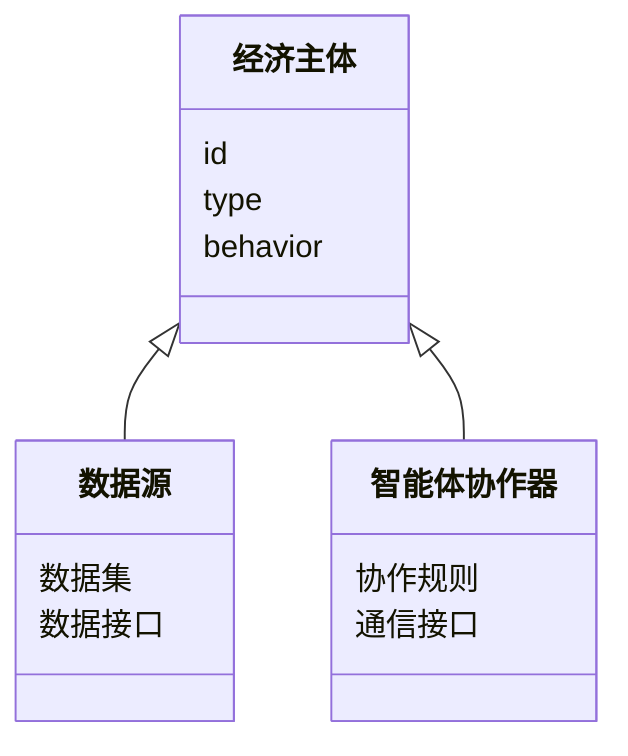
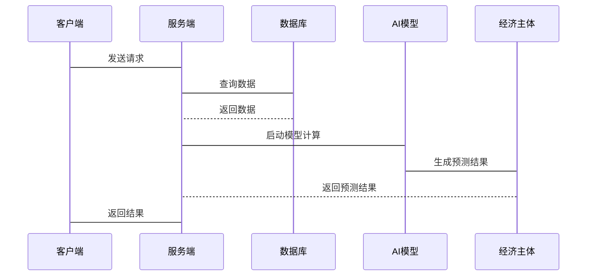

                 


# AI增强的宏观经济影响分析：多智能体协作模型

> 关键词：宏观经济影响分析，人工智能，多智能体协作模型，经济预测，系统架构设计

> 摘要：本文深入探讨了AI技术在宏观经济影响分析中的应用，重点介绍了基于多智能体协作模型的宏观经济分析方法。文章从背景介绍、核心概念、算法原理、系统架构设计、项目实战等多个方面展开，详细讲解了AI增强的宏观经济影响分析模型的构建与实现过程。通过实际案例分析，展示了该模型在经济预测中的应用价值和优势。

---

# 第一部分：AI增强的宏观经济影响分析基础

## 第1章：宏观经济影响分析概述

### 1.1 宏观经济分析的基本概念

#### 1.1.1 宏观经济的核心概念
宏观经济是指整个经济系统的整体运行状况，包括GDP、通货膨胀率、失业率、消费指数等关键指标。宏观经济分析旨在研究这些指标之间的相互关系及其对经济整体的影响。

#### 1.1.2 宏观经济影响分析的定义
宏观经济影响分析是指通过研究政策、市场变化或外部事件对经济系统的影响，预测其可能的结果并制定应对策略。传统的宏观经济分析主要依赖于统计模型和经济学理论，而AI技术的引入为这一领域带来了新的可能性。

#### 1.1.3 宏观经济分析的常用方法
传统的宏观经济分析方法包括回归分析、时间序列分析、计量经济模型等。这些方法在一定程度上能够揭示经济变量之间的关系，但其局限性在于难以处理复杂多变的经济系统和非线性关系。

---

### 1.2 AI技术在宏观经济分析中的应用

#### 1.2.1 AI技术的基本概念
人工智能（AI）是指计算机系统模拟人类智能的能力，包括学习、推理、判断和自适应等能力。AI技术在宏观经济分析中的应用主要体现在数据处理、模式识别、预测建模等方面。

#### 1.2.2 AI在宏观经济预测中的作用
AI技术能够处理海量数据，发现传统方法难以察觉的模式和趋势。例如，通过机器学习算法，可以预测GDP增长率、通货膨胀率等关键经济指标，并对政策调整的效果进行模拟。

#### 1.2.3 多智能体协作模型的优势
多智能体协作模型是一种分布式计算模型，多个智能体通过协作完成复杂的任务。在宏观经济分析中，每个智能体可以代表一个经济主体（如企业、消费者、政府等），通过协作模拟经济系统的运行。

---

## 第2章：多智能体协作模型的核心概念

### 2.1 多智能体协作模型的定义与特点

#### 2.1.1 多智能体系统的定义
多智能体系统是指由多个具有独立决策能力的智能体组成的系统。这些智能体通过协作完成复杂的任务，并能够适应环境的变化。

#### 2.1.2 多智能体协作模型的特点
- 分布式计算：智能体之间通过分布式协作完成任务。
- 自主性：每个智能体具有独立决策的能力。
- 交互性：智能体之间能够通过通信模块进行信息交换。
- 社会性：智能体之间的协作需要遵循一定的社会规范和协议。

#### 2.1.3 多智能体协作模型与传统模型的对比
与传统的宏观经济模型相比，多智能体协作模型更加灵活和动态。它能够模拟经济主体之间的互动，从而更真实地反映经济系统的运行状况。

---

### 2.2 多智能体协作模型的组成部分

#### 2.2.1 智能体的定义与功能
智能体是一个具有感知、决策和行动能力的实体。在宏观经济分析中，智能体可以代表企业、消费者、政府等经济主体。

#### 2.2.2 智能体之间的协作机制
智能体之间的协作机制包括信息共享、任务分配、协调决策等。协作机制的设计直接影响模型的准确性和效率。

#### 2.2.3 模型的输入与输出
- 输入：宏观经济指标、政策参数、市场数据等。
- 输出：预测结果、政策建议、风险评估等。

---

### 2.3 多智能体协作模型的数学模型

#### 2.3.1 智能体行为模型的数学表达
智能体的行为模型可以通过数学方程描述。例如，企业智能体的决策可以表示为：
$$
\text{产量} = \text{成本函数} + \text{需求预测}
$$

#### 2.3.2 协作机制的数学描述
协作机制可以通过博弈论模型描述。例如，两个智能体之间的合作可以通过纳什均衡模型表示：
$$
\text{纳什均衡} = \left\{ \begin{array}{l}
\text{智能体1的策略} \\
\text{智能体2的策略}
\end{array} \right.
$$

#### 2.3.3 模型的优化目标
模型的优化目标是最大化整体效益或最小化整体风险。例如，最大化GDP增长率：
$$
\max_{\theta} \sum_{i=1}^{n} \theta_i
$$
其中，$\theta_i$ 表示第i个智能体的贡献。

---

## 第3章：AI增强的宏观经济影响分析模型

### 3.1 宏观经济影响分析的AI增强方法

#### 3.1.1 AI技术在宏观经济分析中的应用领域
AI技术在宏观经济分析中的应用领域包括经济预测、政策模拟、风险评估等。

#### 3.1.2 多智能体协作模型的优势
多智能体协作模型能够模拟经济主体之间的互动，从而更准确地预测经济变化。例如，通过模拟企业之间的竞争，可以预测市场格局的变化。

#### 3.1.3 多智能体协作模型的实现步骤
1. 确定智能体的类型和数量。
2. 设计智能体的行为模型和协作机制。
3. 收集和处理数据。
4. 模型训练与优化。
5. 模型验证与评估。

---

### 3.2 AI增强的宏观经济影响分析模型的实现

#### 3.2.1 算法原理
AI增强的宏观经济影响分析模型主要基于深度学习和强化学习算法。例如，使用LSTM网络进行时间序列预测，或使用Q-learning算法进行策略优化。

#### 3.2.2 算法实现
以下是使用Python实现的LSTM网络示例代码：
```python
import numpy as np
from tensorflow.keras.models import Sequential
from tensorflow.keras.layers import LSTM, Dense

# 初始化模型
model = Sequential()
model.add(LSTM(64, input_shape=(timesteps, features)))
model.add(Dense(1))
model.compile(optimizer='adam', loss='mean_squared_error')

# 训练模型
model.fit(X_train, y_train, epochs=100, batch_size=32)
```

#### 3.2.3 模型的优化与调优
模型的优化包括超参数调整、特征选择和模型融合等。例如，通过网格搜索优化LSTM网络的参数。

---

## 第4章：系统分析与架构设计

### 4.1 系统应用场景
AI增强的宏观经济影响分析系统的应用场景包括政策模拟、市场预测、风险管理等。

### 4.2 系统功能设计

#### 4.2.1 领域模型（Mermaid 类图）


#### 4.2.2 系统架构设计（Mermaid 架构图）


#### 4.2.3 系统交互设计（Mermaid 序列图）


---

## 第5章：项目实战

### 5.1 环境安装
需要安装的环境包括Python、TensorFlow、Keras等。

### 5.2 系统核心实现源代码
以下是核心代码示例：
```python
import numpy as np
from tensorflow.keras.models import Model
from tensorflow.keras.layers import Input, LSTM, Dense

# 定义输入层
inputs = Input(shape=(timesteps, features))

# LSTM层
lstm_layer = LSTM(64)(inputs)

# 输出层
outputs = Dense(1)(lstm_layer)

# 编译模型
model = Model(inputs=inputs, outputs=outputs)
model.compile(optimizer='adam', loss='mean_squared_error')
```

### 5.3 实际案例分析
以贸易政策对就业的影响为例，通过模型预测政策实施后的就业变化。

### 5.4 案例分析与解读
通过模型预测结果，分析政策实施前后的就业变化趋势，并提出相应的建议。

---

## 第6章：总结与展望

### 6.1 最佳实践 tips
- 数据质量是模型准确性的关键。
- 模型的可解释性需要重点关注。
- 定期更新模型以适应经济变化。

### 6.2 小结
本文详细介绍了AI增强的宏观经济影响分析模型的构建与实现过程，展示了其在经济预测中的应用价值。

### 6.3 注意事项
- 模型的复杂性可能会影响计算效率。
- 数据隐私问题需要重点关注。

### 6.4 拓展阅读
推荐阅读《深度学习》、《强化学习》等相关书籍，以进一步深入理解AI技术在宏观经济分析中的应用。

---

# 作者：AI天才研究院 & 禅与计算机程序设计艺术

---

**本文遵循[CC BY 4.0](https://creativecommons.org/licenses/by/4.0/)协议，转载请注明出处。**

