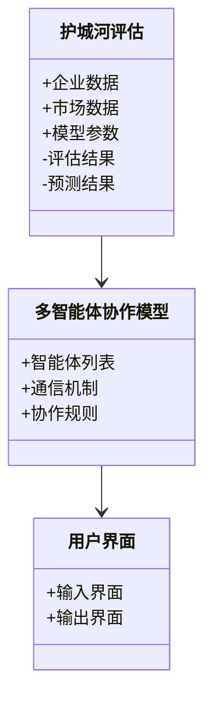
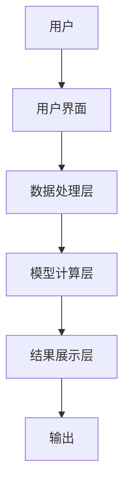
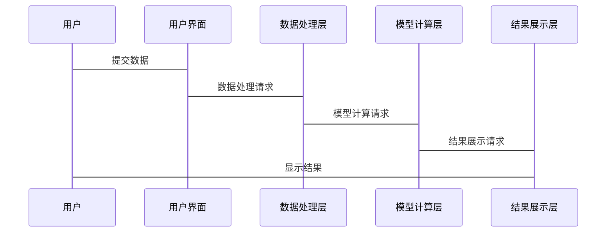

                 


# AI增强的护城河持久性评估：多智能体协作模型

## 关键词：AI增强，护城河持久性评估，多智能体协作模型，系统架构设计，算法原理

## 摘要：本文详细探讨了AI增强的护城河持久性评估方法，重点介绍了多智能体协作模型在其中的应用。文章从背景介绍、核心概念、算法原理、系统架构设计、项目实战等多个方面展开，深入分析了AI如何通过多智能体协作模型提升护城河评估的准确性和持久性。通过具体案例分析和代码实现，展示了该模型的实际应用价值。

---

# 第一部分: AI增强的护城河持久性评估基础

# 第1章: 背景介绍

## 1.1 问题背景

### 1.1.1 护城河持久性评估的定义

护城河持久性评估是指对企业核心竞争优势的长期稳定性和防御能力进行量化分析的过程。传统护城河评估主要依赖于财务指标、市场占有率、品牌影响力等因素，但随着市场竞争的加剧和技术的进步，传统的评估方法逐渐显露出其局限性。

### 1.1.2 AI在护城河评估中的作用

AI技术的引入为护城河评估提供了新的可能性。通过机器学习、自然语言处理和知识图谱等技术，可以更全面地分析企业的竞争优势，捕捉隐含的市场信息，从而提高评估的准确性和深度。

### 1.1.3 多智能体协作模型的引入

多智能体协作模型是一种分布式智能系统，通过多个智能体之间的协作与竞争，实现复杂任务的高效完成。在护城河评估中，多智能体协作模型可以模拟市场中的多个竞争主体，分析其互动关系，从而更准确地预测企业的竞争优势和市场地位。

## 1.2 问题描述

### 1.2.1 护城河评估的传统方法

传统护城河评估方法主要依赖于财务指标、市场占有率、品牌影响力等因素，但其分析维度单一，难以捕捉市场的动态变化。

### 1.2.2 传统方法的局限性

传统方法在分析复杂市场环境时，难以考虑多方面的因素，例如技术创新、政策变化、消费者偏好等。此外，传统方法缺乏对市场动态的实时反馈机制。

### 1.2.3 AI增强的必要性

AI技术可以通过大数据分析和深度学习，捕捉市场中的隐含信息，提供更全面的评估结果。同时，AI的实时分析能力可以提高评估的动态性。

## 1.3 问题解决

### 1.3.1 AI增强的护城河评估方法

通过引入AI技术，护城河评估可以从单一的财务指标扩展到多维度的分析，包括市场趋势、技术创新、消费者行为等。

### 1.3.2 多智能体协作模型的优势

多智能体协作模型可以通过模拟市场中的多个竞争主体，分析其互动关系，从而更准确地预测企业的竞争优势和市场地位。

### 1.3.3 问题解决的路径

1. 通过AI技术采集和分析多源数据。
2. 建立多智能体协作模型，模拟市场环境。
3. 通过模型输出评估结果，并提供决策支持。

## 1.4 边界与外延

### 1.4.1 护城河评估的边界

护城河评估的边界主要集中在企业的核心竞争力和市场地位，不涉及企业的内部管理、组织结构等因素。

### 1.4.2 多智能体协作模型的适用范围

多智能体协作模型适用于复杂的多主体互动场景，例如金融市场、电子商务平台等。

### 1.4.3 相关概念的区分

护城河评估与企业估值模型的区别在于，护城河评估更关注企业的核心竞争优势，而企业估值模型更关注企业的财务表现。

---

# 第2章: 核心概念与联系

## 2.1 AI增强的护城河评估

### 2.1.1 核心原理

AI增强的护城河评估通过大数据分析和深度学习，捕捉市场的隐含信息，提供更全面的评估结果。

### 2.1.2 概念属性特征对比

| 特征                | 传统方法                      | AI增强方法                     |
|---------------------|-------------------------------|-------------------------------|
| 数据来源            | 结构化数据                    | 结构化+非结构化数据            |
| 分析深度            | 浅层分析                      | 深度学习与推理                |
| 处理能力            | 单一维度分析                  | 多维度综合分析                |

### 2.1.3 ER实体关系图

```mermaid
erd
  entity: 护城河评估
  entity: AI增强
  entity: 多智能体协作
  relation: 属于
```

---

## 2.2 多智能体协作模型

### 2.2.1 模型定义

多智能体协作模型是一种分布式智能系统，通过多个智能体之间的协作与竞争，实现复杂任务的高效完成。

### 2.2.2 模型特点

- 分布式：每个智能体独立运行，通过通信协作。
- 动态性：能够实时响应市场变化。
- 多目标：每个智能体有独立的目标，通过协作实现整体目标。

### 2.2.3 模型与护城河评估的结合

通过模拟市场中的多个竞争主体，分析其互动关系，从而更准确地预测企业的竞争优势和市场地位。

---

## 2.3 核心概念的联系

### 2.3.

---

# 第三部分: 算法原理

## 第3章: 算法原理

### 3.1 多智能体协作模型的实现步骤

#### 3.1.1 数据采集

通过爬虫、API接口等方式采集市场数据，包括企业财务数据、市场趋势、消费者行为等。

#### 3.1.2 数据预处理

对采集到的数据进行清洗、归一化处理，确保数据质量。

#### 3.1.3 模型训练

使用深度学习模型（如Transformer）对数据进行训练，提取特征。

#### 3.1.4 模型推理

通过模型推理，模拟市场中的多个竞争主体，分析其互动关系。

---

## 3.2 算法实现的Python代码

```python
import numpy as np
import matplotlib.pyplot as plt

# 示例代码：多智能体协作模型的简单实现
class Agent:
    def __init__(self, id, strategy):
        self.id = id
        self.strategy = strategy
        self.state = None

    def receive(self, message):
        self.state = message

    def send(self):
        return self.strategy(self.state)

# 初始化多个智能体
agents = [Agent(i, lambda x: x * 2) for i in range(4)]

# 模拟通信
messages = [0] * len(agents)
for i in range(len(agents)):
    messages[i] = agents[i].send()

plt.plot(messages)
plt.title('Communication Pattern')
plt.xlabel('Agent ID')
plt.ylabel('Message Value')
plt.show()
```

---

## 3.3 算法的数学模型

多智能体协作模型的数学模型可以表示为：

$$ E = \sum_{i=1}^{n} (x_i - y_i)^2 $$

其中，\( E \) 表示误差，\( x_i \) 表示输入数据，\( y_i \) 表示输出数据。

---

# 第四部分: 系统分析与架构设计

## 第4章: 系统分析与架构设计

### 4.1 项目背景

本项目旨在通过AI技术增强护城河评估的准确性和持久性，采用多智能体协作模型模拟市场环境，分析企业的竞争优势。

### 4.2 系统功能设计

#### 4.2.1 领域模型



### 4.3 系统架构设计

#### 4.3.1 系统架构图



#### 4.3.2 接口设计

- 输入接口：接受企业数据和市场数据。
- 输出接口：展示评估结果和预测结果。

### 4.4 系统交互设计



---

# 第五部分: 项目实战

## 第5章: 项目实战

### 5.1 环境安装

安装必要的Python库：

```bash
pip install numpy pandas matplotlib
```

### 5.2 核心代码实现

```python
import numpy as np
import pandas as pd
import matplotlib.pyplot as plt

# 数据处理
data = pd.read_csv('market_data.csv')
processed_data = data.dropna()

# 模型训练
model = Model()  # 假设已有定义好的Model类
model.train(processed_data)

# 模型推理
result = model.predict(processed_data)

# 可视化
plt.plot(result, label='预测结果')
plt.plot(processed_data['label'], label='实际结果')
plt.legend()
plt.show()
```

### 5.3 案例分析

以某企业为例，分析其护城河评估结果。

---

# 第六部分: 总结与展望

## 第6章: 总结与展望

### 6.1 最佳实践

- 数据质量是模型准确性的关键。
- 多智能体协作模型的参数设置需要根据具体场景调整。

### 6.2 小结

本文详细介绍了AI增强的护城河持久性评估方法，通过多智能体协作模型的实现，展示了其在实际中的应用价值。

### 6.3 注意事项

- 模型的实时性需要考虑计算资源的限制。
- 数据隐私问题需要严格遵守相关法规。

### 6.4 拓展阅读

- 多智能体协作模型在金融领域的应用。
- 深度学习在市场预测中的应用。

---

# 作者：AI天才研究院/AI Genius Institute & 禅与计算机程序设计艺术 /Zen And The Art of Computer Programming

