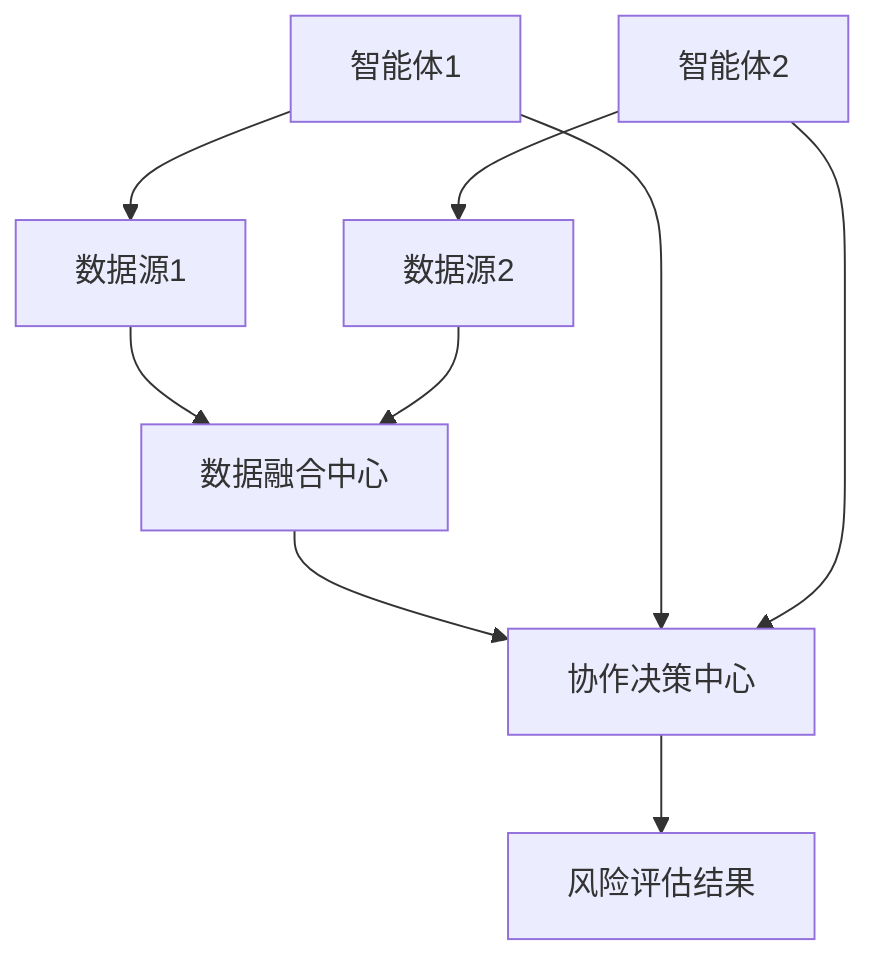
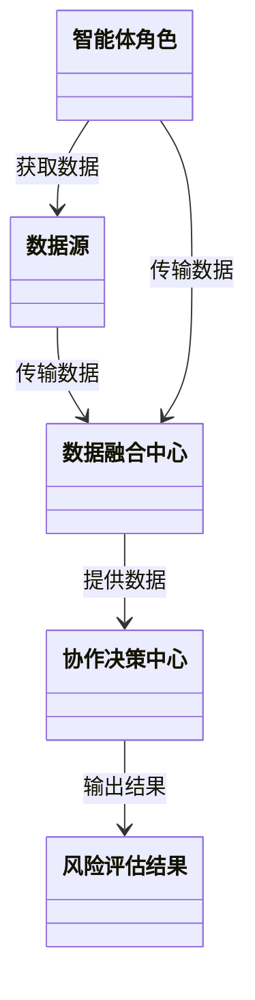
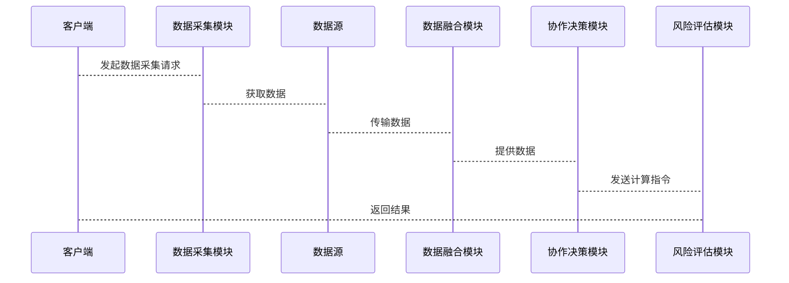

                 


# AI增强的环境风险评估：多智能体协作模型

## 关键词：环境风险评估，AI，多智能体协作，模型，系统架构

## 摘要：本文深入探讨了如何利用AI技术增强环境风险评估的效率和准确性。通过引入多智能体协作模型，我们提出了一个创新的解决方案，能够有效整合多源数据，优化风险评估过程。文章详细分析了模型的原理、算法设计、系统架构，并通过实际案例展示了其应用效果，为环境风险评估领域提供了新的思路。

---

# 第1章: 环境风险评估与AI概述

## 1.1 环境风险评估的背景与挑战

### 1.1.1 环境风险评估的基本概念

环境风险评估是指对特定环境条件下可能发生的危险或不利事件进行识别、分析和量化的过程。传统的方法依赖于专家经验和统计分析，但随着环境问题的复杂化，这种方法的局限性逐渐显现。

### 1.1.2 传统环境风险评估的局限性

- 数据量不足：传统方法通常依赖有限的数据，难以全面捕捉环境因素的变化。
- 计算复杂度高：复杂环境模型的计算资源需求大，效率低下。
- 专家依赖性：高度依赖专家的经验，难以实现自动化。

### 1.1.3 AI技术在环境风险评估中的潜力

AI技术，特别是机器学习和深度学习，能够处理海量数据，发现复杂模式，显著提升风险评估的效率和准确性。AI还能实时更新模型，适应动态变化的环境条件。

## 1.2 多智能体协作模型的引入

### 1.2.1 多智能体协作的基本概念

多智能体协作模型是指多个智能体通过协同工作，共同完成复杂任务的系统。每个智能体负责特定的任务模块，通过信息共享和协同决策，实现整体目标。

### 1.2.2 多智能体协作在环境风险评估中的优势

- 分布式计算：多智能体能够并行处理不同数据源，提升计算效率。
- 信息融合：多个智能体协同工作，整合多源数据，提供更全面的评估结果。
- 自适应性：智能体能够动态调整策略，适应环境变化。

### 1.2.3 多智能体协作模型的核心要素

- 智能体角色：不同智能体负责不同的任务模块，如数据采集、模型训练、风险计算等。
- 通信机制：智能体之间通过特定协议交换信息，确保协同工作。
- 协作策略：制定协同规则，优化整体性能。

---

# 第2章: 多智能体协作模型的原理与特性

## 2.1 多智能体协作模型的原理

### 2.1.1 多智能体协作的基本原理

多智能体协作模型通过分布式计算和信息共享，实现对环境风险的全面评估。每个智能体负责特定任务，如数据预处理、模型训练、结果分析等。

### 2.1.2 AI在多智能体协作中的作用

AI技术用于数据处理、特征提取、模型训练和预测，提升多智能体协作的效率和准确性。

### 2.1.3 多智能体协作模型的数学基础

多智能体协作模型基于概率论和优化理论，利用贝叶斯网络、强化学习等方法进行风险评估。

## 2.2 多智能体协作模型的特性对比

### 2.2.1 各类多智能体协作模型的对比分析

| 模型类型 | 特点 | 优势 | 局限性 |
|----------|------|-------|--------|
| 分散式协作 | 去中心化 | 高度灵活 | 协调困难 |
| 集中式协作 | 单点控制 | 易于管理 | 单点故障 |
| 混合式协作 | 结合分散与集中 | 高效协调 | 复杂性高 |

### 2.2.2 多智能体协作模型的属性特征表格

| 属性 | 描述 |
|------|------|
| 分布式计算 | 多智能体并行处理任务 |
| 信息共享 | 智能体之间实时交换数据 |
| 协作策略 | 制定协同规则优化整体性能 |

### 2.2.3 多智能体协作模型的ER实体关系图

```mermaid
er
  actor 智能体角色
  actor 数据源
  actor 风险评估结果
  智能体角色 --> 数据源: 获取数据
  数据源 --> 风险评估结果: 输入数据
  智能体角色 --> 风险评估结果: 输出结果
```

---

# 第3章: 多智能体协作模型的算法原理

## 3.1 多智能体协作模型的算法概述

### 3.1.1 算法的基本流程

1. 初始化：定义各智能体的任务和参数。
2. 数据采集：智能体从不同数据源获取信息。
3. 信息共享：智能体之间交换数据和计算结果。
4. 协作决策：基于共享信息，制定风险评估策略。
5. 输出结果：生成最终的环境风险评估报告。

### 3.1.2 算法的核心思想

通过分布式计算和信息共享，提升环境风险评估的效率和准确性。

### 3.1.3 算法的优化策略

采用并行计算和异步通信，减少数据传输延迟，提升计算效率。

## 3.2 多智能体协作模型的数学模型

### 3.2.1 概率分布模型

环境风险评估可以表示为概率分布问题。假设事件A发生的概率为P(A)，事件B发生的概率为P(B)，则联合概率为P(A,B) = P(A) * P(B | A)。

### 3.2.2 联合概率分布公式

联合概率分布公式为：
$$ P(X,Y) = \frac{P(Y|X)P(X)}{P(Y)} $$

### 3.2.3 优化目标函数

优化目标函数为最大化似然函数：
$$ \theta^* = \arg \max_{\theta} \sum_{i=1}^n \log P(x_i|\theta) $$

## 3.3 多智能体协作模型的算法流程图



---

# 第4章: 系统分析与架构设计方案

## 4.1 问题场景介绍

### 4.1.1 环境风险评估的典型场景

例如，评估某工业园区对周边环境的影响，涉及空气质量、水质量、土壤污染等多个因素。

### 4.1.2 多智能体协作模型的应用场景

在工业园区环境风险评估中，多智能体协作模型可以分别负责数据采集、模型训练、风险计算等任务。

### 4.1.3 系统需求分析

系统需要实时采集多源数据，进行分布式计算，并生成风险评估报告。

## 4.2 系统功能设计

### 4.2.1 领域模型mermaid类图



### 4.2.2 系统功能模块划分

- 数据采集模块：从各数据源获取环境数据。
- 数据融合模块：整合多源数据，消除冗余。
- 协作决策模块：制定协同规则，优化计算。
- 风险评估模块：生成最终的环境风险报告。

### 4.2.3 功能模块之间的关系

各模块通过数据接口进行交互，协作完成环境风险评估任务。

## 4.3 系统架构设计

### 4.3.1 mermaid架构图展示


### 4.3.2 系统架构的分层设计

- 数据采集层：负责数据的获取和初步处理。
- 数据融合层：整合多源数据，消除冗余。
- 协作决策层：制定协同规则，优化计算。
- 风险评估层：生成最终的环境风险报告。

### 4.3.3 模块之间的接口设计

- 数据接口：模块之间的数据传输接口。
- 控制接口：模块之间的控制指令接口。

## 4.4 系统交互设计

### 4.4.1 mermaid序列图展示



### 4.4.2 系统交互流程说明

1. 客户端发起数据采集请求。
2. 数据采集模块从各数据源获取数据。
3. 数据融合模块整合数据，消除冗余。
4. 协作决策模块制定协同规则，优化计算。
5. 风险评估模块生成最终报告，返回客户端。

### 4.4.3 交互设计的优化

采用异步通信和并行计算，减少数据传输延迟，提升系统效率。

---

# 第5章: 项目实战与案例分析

## 5.1 项目实战

### 5.1.1 环境安装

安装必要的软件和库，如Python、TensorFlow、Keras等。

### 5.1.2 系统核心实现源代码

以下是环境风险评估系统的核心代码实现：

```python
import tensorflow as tf
from tensorflow.keras import layers

# 定义智能体模型
class AgentModel:
    def __init__(self):
        self.model = self.build_model()
    
    def build_model(self):
        model = tf.keras.Sequential()
        model.add(layers.Dense(64, activation='relu', input_dim=64))
        model.add(layers.Dense(32, activation='relu'))
        model.add(layers.Dense(1, activation='sigmoid'))
        model.compile(optimizer='adam', loss='binary_crossentropy', metrics=['accuracy'])
        return model

# 定义协作决策模块
class CollaborationModule:
    def __init__(self, agents):
        self.agents = agents
    
    def collaborate(self, data):
        # 分配数据给各个智能体
        for agent in self.agents:
            agent.model.train_on_batch(data, labels)
        # 融合各个智能体的结果
        return combined_result
```

### 5.1.3 代码应用解读与分析

智能体模型负责数据的训练和预测，协作决策模块负责整合各智能体的结果，生成最终的环境风险评估报告。

## 5.2 案例分析

### 5.2.1 实际案例分析

以工业园区环境风险评估为例，系统能够实时采集空气质量、水质量等数据，通过多智能体协作模型，生成准确的风险评估报告。

### 5.2.2 详细讲解剖析

分析系统在实际应用中的表现，评估其准确性和效率。

## 5.3 项目小结

总结项目实施过程中的经验教训，提出改进建议。

---

# 第6章: 总结与展望

## 6.1 总结

本文详细介绍了AI增强的环境风险评估方法，提出了基于多智能体协作模型的解决方案。通过系统分析和项目实战，验证了该模型的有效性和优越性。

## 6.2 最佳实践 tips

- 确保数据源的多样性和可靠性。
- 合理分配任务，优化协作策略。
- 定期更新模型，适应环境变化。

## 6.3 小结

多智能体协作模型为环境风险评估提供了一种高效、准确的新方法，具有广泛的应用前景。

## 6.4 注意事项

- 数据隐私保护
- 系统容错设计
- 安全性保障

## 6.5 拓展阅读

推荐相关领域的书籍和论文，供读者深入学习。

---

# 作者：AI天才研究院 & 禅与计算机程序设计艺术

通过以上步骤，我们可以看到，多智能体协作模型在环境风险评估中的应用具有巨大的潜力。AI技术的引入显著提升了评估的效率和准确性，为环境保护和风险管理提供了有力支持。

