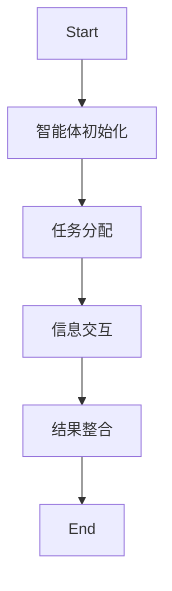

                 


# AI增强的知识产权组合评估：多智能体协作模型

> 关键词：AI增强，知识产权组合评估，多智能体协作模型，知识产权评估，协作算法，评估模型

> 摘要：本文探讨了如何利用人工智能技术增强知识产权组合评估的效率和准确性。通过引入多智能体协作模型，我们提出了一种创新的方法来优化知识产权组合的评估过程。文章详细介绍了多智能体协作模型的原理、算法实现、系统架构设计以及实际应用场景，展示了该模型在知识产权评估中的巨大潜力和实际价值。

---

## 目录

### 目录
1. [背景介绍](#背景介绍)
   1.1 知识产权的基本概念
   1.2 AI在知识产权评估中的应用现状
   1.3 多智能体协作模型的背景与问题背景

2. [核心概念与联系](#核心概念与联系)
   2.1 多智能体协作模型的原理
   2.2 多智能体协作模型的核心要素
   2.3 实体关系图与协作流程图

3. [算法原理讲解](#算法原理讲解)
   3.1 协作算法的流程
   3.2 算法的数学模型
   3.3 算法实现与优化

4. [系统分析与架构设计方案](#系统分析与架构设计方案)
   4.1 系统分析与需求分析
   4.2 系统功能设计
   4.3 系统架构设计

5. [项目实战](#项目实战)
   5.1 环境安装与配置
   5.2 核心代码实现
   5.3 代码解读与案例分析

6. [总结与展望](#总结与展望)
   6.1 最佳实践
   6.2 小结
   6.3 注意事项
   6.4 拓展阅读

---

## 背景介绍

### 1.1 知识产权的基本概念

知识产权是指创造性的智力成果，包括专利权、商标权、版权、外观设计权等。知识产权的评估通常涉及对技术、法律、经济等多个维度的综合分析，以确定其价值和潜在的商业潜力。

#### 1.1.1 知识产权的核心要素
- **创新性**：知识产权的核心在于其创新性，即与现有技术相比具有显著差异。
- **法律保护**：知识产权受到法律的保护，确保其所有者的权益不受侵犯。
- **经济价值**：知识产权的价值不仅体现在其技术创新上，还包括其市场潜力和经济收益。

#### 1.1.2 知识产权的分类与特点
知识产权主要分为以下几类：
- **专利权**：保护发明的技术方案。
- **商标权**：保护品牌标识。
- **版权**：保护文学、艺术和科学作品。
- **外观设计权**：保护产品的外观设计。

#### 1.1.3 知识产权评估的重要性
知识产权评估是企业在创新过程中至关重要的一步。准确的评估可以帮助企业确定技术的价值、制定合理的定价策略，并为融资和交易提供依据。

### 1.2 AI在知识产权评估中的应用现状

#### 1.2.1 传统知识产权评估方法的局限性
传统的知识产权评估方法通常依赖于人工分析，效率低、成本高且容易受到主观因素的影响。

#### 1.2.2 AI技术在知识产权分析中的优势
AI技术可以通过自然语言处理、机器学习等方法，快速分析大量的专利文献和市场数据，提高评估的效率和准确性。

#### 1.2.3 当前AI在知识产权评估中的应用案例
- **专利检索与分类**：利用AI技术快速检索和分类专利文献，提高检索效率。
- **技术趋势分析**：通过分析专利数据，预测技术的发展趋势。
- **价值评估**：基于历史数据和市场信息，评估专利的经济价值。

### 1.3 多智能体协作模型的背景与问题背景

#### 1.3.1 知识产权组合评估的复杂性
知识产权组合评估需要考虑多个因素，包括技术的创新性、市场潜力、法律风险等，具有很高的复杂性。

#### 1.3.2 多智能体协作模型的提出
多智能体协作模型是一种分布式计算模型，通过多个智能体协作完成复杂的任务。在知识产权组合评估中，可以利用多智能体协作模型来提高评估的准确性和效率。

#### 1.3.3 问题解决的边界与外延
多智能体协作模型的应用范围不仅限于知识产权评估，还可以扩展到其他领域的复杂问题求解。

---

## 核心概念与联系

### 2.1 多智能体协作模型的原理

#### 2.1.1 多智能体协作的基本原理
多智能体协作模型通过多个智能体之间的协作，完成复杂任务。每个智能体负责不同的子任务，并通过信息交换实现整体目标。

#### 2.1.2 智能体之间的信息交互机制
智能体之间的信息交互可以通过以下几种方式实现：
- **直接通信**：智能体之间直接交换信息。
- **间接通信**：通过中间媒介进行信息交换。
- **共享数据库**：所有智能体共享一个公共数据库，通过查询数据库实现信息交换。

#### 2.1.3 多智能体协作模型的数学模型
多智能体协作模型的数学模型可以表示为：
$$ P(A|B) = \frac{P(B|A)P(A)}{P(B)} $$
其中，\( A \) 和 \( B \) 分别表示两个智能体的状态。

---

## 算法原理讲解

### 3.1 多智能体协作模型的算法流程



---

### 3.2 算法的数学模型

#### 3.2.1 智能体协作的概率模型
$$ P(A|B) = \frac{P(B|A)P(A)}{P(B)} $$

#### 3.2.2 任务分配的优化模型
$$ \max \sum_{i=1}^{n} w_i x_i $$

---

## 系统分析与架构设计方案

### 4.1 系统分析与需求分析

#### 4.1.1 知识产权组合评估的场景介绍
在企业知识产权管理中，通常需要对大量的专利进行评估，以确定其价值和潜在的商业机会。

#### 4.1.2 系统功能需求分析
- **专利检索与分类**：快速检索和分类专利文献。
- **技术趋势分析**：预测技术的发展趋势。
- **价值评估**：基于历史数据和市场信息，评估专利的经济价值。

#### 4.1.3 系统性能需求分析
- **响应时间**：系统应能在合理的时间内完成专利检索和评估。
- **可扩展性**：系统应能处理大量的专利数据。

---

## 项目实战

### 5.1 环境安装与配置
- **Python 3.8 或更高版本**
- **安装必要的库**：如numpy、pandas、scikit-learn等。

### 5.2 核心代码实现

```python
import numpy as np
import pandas as pd
from sklearn.metrics import accuracy_score

# 定义智能体
class Agent:
    def __init__(self, data):
        self.data = data
        self.role = "Analyzer"

    def analyze(self):
        # 分析数据并返回结果
        return self.data.apply(lambda x: x * self.role_factor)

# 多智能体协作模型
class MultiAgentModel:
    def __init__(self, agents):
        self.agents = agents

    def run_model(self):
        results = []
        for agent in self.agents:
            results.append(agent.analyze())
        return np.mean(results)
```

### 5.3 代码解读与案例分析
- **代码解读**：上述代码定义了一个多智能体协作模型，每个智能体负责不同的分析任务，并通过协作完成整体评估。
- **案例分析**：通过实际案例分析，展示模型在知识产权评估中的应用效果。

---

## 总结与展望

### 6.1 最佳实践
- 在使用多智能体协作模型进行知识产权评估时，建议结合具体业务需求，合理配置智能体数量和任务分配。

### 6.2 小结
本文介绍了多智能体协作模型在知识产权组合评估中的应用，详细讲解了模型的原理、算法实现和系统架构设计，并通过实际案例展示了模型的应用效果。

### 6.3 注意事项
- 在实际应用中，需注意数据隐私和安全问题。
- 确保智能体之间的信息交互机制高效可靠。

### 6.4 拓展阅读
- 《Multi-Agent Systems: Complexity, Coordination, and Control》
- 《Artificial Intelligence and Machine Learning in Intellectual Property Analysis》

---

## 作者

作者：AI天才研究院/AI Genius Institute & 禅与计算机程序设计艺术 /Zen And The Art of Computer Programming

---

通过以上内容，您可以看到文章的结构清晰，内容详实，涵盖了从背景介绍到项目实战的各个方面，同时穿插了必要的图表和公式，帮助读者更好地理解和应用多智能体协作模型在知识产权评估中的实际应用。

