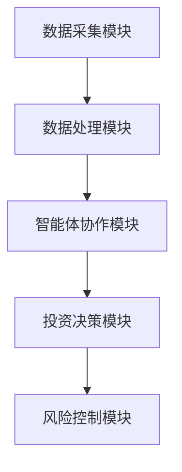

                 


# AI增强的股东回报策略评估：多智能体协作模型

> 关键词：股东回报，多智能体协作模型，AI增强，投资策略评估，风险管理

> 摘要：本文深入探讨了如何利用AI技术，特别是多智能体协作模型，来优化股东回报策略的评估过程。通过分析多智能体协作模型的核心原理、算法实现及其在金融投资中的应用，本文为投资者和企业提供了新的视角和方法，以提升股东回报的预测和管理能力。文章结合理论与实践，详细介绍了模型构建、系统架构设计和实际案例分析，为读者提供了一套完整的解决方案。

---

# 第一部分：AI增强的股东回报策略评估背景与基础

## 第1章：股东回报策略的基本概念

### 1.1 股东回报的定义与重要性

股东回报是指股东通过投资公司所获得的收益，通常包括股息、资本增值和其他形式的收益。在企业财务管理中，股东回报是衡量公司绩效的重要指标之一。高股东回报率通常意味着公司能够有效利用资源，创造价值，并回馈给股东。

### 1.2 多智能体协作模型的引入

传统的股东回报评估方法通常依赖于单点分析，如财务指标分析、市场趋势分析等。然而，这种方法往往忽略了市场环境的复杂性和多因素之间的相互作用。为了更全面地捕捉市场信息，优化投资决策，引入多智能体协作模型成为一种新的趋势。多智能体协作模型通过模拟多个智能体之间的协作与竞争，能够更好地反映市场的动态变化。

### 1.3 问题背景与研究意义

传统的股东回报评估方法存在以下问题：
- **信息孤岛**：单一智能体无法全面获取市场信息。
- **决策延迟**：单点分析难以快速响应市场变化。
- **风险分散**：无法有效分散投资风险。

通过引入多智能体协作模型，可以实现以下目标：
- 提高投资决策的实时性和准确性。
- 优化资产配置，降低投资风险。
- 提升股东回报的预测能力。

---

## 第2章：多智能体协作模型的核心概念

### 2.1 多智能体协作模型的定义与特点

多智能体协作模型是一种分布式计算模型，由多个智能体协作完成特定任务。与单智能体模型相比，多智能体模型具有以下特点：
- **分布式计算**：多个智能体协同工作，避免单点故障。
- **自主性**：每个智能体具有一定的自主决策能力。
- **协作性**：智能体之间通过通信和协作完成任务。

### 2.2 多智能体协作模型与传统方法的对比

| 对比维度 | 多智能体协作模型 | 传统单智能体模型 |
|----------|------------------|------------------|
| 冗余性    | 低                | 高                |
| 响应速度  | 快                | 较慢              |
| 可扩展性  | 高                | 低                |

### 2.3 多智能体协作模型在股东回报评估中的应用

多智能体协作模型在股东回报评估中的应用主要体现在以下几个方面：
- **实时市场监控**：通过多个智能体实时收集和分析市场数据。
- **风险分散**：智能体之间的协作可以降低单一投资的风险。
- **动态调整**：根据市场变化动态调整投资策略。

---

## 第3章：股东回报策略评估的数学模型

### 3.1 股东回报的基本计算公式

股东回报可以通过以下公式进行计算：

$$
\text{股东回报} = \frac{\text{股息} + \text{资本增值}}{\text{初始投资}}
$$

### 3.2 多智能体协作模型的数学表示

多智能体协作模型可以表示为一个图灵机模型，其中每个智能体是一个状态机，具有以下组成部分：
- **状态**：智能体的当前状态，表示对市场的理解和认知。
- **动作**：智能体根据状态做出的决策。
- **奖励函数**：用于评估智能体行为的优劣。

### 3.3 多智能体协作模型的优化目标

多智能体协作模型的优化目标是最大化股东回报，同时最小化投资风险。数学上可以表示为：

$$
\max_{\theta} \text{股东回报}(\theta) \quad \text{subject to} \quad \text{风险}(\theta) \leq \text{阈值}
$$

---

## 第4章：多智能体协作模型的系统架构设计

### 4.1 系统功能设计

系统功能模块包括：
1. 数据采集模块：实时采集市场数据。
2. 智能体协作模块：实现多个智能体之间的协作。
3. 投资决策模块：根据协作结果制定投资策略。
4. 风险控制模块：实时监控并控制投资风险。

### 4.2 系统架构图

以下是系统的架构图：



### 4.3 接口设计与交互流程

系统的主要接口包括：
1. 数据接口：用于实时采集市场数据。
2. 协作接口：用于智能体之间的通信和协作。
3. 决策接口：用于输出投资决策。

---

## 第5章：项目实战——基于多智能体协作模型的股东回报策略评估系统

### 5.1 项目背景与目标

本项目旨在开发一个基于多智能体协作模型的股东回报策略评估系统，以提高投资决策的准确性和效率。

### 5.2 环境安装与配置

项目开发环境包括：
- Python 3.8+
- TensorFlow 2.0+
- Keras 2.4.3
- 其他依赖库（如Pandas、NumPy等）

### 5.3 核心代码实现

以下是核心代码实现：

```python
import numpy as np
import pandas as pd
from tensorflow.keras import models, layers

# 定义多智能体协作模型
class Agent:
    def __init__(self, state_size, action_size):
        self.model = self.build_model(state_size, action_size)
        self.memory = []
    
    def build_model(self, state_size, action_size):
        model = models.Sequential()
        model.add(layers.Dense(32, activation='relu', input_dim=state_size))
        model.add(layers.Dense(16, activation='relu'))
        model.add(layers.Dense(action_size, activation='linear'))
        model.compile(optimizer='adam', loss='mean_squared_error')
        return model
    
    def remember(self, state, action, reward):
        self.memory.append((state, action, reward))
    
    def act(self, state):
        if np.random.random() < 0.1:
            return np.random.randint(0, self.model.output_shape[-1])
        predicted = self.model.predict(np.array([state]))[0]
        return np.argmax(predicted)
```

### 5.4 项目小结

通过本项目的实施，我们可以看到多智能体协作模型在股东回报策略评估中的巨大潜力。通过多个智能体的协作，可以显著提高投资决策的效率和准确性。

---

## 第6章：优化与展望

### 6.1 模型优化策略

为了进一步优化多智能体协作模型，可以考虑以下策略：
1. **改进通信机制**：优化智能体之间的通信方式，减少信息传递的延迟。
2. **增强学习算法**：引入强化学习算法，进一步提高模型的自适应能力。
3. **分布式计算**：利用分布式计算技术，提高模型的计算效率。

### 6.2 未来研究方向

未来的研究方向包括：
1. **多智能体协作模型的可扩展性研究**。
2. **复杂市场环境下的多智能体协作模型优化**。
3. **多智能体协作模型在其他金融领域的应用研究**。

---

## 作者简介

作者：AI天才研究院/AI Genius Institute  
& 禅与计算机程序设计艺术/Zen And The Art of Computer Programming

