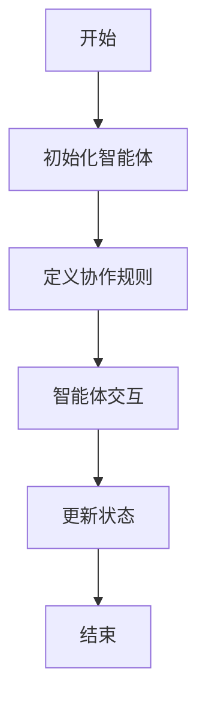
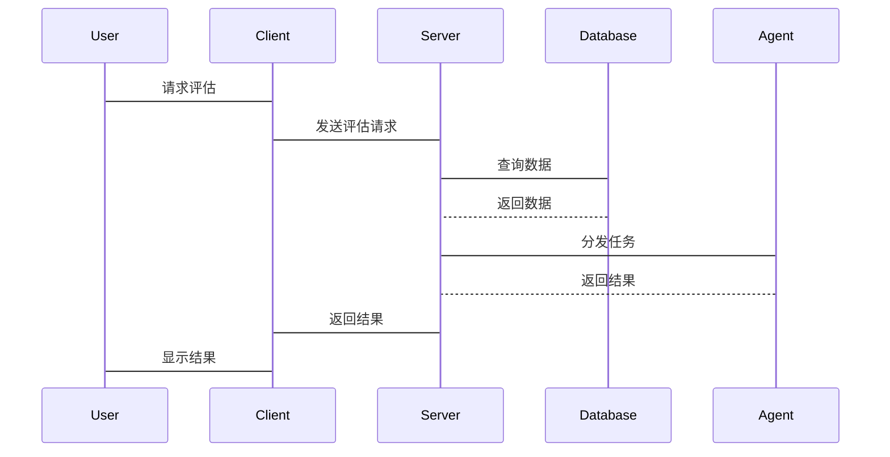

                 


# AI增强的长期增长可持续性评估：多智能体协作模型

## 关键词：
AI增强、长期增长可持续性评估、多智能体协作模型、系统架构设计、项目实战、最佳实践

## 摘要：
本文系统阐述了如何利用AI技术，特别是多智能体协作模型，来评估和促进企业的长期增长可持续性。通过详细的背景分析、模型原理、算法实现、系统架构设计、项目实战以及最佳实践，本文为读者提供了一套全面的方法论，帮助企业在复杂多变的环境中实现可持续增长。

---

# 目录

## 第一章：背景介绍

### 1.1 问题背景
- 1.1.1 长期增长可持续性评估的定义
- 1.1.2 当前评估方法的局限性
- 1.1.3 AI技术在评估中的应用潜力

### 1.2 问题描述
- 1.2.1 企业增长中的关键问题
- 1.2.2 可持续性评估的核心要素
- 1.2.3 多智能体协作模型的必要性

### 1.3 问题解决
- 1.3.1 AI增强的评估方法
- 1.3.2 多智能体协作模型的优势
- 1.3.3 评估模型的边界与外延

### 1.4 概念结构与核心要素
- 1.4.1 模型的核心要素分析
- 1.4.2 要素之间的关系
- 1.4.3 模型的输入与输出

---

## 第二章：多智能体协作模型的核心概念与联系

### 2.1 模型的核心概念
- 2.1.1 多智能体系统的定义
- 2.1.2 协作机制的实现方式
- 2.1.3 智能体之间的通信与协调

### 2.2 模型的属性特征对比
- 2.2.1 智能体的属性特征分析
- 2.2.2 不同协作机制的特征对比
- 2.2.3 模型的可扩展性与可维护性

### 2.3 ER实体关系图架构
```mermaid
er
actor: 用户
model: 多智能体协作模型
attribute: 智能体属性
relation: 关系
```

---

## 第三章：多智能体协作模型的算法原理

### 3.1 算法流程


### 3.2 算法实现

#### 3.2.1 算法伪代码
```python
def initialize_agents(num_agents):
    agents = []
    for _ in range(num_agents):
        agent = Agent()
        agents.append(agent)
    return agents

def define_collaboration_rules(agents, rules):
    for agent in agents:
        agent.rules = rules

def agent_interaction(agents):
    for agent in agents:
        agent.act()

def update_state(agents, state):
    for agent in agents:
        agent.state = state

def main():
    agents = initialize_agents(5)
    rules = define_collaboration_rules(agents, rules)
    agent_interaction(agents)
    update_state(agents, new_state)
    return agents

if __name__ == "__main__":
    main()
```

#### 3.2.2 算法数学模型
$$ S = \sum_{i=1}^{n} \alpha_i \cdot x_i $$

---

## 第四章：系统分析与架构设计方案

### 4.1 问题场景介绍
- 4.1.1 企业增长评估的场景分析
- 4.1.2 多智能体协作模型的应用场景
- 4.1.3 系统的目标与范围

### 4.2 系统功能设计
- 4.2.1 领域模型设计
  ```mermaid
  classDiagram
  class Agent {
    state
    rules
    act()
  }
  class Environment {
    agents
    update_state()
  }
  ```

- 4.2.2 系统架构设计
  ```mermaid
  architecture
  Client <---> Server
  Server <---> Database
  Server <---> Agent
  ```

### 4.3 系统接口设计
- 4.3.1 接口定义
- 4.3.2 接口实现
- 4.3.3 接口测试

### 4.4 系统交互设计


---

## 第五章：项目实战

### 5.1 环境安装
- 5.1.1 安装Python
- 5.1.2 安装相关库（如numpy、scipy、matplotlib）

### 5.2 核心代码实现
```python
import numpy as np
import matplotlib.pyplot as plt

def plot_agents_behavior(agents):
    for agent in agents:
        plt.plot(agent.history, label=f'Agent {agent.id}')
    plt.xlabel('时间')
    plt.ylabel('行为值')
    plt.legend()
    plt.show()

# 示例运行
agents = initialize_agents(5)
define_collaboration_rules(agents, rules)
agent_interaction(agents)
plot_agents_behavior(agents)
```

### 5.3 代码解读与分析
- 5.3.1 代码结构分析
- 5.3.2 关键代码段解读
- 5.3.3 代码优化建议

### 5.4 实际案例分析
- 5.4.1 案例背景介绍
- 5.4.2 模型应用过程
- 5.4.3 结果分析与总结

### 5.5 项目小结
- 5.5.1 项目总结
- 5.5.2 经验与教训
- 5.5.3 未来改进方向

---

## 第六章：最佳实践、小结、注意事项、拓展阅读

### 6.1 最佳实践
- 6.1.1 模型选择与优化
- 6.1.2 数据质量与处理
- 6.1.3 系统维护与更新

### 6.2 小结
- 6.2.1 本文核心内容回顾
- 6.2.2 多智能体协作模型的优势与挑战
- 6.2.3 未来研究方向

### 6.3 注意事项
- 6.3.1 数据隐私与安全
- 6.3.2 系统性能优化
- 6.3.3 模型的可解释性

### 6.4 拓展阅读
- 6.4.1 相关领域推荐读物
- 6.4.2 进一步学习资源
- 6.4.3 行业动态与趋势

---

## 作者：AI天才研究院/AI Genius Institute & 禅与计算机程序设计艺术/Zen And The Art of Computer Programming

